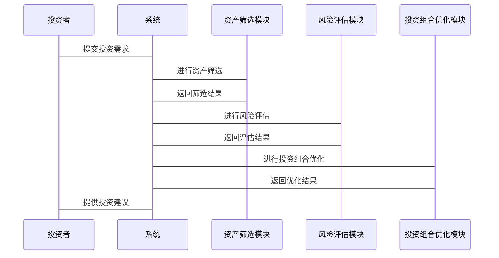

                 


# 杰里米·格兰瑟姆的长期价值投资哲学

**关键词**：价值投资、长期投资、安全边际、逆向思维、市场心理、投资组合管理、风险管理

**摘要**：本文深入探讨了杰里米·格兰瑟姆的长期价值投资哲学，分析了其核心理念、安全边际的概念与应用、逆向投资策略，以及投资组合管理和风险管理的重要性。通过技术化的分析方法，结合实际案例，阐述了如何在复杂多变的市场环境中运用格兰瑟姆的投资哲学实现稳健收益。

---

## 第1章: 投资的基本概念与长期价值

### 1.1 投资的基本概念

#### 1.1.1 资产与投资的定义

投资是指将资金投入到某种资产中，以期获得未来收益的行为。资产可以是股票、债券、房地产等，其价值取决于市场供需、经济周期和公司基本面等多种因素。

#### 1.1.2 长期投资的重要性

长期投资是指持有资产超过一年的投资行为。与短期交易相比，长期投资更注重资产的内在价值，避免了短期市场波动的干扰。长期投资的优势在于复利效应和时间价值，能够帮助投资者实现财富的稳步增长。

#### 1.1.3 价值投资的核心理念

价值投资是一种以基本面分析为基础的投资策略，强调以低于内在价值的价格购买优质资产。其核心理念是寻找市场低估的资产，并长期持有，直到其价值回归。

---

### 1.2 长期价值投资的背景

#### 1.2.1 传统投资理论的局限性

传统投资理论如技术分析和短期交易策略往往依赖于市场情绪和价格波动，忽视了资产的内在价值。在市场剧烈波动时，这些方法难以提供稳定的收益。

#### 1.2.2 价值投资的兴起与发展

价值投资的兴起源于20世纪初，格兰瑟姆是这一领域的先驱之一。随着市场的成熟和投资者对稳健收益的需求增加，价值投资逐渐成为一种主流的投资策略。

#### 1.2.3 格兰瑟姆的贡献与影响

格兰瑟姆通过长期实践和理论研究，提出了以安全边际为核心的价值投资理念，为投资者提供了规避风险和实现稳健收益的方法。

---

### 1.3 格兰瑟姆的投资哲学

#### 1.3.1 格兰瑟姆的生平简介

格兰瑟姆是价值投资的鼻祖之一，他的投资理念影响了无数投资者。他强调长期持有、安全边际和逆向思维，形成了独特的投资哲学。

#### 1.3.2 格兰瑟姆的价值投资理念

格兰瑟姆的价值投资理念包括以下几点：
1. 以低于内在价值的价格买入优质资产。
2. 长期持有，避免频繁交易。
3. 重视安全边际，降低投资风险。

#### 1.3.3 格兰瑟姆的投资策略

格兰瑟姆的投资策略包括：
1. 基于基本面分析筛选低估资产。
2. 以安全边际为标准决定买入价格。
3. 在市场恐慌时逆势投资。

---

## 1.4 本章小结

本章介绍了投资的基本概念、长期价值投资的背景以及格兰瑟姆的投资哲学。通过对比传统投资理论和价值投资理念，突出了长期价值投资的重要性和独特性。

---

## 第2章: 安全边际的概念与应用

### 2.1 安全边际的定义

#### 2.1.1 安全边际的内涵

安全边际是指资产的市场价格低于其内在价值的部分，是投资者在投资决策中考虑的风险溢价。

#### 2.1.2 安全边际的外延

安全边际不仅是一个价格指标，更是一种风险管理工具，能够帮助投资者在市场波动中规避风险。

---

### 2.2 安全边际在投资中的作用

#### 2.2.1 安全边际与风险控制

通过设置安全边际，投资者可以降低投资风险，避免因市场价格波动而产生损失。

#### 2.2.2 安全边际与投资收益

安全边际的存在使得投资者能够在低于内在价值的价格买入资产，从而提高投资收益。

---

### 2.3 格兰瑟姆安全边际的计算方法

#### 2.3.1 市盈率法

市盈率法是通过比较资产的市盈率与行业平均水平，判断其是否低估。

公式：
$$市盈率 = \frac{股价}{每股收益}$$

#### 2.3.2 市净率法

市净率法是通过比较资产的市净率与行业平均水平，判断其是否低估。

公式：
$$市净率 = \frac{股价}{每股净资产}$$

#### 2.3.3 股息率法

股息率法是通过比较资产的股息率与行业平均水平，判断其是否低估。

公式：
$$股息率 = \frac{每股股息}{股价}$$

---

### 2.4 安全边际的实际应用案例

#### 2.4.1 案例分析一

某公司A的内在价值为10元，市场价格为8元，安全边际为2元。投资者可以在市场价格低于10元时买入，以确保安全边际的存在。

#### 2.4.2 案例分析二

某公司B的内在价值为15元，市场价格为12元，安全边际为3元。投资者可以在市场价格低于15元时买入，以确保安全边际的存在。

---

## 2.5 本章小结

本章详细介绍了安全边际的概念、计算方法和实际应用。通过案例分析，展示了如何利用安全边际进行风险控制和投资收益的提升。

---

## 第3章: 逆向投资策略

### 3.1 逆向投资的定义与特点

#### 3.1.1 逆向投资的内涵

逆向投资是指在市场恐慌时买入，在市场狂热时卖出的投资策略。

#### 3.1.2 逆向投资与传统投资的区别

逆向投资与传统投资的区别在于，逆向投资更注重市场情绪和价格波动，而传统投资更注重基本面分析。

---

### 3.2 逆向投资的核心思想

#### 3.2.1 市场情绪与逆向投资

逆向投资的核心思想是，在市场恐慌时寻找低估资产，在市场狂热时寻找高估资产。

#### 3.2.2 价格波动与逆向投资

逆向投资通过分析价格波动，寻找市场的非理性行为，从而实现超额收益。

---

### 3.3 格兰瑟姆的逆向投资策略

#### 3.3.1 逆向投资的时机选择

格兰瑟姆认为，逆向投资的最佳时机是在市场恐慌时，即当市场价格大幅低于内在价值时。

#### 3.3.2 逆向投资的标的筛选

格兰瑟姆建议，逆向投资时应选择基本面良好、价格低估的资产。

---

### 3.4 逆向投资的实际应用

#### 3.4.1 案例分析一

某股票市场价格为5元，内在价值为10元，市场恐慌时买入。

#### 3.4.2 案例分析二

某股票市场价格为15元，内在价值为10元，市场狂热时卖出。

---

## 3.5 本章小结

本章介绍了逆向投资的定义、核心思想和实际应用。通过案例分析，展示了如何在市场波动中利用逆向投资策略实现超额收益。

---

## 第四部分: 投资组合管理与风险管理

## 第4章: 投资组合管理

### 4.1 投资组合管理的核心思想

投资组合管理的核心思想是通过分散投资降低风险，同时实现收益的最大化。

---

### 4.2 投资组合的构建

#### 4.2.1 资产配置

资产配置是指将资金分配到不同的资产类别中，以分散风险。

#### 4.2.2 个股选择

个股选择是指在资产配置的基础上，选择具体的股票进行投资。

---

### 4.3 投资组合的风险管理

#### 4.3.1 风险分散

通过分散投资，降低特定资产的风险。

#### 4.3.2 风险对冲

通过衍生品对冲市场风险，实现收益的稳定。

---

## 第5章: 风险管理

### 5.1 风险管理的核心思想

风险管理的核心思想是通过识别、评估和控制风险，实现投资目标的稳健达成。

---

### 5.2 风险识别

#### 5.2.1 市场风险

市场风险是指由于市场价格波动导致的投资损失。

#### 5.2.2 信用风险

信用风险是指由于债务人违约导致的投资损失。

---

### 5.3 风险评估

#### 5.3.1 风险量化

通过量化方法评估风险，如VaR（Value at Risk）模型。

#### 5.3.2 风险排序

根据风险量化结果，对资产进行风险排序。

---

### 5.4 风险控制

#### 5.4.1 风险对冲

通过衍生品对冲市场风险。

#### 5.4.2 风险分散

通过分散投资降低特定风险。

---

## 5.5 本章小结

本章介绍了投资组合管理和风险管理的核心思想、方法和实际应用。通过量化方法和分散策略，帮助投资者实现稳健收益。

---

## 第六部分: 系统分析与架构设计

## 第6章: 系统分析与架构设计

### 6.1 问题场景介绍

#### 6.1.1 投资者的需求

投资者需要一个系统化的投资决策支持系统，帮助其实现长期价值投资目标。

#### 6.1.2 系统功能需求

系统需要提供资产筛选、风险评估、投资组合优化等功能。

---

### 6.2 系统功能设计

#### 6.2.1 领域模型

使用mermaid类图展示系统功能模块。

```mermaid
classDiagram

    class 投资者 {
        +资金：float
        +目标：string
        +风险偏好：int
    }
    class 资产 {
        +名称：string
        +内在价值：float
        +市场价格：float
        +安全边际：float
    }
    class 系统 {
        +资产筛选：function
        +风险评估：function
        +投资组合优化：function
    }
    投资者 --> 系统：提交投资需求
    系统 --> 资产：进行资产筛选
    系统 --> 资产：进行风险评估
    系统 --> 资产：进行投资组合优化
```

---

### 6.3 系统架构设计

#### 6.3.1 系统架构图

使用mermaid架构图展示系统架构。


---

### 6.4 系统接口设计

#### 6.4.1 系统接口描述

系统接口包括资产筛选接口、风险评估接口和投资组合优化接口。

---

### 6.5 系统交互设计

#### 6.5.1 系统交互图

使用mermaid序列图展示系统交互流程。



---

## 6.6 本章小结

本章通过系统分析和架构设计，展示了如何构建一个支持长期价值投资的决策支持系统。通过模块化设计和系统交互，帮助投资者实现稳健收益。

---

## 第七部分: 项目实战

## 第7章: 项目实战

### 7.1 环境安装

#### 7.1.1 系统环境

需要安装Python、Pandas、NumPy等库。

#### 7.1.2 环境配置

安装必要的Python包：

```bash
pip install pandas numpy matplotlib
```

---

### 7.2 核心实现

#### 7.2.1 资产筛选

编写Python代码实现资产筛选功能。

```python
import pandas as pd

# 假设资产数据存储在Excel文件中
df = pd.read_excel('assets.xlsx')

# 筛选内在价值大于市场价格的资产
df[df['内在价值'] > df['市场价格']]
```

---

#### 7.2.2 风险评估

编写Python代码实现风险评估功能。

```python
import numpy as np

# 计算资产的风险值
def calculate_risk(values):
    return np.std(values)

# 示例数据
prices = [10, 12, 8, 14, 11]
risk = calculate_risk(prices)
print(risk)
```

---

### 7.3 代码应用解读与分析

#### 7.3.1 资产筛选代码解读

上述代码通过读取资产数据，筛选出内在价值大于市场价格的资产，帮助投资者找到低估资产。

#### 7.3.2 风险评估代码解读

上述代码通过计算资产价格的波动性，评估资产的风险水平，帮助投资者进行风险控制。

---

### 7.4 实际案例分析

#### 7.4.1 案例分析一

某公司C的内在价值为20元，市场价格为15元，安全边际为5元。通过资产筛选代码，筛选出该公司作为投资标的。

#### 7.4.2 案例分析二

某资产组合的风险值为3%，低于市场平均风险水平，符合投资者的风险偏好。

---

## 7.5 本章小结

本章通过项目实战，展示了如何利用Python代码实现资产筛选和风险评估功能。通过实际案例分析，帮助投资者更好地理解和应用长期价值投资策略。

---

## 第八部分: 最佳实践与小结

## 第8章: 最佳实践与小结

### 8.1 最佳实践

#### 8.1.1 定期评估投资组合

投资者应定期评估投资组合的构成和风险水平，及时调整投资策略。

#### 8.1.2 保持长期视角

长期投资需要耐心和信心，避免因短期波动而改变投资策略。

#### 8.1.3 持续学习和改进

投资者应不断学习新的知识和技能，优化投资策略，提升投资收益。

---

### 8.2 小结

本文深入探讨了杰里米·格兰瑟姆的长期价值投资哲学，通过技术化的分析方法，结合实际案例，阐述了如何在复杂多变的市场环境中运用格兰瑟姆的投资哲学实现稳健收益。通过系统分析和项目实战，帮助投资者更好地理解和应用长期价值投资策略。

---

## 第九部分: 注意事项与拓展阅读

## 第9章: 注意事项与拓展阅读

### 9.1 投资注意事项

#### 9.1.1 风险提示

投资者应充分认识到投资市场的不确定性和风险性，避免盲目跟风。

#### 9.1.2 信息获取

投资者应通过合法渠道获取信息，避免受到虚假信息的误导。

---

### 9.2 拓展阅读

#### 9.2.1 推荐书籍

1. 《格兰瑟姆投资哲学》
2. 《长期价值投资策略》

#### 9.2.2 推荐博客

1. 格兰瑟姆投资博客
2. 长期价值投资论坛

---

## 9.3 本章小结

本章提醒投资者在实际操作中注意风险提示和信息获取，并推荐了相关书籍和博客，供投资者进一步学习和研究。

---

## 结语

杰里米·格兰瑟姆的长期价值投资哲学为投资者提供了规避风险和实现稳健收益的方法。通过技术化的分析方法和实际案例的讲解，帮助投资者更好地理解和应用长期价值投资策略。希望本文能够为投资者提供有价值的参考和启示。

