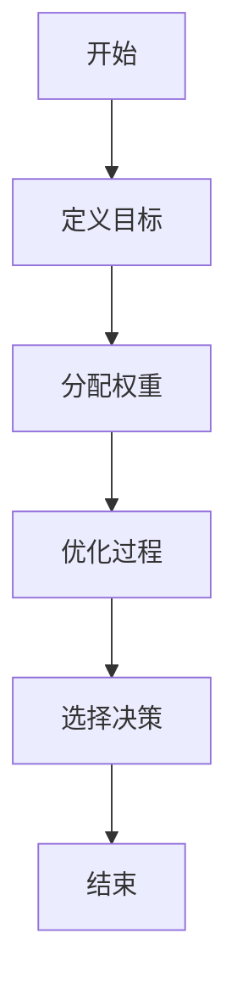
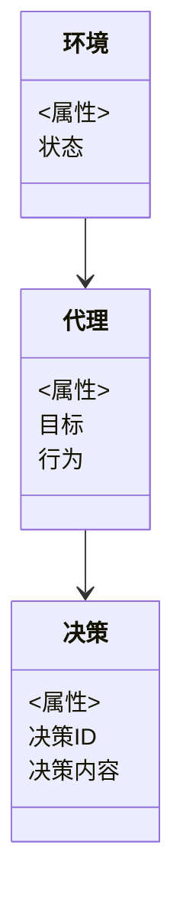
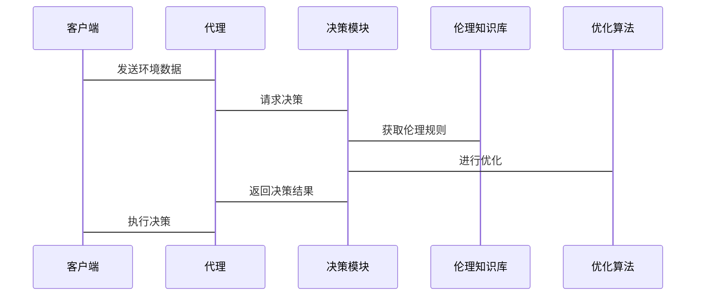

                 


# 《构建AI Agent的伦理决策框架》

## 关键词：AI Agent，伦理决策，多目标优化，决策框架，伦理评估，系统架构

## 摘要：  
本文详细探讨了构建AI Agent伦理决策框架的核心原理与实现方法。通过分析伦理决策的基本概念、算法原理、系统架构及实际案例，本文为AI Agent的开发者和研究人员提供了从理论到实践的全面指导。文章从背景介绍出发，逐步深入伦理决策框架的设计与实现，最终通过项目实战展示了框架的应用价值。

---

## 第1章：AI Agent与伦理决策概述

### 1.1 AI Agent的基本概念

#### 1.1.1 AI Agent的定义与分类  
AI Agent（人工智能代理）是指能够感知环境、自主决策并执行任务的智能体。根据智能水平，AI Agent可以分为：  
- **反应式代理**：基于当前感知做出反应，适用于简单任务。  
- **认知式代理**：具备推理、规划和学习能力，适用于复杂任务。  
- **学习型代理**：通过与环境交互优化自身行为，如强化学习代理。  

#### 1.1.2 AI Agent的核心特征与能力  
AI Agent的核心特征包括：  
1. **自主性**：无需外部干预，自主完成任务。  
2. **反应性**：能够实时感知环境并做出反应。  
3. **目标导向性**：基于目标驱动行为。  
4. **学习能力**：通过数据或经验改进决策能力。  

#### 1.1.3 AI Agent的应用场景与挑战  
AI Agent广泛应用于自动驾驶、智能助手、医疗诊断等领域。然而，其决策过程可能引发伦理问题，例如自动驾驶中的“电车难题”。如何在AI Agent中融入伦理决策框架，确保其行为符合社会伦理规范，是当前亟待解决的挑战。

---

### 1.2 伦理决策的背景与重要性

#### 1.2.1 伦理决策的基本概念  
伦理决策是指在决策过程中考虑伦理原则，确保行为符合社会道德规范。AI Agent的伦理决策框架需要将这些原则转化为可执行的规则或模型。

#### 1.2.2 AI Agent中伦理决策的必要性  
AI Agent的决策可能对人类生命或社会利益产生重大影响，因此必须考虑伦理因素。例如，在医疗诊断中，AI Agent的决策可能影响患者的治疗方案。

#### 1.2.3 当前AI Agent决策中的伦理问题  
当前AI Agent的决策主要基于数据驱动的方法，缺乏对伦理原则的明确考虑。例如，在自动驾驶中，如何在紧急情况下优先保护谁的利益？

---

## 第2章：伦理决策框架的核心概念

### 2.1 伦理决策框架的组成部分

#### 2.1.1 伦理原则与价值观  
伦理决策的核心是伦理原则，常见的伦理原则包括：  
- **功利主义**：追求整体利益的最大化。  
- **义务论**：基于道德义务做出决策。  
- **美德伦理**：基于美德和情境做出决策。  

#### 2.1.2 决策模型与规则  
伦理决策模型是将伦理原则转化为可执行规则的桥梁。常见的决策模型包括：  
- **规则导向模型**：基于预定义的伦理规则做出决策。  
- **案例导向模型**：基于类似案例的分析做出决策。  

#### 2.1.3 评估指标与反馈机制  
评估指标用于衡量伦理决策的效果，常见的评估指标包括：  
- **伦理符合度**：决策是否符合伦理原则。  
- **社会接受度**：决策是否被社会接受。  

### 2.2 核心概念的属性对比

#### 2.2.1 伦理原则的属性分析  
| 伦理原则 | 描述 | 适用场景 |
|----------|------|----------|
| 功利主义 | 追求整体利益最大化 | 群体决策 |
| 义务论 | 基于道德义务 | 个体责任 |
| 美德伦理 | 基于情境和美德 | 复杂情境 |

#### 2.2.2 决策模型的特征对比  
| 模型类型 | 描述 | 优缺点 |
|----------|------|--------|
| 规则导向模型 | 基于预定义规则 | 易实现，但缺乏灵活性 |
| 案例导向模型 | 基于类似案例 | 高灵活性，但需要大量案例数据 |

#### 2.2.3 评估指标的维度分析  
| 评估指标 | 描述 | 示例 |
|----------|------|------|
| 伦理符合度 | 决策是否符合伦理原则 | 功利主义下的决策是否最大化整体利益 |
| 社会接受度 | 决策是否被社会接受 | 自动驾驶中的紧急决策是否符合社会道德 |

### 2.3 ER实体关系图

```mermaid
erDiagram
    actor 顾客 {
        string 名字
        string 身份证号
    }
    actor 代理 {
        string 名称
        string 类型
    }
    entity 决策 {
        string 决策ID
        string 决策内容
    }
    entity 伦理原则 {
        string 伦理ID
        string 原则描述
    }
    决策 <|-- 伦理原则
    决策 <|-- 代理
    决策 <|-- 顾客
```

---

## 第3章：伦理决策算法的原理与实现

### 3.1 多目标优化算法

#### 3.1.1 多目标优化的基本概念  
多目标优化算法是一种在多个目标之间寻找最优解的方法。例如，在自动驾驶中，AI Agent需要在保护乘客、保护行人和避免事故之间寻找平衡。

#### 3.1.2 算法实现步骤  
1. **目标定义**：定义多个目标（如安全性、舒适性、效率）。  
2. **权重分配**：为每个目标分配权重。  
3. **优化过程**：通过迭代优化，找到目标函数的最优解。  
4. **决策选择**：根据优化结果选择最终决策。  

#### 3.1.3 算法的优缺点分析  
- **优点**：能够同时考虑多个目标，找到平衡点。  
- **缺点**：计算复杂，可能需要大量计算资源。  

### 3.2 算法的mermaid流程图



---

### 3.3 算法的Python实现

```python
import numpy as np

def multi_objective_optimization(objectives, weights):
    # 计算目标函数值
    objective_values = [sum(obj * weight for obj, weight in zip(objectives, weights))]
    # 确定优化方向（最小化或最大化）
    if all(weights[i] < 0 for i in range(len(weights))):
        # 最小化问题
        return np.min(objective_values)
    else:
        # 最大化问题
        return np.max(objective_values)

# 示例
objectives = [5, 10]
weights = [0.6, 0.4]
result = multi_objective_optimization(objectives, weights)
print(result)  # 输出：5*0.6 + 10*0.4 = 6.2
```

---

### 3.4 数学模型与公式

#### 3.4.1 多目标优化的数学表达  
$$ \text{优化目标：} \sum_{i=1}^{n} w_i \cdot f_i(x) $$  
其中，$w_i$ 是目标 $f_i(x)$ 的权重，$x$ 是决策变量。

#### 3.4.2 约束条件  
$$ \text{约束条件：} g(x) \leq 0 $$  
其中，$g(x)$ 是约束函数。

---

## 第4章：伦理决策框架的系统分析与架构设计

### 4.1 问题场景介绍  
以自动驾驶为例，AI Agent需要在紧急情况下做出符合伦理的决策，例如在刹车失灵时，选择撞向空旷区域还是保护乘客。

### 4.2 系统功能设计

#### 4.2.1 领域模型mermaid类图  


#### 4.2.2 系统架构设计  


#### 4.2.3 系统接口设计  
- **输入接口**：接收环境感知数据和目标。  
- **输出接口**：输出决策结果。  

#### 4.2.4 系统交互mermaid序列图  


---

## 第5章：项目实战

### 5.1 环境安装与配置  
安装必要的库：  
```bash
pip install numpy matplotlib scikit-learn
```

### 5.2 系统核心实现

#### 5.2.1 伦理知识库的构建  
```python
# 定义伦理规则
class EthicalRule:
    def __init__(self, name, description):
        self.name = name
        self.description = description
```

#### 5.2.2 决策模块的实现  
```python
class DecisionModule:
    def __init__(self, rules):
        self.rules = rules
    def make_decision(self, input):
        # 根据规则进行决策
        pass
```

#### 5.2.3 优化算法的实现  
```python
def optimize(objectives, weights):
    # 实现多目标优化算法
    pass
```

### 5.3 系统功能模块分析  
- **伦理知识库**：存储和管理伦理规则。  
- **决策模块**：根据输入和规则做出决策。  
- **优化算法**：对多个目标进行优化，找到最优解。  

### 5.4 实际案例分析  
以医疗诊断为例，AI Agent需要在有限的资源下，优先为哪些患者提供治疗。伦理决策框架可以帮助AI Agent在效率和公平性之间找到平衡。

---

## 第6章：总结与最佳实践

### 6.1 总结  
本文详细探讨了构建AI Agent伦理决策框架的核心原理与实现方法，从理论到实践，为AI Agent的开发者提供了全面的指导。

### 6.2 最佳实践 tips  
- **明确伦理原则**：在设计框架时，明确AI Agent需要遵循的伦理原则。  
- **动态调整权重**：根据具体场景动态调整目标权重，以适应不同情境。  
- **持续优化**：通过反馈机制不断优化决策模型，提高伦理决策的准确性。  

### 6.3 注意事项  
- 伦理决策框架的设计需要结合具体场景，避免“一刀切”。  
- 在实际应用中，需考虑法律法规和文化差异对伦理决策的影响。  

### 6.4 拓展阅读  
- 《伦理与人工智能》  
- 《多目标优化算法及其应用》  

---

## 结语  
构建AI Agent的伦理决策框架是一项复杂但至关重要的任务。通过本文的指导，开发者可以更好地理解和实现伦理决策框架，确保AI Agent的行为符合伦理规范，为人类社会带来更大的福祉。

