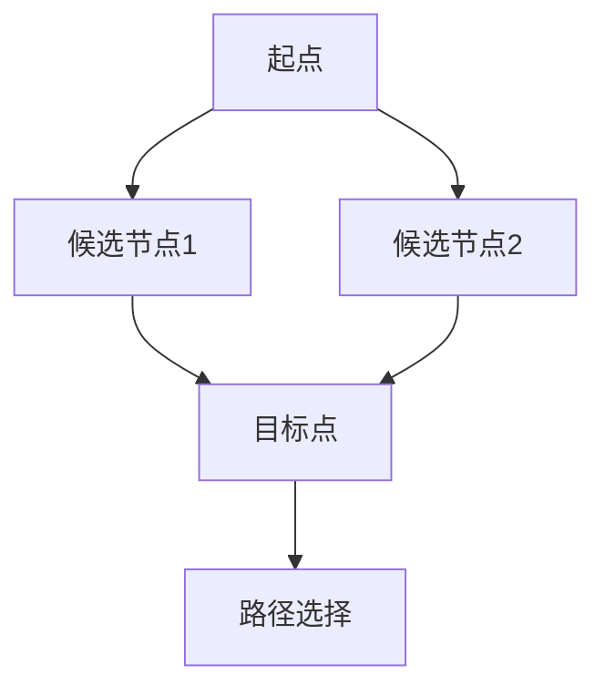
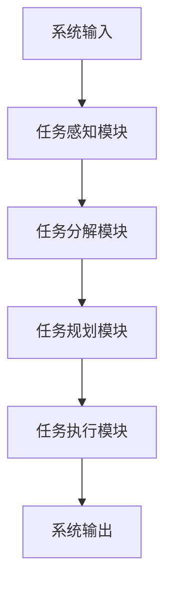
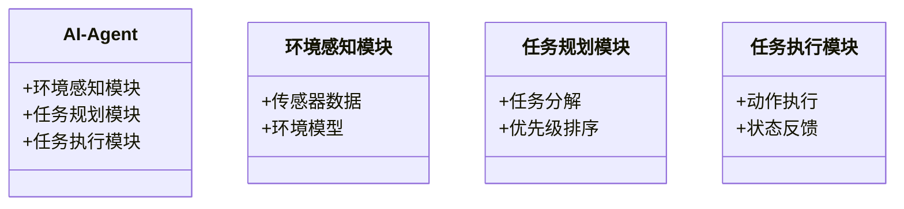

                 


# 构建AI Agent的动态任务规划与执行框架

> 关键词：AI Agent、动态任务规划、多智能体协作、任务分配算法、数学模型、系统架构设计  
> 摘要：本文深入探讨了AI Agent的动态任务规划与执行框架的构建方法，从核心概念、算法原理、系统架构设计到项目实战，全面解析了动态任务规划的关键技术与实现细节。文章通过丰富的案例分析和详细的代码实现，帮助读者理解如何在实际场景中应用这些技术。

---

# 第一部分: AI Agent的动态任务规划与执行框架概述

## 第1章: AI Agent的基本概念与背景

### 1.1 AI Agent的定义与特点
AI Agent（人工智能代理）是指能够感知环境、自主决策并执行任务的智能实体。其核心特点包括：
1. **自主性**：能够在没有外部干预的情况下独立运行。
2. **反应性**：能够实时感知环境变化并做出反应。
3. **目标导向性**：以特定目标为导向，优化决策过程。
4. **学习能力**：通过经验或数据不断优化自身行为。

AI Agent与传统AI的区别在于，它不仅能够处理静态问题，还能在动态环境中灵活调整策略。

### 1.2 动态任务规划的背景与意义
动态任务规划是指在不确定或动态变化的环境中，实时调整任务优先级和执行顺序的过程。其背景包括：
1. **环境不确定性**：任务执行过程中可能出现不可预测的障碍或变化。
2. **任务复杂性**：任务可能需要协调多个子任务或多个智能体协作完成。
3. **时间敏感性**：某些任务需要在特定时间内完成，否则可能导致严重后果。

动态任务规划的意义在于提高AI Agent在复杂环境中的适应性和效率。

### 1.3 AI Agent在动态任务规划中的应用
动态任务规划在多个领域有广泛应用，例如：
1. **自动驾驶**：实时路径规划与障碍规避。
2. **智能物流**：动态调整配送路径以优化效率。
3. **机器人协作**：多机器人团队的任务分配与协作。

---

## 第2章: 动态任务规划的核心概念与联系

### 2.1 动态任务规划的原理
动态任务规划的核心原理包括：
1. **问题建模**：将任务分解为多个子任务，并定义每个子任务的状态和目标。
2. **任务分解**：将复杂任务分解为多个 simpler tasks，并确定它们之间的依赖关系。
3. **动态调整**：根据环境变化实时调整任务优先级和执行顺序。

### 2.2 动态任务规划的核心要素
动态任务规划的核心要素包括：
1. **任务目标**：每个任务的具体目标和约束条件。
2. **环境感知**：对环境状态的实时感知能力。
3. **时间约束**：任务的截止时间和优先级。
4. **资源约束**：可分配的资源（如计算能力、传感器数据）。

### 2.3 动态任务规划与多智能体协作的关系
动态任务规划与多智能体协作密不可分。多个AI Agent需要通过任务分配和协作完成复杂任务。常见的多智能体协作方式包括：
1. **基于任务分配的协作**：每个智能体负责特定子任务。
2. **基于角色的协作**：智能体根据角色分工合作。
3. **基于通信的协作**：智能体之间通过通信共享信息。

---

## 第3章: 动态任务规划的算法原理

### 3.1 A*算法在动态任务规划中的应用
A*算法是一种常用路径规划算法，适用于动态环境中的任务规划。其基本步骤如下：
1. **初始化**：设置起始点和目标点。
2. **生成候选节点**：扩展当前节点的邻居节点。
3. **计算优先级**：使用启发式函数计算候选节点的优先级。
4. **选择最优路径**：从候选节点中选择优先级最高的节点继续扩展。

**A*算法的实现流程图（mermaid）**：



### 3.2 任务分配算法
任务分配算法用于将任务分配给多个智能体。常见的算法包括：
1. **贪心算法**：基于当前最优选择分配任务。
2. **优化算法**：如遗传算法、粒子群优化算法，用于全局最优任务分配。

**任务分配算法的数学模型**：
$$ \text{目标函数} = \sum_{i=1}^{n} w_i x_i $$
其中，$w_i$是任务权重，$x_i$是任务分配变量（0或1）。

### 3.3 动态任务规划的数学模型
动态任务规划的数学模型通常包括：
1. **状态空间模型**：描述系统可能的状态。
2. **动作空间模型**：描述系统可能采取的动作。
3. **任务优先级模型**：描述任务的优先级排序规则。

**动态任务规划的数学公式**：
$$ P(t) = \sum_{i=1}^{m} \alpha_i t_i $$
其中，$P(t)$是任务优先级，$\alpha_i$是任务权重，$t_i$是任务时间。

---

## 第4章: 动态任务规划的系统分析与架构设计

### 4.1 系统功能设计
系统功能模块包括：
1. **任务感知模块**：感知环境并提取任务相关信息。
2. **任务分解模块**：将任务分解为子任务。
3. **任务规划模块**：动态调整任务优先级和执行顺序。
4. **任务执行模块**：根据规划执行任务。

**系统功能流程图（mermaid）**：



### 4.2 系统架构设计
系统架构设计包括：
1. **分层架构**：将系统划分为感知层、决策层和执行层。
2. **模块化架构**：每个模块独立开发，便于维护和扩展。

**系统架构类图（mermaid）**：



---

## 第5章: 项目实战

### 5.1 环境搭建
1. **开发环境**：建议使用Python和相关AI库（如ROS、OpenAI Gym）。
2. **依赖安装**：安装必要的库和工具。

### 5.2 核心实现代码
以下是动态任务规划的核心实现代码：

```python
import heapq

def a_star_search(start, goal, heuristic):
    open_heap = []
    heapq.heappush(open_heap, (0, start))
    g_scores = {start: 0}
    f_scores = {start: heuristic(start, goal)}
    visited = set()

    while open_heap:
        current = heapq.heappop(open_heap)
        if current[1] == goal:
            return current[1]
        if current[1] in visited:
            continue
        visited.add(current[1])
        for neighbor in get_neighbors(current[1]):
            tentative_g = g_scores[current[1]] + distance(current[1], neighbor)
            if neighbor not in g_scores or tentative_g < g_scores[neighbor]:
                g_scores[neighbor] = tentative_g
                f_scores[neighbor] = tentative_g + heuristic(neighbor, goal)
                heapq.heappush(open_heap, (f_scores[neighbor], neighbor))
    return None
```

### 5.3 案例分析
以智能物流配送为例，AI Agent需要动态调整配送路径以避开障碍并优化配送时间。

### 5.4 代码解读与分析
上述代码实现了A*算法，用于动态路径规划。`heuristic`函数用于计算启发式评估值，`get_neighbors`函数获取当前节点的邻居节点。

---

## 第6章: 总结与展望

### 6.1 总结
本文详细介绍了AI Agent的动态任务规划与执行框架，从核心概念到算法实现，再到系统设计，为读者提供了全面的指导。

### 6.2 展望
未来的研究方向包括：
1. **强化学习的应用**：通过强化学习优化动态任务规划策略。
2. **边缘计算的结合**：利用边缘计算提高任务执行效率。
3. **多智能体协作的优化**：进一步研究多智能体协作的高效算法。

---

# 关键词
AI Agent、动态任务规划、多智能体协作、任务分配算法、数学模型、系统架构设计

# 摘要
本文深入探讨了AI Agent的动态任务规划与执行框架的构建方法，从核心概念、算法原理、系统架构设计到项目实战，全面解析了动态任务规划的关键技术与实现细节。文章通过丰富的案例分析和详细的代码实现，帮助读者理解如何在实际场景中应用这些技术。

