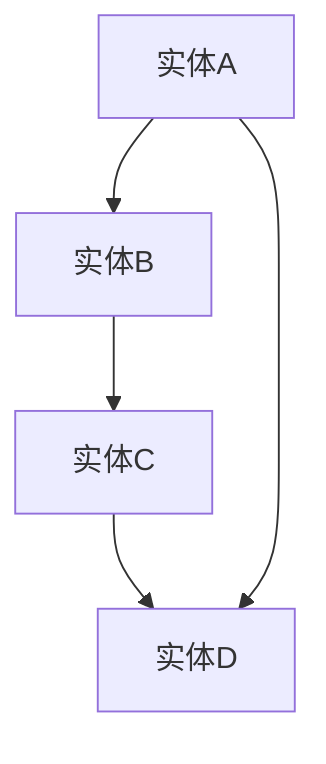
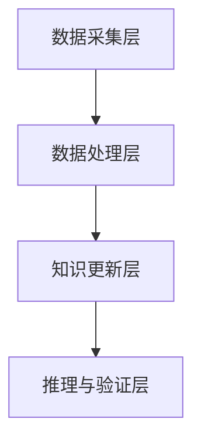

                 


# 构建AI Agent的动态知识图谱更新系统

## 关键词：动态知识图谱、AI Agent、知识图谱更新、系统架构、算法原理

## 摘要：  
本文详细探讨了构建AI Agent驱动的动态知识图谱更新系统的背景、核心概念、算法原理、系统架构以及实际应用。通过分析动态知识图谱更新的必要性，阐述了AI Agent在其中的关键作用，并结合具体案例展示了系统的实现过程。文章最后总结了最佳实践经验和未来发展方向，为构建高效、智能的知识图谱更新系统提供了理论和实践指导。

---

## 第一部分: 背景介绍

### 第1章: 动态知识图谱更新系统的背景与问题

#### 1.1 问题背景
动态知识图谱是指在不断变化的环境中，能够实时更新和调整的知识表示结构。传统的静态知识图谱无法应对现实世界中信息的快速变化，而动态知识图谱通过持续学习和更新，能够更好地反映现实世界的复杂性。

#### 1.2 问题描述
在实际应用中，知识图谱的动态更新面临以下挑战：
- **数据源异构性**：来自不同数据源的信息格式和结构可能不一致，导致整合难度大。
- **实时性要求**：动态环境下的知识更新需要实时或近实时完成，这对系统的处理能力提出了更高要求。
- **知识准确性**：动态更新可能导致知识的不准确或不一致，如何保证更新后的知识质量是一个重要问题。

#### 1.3 问题解决
AI Agent（智能代理）通过感知环境变化、执行操作和优化决策，能够有效地驱动知识图谱的动态更新。AI Agent具备以下优势：
- **自主性**：能够独立执行任务，减少人工干预。
- **反应性**：能够实时感知环境变化并做出响应。
- **学习能力**：能够通过机器学习技术不断优化自身的更新策略。

---

### 第2章: 动态知识图谱更新系统的概念与核心要素

#### 2.1 核心概念原理
动态知识图谱更新系统的核心在于通过AI Agent实时感知环境变化，并根据变化调整知识图谱的内容。具体包括以下几个步骤：
1. **数据采集**：从多个数据源采集实时数据。
2. **信息处理**：对采集到的数据进行清洗、转换和整合。
3. **知识更新**：基于处理后的新数据，更新知识图谱中的相关信息。
4. **验证与优化**：对更新后的知识图谱进行验证，确保其准确性和一致性，并根据反馈不断优化更新策略。

#### 2.2 概念属性对比
下表展示了动态知识图谱与静态知识图谱的关键区别：

| 属性         | 静态知识图谱                  | 动态知识图谱                  |
|--------------|-----------------------------|-----------------------------|
| 更新频率     | 低频或静态                   | 高频或实时                   |
| 数据源       | 单一或有限                   | 多源且动态                   |
| 知识准确性   | 较高                         | 可能较低，需实时验证         |
| 系统响应     | 延迟较高                     | 延迟较低                     |

#### 2.3 ER实体关系图
动态知识图谱更新系统的实体关系可以通过以下Mermaid图表示：



---

## 第二部分: 核心概念与联系

### 第3章: 动态知识图谱更新系统的原理

#### 3.1 核心概念原理
动态知识图谱更新系统的核心在于通过AI Agent实现对知识图谱的实时更新。AI Agent通过以下步骤完成任务：
1. **感知环境**：通过传感器或API接口获取实时数据。
2. **信息处理**：对获取的数据进行分析和转换，以便与现有知识图谱兼容。
3. **知识更新**：将处理后的新信息整合到知识图谱中。
4. **反馈与优化**：根据更新结果和用户反馈，优化AI Agent的行为策略。

#### 3.2 算法原理
动态知识图谱更新的算法基于异步更新机制，能够实现高效的知识更新。算法流程如下：

1. **数据采集**：从多个数据源异构数据。
2. **数据清洗**：去除噪声数据，确保数据质量。
3. **知识推理**：基于现有知识图谱进行推理，生成新的知识。
4. **知识更新**：将推理结果整合到知识图谱中。
5. **验证与优化**：通过验证模块确保知识的准确性，并根据反馈优化更新策略。

以下是算法的伪代码实现：

```python
def dynamic_knowledge_update(agent, knowledge_graph):
    while True:
        data = agent.perceive_environment()
        cleaned_data = agent.clean_data(data)
        inferred Knowledge = agent.infer_knowledge(cleaned_data, knowledge_graph)
        updated_graph = agent.update_graph(inferred_Knowledge, knowledge_graph)
        validation_result = agent.validate_update(updated_graph)
        if validation_result:
            knowledge_graph = updated_graph
        else:
            agent.optimize_strategy(cleaned_data, inferred_Knowledge)
```

---

### 第4章: 系统分析与架构设计

#### 4.1 问题场景介绍
动态知识图谱更新系统需要应对以下场景：
1. **实时数据源**：如社交媒体、物联网设备等。
2. **异构数据格式**：数据源可能提供不同格式的数据。
3. **高频更新需求**：知识图谱需要实时更新，以反映最新信息。

#### 4.2 系统功能设计
系统的功能模块包括：
1. **数据采集模块**：负责从多个数据源采集实时数据。
2. **数据处理模块**：对采集到的数据进行清洗、转换和整合。
3. **知识更新模块**：基于处理后的新数据，更新知识图谱。
4. **验证与优化模块**：对更新后的知识图谱进行验证，并根据反馈优化更新策略。

#### 4.3 系统架构设计
系统的架构设计采用分层架构：

1. **数据采集层**：负责从多种数据源采集实时数据。
2. **数据处理层**：对采集到的数据进行清洗、转换和整合。
3. **知识更新层**：基于处理后的新数据，更新知识图谱。
4. **推理与验证层**：对更新后的知识图谱进行推理和验证，并根据反馈优化更新策略。

以下是一个简单的系统架构图：



---

### 第5章: 项目实战

#### 5.1 环境安装
为了实现动态知识图谱更新系统，首先需要安装以下工具和库：
- Python 3.8+
- Jupyter Notebook
- PyTorch 1.9+
- NetworkX
- SPARQLWrapper

#### 5.2 核心代码实现
以下是实现动态知识图谱更新的核心代码示例：

```python
from SPARQLWrapper import SPARQLWrapper
import networkx as nx

class DynamicKnowledgeUpdater:
    def __init__(self, endpoint):
        self.endpoint = endpoint
        self.graph = nx.Graph()

    def perceive_environment(self):
        # 使用SPARQL查询数据
        sparql = SPARQLWrapper(self.endpoint)
        sparql.set_query("SELECT ?s ?p ?o WHERE {}")
        results = sparql.query().convert()
        return results

    def clean_data(self, data):
        # 数据清洗逻辑
        cleaned = {}
        for row in data['results']['bindings']:
            s = row['s']['value']
            p = row['p']['value']
            o = row['o']['value']
            cleaned[(s, p)] = o
        return cleaned

    def update_graph(self, cleaned_data):
        # 更新知识图谱
        for (s, p), o in cleaned_data.items():
            self.graph.add_edge(s, p, label=o)
        return self.graph

# 示例用法
 updater = DynamicKnowledgeUpdater("http://example.com/sparql")
 data = updater.perceive_environment()
 cleaned_data = updater.clean_data(data)
 updated_graph = updater.update_graph(cleaned_data)
```

#### 5.3 代码解读与分析
上述代码实现了以下功能：
1. **数据采集**：使用SPARQL查询数据。
2. **数据清洗**：将查询结果转换为键值对的形式。
3. **知识更新**：将清洗后的新数据整合到知识图谱中。

#### 5.4 实际案例分析
假设我们有一个动态知识图谱，用于实时更新城市交通信息。当检测到交通事故时，AI Agent会触发更新机制，将新的交通状况整合到知识图谱中，从而优化路径规划。

#### 5.5 项目小结
通过上述实现，我们可以看到动态知识图谱更新系统的核心在于高效的数据处理和智能的知识更新能力。AI Agent在其中起到了关键作用，能够实时感知环境变化并驱动知识图谱的动态更新。

---

## 第三部分: 总结与展望

### 6.1 最佳实践 Tips
1. **数据源管理**：确保数据源的多样性和可靠性。
2. **算法优化**：不断优化知识更新算法，提高系统效率。
3. **系统验证**：定期验证知识图谱的准确性和一致性。

### 6.2 小结
本文详细探讨了构建AI Agent驱动的动态知识图谱更新系统的背景、核心概念、算法原理、系统架构以及实际应用。通过分析动态知识图谱更新的必要性，阐述了AI Agent在其中的关键作用，并结合具体案例展示了系统的实现过程。

### 6.3 注意事项
- **数据隐私**：在处理实时数据时，需要注意数据隐私和安全问题。
- **系统稳定性**：确保系统在高频更新下的稳定性和可靠性。
- **反馈机制**：建立有效的反馈机制，及时发现和解决系统中的问题。

### 6.4 拓展阅读
- 《Knowledge Graph Construction and Dynamic Update》
- 《Artificial Intelligence and Knowledge Management》
- 《Dynamic Knowledge Representation in AI Systems》

---

通过本文的详细讲解，读者可以全面了解动态知识图谱更新系统的核心原理和实现方法。未来，随着AI技术的不断发展，动态知识图谱更新系统将在更多领域发挥重要作用，为现实世界中的复杂问题提供更高效的解决方案。

