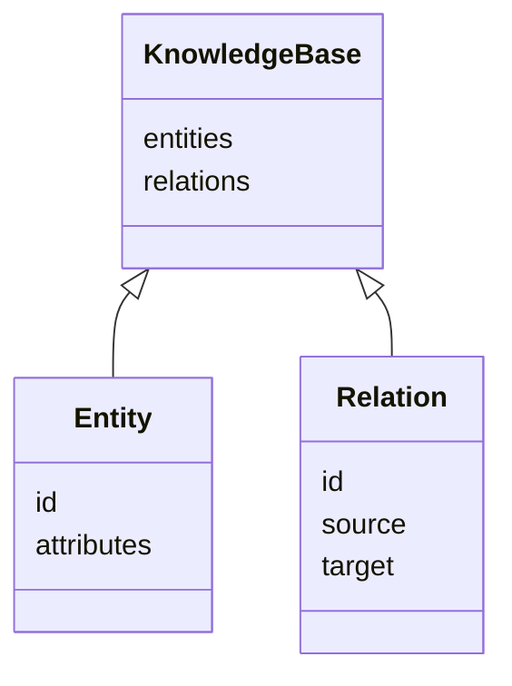
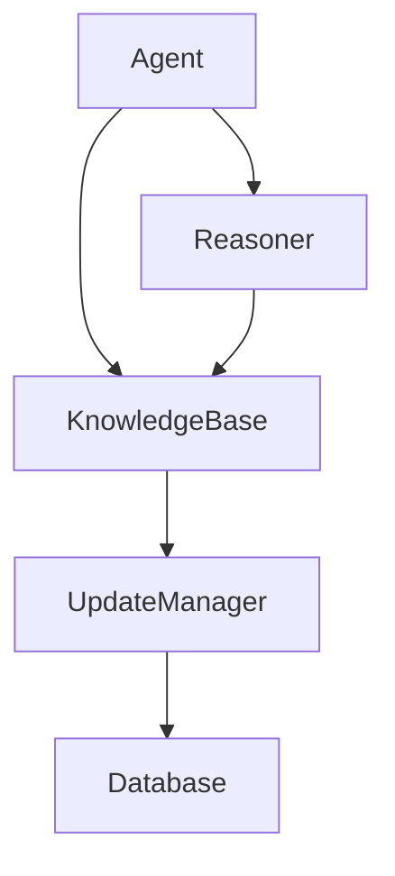
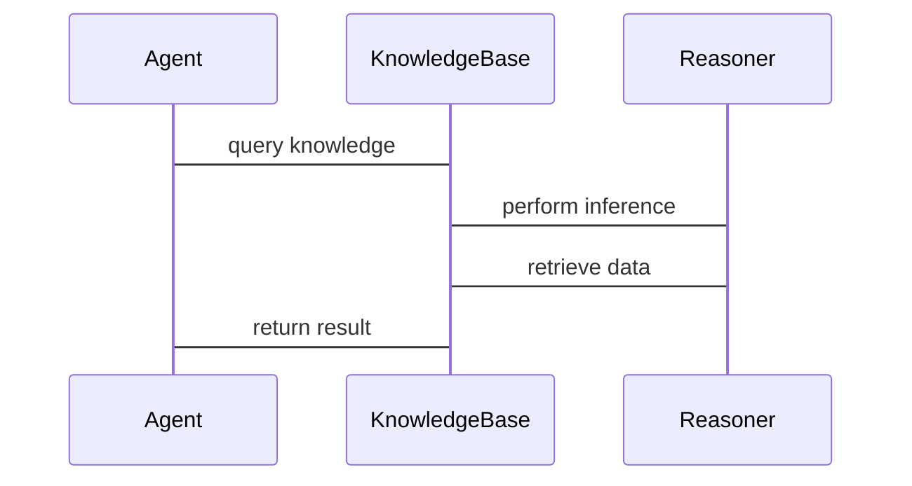

                 


# 构建AI Agent的动态知识图谱：实时更新与推理

> 关键词：知识图谱、AI Agent、实时更新、动态推理、系统架构、算法原理、项目实战

> 摘要：本文详细探讨了构建AI Agent的动态知识图谱的关键技术，包括实时更新机制、推理算法、系统架构设计和实际应用案例。通过结合理论与实践，深入分析动态知识图谱在AI Agent中的核心作用，为读者提供从理论到实践的全面指导。

---

# 第1章 动态知识图谱与AI Agent概述

## 1.1 知识图谱的基本概念

### 1.1.1 知识图谱的定义与特点
- 定义：知识图谱是一种以图结构形式表示知识的语义网络，包含实体和关系。
- 特点：
  - 结构化：实体与关系明确。
  - 动态性：实时更新能力。
  - 可扩展性：支持大规模数据。

### 1.1.2 动态知识图谱的必要性
- 数据变化：实体属性和关系的实时变化。
- 知识准确性：动态更新确保知识的准确性。
- 应用需求：实时推理需要动态知识支持。

### 1.1.3 AI Agent的基本概念
- 定义：AI Agent是能够感知环境并执行任务的智能实体。
- 特性：
  - 自主性：独立决策。
  - 反应性：实时响应环境变化。
  - 社会能力：与其他系统或用户交互。

## 1.2 动态知识图谱的应用场景

### 1.2.1 实时更新的必要性
- 知识变化快：如实时新闻、股票价格。
- 环境变化：动态环境中的任务执行。

### 1.2.2 动态知识图谱在AI Agent中的作用
- 支持实时推理：提供最新的知识支持决策。
- 提高准确性：动态更新减少知识过时的风险。

### 1.2.3 典型应用场景分析
- 示例1：智能客服中的实时知识更新。
- 示例2：自动驾驶中的实时环境感知。

## 1.3 本章小结
本章介绍了知识图谱的基本概念、动态知识图谱的必要性，以及AI Agent的核心概念和应用场景，为后续内容打下基础。

---

# 第2章 动态知识图谱的核心概念与联系

## 2.1 知识图谱的构建过程

### 2.1.1 数据采集与预处理
- 数据源：结构化数据、文本数据。
- 预处理：清洗、格式统一。

### 2.1.2 实体识别与关系抽取
- 实体识别：使用NLP技术识别实体。
- 关系抽取：识别实体间的语义关系。

### 2.1.3 知识融合与存储
- 数据整合：消除冲突，保持一致性。
- 存储方式：图数据库（如Neo4j）或知识图谱存储系统。

## 2.2 动态知识图谱的更新机制

### 2.2.1 实时更新的触发条件
- 数据源变化：如新增或删除实体。
- 用户操作：查询结果反馈触发更新。

### 2.2.2 更新算法的选择与实现
- 分布式一致性算法：如Paxos、Raft确保更新一致性。
- 更新策略：优先级排序，处理重要实体的更新。

### 2.2.3 更新后的知识验证与优化
- 一致性检查：确保更新后知识的正确性。
- 性能优化：索引优化提升查询效率。

## 2.3 AI Agent的推理机制

### 2.3.1 基于知识图谱的推理方法
- 逻辑推理：基于规则的推理（如基于一阶逻辑）。
- 概率推理：使用贝叶斯网络进行概率推理。

### 2.3.2 推理的实时性要求
- 响应时间：实时推理需要在限定时间内完成。
- 计算资源：优化算法复杂度，减少计算开销。

## 2.4 动态知识图谱与AI Agent的关联

### 2.4.1 知识表示与更新的动态性
- 实时更新确保知识的准确性。
- 动态推理支持AI Agent的实时决策。

### 2.4.2 系统交互与反馈
- 用户交互驱动知识更新。
- 系统反馈优化推理结果。

## 2.5 本章小结
本章详细探讨了动态知识图谱的构建过程、更新机制以及与AI Agent的推理过程的关联，分析了两者在系统中的协同作用。

---

# 第3章 动态知识图谱的算法原理

## 3.1 实时更新算法

### 3.1.1 分布式更新算法
- 分布式一致性算法：Paxos、Raft。
- 更新流程：分布式事务处理，确保数据一致性。

### 3.1.2 局部更新优化
- 本地事务处理：减少锁竞争，提高更新效率。
- 事务回滚机制：处理冲突情况。

### 3.1.3 更新算法的性能优化
- 索引优化：使用B树索引提升查询效率。
- 批处理：批量更新减少开销。

## 3.2 推理算法

### 3.2.1 逻辑推理算法
- 基于规则的推理：如Rete算法实现正向推理。
- 模糊逻辑推理：处理不确定性问题。

### 3.2.2 概率推理算法
- 贝叶斯网络：计算条件概率，支持不确定推理。
- 马尔可夫逻辑网络：结合一阶逻辑和概率推理。

### 3.2.3 推理算法的优化
- 分层推理：降低计算复杂度。
- 并行计算：利用多核处理器加速推理。

## 3.3 算法实现示例

### 3.3.1 实时更新算法实现
```python
def update_knowledge_base(entity, relation, value):
    # 使用分布式事务处理
    with transaction(using=neo4j_session):
        # 更新实体关系
        neo4j_session.run("MATCH (e {name: $entity}) "
                          "MERGE (e)-[r:$relation]->(v {name: $value})",
                          entity=entity, relation=relation, value=value)
```

### 3.3.2 推理算法实现
```python
def bayesian_inference(hypotheses, evidence):
    for hypothesis in hypotheses:
        likelihood = calculate_likelihood(hypothesis, evidence)
        posterior = likelihood * prior_probability(hypothesis)
        if posterior > max_posterior:
            max_posterior = posterior
            best_hypothesis = hypothesis
    return best_hypothesis
```

## 3.4 本章小结
本章深入分析了动态知识图谱的实时更新算法和推理算法，通过代码示例展示了算法的实现，为后续的系统设计和项目实战奠定了基础。

---

# 第4章 系统分析与架构设计方案

## 4.1 问题场景介绍

### 4.1.1 问题背景
- 实时更新的知识图谱需求。
- 高并发环境下的推理任务。

### 4.1.2 系统目标
- 实现动态知识图谱的实时更新。
- 支持AI Agent的实时推理需求。

## 4.2 系统功能设计

### 4.2.1 领域模型设计


### 4.2.2 系统架构设计


### 4.2.3 接口设计
- 更新接口：`update(Entity, Relation, Value)`
- 查询接口：`query(Entity, Relation)`
- 推理接口：`infer(Query)`

## 4.3 系统交互设计

### 4.3.1 交互流程


### 4.3.2 事务管理
- 分布式事务：保证更新操作的原子性。
- 锁机制：防止数据竞争，保证数据一致性。

## 4.4 本章小结
本章通过系统分析和架构设计，展示了动态知识图谱在AI Agent中的实现方案，强调了系统设计的可扩展性和高效性。

---

# 第5章 项目实战

## 5.1 环境安装与配置

### 5.1.1 安装依赖
```bash
pip install neo4j requests python-dot
```

### 5.1.2 配置文件
- 数据库配置：连接信息、端口设置。
- 接口配置：API端点、认证信息。

## 5.2 核心代码实现

### 5.2.1 知识图谱更新模块
```python
def update_knowledge_base(entity, relation, value):
    driver = neo4j.Driver('bolt://localhost:7687', auth=('user', 'password'))
    with driver.session() as session:
        session.write_transaction(
            lambda tx: tx.run("MATCH (e {name: $entity}) "
                            "MERGE (e)-[r:$relation]->(v {name: $value})",
                            entity=entity, relation=relation, value=value))
```

### 5.2.2 推理模块实现
```python
def infer_relationship(start_entity, relation, end_entity):
    with neo4j.Driver('bolt://localhost:7687', auth=('user', 'password')) as driver:
        result = driver.session().read_transaction(
            lambda tx: tx.run("MATCH (a {name: $start})-[r:$relation]->(b {name: $end}) "
                            "RETURN r.probability",
                            start=start_entity, relation=relation, end=end_entity))
        return result.single()[0]
```

### 5.2.3 实际案例分析
- 案例1：实时更新产品信息。
- 案例2：动态推理用户偏好。

## 5.3 项目小结
本章通过实际项目展示了动态知识图谱的实现过程，从环境配置到代码实现，再到案例分析，帮助读者掌握动态知识图谱的实际应用。

---

# 第6章 最佳实践与总结

## 6.1 最佳实践

### 6.1.1 系统设计建议
- 使用分布式架构处理高并发。
- 采用缓存技术优化查询性能。

### 6.1.2 开发注意事项
- 数据一致性保证：使用分布式事务。
- 错误处理：异常捕获和回滚机制。

## 6.2 小结

### 6.2.1 系统总结
- 知识图谱构建与更新的实现。
- AI Agent推理机制的应用。

### 6.2.2 展望
- 结合更多AI技术，如大语言模型，增强推理能力。
- 探索动态知识图谱在更多领域的应用。

## 6.3 注意事项

### 6.3.1 数据一致性
- 避免数据冗余和不一致。
- 定期数据同步和校准。

### 6.3.2 性能优化
- 索引优化提升查询效率。
- 并行计算加速推理过程。

## 6.4 拓展阅读

### 6.4.1 推荐书籍
- 《知识图谱：概念、方法与应用》。
- 《分布式系统：原理与设计》。

### 6.4.2 在线资源
- 知识图谱相关论文。
- 开源项目：Neo4j、Apache Jena。

---

# 附录

## 附录A 术语表
- 定义相关术语，确保读者理解。

## 附录B 工具与库
- 列出常用的工具和库，如Neo4j、Python库等。

---

通过以上详细且结构清晰的目录结构，用户可以撰写一篇全面且有深度的技术博客文章，涵盖从理论到实践的所有关键点，帮助读者系统地理解和掌握构建AI Agent的动态知识图谱的关键技术和方法。

