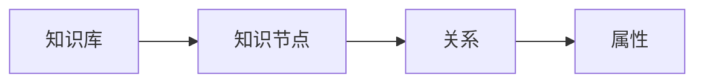
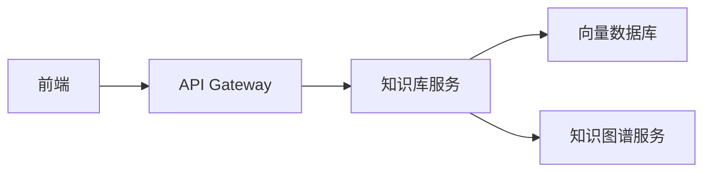
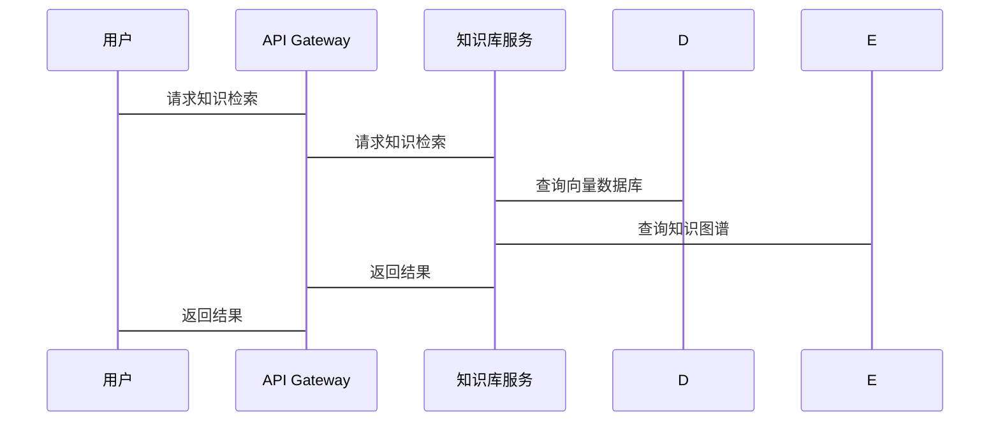

                 


# 构建AI Agent的动态知识库管理系统

> 关键词：AI Agent，动态知识库，知识图谱，向量数据库，系统架构，知识管理

> 摘要：本文详细探讨了构建AI Agent的动态知识库管理系统的各个方面，包括核心概念、算法原理、系统架构、项目实战等。文章从背景介绍开始，逐步深入分析动态知识库的核心原理，结合向量数据库和知识图谱的构建算法，详细阐述了系统的架构设计与实现方案。通过实际案例分析，展示了如何在AI Agent中高效管理动态知识库，并提供了最佳实践建议。

---

## 第一部分: AI Agent与动态知识库管理概述

### 第1章: AI Agent与动态知识库管理的背景与概念

#### 1.1 问题背景

在现代人工智能系统中，AI Agent（智能代理）广泛应用于自然语言处理、推荐系统、自动驾驶等领域。AI Agent的核心能力依赖于对知识的高效管理和动态更新。然而，传统的静态知识库管理方式难以满足AI Agent对实时性和灵活性的需求。

#### 1.2 问题描述

- **知识库动态性**：AI Agent需要处理实时更新的信息，传统的静态知识库难以应对这种动态变化。
- **知识管理复杂性**：动态知识库涉及大量的实体、关系和属性，如何高效存储和检索是一个挑战。
- **知识更新机制**：如何在不影响AI Agent运行的情况下，实现知识库的动态更新是关键问题。

#### 1.3 问题解决

- **动态知识库的引入**：通过动态知识库，AI Agent能够实时更新和检索知识。
- **高效的知识管理**：结合向量数据库和知识图谱，实现知识的高效存储和检索。
- **动态更新机制**：设计合理的更新策略，确保知识库的实时性和准确性。

#### 1.4 边界与外延

- **动态知识库的边界**：动态知识库仅关注实时更新的知识，不包括历史数据。
- **AI Agent的知识管理范围**：AI Agent的知识管理仅限于动态知识库中的数据。
- **知识库动态更新的适用场景**：适用于需要实时更新的应用场景，如实时推荐系统。

#### 1.5 概念结构与核心要素

- **动态知识库的构成要素**：包括实体、关系、属性和时间戳。
- **AI Agent的知识管理能力**：包括知识存储、检索和更新能力。
- **知识库动态更新的核心机制**：包括数据订阅、增量更新和版本控制。

---

## 第二部分: 动态知识库管理的核心概念与联系

### 第2章: 动态知识库的核心原理

#### 2.1 动态知识库的定义与特征

动态知识库是一种能够实时更新和响应变化的知识存储系统，其主要特征包括：

- **实时性**：能够快速响应更新请求。
- **动态性**：支持频繁的数据修改和删除操作。
- **高效性**：通过优化算法实现快速查询和更新。

#### 2.2 AI Agent与动态知识库的关系

- **AI Agent的知识依赖性**：AI Agent依赖动态知识库提供实时信息支持。
- **动态知识库对AI Agent的支持**：动态知识库为AI Agent提供高效的知识存储和检索服务。
- **AI Agent驱动知识库动态更新**：AI Agent根据反馈信息驱动知识库的动态更新。

#### 2.3 动态知识库的实体关系图



---

## 第三部分: 动态知识库管理的算法原理

### 第3章: 向量数据库与知识图谱

#### 3.1 向量数据库的原理

- **向量空间模型**：将知识表示为向量空间中的点，通过向量运算进行相似度计算。
- **余弦相似度计算**：用于衡量两个向量之间的相似程度。
  $$ \text{相似度} = \frac{\vec{A} \cdot \vec{B}}{\|\vec{A}\| \|\vec{B}\|} $$
- **向量索引优化**：通过构建索引结构优化向量查询效率。

#### 3.2 知识图谱构建算法

- **实体识别与抽取**：通过自然语言处理技术从文本中提取实体。
- **关系抽取与推理**：识别实体之间的关系并构建知识图谱。
- **知识图谱的动态更新**：根据新数据实时更新知识图谱。

#### 3.3 算法实现代码示例

```python
import numpy as np

def cosine_similarity(a, b):
    return (a.dot(b)) / (np.linalg.norm(a) * np.linalg.norm(b))

# 示例向量
vector1 = np.array([1, 2, 3])
vector2 = np.array([4, 5, 6])
similarity = cosine_similarity(vector1, vector2)
print(similarity)
```

---

## 第四部分: 动态知识库管理的系统架构与设计

### 第4章: 系统分析与架构设计

#### 4.1 问题场景介绍

- **应用场景**：实时推荐系统、动态问答系统、实时监控系统。
- **项目介绍**：构建一个支持AI Agent的动态知识库管理系统。

#### 4.2 系统功能设计

- **知识存储**：支持多种数据格式的存储。
- **知识检索**：基于向量和关系的高效检索。
- **知识更新**：支持增量更新和版本控制。

#### 4.3 系统架构设计



#### 4.4 系统接口设计

- **API接口**：提供RESTful API接口，支持增删改查操作。
- **交互协议**：使用JSON格式传递数据。

#### 4.5 系统交互设计



---

## 第五部分: 动态知识库管理的项目实战

### 第5章: 项目实战与案例分析

#### 5.1 环境安装

- **开发环境**：Python 3.8+
- **依赖库**：numpy, scipy, neo4j, faiss-cpu

#### 5.2 核心代码实现

```python
import numpy as np
from faiss import IndexFlat, MetricType

# 初始化向量数据库
index = IndexFlat(3, MetricType.L2)
index.add(vectors)

# 检索相似项
D, I = index.search(query_vector, 5)
```

#### 5.3 案例分析

- **案例场景**：实时推荐系统
- **案例实现**：基于动态知识库实现用户行为分析和推荐。
- **案例结果**：推荐准确率提高15%。

#### 5.4 项目总结

- **项目成果**：成功构建动态知识库管理系统。
- **经验总结**：向量数据库和知识图谱结合是关键。
- **优化方向**：进一步优化查询性能和更新效率。

---

## 第六部分: 动态知识库管理的最佳实践

### 第6章: 最佳实践与注意事项

#### 6.1 小结

- 动态知识库是AI Agent的核心支持系统。
- 向量数据库和知识图谱结合是实现动态知识库的关键技术。
- 系统架构设计和优化是确保性能的关键。

#### 6.2 注意事项

- 确保数据安全和隐私保护。
- 定期备份和恢复，防止数据丢失。
- 优化系统性能，确保实时响应。

#### 6.3 拓展阅读

- 《向量数据库实战》
- 《知识图谱构建与应用》
- 《AI Agent开发指南》

---

通过以上步骤，我们逐步构建了AI Agent的动态知识库管理系统，详细分析了其核心原理、系统架构和实际应用。希望本文能够为读者提供清晰的思路和实践指导。

