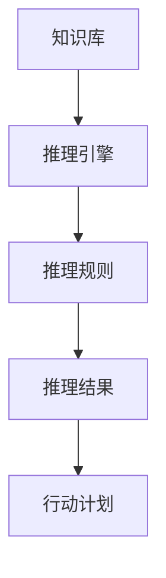
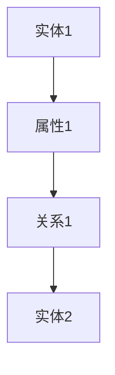
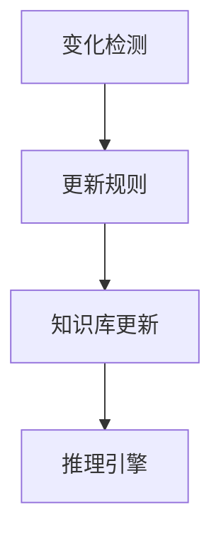
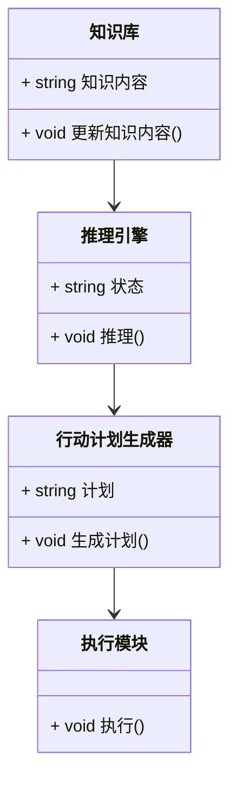
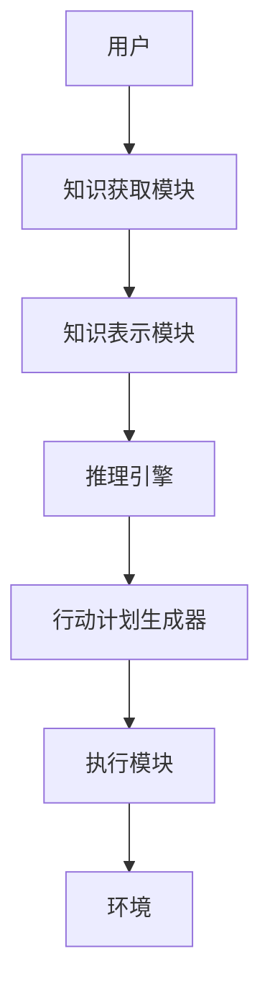
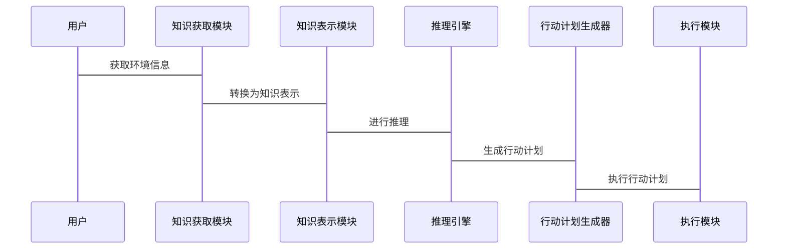

                 


# 《构建AI Agent的动态知识推理系统》

> 关键词：AI Agent, 动态知识推理, 知识表示, 推理算法, 系统架构

> 摘要：  
本文系统地探讨了AI Agent的动态知识推理系统，从核心概念、算法原理到系统架构，全面分析了构建此类系统的必要性、方法和实现路径。文章首先介绍了AI Agent的基本概念和动态知识推理的背景，然后深入探讨了知识表示与推理的核心原理，结合具体算法和数学模型，分析了系统的架构设计。通过实战案例，展示了如何将理论应用于实际项目，并总结了最佳实践和未来发展路径。

---

# 第一部分: AI Agent与动态知识推理系统背景介绍

## 第1章: AI Agent的基本概念与动态知识推理的背景

### 1.1 AI Agent的基本概念

#### 1.1.1 什么是AI Agent
AI Agent（智能体）是指在特定环境中能够感知并自主行动以实现目标的实体。它可以是一个软件程序、机器人或其他智能系统，通过与环境交互来完成任务。AI Agent的核心特征包括：
- **自主性**：能够在没有外部干预的情况下运行。
- **反应性**：能够实时感知环境并做出反应。
- **目标导向**：所有行为都以实现特定目标为导向。

#### 1.1.2 AI Agent的核心特征
AI Agent的特征可以分为以下几类：
- **知识表示**：Agent需要表示和存储知识，以便进行推理和决策。
- **推理能力**：基于现有知识和环境信息，推导出新的结论或行动方案。
- **行动计划**：根据推理结果，生成具体的行动计划并执行。

#### 1.1.3 动态知识推理的定义与作用
动态知识推理是指在实时环境中，Agent能够根据不断变化的信息更新其知识库并进行推理的能力。其作用包括：
- **实时更新**：适应快速变化的环境。
- **动态决策**：根据最新信息做出最优决策。
- **自我优化**：通过持续推理和学习，提高系统的性能。

---

### 1.2 动态知识推理的背景与问题背景

#### 1.2.1 当前AI Agent面临的挑战
随着AI Agent应用场景的不断扩大，传统的静态知识推理系统逐渐暴露出以下问题：
- **知识更新滞后**：无法实时处理动态变化的信息。
- **推理效率低下**：面对复杂场景时，推理速度难以满足实时需求。
- **环境不确定性**：动态环境中，Agent需要快速适应不确定性。

#### 1.2.2 动态知识推理的必要性
动态知识推理的必要性体现在以下几个方面：
- **实时性要求**：许多应用场景（如自动驾驶、实时推荐系统）需要快速决策。
- **环境复杂性**：动态环境中的信息不断变化，静态推理难以应对。
- **用户需求多样性**：不同用户的需求可能随时变化，系统需要动态调整。

#### 1.2.3 问题解决的核心思路
动态知识推理的核心思路包括：
1. **动态知识表示**：使用灵活的知识表示方法，支持实时更新。
2. **高效的推理算法**：设计高效的推理算法，确保实时推理能力。
3. **自适应学习**：通过机器学习技术，动态优化推理模型。

---

### 1.3 动态知识推理系统的边界与外延

#### 1.3.1 系统的边界定义
动态知识推理系统的边界主要集中在以下几个方面：
- **输入边界**：实时环境信息和用户输入。
- **输出边界**：推理结果和行动计划。
- **外部依赖**：依赖于知识库和推理引擎。

#### 1.3.2 系统的外延特征
系统的外延特征包括：
- **可扩展性**：能够轻松扩展知识库和推理规则。
- **可定制性**：支持不同应用场景的定制需求。
- **容错性**：在部分信息缺失或错误的情况下仍能正常运行。

#### 1.3.3 相关概念的对比与区分
以下是相关概念的对比表格：

| 概念       | 静态知识推理 | 动态知识推理 |
|------------|--------------|--------------|
| 知识表示     | 静态、固定   | 动态、可变   |
| 推理速度     | 非实时       | 实时         |
| 适应性       | 低           | 高           |

---

### 1.4 动态知识推理系统的概念结构

#### 1.4.1 系统的核心要素组成
动态知识推理系统的核心要素包括：
1. **知识库**：存储Agent所需的所有知识。
2. **推理引擎**：负责根据知识库和环境信息进行推理。
3. **行动计划生成器**：根据推理结果生成具体的行动计划。

#### 1.4.2 系统的层次结构
系统的层次结构如下：
1. **感知层**：负责采集环境信息。
2. **知识表示层**：对感知到的信息进行知识化处理。
3. **推理层**：基于知识库进行推理，生成决策。
4. **执行层**：根据决策执行具体行动。

#### 1.4.3 系统的功能模块划分
以下是系统的功能模块划分表格：

| 功能模块         | 描述                           |
|------------------|----------------------------|
| 知识获取模块     | 从环境中获取知识               |
| 知识表示模块     | 将知识转化为可推理的形式       |
| 推理引擎模块     | 基于知识进行推理               |
| 行动计划生成模块 | 根据推理结果生成行动计划       |
| 执行模块         | 执行生成的行动计划             |

---

## 第2章: 动态知识推理系统的原理与核心概念

### 2.1 动态知识推理的核心原理

#### 2.1.1 知识表示与推理的基本原理
知识表示是动态知识推理的基础，常见的知识表示方法包括：
- **符号逻辑表示**：使用符号和逻辑规则表示知识。
- **语义网络表示**：通过节点和边表示概念及其关系。
- **知识图谱表示**：使用图结构表示实体及其属性。

#### 2.1.2 动态知识更新的机制
动态知识更新的机制包括：
1. **增量更新**：仅更新变化的部分，减少计算开销。
2. **版本控制**：记录知识的版本，确保更新的可追溯性。
3. **冲突解决**：处理新旧知识之间的冲突，确保知识的正确性。

#### 2.1.3 知识推理的逻辑框架
知识推理的逻辑框架包括：
1. **演绎推理**：从一般到特殊的推理方式。
2. **归纳推理**：从特殊到一般的推理方式。
3. **默认推理**：基于常识进行推理。

---

#### 2.1.4 动态知识推理的逻辑框架

以下是动态知识推理的逻辑框架Mermaid图：



---

### 2.2 核心概念的属性特征对比

#### 2.2.1 知识表示的多样性
知识表示的多样性可以通过以下表格对比：

| 表示方法       | 优点               | 缺点               |
|----------------|--------------------|--------------------|
| 符号逻辑表示     | 表达清晰，易于推理   | 难以处理语义信息     |
| 语义网络表示     | 能够表示概念关系     | 实施复杂            |
| 知识图谱表示     | 支持大规模知识存储   | 需要大量计算资源    |

---

### 2.3 ER实体关系图架构

#### 2.3.1 实体关系图的构建
以下是实体关系图的Mermaid图：



---

#### 2.3.2 实体关系的动态变化
动态知识推理系统中，实体关系的动态变化可以通过以下流程图表示：



---

#### 2.3.3 实体关系图的更新机制
以下是实体关系图的更新机制表格：

| 步骤       | 描述               |
|------------|--------------------|
| 检测变化     | 检测环境中的变化信息 |
| 生成更新规则 | 根据变化生成更新规则 |
| 更新知识库   | 执行更新规则，更新知识库 |
| 通知推理引擎 | 通知推理引擎知识库的变化 |

---

## 第3章: 动态知识推理算法的数学模型与公式

### 3.1 知识表示的数学模型

#### 3.1.1 基于符号逻辑的知识表示
基于符号逻辑的知识表示可以表示为：

$$
P \rightarrow Q
$$

其中，$P$ 和 $Q$ 是命题，表示如果 $P$ 为真，则 $Q$ 必须为真。

---

#### 3.1.2 基于概率论的知识表示
基于概率论的知识表示可以表示为：

$$
P(A|B) = \frac{P(B|A) \cdot P(A)}{P(B)}
$$

其中，$P(A|B)$ 表示在 $B$ 发生的情况下，$A$ 发生的概率。

---

### 3.2 动态知识推理算法的数学模型

#### 3.2.1 基于规则的推理算法
基于规则的推理算法可以表示为：

$$
\text{如果 } P \text{ 和 } Q \text{ 成立，则 } R \text{ 成立}
$$

其中，$P$、$Q$ 和 $R$ 是命题。

---

#### 3.2.2 基于概率的推理算法
基于概率的推理算法可以表示为：

$$
P(R|P \cap Q) = \frac{P(R \cap P \cap Q)}{P(P \cap Q)}
$$

其中，$P(R|P \cap Q)$ 表示在 $P$ 和 $Q$ 成立的情况下，$R$ 成立的概率。

---

## 第4章: 动态知识推理系统的系统分析与架构设计方案

### 4.1 问题场景介绍

#### 4.1.1 项目介绍
假设我们正在开发一个智能客服系统，该系统需要能够实时处理用户的查询，并根据上下文进行推理和回答。

---

#### 4.1.2 系统功能设计

以下是系统功能设计的类图：



---

### 4.2 系统架构设计

#### 4.2.1 系统架构设计的Mermaid图
以下是系统架构设计的Mermaid图：



---

#### 4.2.2 系统接口设计
以下是系统接口设计的表格：

| 接口名称       | 描述               |
|----------------|--------------------|
| 获取知识接口     | 从环境中获取知识     |
| 表示知识接口     | 将知识转化为可推理形式 |
| 推理接口         | 基于知识进行推理     |
| 生成计划接口     | 根据推理结果生成行动计划 |
| 执行接口         | 执行生成的行动计划   |

---

#### 4.2.3 系统交互设计
以下是系统交互设计的Mermaid序列图：



---

## 第5章: 项目实战

### 5.1 环境安装与配置

#### 5.1.1 环境要求
- Python 3.8+
- PyTorch
- transformers库

---

#### 5.1.2 安装依赖
```bash
pip install torch transformers
```

---

### 5.2 系统核心实现

#### 5.2.1 知识表示模块

以下是知识表示模块的代码示例：

```python
class KnowledgeBase:
    def __init__(self):
        self.knowledge = {}

    def update_knowledge(self, key, value):
        self.knowledge[key] = value

    def get_knowledge(self, key):
        return self.knowledge.get(key, None)
```

---

#### 5.2.2 推理引擎模块

以下是推理引擎模块的代码示例：

```python
class ReasoningEngine:
    def __init__(self, knowledge_base):
        self.knowledge_base = knowledge_base

    def infer(self, query):
        # 假设推理逻辑基于知识库中的知识
        knowledge = self.knowledge_base.get_knowledge(query)
        return knowledge if knowledge else None
```

---

#### 5.2.3 行动计划生成器模块

以下是行动计划生成器模块的代码示例：

```python
class PlanGenerator:
    def __init__(self):
        self.plans = []

    def generate_plan(self, knowledge):
        # 生成简单的行动计划
        self.plans.append(f"Action based on {knowledge}")
        return self.plans[-1]
```

---

### 5.3 代码应用解读与分析

#### 5.3.1 代码实现步骤
1. 初始化知识库。
2. 更新知识库。
3. 调用推理引擎进行推理。
4. 生成行动计划。
5. 执行行动计划。

---

### 5.4 实际案例分析

#### 5.4.1 案例描述
假设我们的智能客服系统需要回答用户的问题，以下是具体实现步骤：

1. 用户询问：“如何重置密码？”
2. 知识库获取相关知识：“重置密码需要通过邮件验证。”
3. 推理引擎推理出需要验证邮件。
4. 行动计划生成器生成验证邮件的步骤。
5. 执行模块发送验证邮件。

---

### 5.5 项目小结

#### 5.5.1 项目总结
通过以上步骤，我们实现了动态知识推理系统的初步功能，能够根据实时环境信息进行推理和决策。

---

## 第6章: 扩展内容

### 6.1 最佳实践 tips

#### 6.1.1 知识库管理
- 定期清理无效知识。
- 及时更新过时知识。

#### 6.1.2 推理引擎优化
- 使用更高效的推理算法。
- 并行处理推理任务。

#### 6.1.3 系统监控
- 实时监控系统性能。
- 记录系统日志。

---

### 6.2 小结

动态知识推理系统是AI Agent的核心组成部分，通过实时更新知识库和高效的推理算法，能够帮助AI Agent更好地适应动态环境，做出更优决策。

---

### 6.3 注意事项

- **数据质量**：确保知识库中的数据准确无误。
- **推理效率**：优化推理算法，提高推理速度。
- **系统安全性**：防止知识泄露和推理错误。

---

### 6.4 拓展阅读

- 推荐书籍：《Dynamic Knowledge Representation and Reasoning》
- 推荐论文：《Dynamic Knowledge Graphs for Real-Time Reasoning》
- 推荐工具：使用知识图谱工具构建动态知识库。

---

# 第七章: 总结与展望

## 7.1 总结
本文详细探讨了动态知识推理系统的构建方法，从理论到实践，全面分析了系统的各个组成部分。

## 7.2 展望
未来，动态知识推理系统将在更多领域得到应用，如自动驾驶、智能客服、实时推荐系统等。同时，随着AI技术的进步，系统的推理能力和知识更新速度将进一步提升。

---

# 附录: 参考文献

1. Russell, S., & Norvig, P. (2010). Artificial Intelligence: A Modern Approach.
2. Smith, R. (2007). Dynamic Knowledge Representation.
3. Davis, R., & Shoham, Y. (1986). Reasoning with Incomplete Information.

---

通过以上目录大纲，我们可以看到构建AI Agent的动态知识推理系统需要从多个方面进行系统性设计，包括知识表示、推理算法、系统架构等。通过理论与实践的结合，我们能够构建出高效、动态、智能的推理系统，为AI Agent的发展提供坚实的基础。

