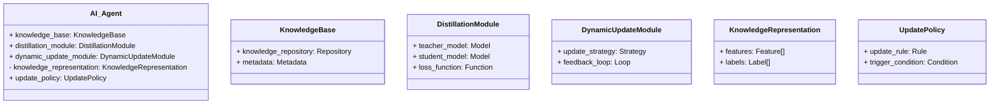
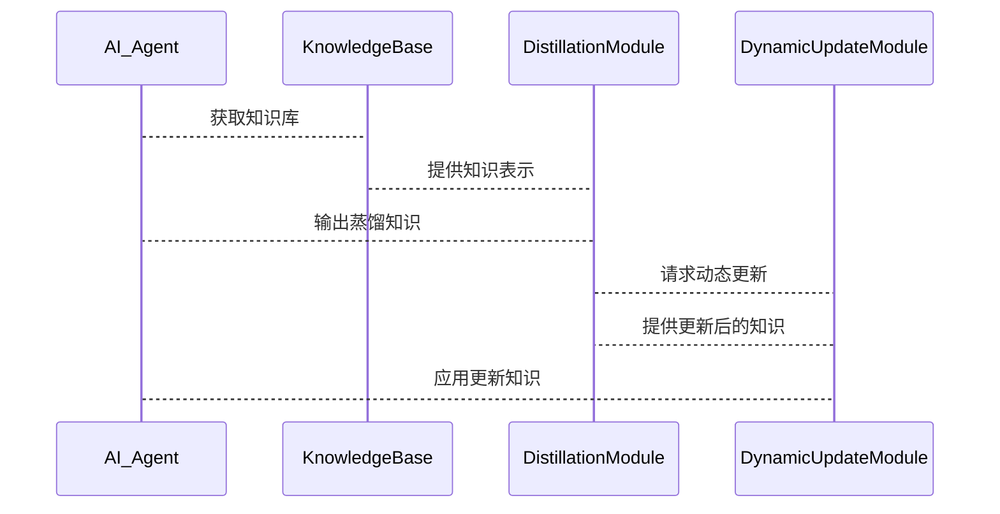

                 


### 第四章: 动态知识蒸馏机制的系统分析与架构设计

---

#### 4.1 问题场景介绍

动态知识蒸馏系统需要在实时环境中高效运行，支持动态知识更新和快速推理。

---

#### 4.2 系统功能设计

##### 4.2.1 领域模型类图



---

##### 4.3 系统架构设计

###### 4.3.1 总体架构图


---

#### 4.4 接口与交互设计

##### 4.4.1 系统接口设计

1. **知识蒸馏接口**：
   - 输入：教师模型输出、学生模型输出
   - 输出：蒸馏损失
2. **动态更新接口**：
   - 输入：知识表示、更新策略
   - 输出：更新后的知识表示

##### 4.4.2 交互流程图



---

### 第五章: 动态知识蒸馏机制的项目实战

#### 5.1 项目环境安装

##### 5.1.1 安装依赖

```bash
pip install torch==1.9.0+cu111 pytorch-lightning==1.4.7
```

---

#### 5.2 核心代码实现

##### 5.2.1 动态蒸馏模块代码

```python
import torch
import torch.nn as nn
from torch.utils.data import DataLoader
import torch.optim as optim

class TeacherModel(nn.Module):
    def __init__(self, input_size, output_size):
        super(TeacherModel, self).__init__()
        self.fc = nn.Linear(input_size, output_size)
    
    def forward(self, x):
        return self.fc(x)

class StudentModel(nn.Module):
    def __init__(self, input_size, output_size):
        super(StudentModel, self).__init__()
        self.fc = nn.Linear(input_size, output_size)
    
    def forward(self, x):
        return self.fc(x)

def distillation_loss(y_t, y_s, alpha=0.5):
    kl_loss = torch.nn.KLDivLoss(log_target=True)(F.log_softmax(y_s, dim=1), F.softmax(y_t, dim=1))
    ce_loss = torch.nn.CrossEntropyLoss()(y_s, y_t)
    return alpha * kl_loss + (1 - alpha) * ce_loss

def train(agent, teacher, student, dataloader, epochs=100, update_interval=20):
    optimizer = optim.Adam(student.parameters(), lr=0.001)
    for epoch in range(epochs):
        for batch in dataloader:
            inputs, labels = batch
            # 教师模型输出
            with torch.no_grad():
                teacher_outputs = teacher(inputs)
            # 学生模型输出
            student_outputs = student(inputs)
            # 计算蒸馏损失
            loss = distillation_loss(teacher_outputs, student_outputs)
            # 反向传播
            optimizer.zero_grad()
            loss.backward()
            optimizer.step()
            # 动态更新知识表示
            if epoch % update_interval == 0:
                agent.update_knowledge_representations(student, teacher)
```

---

#### 5.3 项目小结

通过本章的实战部分，我们详细讲解了动态知识蒸馏机制的实现步骤，并给出了具体的代码示例。通过动态蒸馏，AI Agent能够实时更新知识表示，提升推理效率和准确性。

---

### 第六章: 动态知识蒸馏机制的最佳实践与小结

#### 6.1 最佳实践 Tips

1. **动态更新策略**：根据场景选择合适的动态更新策略，如增量式更新或批量更新。
2. **模型选择**：选择适合蒸馏的学生模型，如轻量级模型或特定任务优化模型。
3. **性能监控**：实时监控模型性能，动态调整蒸馏参数。

#### 6.2 小结

本文从背景、核心概念、算法原理到系统架构和项目实战，全面解析了动态知识蒸馏机制的实现与应用。通过本文的学习，读者可以深入了解动态知识蒸馏的技术细节，并能够将其应用于实际的AI Agent开发中。

---

### 第七章: 注意事项与拓展阅读

#### 7.1 注意事项

1. **知识一致性**：动态更新可能导致知识不一致，需设计合理的同步机制。
2. **计算效率**：动态蒸馏可能引入额外的计算开销，需优化实现。
3. **模型鲁棒性**：动态更新可能影响模型的稳定性，需设计自适应机制。

#### 7.2 拓展阅读

1. **知识蒸馏的经典论文**：如"Distilling the Knowledge in Neural Networks"。
2. **动态模型的研究进展**：如"Dynamic Neural Networks for Real-time Knowledge Updating"。
3. **AI Agent领域的最新研究**：如"Advanced AI Agents with Knowledge Graphs".

---

以上是《构建AI Agent的动态知识蒸馏机制》的技术博客文章的完整目录和内容概览。通过逐步分析和详细阐述，本文为读者提供了从理论到实践的全面指导，帮助读者深入理解动态知识蒸馏机制的核心原理和应用方法。

