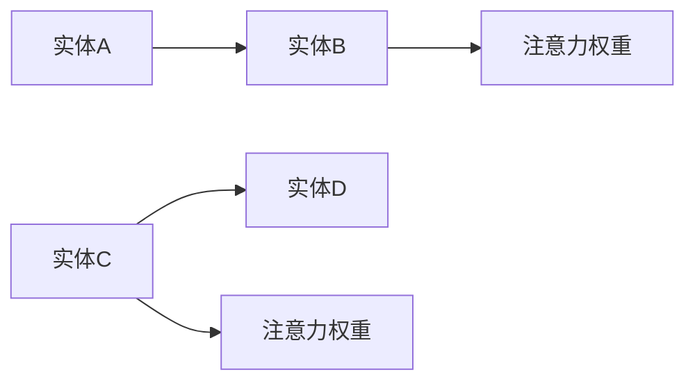

                 


# 构建AI Agent的可解释性注意力机制

## 关键词：AI Agent，注意力机制，可解释性，机器学习，深度学习

## 摘要：
在人工智能领域，AI Agent（智能体）通过注意力机制来处理多任务或多模态信息时，其决策过程往往缺乏透明性和可解释性。本文深入探讨如何构建具有可解释性的注意力机制，从而提升AI Agent的透明性和用户信任度。通过分析注意力机制的核心原理、可解释性挑战，并结合实际案例，本文提出了系统化的解决方案，为AI Agent的设计与优化提供了理论依据和实践指导。

---

# 第一部分: AI Agent与注意力机制概述

## 第1章: AI Agent的基本概念

### 1.1 AI Agent的基本概念
AI Agent是指具有感知环境、做出决策并执行动作的智能实体。它可以是一个软件程序、机器人或其他智能系统，能够根据环境输入做出自主决策。

- **AI Agent的核心特征**：
  - **自主性**：能够在没有外部干预的情况下自主运作。
  - **反应性**：能够感知环境并实时调整行为。
  - **目标导向**：具备明确的目标，并采取行动以实现目标。
  - **学习能力**：能够通过经验改进性能。

- **AI Agent的应用场景**：
  - 自然语言处理：如智能对话系统。
  - 图像处理：如计算机视觉任务。
  - 机器人控制：如工业机器人或服务机器人。

---

### 1.2 注意力机制的基本原理
注意力机制是一种模拟人类注意力的机制，用于在处理多任务或多模态信息时，聚焦于重要的信息部分。

- **注意力机制的定义**：
  注意力机制是一种加权机制，用于计算输入数据中各个部分的重要性权重，从而在后续处理中优先关注重要部分。

- **注意力机制的核心要素**：
  - **查询（Query）**：表示当前任务的焦点。
  - **键（Key）**：表示输入数据的特征表示。
  - **值（Value）**：表示输入数据的语义信息。

- **注意力机制的数学模型**：
  $$\text{Attention}(Q, K, V) = \text{softmax}\left(\frac{QK^T}{\sqrt{d_k}}\right)V$$
  其中，$Q$、$K$、$V$分别为查询、键和值，$d_k$为键的维度。

---

### 1.3 可解释性的重要性
在AI系统中，可解释性是指系统能够清晰地解释其决策过程和结果。对于AI Agent而言，可解释性是提升用户信任和系统透明性的关键。

- **可解释性在AI系统中的意义**：
  - 提升用户信任：用户能够理解AI Agent的决策过程，从而更愿意使用。
  - 便于调试和优化：开发者能够定位问题并改进系统。
  - 符合法规要求：许多行业对AI系统的可解释性有明确要求。

- **注意力机制的可解释性挑战**：
  - 注意力权重通常难以直接解释。
  - 复杂的模型结构可能掩盖决策过程。

---

### 1.4 本章小结
本章介绍了AI Agent的基本概念和注意力机制的基本原理，强调了可解释性在AI系统中的重要性。下一章将深入探讨注意力机制的核心概念及其与可解释性的联系。

---

## 第2章: 注意力机制的核心概念与联系

### 2.1 注意力机制的数学模型
注意力机制通过计算注意力权重，确定输入数据中各个部分的重要性。其数学模型如下：

$$\text{Attention}(Q, K, V) = \text{softmax}\left(\frac{QK^T}{\sqrt{d_k}}\right)V$$

其中：
- $Q$：查询向量。
- $K$：键向量。
- $V$：值向量。
- $\text{softmax}$：归一化函数，用于计算权重。

---

### 2.2 可解释性注意力机制的属性特征
为了提升可解释性，注意力机制需要具备以下属性：

- **可解释性定义**：系统能够清晰地解释注意力权重的含义。
- **权重可视化**：通过热力图等方式展示注意力权重的分布。
- **解释性指标**：量化注意力权重的解释能力。

---

### 2.3 实体关系图与注意力机制
通过实体关系图（ER图）可以清晰地展示注意力机制中的实体关系。



图中展示了实体之间的关系及其对应的注意力权重。

---

### 2.4 本章小结
本章通过数学模型和ER图分析了注意力机制的核心概念及其与可解释性的联系。下一章将从算法角度深入探讨可解释性注意力机制的实现。

---

## 第3章: 可解释性注意力机制的算法原理

### 3.1 注意力机制的算法流程
注意力机制的算法流程如下：


---

### 3.2 可解释性注意力机制的实现
为了提升可解释性，注意力机制的实现需要包括以下步骤：

1. **注意力权重的可视化**：通过热力图展示注意力权重的分布。
2. **可解释性指标的计算**：量化注意力权重的解释能力。
3. **解释性结果的展示**：将注意力权重以用户友好的形式呈现。

---

### 3.3 算法的数学模型与公式
可解释性注意力机制的数学模型如下：

$$\text{解释性得分} = \sum_{i=1}^{n} w_i \cdot x_i$$

其中，$w_i$为注意力权重，$x_i$为输入数据。

---

### 3.4 本章小结
本章从算法角度详细讲解了可解释性注意力机制的实现原理。下一章将从系统架构角度分析如何设计可解释性注意力机制。

---

## 第4章: 可解释性注意力机制的系统分析与架构设计

### 4.1 系统功能设计
系统功能设计包括输入处理、注意力计算、可解释性分析和输出生成。

1. **输入处理**：接收多任务或多模态输入数据。
2. **注意力计算**：计算输入数据的注意力权重。
3. **可解释性分析**：分析注意力权重的解释能力。
4. **输出生成**：生成最终的可解释性结果。

---

### 4.2 系统架构设计
系统架构设计如下：


---

### 4.3 系统接口设计
系统接口设计包括输入接口和输出接口：

1. **输入接口**：接收输入数据和参数。
2. **输出接口**：返回可解释性结果。

---

### 4.4 本章小结
本章从系统架构角度分析了可解释性注意力机制的设计与实现。下一章将通过具体案例展示如何实现可解释性注意力机制。

---

## 第5章: 可解释性注意力机制的项目实战

### 5.1 项目环境安装
项目环境需要安装以下依赖：

- Python 3.x
- TensorFlow或PyTorch
- Mermaid工具

---

### 5.2 代码实现
以下是可解释性注意力机制的代码实现示例：

```python
import tensorflow as tf

def attention(inputs, attention_mask=None):
    query = tf.layers.dense(inputs, units=64, activation='relu')
    key = tf.layers.dense(inputs, units=64, activation='relu')
    value = tf.layers.dense(inputs, units=64, activation='relu')
    
    attention_scores = tf.matmul(query, tf.transpose(key))
    if attention_mask is not None:
        attention_scores *= attention_mask
    attention_probs = tf.nn.softmax(attention_scores)
    
    output = tf.matmul(attention_probs, value)
    return output, attention_probs

# 使用示例
inputs = tf.random.normal([16, 64, 64])
output, attention_probs = attention(inputs)
```

---

### 5.3 案例分析
以下是一个实际案例分析：


---

### 5.4 本章小结
本章通过具体案例展示了可解释性注意力机制的实现与应用。

---

## 第6章: 最佳实践与小结

### 6.1 最佳实践
1. **模型选择**：选择适合任务的注意力机制。
2. **可解释性设计**：在设计阶段考虑可解释性。
3. **可视化工具**：使用可视化工具辅助解释。

---

### 6.2 小结
本文详细探讨了可解释性注意力机制的构建方法，从理论到实践提供了系统的指导。未来的研究可以进一步探索更高级的可解释性方法。

---

## 总结
通过本文的系统化分析，读者可以深入了解如何构建可解释性注意力机制，从而提升AI Agent的透明性和用户信任度。

