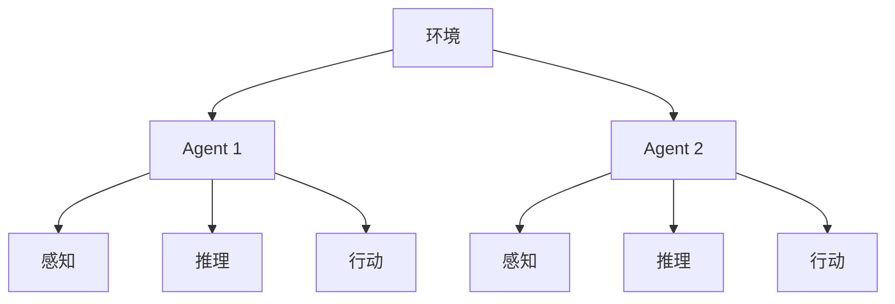
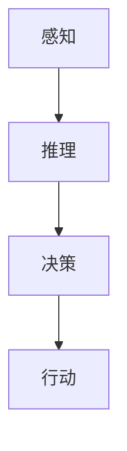
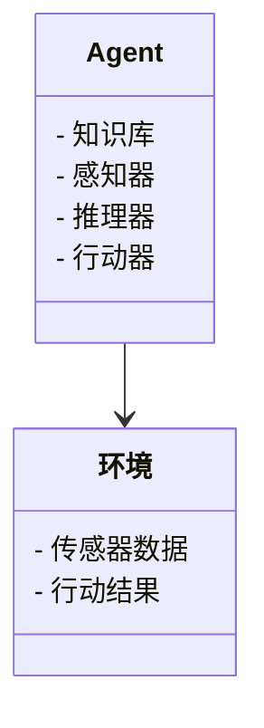
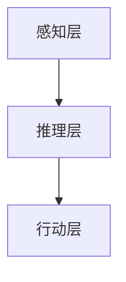

                 


# 构建AI Agent的多Agent协作决策系统

**关键词**：AI Agent、多Agent协作、决策系统、分布式计算、博弈论、系统架构

**摘要**：  
本文系统地探讨了构建AI Agent的多Agent协作决策系统的各个方面，从基本概念到数学模型，从系统架构设计到项目实战。文章首先介绍了多Agent协作决策系统的核心概念与应用场景，然后深入分析了相关的算法原理与数学模型，特别是博弈论在多Agent决策中的应用。接着，文章从系统分析与架构设计的角度，详细阐述了多Agent协作决策系统的实现路径。最后，通过一个智能交通系统的实际案例，展示了多Agent协作决策系统的具体实现过程与应用效果。本文旨在为读者提供一个多维度、多层次的视角，帮助理解与构建高效、智能的多Agent协作决策系统。

---

## 第一部分: 多Agent协作决策系统概述

### 第1章: 多Agent协作决策系统背景介绍

#### 1.1 多Agent系统的概念与特点
##### 1.1.1 多Agent系统的基本概念
多Agent系统（Multi-Agent System, MAS）是由多个智能体（Agent）组成的分布式系统，这些智能体能够通过协作完成复杂的任务。与传统的单体决策系统不同，多Agent系统强调去中心化、分布式计算和自主性。

##### 1.1.2 多Agent系统的分类与应用场景
多Agent系统可以分为以下几类：
- **简单反射型Agent**：基于当前输入做出反应，适用于简单的任务。
- **基于模型的反射型Agent**：通过内部模型和推理进行决策。
- **目标驱动型Agent**：以明确的目标为导向，通过规划实现任务。
- **效用驱动型Agent**：通过最大化效用函数来优化决策。

多Agent系统广泛应用于自动驾驶、智能交通管理、机器人协作、分布式计算、电子商务等领域。

##### 1.1.3 多Agent系统与传统单体决策系统的区别
| 特性 | 多Agent系统 | 单体决策系统 |
|------|-------------|--------------|
| 结构  | 去中心化    | 中心化       |
| 可扩展性 | 高          | 低           |
| 并行性 | 高          | 低           |
| 故障容错性 | 高          | 低           |

#### 1.2 AI Agent的定义与核心要素
##### 1.2.1 AI Agent的基本定义
AI Agent（人工智能代理）是一种能够感知环境、自主决策并采取行动以实现目标的智能实体。

##### 1.2.2 AI Agent的核心要素
AI Agent的核心要素包括：
- **知识**：Agent对环境和任务的理解。
- **感知**：Agent获取环境信息的能力。
- **推理**：Agent基于知识和感知进行逻辑推理。
- **行动**：Agent根据推理结果采取行动。

##### 1.2.3 AI Agent的分类与属性特征对比（表格）
| 类型          | 描述                                                                 |
|---------------|--------------------------------------------------------------------|
| 简单反射型    | 基于当前输入做出反应，适用于简单的任务                               |
| 基于模型的反射型 | 通过内部模型和推理进行决策                                         |
| 目标驱动型    | 以明确的目标为导向，通过规划实现任务                                 |
| 效用驱动型    | 通过最大化效用函数来优化决策                                         |

#### 1.3 多Agent协作决策系统的边界与外延
##### 1.3.1 系统的边界定义
多Agent协作决策系统的边界包括：
- **输入边界**：感知环境输入。
- **输出边界**：通过行动影响环境。
- **交互边界**：与其他Agent或系统进行通信。

##### 1.3.2 外延与相关概念的区分（如分布式系统、边缘计算）
- **分布式系统**：强调任务的分解与节点间的协作，不涉及智能性。
- **边缘计算**：强调数据处理的边缘化，与多Agent系统有部分重叠。

#### 1.4 多Agent协作决策系统的概念结构
##### 1.4.1 系统的核心概念框架
多Agent协作决策系统的概念结构包括：
- **环境**：Agent所处的物理或虚拟环境。
- **Agent**：具有感知、推理和行动能力的智能体。
- **协作机制**：Agent之间的通信与协作规则。

##### 1.4.2 核心要素的交互关系（Mermaid流程图）


---

## 第2章: 多Agent协作决策系统的数学模型与算法原理

### 2.1 多Agent协作决策的核心算法
#### 2.1.1 分布式计算与多Agent协作的基本原理
分布式计算是多Agent协作的基础，通过任务分解和Agent之间的协作完成复杂任务。

#### 2.1.2 博弈论在多Agent决策中的应用
博弈论为多Agent协作决策提供了理论基础，特别是纳什均衡的概念。

### 2.2 多Agent协作的数学模型
#### 2.2.1 Agent的决策模型（Mermaid流程图）


#### 2.2.2 多Agent协作的数学表达式（公式）
$$ V = \sum_{i=1}^{n} v_i $$

### 2.3 博弈论与纳什均衡
#### 2.3.1 纳什均衡的定义与公式
$$ (x_i, x_{-i}) \text{ 是纳什均衡当且仅当} u_i(x_i, x_{-i}) \geq u_i(x'_i, x_{-i}) \text{ 对所有} x'_i \text{成立} $$

#### 2.3.2 博弈论在多Agent协作中的应用实例
- **囚徒困境**：两个Agent在协作与背叛之间的选择问题。

---

## 第3章: 多Agent协作决策系统的系统分析与架构设计

### 3.1 问题场景与需求分析
#### 3.1.1 多Agent协作的典型问题场景
- **智能交通系统**：多辆自动驾驶汽车协作完成交通任务。

#### 3.1.2 系统需求分析与功能分解
- **需求分析**：实时感知、决策与行动。
- **功能分解**：路径规划、碰撞 avoidance、交通灯控制。

### 3.2 系统功能设计
#### 3.2.1 领域模型设计（Mermaid类图）


#### 3.2.2 功能模块划分与交互流程
- **功能模块**：感知模块、推理模块、行动模块。
- **交互流程**：环境 → 感知 → 推理 → 行动 → 环境。

### 3.3 系统架构设计
#### 3.3.1 分层架构设计（Mermaid架构图）


#### 3.3.2 模块间接口设计与交互流程（Mermaid序列图）
```mermaid
sequenceDiagram
participant 环境
participant 感知器
participant 推理器
participant 行动器
环境 → 感知器: 提供传感器数据
感知器 → 推理器: 提供推理输入
推理器 → 行动器: 提供行动指令
行动器 → 环境: 执行行动
```

---

## 第4章: 多Agent协作决策系统的项目实战

### 4.1 项目环境与工具安装
#### 4.1.1 开发环境
- **编程语言**：Python
- **框架工具**：ROS（Robot Operating System）
- **开发工具**：PyCharm、VS Code

#### 4.1.2 依赖库安装
```bash
pip install numpy matplotlib rospy
```

### 4.2 系统核心实现源代码
#### 4.2.1 Agent感知模块
```python
import rospy
from std_msgs.msg import String

def agent_perception():
    rospy.init_node('agent_perception', anonymous=True)
    pub = rospy.Publisher('agent Perception', String, queue_size=10)
    rate = rospy.Rate(10)  # 10hz
    while True:
        data = "感知到环境数据"
        pub.publish(data)
        rate.sleep()
```

#### 4.2.2 推理与决策模块
```python
import rospy
from std_msgs.msg import String

def agent_decision():
    rospy.init_node('agent_decision', anonymous=True)
    sub = rospy.Subscriber('agent Perception', String, callback)
    pub = rospy.Publisher('agent Decision', String, queue_size=10)
    def callback(data):
        decision = "做出推理与决策"
        pub.publish(decision)
    rospy.spin()

if __name__ == '__main__':
    agent_decision()
```

#### 4.2.3 行动模块
```python
import rospy
from std_msgs.msg import String

def agent_action():
    rospy.init_node('agent_action', anonymous=True)
    sub = rospy.Subscriber('agent Decision', String, callback)
    def callback(data):
        action = "执行行动"
        print(action)
    rospy.spin()

if __name__ == '__main__':
    agent_action()
```

### 4.3 案例分析与代码实现
#### 4.3.1 案例分析
以智能交通系统为例，多个自动驾驶汽车通过多Agent协作实现交通优化。

#### 4.3.2 代码实现
```python
# 智能交通系统多Agent协作实现
import rospy
from std_msgs.msg import String

def traffic_agent():
    rospy.init_node('traffic_agent', anonymous=True)
    sub = rospy.Subscriber('agent Decision', String, callback)
    pub = rospy.Publisher('agent Action', String, queue_size=10)
    def callback(data):
        action = "优化交通流量"
        pub.publish(action)
    rospy.spin()

if __name__ == '__main__':
    traffic_agent()
```

### 4.4 项目小结
通过实际案例，展示了多Agent协作决策系统的实现过程，包括感知、推理、决策与行动模块的协作。

---

## 第5章: 最佳实践与拓展

### 5.1 最佳实践 Tips
- **选择合适的工具与框架**：如ROS、DDS等。
- **注重系统的可扩展性与可维护性**。
- **确保安全与隐私保护**。

### 5.2 小结
本文从理论到实践，系统地探讨了多Agent协作决策系统的构建过程。

### 5.3 注意事项
- **避免过度复杂化**：在设计系统时，要避免过度复杂化，保持系统的简洁性。
- **考虑边缘情况**：在实际应用中，需要考虑各种边缘情况。

### 5.4 拓展阅读
- **推荐书籍**：《Multi-Agent Systems: Algorithm and Applications》
- **推荐论文**：相关领域的经典论文。

---

通过本文的系统阐述，读者可以全面理解多Agent协作决策系统的构建过程，并能够实际操作相关项目。

