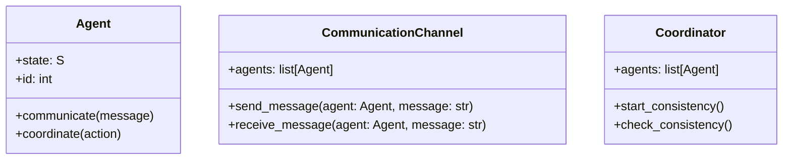

                 


# 构建AI Agent的多Agent协作框架：团队问题解决

> 关键词：多智能体协作、AI Agent、分布式系统、一致性协议、协作算法

> 摘要：本文将详细探讨构建AI Agent的多Agent协作框架，重点分析团队问题解决的核心概念、算法原理和系统架构设计。通过实际案例分析，结合数学模型和流程图，全面解析多Agent协作的实现过程。

---

# 第1章 多Agent协作框架概述

## 1.1 多Agent协作的背景与问题背景

### 1.1.1 从单Agent到多Agent的演进

随着人工智能技术的快速发展，单个智能体（Agent）的决策能力逐渐显得不足。在复杂环境中，单个Agent难以独立完成复杂的任务，因此多Agent协作成为必然趋势。

### 1.1.2 多Agent协作的核心问题

多Agent协作的核心问题包括：
1. **通信机制**：如何实现Agent之间的有效信息交换。
2. **协调机制**：如何确保多个Agent能够协同工作。
3. **一致性协议**：如何在分布式系统中达成一致。

### 1.1.3 多Agent协作的应用场景

多Agent协作广泛应用于：
- 分布式系统
- 群智计算
- 自动化协作

## 1.2 多Agent协作的问题描述

### 1.2.1 Agent的基本定义与属性

- **定义**：Agent是具有感知、决策、执行能力的智能体。
- **属性**：自主性、反应性、协作性。

### 1.2.2 多Agent协作中的问题描述

- **信息孤岛**：各个Agent之间缺乏有效的信息共享。
- **协调困难**：多个Agent之间难以达成一致。
- **复杂性**：系统的复杂性随着Agent数量增加而指数级上升。

### 1.2.3 多Agent协作的边界与外延

- **边界**：多Agent协作的范围和限制。
- **外延**：多Agent协作与其他技术的结合。

## 1.3 多Agent协作的核心概念与联系

### 1.3.1 多Agent协作的核心要素

- **通信渠道**：Agent之间的信息交换。
- **协调机制**：确保Agent协作一致。

### 1.3.2 多Agent协作的概念结构

多Agent协作的概念结构包括：
- **协作目标**：共同完成的任务。
- **协作过程**：任务分解、信息共享、决策制定。

### 1.3.3 多Agent协作的ER实体关系图

```mermaid
er
actor: 多Agent协作系统
role: Agent角色
agent: 具体Agent实例
communication: 通信渠道
coordination: 协调机制
```

---

# 第2章 多Agent协作的核心概念与联系

## 2.1 多Agent协作的核心概念原理

### 2.1.1 Agent的智能体模型

- **感知**：通过传感器获取环境信息。
- **决策**：基于感知信息做出决策。
- **执行**：通过执行器执行决策。

### 2.1.2 多Agent协作的通信机制

- **消息传递**：通过消息实现信息共享。
- **通信协议**：规范消息格式和传输方式。

### 2.1.3 多Agent协作的协调机制

- **一致性协议**：确保系统状态一致。
- **任务分配**：合理分配任务。

## 2.2 多Agent协作的概念属性特征对比表格

| 特性         | 单Agent      | 多Agent      |
|--------------|--------------|--------------|
| 智能性       | 单一决策     | 多方协作决策 |
| 通信性       | 无           | 有           |
| 协调性       | 无           | 有           |

## 2.3 多Agent协作的ER实体关系图

```mermaid
er
actor: 多Agent协作系统
role: Agent角色
agent: 具体Agent实例
communication: 通信渠道
coordination: 协调机制
```

---

# 第3章 多Agent协作的算法原理

## 3.1 多Agent协作算法概述

### 3.1.1 基于一致性协议的多Agent协作

一致性协议是确保多个Agent状态一致的核心算法。

### 3.1.2 基于分布式计算的多Agent协作

分布式计算实现 Agent 之间的任务分配和资源协调。

### 3.1.3 基于博弈论的多Agent协作

博弈论为多Agent协作提供决策优化的理论基础。

## 3.2 基于一致性协议的多Agent协作算法

### 3.2.1 算法流程图

```mermaid
graph TD
A[一致性协议开始] --> B[各Agent初始化状态]
B --> C[开始一致性计算]
C --> D[各Agent交换信息]
D --> E[计算一致性状态]
E --> F[判断是否收敛]
F --> G[Fork 叉路选择]
G --> H[继续计算] 或 G --> I[结束]
```

### 3.2.2 一致性协议的数学模型

一致性协议的数学模型可以表示为：
$$ s_{i}^{new} = f(s_{i}, s_{j}) $$
其中，$s_i$ 表示第i个Agent的状态，$f$ 是一致性函数。

### 3.2.3 一致性协议的Python实现

```python
def consistency_protocol(agents):
    while not all_agents_consistent(agents):
        for agent in agents:
            agent.exchange_information()
    return agents.get_consistent_state()
```

---

# 第4章 系统分析与架构设计

## 4.1 问题场景介绍

### 4.1.1 项目介绍

以一个多智能体协作系统为例，分析其设计和实现。

## 4.2 系统功能设计

### 4.2.1 领域模型



## 4.3 系统架构设计

### 4.3.1 系统架构


### 4.3.2 系统接口设计

- **通信接口**：定义Agent之间的通信接口。
- **协调接口**：定义一致性协议的接口。

---

# 第5章 项目实战

## 5.1 环境安装

### 5.1.1 安装依赖

```bash
pip install mermaid4jupyter
```

## 5.2 系统核心实现

### 5.2.1 一致性协议的实现

```python
class Agent:
    def __init__(self, id):
        self.id = id
        self.state = 0

    def communicate(self, message):
        # 处理消息
        pass

    def coordinate(self):
        # 协调动作
        pass
```

## 5.3 代码解读与分析

### 5.3.1 一致性协议实现代码

```python
def all_agents_consistent(agents):
    states = [agent.state for agent in agents]
    return all(state == states[0] for state in states)
```

## 5.4 实际案例分析

### 5.4.1 在线客服系统

通过一致性协议实现客服系统的协作。

---

# 第6章 总结与展望

## 6.1 最佳实践

- **通信机制**：选择高效的通信方式。
- **一致性协议**：确保系统一致性。

## 6.2 小结

通过本文的讲解，读者可以全面理解多Agent协作的核心概念和实现方法。

## 6.3 注意事项

- 处理一致性问题时，需考虑网络延迟和分区情况。
- 在实际应用中，需考虑安全性问题。

## 6.4 拓展阅读

- 一致性协议的改进方法
- 分布式系统中的其他问题

---

# 附录

## 附录A 一致性协议的数学模型

一致性协议的数学模型：
$$ s_{i}^{new} = f(s_{i}, s_{j}) $$

---

以上是《构建AI Agent的多Agent协作框架：团队问题解决》的完整目录大纲结构，涵盖从背景介绍、核心概念、算法原理、系统设计到项目实战的各个方面。通过详细讲解每个部分，读者可以逐步掌握构建多Agent协作框架的全过程。

