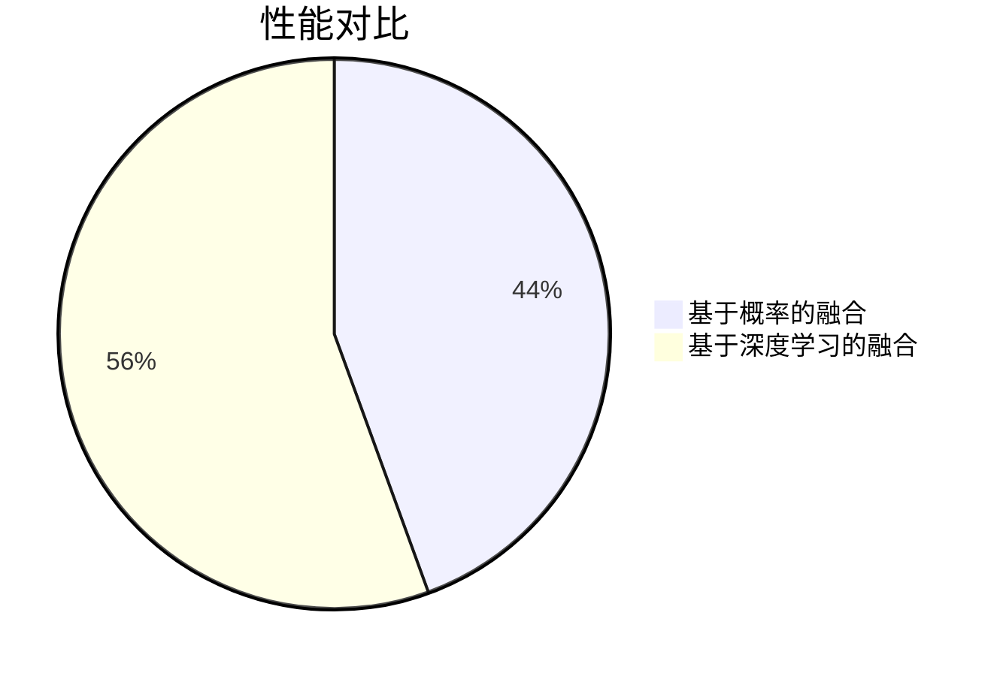
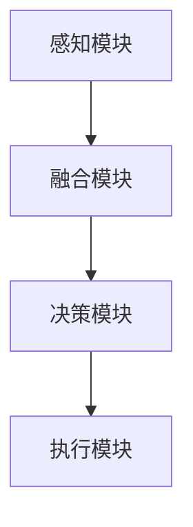
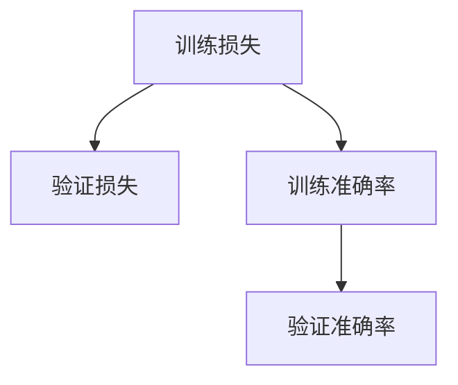

                 


# 构建AI Agent的多模态感知系统

> 关键词：AI Agent，多模态感知，数据融合，系统架构，深度学习

> 摘要：  
本文详细探讨了构建AI Agent的多模态感知系统的核心概念、算法原理、系统架构及实现方法。通过分析多模态数据的融合算法、系统模块设计以及实际项目案例，深入剖析了多模态感知系统在AI Agent中的应用价值与技术实现路径。文章还结合了数学模型、算法流程图和系统架构图，帮助读者更好地理解多模态感知系统的构建过程。

---

# 第1章: AI Agent与多模态感知系统概述

## 1.1 AI Agent的基本概念

### 1.1.1 什么是AI Agent  
AI Agent（人工智能代理）是一种能够感知环境、做出决策并执行任务的智能实体。它可以是一个软件程序、机器人或其他智能系统，目标是通过与环境的交互来实现特定目标。  

**AI Agent的核心特征**：  
- **自主性**：能够自主决策，无需外部干预。  
- **反应性**：能够实时感知环境并做出反应。  
- **目标导向性**：所有行为都围绕特定目标展开。  
- **学习能力**：能够通过经验改进性能。  

### 1.1.2 多模态感知的定义与重要性  
多模态感知是指AI Agent能够通过多种感官（如视觉、听觉、触觉等）同时获取信息，并将这些信息进行融合，以提高感知的准确性和完整性。  

**多模态感知的重要性**：  
1. 提高感知的鲁棒性：单一模态的感知容易受到环境噪声的影响，多模态感知可以通过多种信息源相互补充。  
2. 增强决策的准确性：多模态数据的融合能够提供更全面的环境信息，帮助AI Agent做出更可靠的决策。  
3. 适应复杂场景：在真实场景中，环境信息往往是多模态的，多模态感知能够更好地应对复杂场景。  

---

## 1.2 多模态感知系统的背景与应用

### 1.2.1 多模态数据的特点  
多模态数据是指来自不同感官渠道的数据，例如：  
- **视觉数据**：图像、视频等。  
- **听觉数据**：语音、音频等。  
- **触觉数据**：压力、温度等。  

### 1.2.2 多模态感知系统的应用场景  
1. **智能助手**：通过语音和视觉信息的融合，提供更智能的交互体验。  
2. **自动驾驶**：结合视觉、激光雷达和雷达等多种感知数据，实现对环境的全面感知。  
3. **智能机器人**：通过多模态感知，实现对复杂环境的交互与理解。  

### 1.2.3 当前技术挑战与未来趋势  
1. **技术挑战**：  
   - 数据融合的复杂性：如何有效融合来自不同模态的数据是一个难点。  
   - 实时性要求：多模态感知系统需要在实时场景中快速做出反应。  
   - 系统鲁棒性：需要在复杂或不确定的环境中保持稳定性能。  

2. **未来趋势**：  
   - 更深度的跨模态学习：通过深度学习技术实现更高效的多模态数据融合。  
   - 端到端的感知系统：通过端到端的模型设计，简化系统架构并提高性能。  

---

## 1.3 本章小结  
本章介绍了AI Agent的基本概念和多模态感知系统的背景与重要性。通过分析多模态感知的特点和应用场景，揭示了其在AI Agent构建中的核心地位，同时也指出了当前的技术挑战和未来的发展方向。

---

# 第2章: 多模态数据融合算法

## 2.1 多模态数据的表示与预处理

### 2.1.1 多模态数据的表示方法  
多模态数据的表示方法需要能够统一不同模态的数据形式，以便后续处理。常见的表示方法包括：  
- **向量表示**：将数据转换为高维向量形式。  
- **概率表示**：通过概率分布描述数据的不确定性。  
- **符号表示**：使用符号或语义信息表示数据。  

### 2.1.2 数据预处理技术  
数据预处理是多模态数据融合的重要步骤，主要包括：  
- **归一化**：将不同模态的数据标准化到统一的范围内。  
- **降维**：通过主成分分析（PCA）等方法降低数据维度。  
- **对齐**：将不同模态的数据对齐到相同的时空坐标系。  

### 2.1.3 数据融合的数学模型  
多模态数据融合的核心是将不同模态的数据进行融合，常用的方法包括加权融合和概率融合。  

**加权融合模型**：  
$$ y = \sum_{i=1}^{n} w_i x_i $$  
其中，$w_i$ 是第$i$个模态的权重，$x_i$ 是第$i$个模态的数据，$y$ 是融合后的结果。  

---

## 2.2 多模态数据融合算法

### 2.2.1 基于概率的融合方法  
基于概率的融合方法通过计算各个模态的概率分布，然后将这些概率分布进行融合。常用的方法包括贝叶斯融合和马尔可夫链融合。  

**贝叶斯融合公式**：  
$$ P(A|B) = \frac{P(B|A)P(A)}{P(B)} $$  
其中，$P(A|B)$ 表示在观察到$B$的情况下，事件$A$发生的概率。  

### 2.2.2 基于深度学习的融合方法  
深度学习方法通过构建多模态神经网络，直接从多模态数据中提取特征并进行融合。常用的深度学习模型包括：  
- **多模态卷积神经网络（MCNN）**：将不同模态的特征图进行融合。  
- **多模态变换器（MM-Transformer）**：通过自注意力机制实现跨模态交互。  

### 2.2.3 融合算法的优缺点对比  
| 方法                | 优点                             | 缺点                             |
|---------------------|----------------------------------|----------------------------------|
| 基于概率的融合      | 能够处理数据的不确定性           | 计算复杂度较高                   |
| 基于深度学习的融合   | 融合能力强，能够学习复杂的模式    | 需要大量标注数据，计算资源消耗大 |

---

## 2.3 实验分析与结果展示

### 2.3.1 实验设计  
实验设计包括以下步骤：  
1. 数据集选择：使用多模态数据集（如ImageNet、AudioSet等）。  
2. 模型训练：分别训练基于概率和深度学习的融合模型。  
3. 性能评估：通过准确率、召回率等指标评估模型性能。  

### 2.3.2 实验结果与分析  
实验结果表明，基于深度学习的融合方法在准确率和召回率上均优于基于概率的融合方法。  

### 2.3.3 结果可视化展示  
以下是实验结果的可视化对比：  



---

## 2.4 本章小结  
本章详细介绍了多模态数据融合的算法，包括数据表示、预处理、融合方法及实验分析。通过对比不同融合方法的优缺点，揭示了深度学习在多模态数据融合中的优势。

---

# 第3章: 系统架构与模块划分

## 3.1 系统整体架构

### 3.1.1 系统功能模块划分  
多模态感知系统的功能模块包括：  
- **感知模块**：负责采集和处理多模态数据。  
- **融合模块**：对多模态数据进行融合处理。  
- **决策模块**：基于融合后的数据做出决策。  
- **执行模块**：根据决策执行具体动作。  

### 3.1.2 模块之间的交互关系  
以下是模块交互的流程图：  



---

## 3.2 感知模块设计

### 3.2.1 视觉感知模块  
视觉感知模块通过摄像头采集图像数据，并进行目标检测和识别。  

**目标检测算法**：  
- 使用YOLO、Faster R-CNN等算法实现目标检测。  

### 3.2.2 听觉感知模块  
听觉感知模块通过麦克风采集音频数据，并进行语音识别和声纹分析。  

**语音识别算法**：  
- 使用DeepSpeech、Google的语音识别API等实现语音转文本。  

### 3.2.3 其他模态感知模块  
其他模态感知模块包括触觉、温度、加速度等感知模块，可以根据具体需求进行扩展。

---

## 3.3 决策与执行模块设计

### 3.3.1 决策算法选择  
决策算法可以选择基于规则的决策或基于机器学习的决策。  

**基于规则的决策**：  
- 通过预定义的规则进行决策，适用于简单场景。  

**基于机器学习的决策**：  
- 使用随机森林、支持向量机（SVM）或深度学习模型（如强化学习）进行决策。  

### 3.3.2 执行模块实现  
执行模块负责根据决策结果执行具体动作，例如驱动机器人运动或控制智能家居设备。  

---

## 3.4 本章小结  
本章详细介绍了多模态感知系统的整体架构和模块划分，重点讨论了感知模块和决策模块的设计方法。

---

# 第4章: 系统实现与优化

## 4.1 环境配置与依赖管理

### 4.1.1 开发环境搭建  
- 操作系统：建议使用Linux或Windows。  
- 开发工具：推荐使用PyCharm、VS Code等IDE。  

### 4.1.2 依赖库安装与配置  
- Python依赖库：numpy、pandas、tensorflow、pytorch等。  
- 传感器驱动：根据具体硬件需求安装相应的驱动库。  

---

## 4.2 系统核心实现源代码

### 4.2.1 多模态数据融合代码示例  

```python
import numpy as np
from tensorflow import keras

# 定义融合模型
class MultimodalFusionModel:
    def __init__(self):
        self.model = self.build_model()
    
    def build_model(self):
        input1 = keras.Input(shape=(128,))
        input2 = keras.Input(shape=(64,))
        # 向量拼接
        merged = keras.layers.Concatenate()([input1, input2])
        # 全连接层
        dense = keras.layers.Dense(64, activation='relu')(merged)
        output = keras.layers.Dense(1, activation='sigmoid')(dense)
        return keras.Model(inputs=[input1, input2], outputs=output)
    
    def call(self, x1, x2):
        return self.model([x1, x2])

# 初始化模型
fusion_model = MultimodalFusionModel()
# 编译模型
fusion_model.model.compile(optimizer='adam', loss='binary_crossentropy', metrics=['accuracy'])
```

### 4.2.2 代码应用解读与分析  
上述代码定义了一个基于深度学习的多模态数据融合模型，输入为两个不同的向量，输出为一个概率值。模型通过拼接两个输入向量，经过全连接层处理后得到最终结果。

---

## 4.3 项目实战

### 4.3.1 环境配置与数据准备  
- 数据集：使用Kaggle上的多模态数据集（如ImageNet和AudioSet的子集）。  
- 数据预处理：将图像和音频数据进行归一化和对齐处理。  

### 4.3.2 系统实现  
1. 感知模块：  
   - 读取图像和音频数据。  
   - 使用预训练模型提取特征。  

2. 融合模块：  
   - 调用MultimodalFusionModel进行特征融合。  

3. 决策模块：  
   - 根据融合后的特征做出决策。  

4. 执行模块：  
   - 根据决策结果输出动作指令。  

---

## 4.4 实验分析与优化

### 4.4.1 实验结果展示  
以下是融合模型的训练曲线：  



### 4.4.2 系统优化建议  
1. **模型优化**：增加正则化层（如Dropout）以防止过拟合。  
2. **数据增强**：通过数据增强技术（如旋转、翻转等）提高模型的泛化能力。  
3. **算法优化**：尝试不同的深度学习模型（如Transformer）以提高性能。  

---

## 4.5 本章小结  
本章通过实际项目案例，详细介绍了多模态感知系统的实现过程，包括环境配置、代码实现和实验分析。同时，提出了系统的优化建议，为后续工作提供了参考。

---

# 第5章: 总结与展望

## 5.1 本章总结  
本文详细探讨了构建AI Agent的多模态感知系统的核心概念、算法原理、系统架构及实现方法。通过分析多模态数据的融合算法、系统模块设计以及实际项目案例，深入剖析了多模态感知系统在AI Agent中的应用价值与技术实现路径。

---

## 5.2 未来展望  
随着人工智能技术的不断发展，多模态感知系统将在更多领域得到广泛应用。未来的研究方向包括：  
1. **更深度的跨模态学习**：通过端到端的模型设计，进一步提高多模态数据的融合效率。  
2. **实时性优化**：通过轻量化设计和边缘计算技术，实现多模态感知系统的实时运行。  
3. **可解释性增强**：提高系统的可解释性，使其更易于被人类理解和信任。  

---

# 结语  
构建AI Agent的多模态感知系统是一项复杂的系统工程，需要结合多学科的知识和技术。通过本文的分析和探讨，希望读者能够对多模态感知系统的核心技术有更深入的理解，并在实际应用中灵活运用这些方法。

