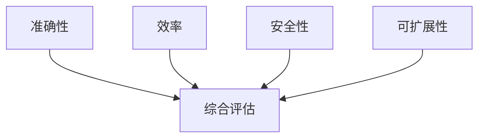
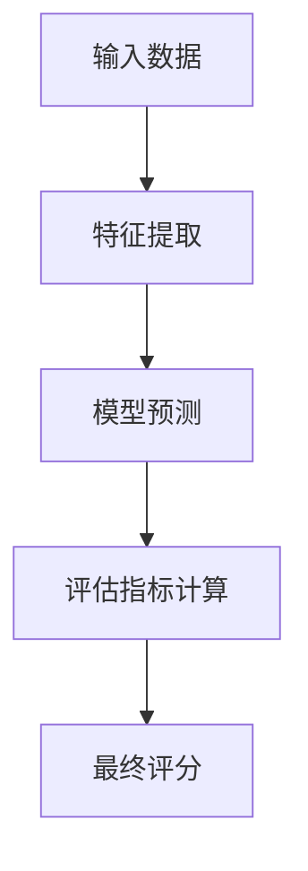
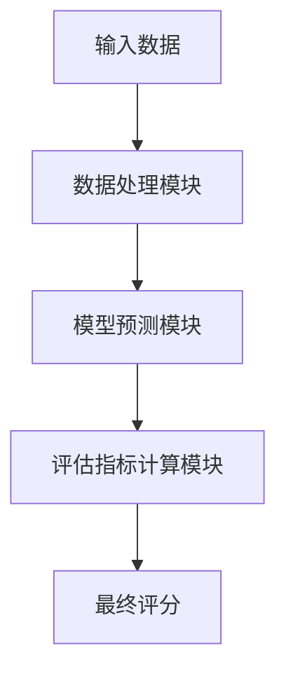

                 


# 构建AI Agent的多维度性能评估体系

## 关键词：AI Agent，性能评估，多维度，算法原理，系统架构，项目实战

## 摘要：构建AI Agent的多维度性能评估体系是一项复杂而重要的任务，涉及多个维度的分析与优化。本文将从背景介绍、核心概念、算法原理、系统设计、项目实战等方面详细探讨这一主题，帮助读者全面理解并有效实施AI Agent的多维度性能评估。

---

## 第一部分：背景介绍

### 第1章：AI Agent的基本概念与背景

#### 1.1 AI Agent的定义与特点
AI Agent（人工智能代理）是指能够感知环境、自主决策并执行任务的智能实体。与传统程序不同，AI Agent具备以下特点：
- **自主性**：无需外部干预，自主完成任务。
- **反应性**：能够实时感知环境并做出反应。
- **目标导向**：基于目标驱动行为。

#### 1.2 AI Agent的分类与应用场景
AI Agent可以根据功能和应用场景分为以下几类：
- **简单反射型**：基于规则执行任务，如自动回复机器人。
- **基于模型的反应型**：使用内部模型进行决策，如自动驾驶系统。
- **目标驱动型**：为实现特定目标而行动，如金融交易代理。
- **实用驱动型**：追求效用最大化，如智能推荐系统。

#### 1.3 AI Agent与传统程序的区别
| 特性          | 传统程序                  | AI Agent                  |
|---------------|---------------------------|---------------------------|
| 行为驱动      | 预定义规则驱动            | 目标导向驱动              |
| 决策方式      | 单一逻辑判断              | 多维度感知与推理          |
| 学习能力      | 无法学习                  | 可以通过数据学习优化      |

---

### 第2章：AI Agent性能评估的背景与意义

#### 2.1 性能评估的核心问题
AI Agent的性能评估涉及以下核心问题：
- **效率**：任务完成的速度和资源消耗。
- **准确性**：输出结果的正确性。
- **鲁棒性**：面对异常情况的处理能力。
- **可解释性**：决策过程的透明度。

#### 2.2 多维度评估的必要性
传统的单维度评估难以全面反映AI Agent的能力。例如，仅评估准确率可能忽略效率和鲁棒性。因此，多维度评估能够更全面地衡量AI Agent的性能。

#### 2.3 评估体系的边界与外延
AI Agent的性能评估体系需要涵盖以下维度：
- **功能性**：任务完成的质量。
- **效率性**：资源利用的效率。
- **安全性**：避免负面效应的能力。
- **可扩展性**：适应不同规模任务的能力。

---

## 第二部分：核心概念与联系

### 第3章：核心概念原理

#### 3.1 AI Agent的输入输出模型
AI Agent的输入输出模型可以用以下公式表示：
$$
输出 = f_{\text{Agent}}(输入)
$$
其中，$f_{\text{Agent}}$表示AI Agent的处理函数。

#### 3.2 性能评估的维度分解
多维度性能评估可以分解为以下步骤：
1. **确定评估维度**：选择需要评估的维度，如准确性、效率、安全性等。
2. **量化每个维度**：将每个维度转化为可量化的指标。
3. **综合评估结果**：根据权重对各维度进行综合评分。

#### 3.3 多维度评估的数学模型
多维度评估的综合得分可以表示为：
$$
\text{综合得分} = \sum_{i=1}^{n} w_i \cdot s_i
$$
其中，$w_i$是第i个维度的权重，$s_i$是第i个维度的得分。

---

### 第4章：核心概念属性对比

#### 4.1 表格对比：AI Agent与传统程序的性能差异
| 维度          | AI Agent                  | 传统程序                  |
|---------------|---------------------------|---------------------------|
| 决策方式      | 基于数据驱动的推理        | 预定义规则驱动            |
| 学习能力      | 可以通过数据优化          | 无法学习                  |
| 适应性        | 能够适应变化              | 固定功能                  |

#### 4.2 图表展示：性能评估维度的层次结构


---

## 第三部分：算法原理

### 第5章：算法原理概述

#### 5.1 基于多维度的评估指标计算
评估指标计算过程如下：
1. **数据预处理**：收集并清洗数据。
2. **特征提取**：提取关键特征。
3. **模型预测**：使用AI Agent进行预测。
4. **指标计算**：计算各个维度的得分。

#### 5.2 算法流程图


---

### 第6章：算法实现

#### 6.1 Python代码实现
```python
def evaluate_agent(agent, test_cases):
    scores = []
    for case in test_cases:
        input_data = case['input']
        expected_output = case['output']
        predicted_output = agent.predict(input_data)
        precision = calculate_precision(expected_output, predicted_output)
        recall = calculate_recall(expected_output, predicted_output)
        scores.append({'precision': precision, 'recall': recall})
    return scores

def calculate_precision(expected, predicted):
    true_positives = sum(1 for e, p in zip(expected, predicted) if e == p == 1)
    false_positives = sum(1 for e, p in zip(expected, predicted) if e == 0 and p == 1)
    return true_positives / (true_positives + false_positives) if (true_positives + false_positives) != 0 else 0

def calculate_recall(expected, predicted):
    true_positives = sum(1 for e, p in zip(expected, predicted) if e == p == 1)
    false_negatives = sum(1 for e, p in zip(expected, predicted) if e == 1 and p == 0)
    return true_positives / (true_positives + false_negatives) if (true_positives + false_negatives) != 0 else 0
```

---

## 第四部分：系统分析与架构设计

### 第7章：问题场景介绍

#### 7.1 系统功能设计
系统需要实现以下功能：
- **数据输入**：接收输入数据。
- **模型预测**：AI Agent进行预测。
- **指标计算**：计算各维度的得分。

#### 7.2 系统架构设计


---

## 第五部分：项目实战

### 第8章：环境安装与代码实现

#### 8.1 环境安装
安装所需的Python库：
```bash
pip install numpy pandas scikit-learn
```

#### 8.2 核心实现代码
```python
import numpy as np
from sklearn.metrics import precision_score, recall_score

def evaluate_agent(agent, X_test, y_test):
    y_pred = agent.predict(X_test)
    precision = precision_score(y_test, y_pred)
    recall = recall_score(y_test, y_pred)
    return {'precision': precision, 'recall': recall}
```

---

## 第六部分：最佳实践

### 第9章：小结与注意事项

#### 9.1 小结
构建AI Agent的多维度性能评估体系需要从背景、核心概念、算法原理、系统设计和项目实战等多个方面进行全面分析。

#### 9.2 注意事项
- **数据质量**：确保数据的准确性和完整性。
- **权重设置**：根据实际需求合理设置各维度的权重。
- **模型优化**：根据评估结果不断优化AI Agent的性能。

#### 9.3 拓展阅读
建议阅读相关领域的书籍和论文，深入理解AI Agent的实现与优化方法。

---

通过以上步骤，我们系统地构建了AI Agent的多维度性能评估体系，从理论到实践，全面剖析了构建过程中的关键点。希望本文能为读者提供有价值的参考和启示。

