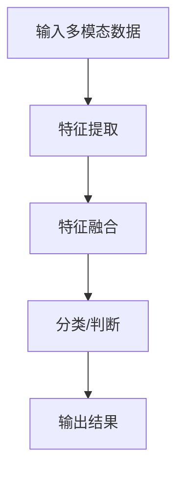
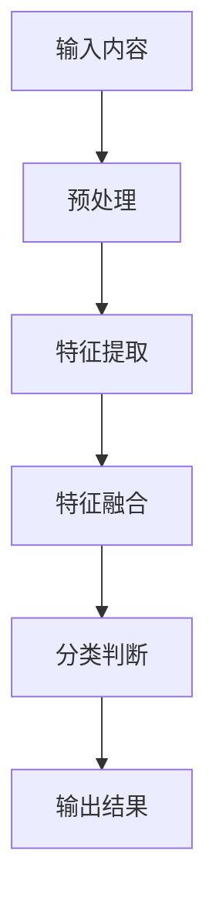
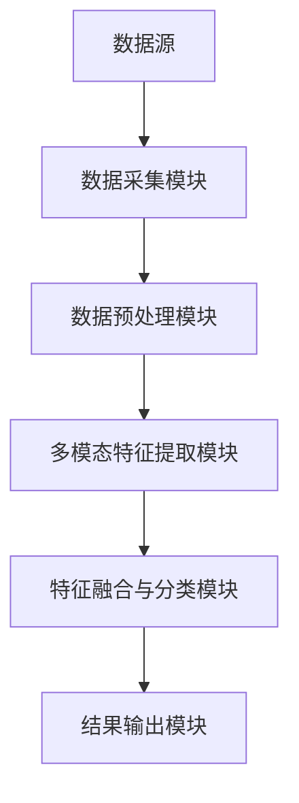
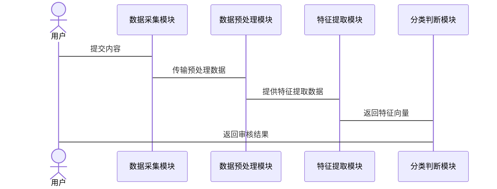

                 


# 构建AI Agent的实时多模态内容审核系统

> 关键词：AI Agent，多模态内容审核，实时处理，系统架构，算法优化

> 摘要：本文将详细讲解如何构建一个基于AI Agent的实时多模态内容审核系统。从问题背景到系统设计，从算法原理到项目实战，全面解析系统构建的每个细节。通过理论与实践相结合的方式，帮助读者掌握构建高效、智能的内容审核系统的核心技术与方法。

---

# 第一部分: 背景与核心概念

## 第1章: 问题背景与需求分析

### 1.1 问题背景
#### 1.1.1 当前内容审核的挑战
随着互联网的快速发展，内容生成和传播的速度也急剧增加。传统的内容审核方式依赖人工或简单的规则匹配，难以应对海量数据和复杂场景的审核需求。此外，内容形式逐渐多样化，包括文本、图片、视频等多模态数据，进一步增加了审核的难度。

#### 1.1.2 多模态内容审核的需求
多模态内容审核需要同时处理文本、图像、视频等多种数据形式，能够更全面地识别违规内容。然而，多模态数据的处理需要更高的计算能力和更复杂的算法支持。此外，实时性要求使得内容审核系统需要在极短的时间内完成审核任务，这对系统的性能提出了更高的挑战。

#### 1.1.3 AI Agent在内容审核中的作用
AI Agent（人工智能代理）能够通过自我学习和优化，不断提高内容审核的准确性和效率。AI Agent可以实时处理多模态数据，结合上下文信息，快速做出判断。同时，AI Agent还可以通过自我进化，不断优化审核策略，适应新的违规内容形式。

### 1.2 问题描述
#### 1.2.1 多模态内容审核的核心问题
- 如何高效地处理多模态数据，提取有效的特征。
- 如何实现多模态数据的融合，提高审核的准确性。
- 如何保证审核的实时性，满足快速响应的需求。

#### 1.2.2 实时性要求与技术难点
- 实时性要求意味着系统需要在极短的时间内完成数据处理和判断。
- 高并发处理能力是系统设计的重要考量。
- 系统需要具备容错和自我恢复能力，确保在异常情况下的稳定运行。

#### 1.2.3 系统边界与外延
系统需要明确处理的内容类型和审核范围，同时需要考虑与其他系统的接口和集成。

### 1.3 问题解决思路
#### 1.3.1 AI Agent的解决方案
- 利用深度学习技术，构建多模态数据的特征提取模型。
- 通过融合多模态特征，提高审核的准确性和鲁棒性。
- 引入实时处理技术，确保系统的响应速度。

#### 1.3.2 多模态数据与AI Agent的结合
- 多模态数据的融合可以通过多种方式实现，例如将文本、图像等数据分别进行特征提取，然后将特征向量进行融合。
- AI Agent可以根据融合后的特征向量，结合上下文信息，做出最终的判断。

#### 1.3.3 实时性与效率的平衡
- 通过分布式计算和并行处理，提高系统的处理能力。
- 引入缓存机制，减少重复计算，提高效率。
- 优化算法复杂度，降低计算成本。

---

## 第2章: 核心概念与联系

### 2.1 多模态数据的定义与特点
- 多模态数据指的是包含多种类型的数据形式，例如文本、图像、音频、视频等。
- 多模态数据的融合需要考虑不同类型数据的特征提取和融合方式。

### 2.2 AI Agent的基本原理
- AI Agent是一种能够感知环境、自主决策的智能体。
- 在内容审核中，AI Agent可以通过学习和优化，不断提升审核的准确性和效率。

### 2.3 多模态内容审核的核心要素
- 数据采集与预处理
- 多模态特征提取
- 特征融合与分类
- 实时处理与反馈

---

### 2.4 多模态数据与AI Agent的关系
- 多模态数据为AI Agent提供了丰富的信息来源。
- AI Agent通过处理多模态数据，能够更全面地理解内容的含义。
- 多模态数据的融合和实时处理是AI Agent实现高效内容审核的关键。

### 2.5 ER实体关系图
```mermaid
er
actor: 用户
agent: AI Agent
content: 待审核内容
rule: 审核规则
status: 审核状态
```

---

# 第二部分: 算法原理与数学模型

## 第3章: 多模态数据融合算法

### 3.1 多模态数据融合原理
- 多模态数据融合的目标是将不同类型的数据特征进行有效结合，提高分类或判断的准确性。
- 常见的融合方法包括早期融合和晚期融合。

### 3.2 多模态融合流程图


### 3.3 数学模型与公式
#### 3.3.1 特征融合公式
$$ y = \sum_{i=1}^{n} w_i x_i $$
其中，$w_i$ 是第i个特征的权重，$x_i$ 是第i个特征的值。

#### 3.3.2 分类判断公式
$$ p = \frac{e^{y}}{1 + e^{y}} $$
其中，$p$ 是判断为违规内容的概率。

---

## 第4章: 实时处理算法优化

### 4.1 实时处理算法原理
- 实时处理需要在极短的时间内完成数据的处理和判断。
- 分布式计算和并行处理是实现实时处理的重要手段。

### 4.2 实时处理流程图


---

## 第5章: AI Agent的优化策略

### 5.1 AI Agent的优化方向
- 模型优化：通过剪枝、蒸馏等技术降低模型复杂度。
- 算法优化：优化特征提取和融合算法，提高处理效率。
- 系统优化：通过分布式架构和负载均衡技术提高系统的吞吐量和响应速度。

---

# 第三部分: 系统架构与设计

## 第6章: 系统架构设计

### 6.1 系统模块划分
- 数据采集模块
- 数据预处理模块
- 多模态特征提取模块
- 特征融合与分类模块
- 结果输出与反馈模块

### 6.2 系统架构图


---

## 第7章: 系统接口设计

### 7.1 系统接口定义
- 输入接口：接收多模态数据
- 输出接口：返回审核结果
- 调用接口：提供API供其他系统调用

### 7.2 系统交互流程图


---

## 第8章: 系统优化与部署

### 8.1 系统优化策略
- 硬件优化：使用高性能计算设备
- 软件优化：优化算法和代码性能
- 分布式部署：通过集群和负载均衡提高系统吞吐量

### 8.2 系统部署方案
- 单机部署：适用于小规模应用
- 集群部署：适用于大规模应用
- 异地部署：适用于全球化的服务

---

# 第四部分: 项目实战与案例分析

## 第9章: 项目实战

### 9.1 环境安装
- 安装Python、TensorFlow、PyTorch等开发工具
- 安装相关依赖库和框架

### 9.2 核心代码实现
#### 9.2.1 数据预处理代码
```python
import numpy as np
def preprocess(data):
    # 数据预处理逻辑
    return processed_data
```

#### 9.2.2 特征提取代码
```python
def extract_features(data):
    # 特征提取逻辑
    return features
```

#### 9.2.3 特征融合与分类代码
```python
def fuse_and_classify(features):
    # 融合特征并进行分类
    return prediction
```

---

### 9.3 案例分析
#### 9.3.1 案例背景
- 简要描述案例的背景和目标
- 分析案例中的关键问题和解决方案

#### 9.3.2 案例实现
- 展示案例的实现过程和代码
- 分析实现过程中的关键点和优化策略

#### 9.3.3 案例结果与总结
- 展示案例的实验结果
- 总结案例的优缺点和经验教训

---

## 第10章: 总结与展望

### 10.1 总结
- 回顾全文的核心内容
- 总结系统构建的关键技术和方法

### 10.2 未来展望
- 探讨多模态内容审核的未来发展方向
- 展望AI Agent在内容审核中的更多应用场景

---

## 第11章: 最佳实践与注意事项

### 11.1 最佳实践
- 系统设计中的注意事项
- 开发过程中的经验分享
- 系统维护与优化建议

### 11.2 小结
- 再次强调系统构建的核心要点
- 提醒读者在实际应用中注意的关键问题

### 11.3 注意事项
- 系统安全性问题
- 数据隐私保护
- 系统容错与恢复机制

---

## 第12章: 拓展阅读与深入学习

### 12.1 拓展阅读
- 推荐相关领域的书籍和论文
- 提供进一步学习的资源和方向

### 12.2 深入学习建议
- 建议读者深入研究多模态数据处理和AI Agent的相关技术
- 鼓励读者参与开源项目和实际应用，积累实践经验

---

通过以上目录结构，您可以逐步展开每个部分的内容，深入探讨构建AI Agent的实时多模态内容审核系统的各个方面。每个章节和小节都包含了丰富的细节和具体的实现方法，帮助读者全面理解和掌握系统构建的核心技术与实践方法。

