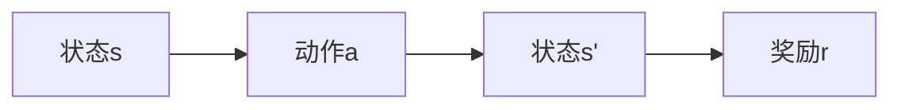
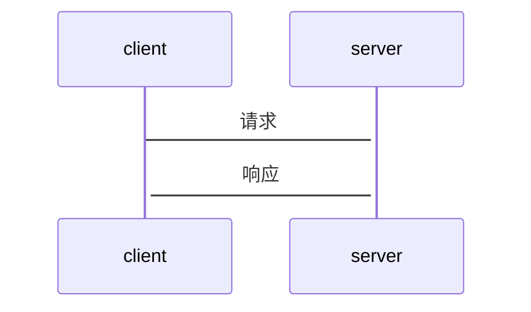

                 


# 构建AI Agent的实时学习与适应机制

---

## 关键词：
- AI Agent
- 实时学习
- 适应机制
- 强化学习
- 系统架构

---

## 摘要：
本文旨在探讨如何构建具备实时学习与适应能力的AI Agent。通过分析动态环境中的挑战，介绍实时学习和适应机制的核心概念，并详细讲解相关算法的原理与实现。结合系统架构设计和实际案例，本文提供了一套完整的解决方案，并总结了最佳实践和未来发展方向。

---

## 第1章: AI Agent概述

### 1.1 AI Agent的基本概念
#### 1.1.1 AI Agent的定义
AI Agent（人工智能代理）是一种能够感知环境、自主决策并执行任务的智能实体。它可以是一个软件程序、机器人或任何具备智能交互能力的系统。

#### 1.1.2 AI Agent的核心特征
- **自主性**：无需外部干预，自主完成任务。
- **反应性**：能够实时感知环境变化并做出反应。
- **目标导向性**：基于目标驱动行为。
- **学习能力**：通过经验改进性能。

#### 1.1.3 AI Agent的应用场景
- 智能助手（如Siri、Alexa）。
- 自动驾驶系统。
- 智能客服系统。
- 机器人控制。

### 1.2 实时学习与适应机制的背景
#### 1.2.1 动态环境中的挑战
AI Agent需要在不断变化的环境中实时调整策略，例如应对突发事件或用户需求变化。

#### 1.2.2 实时学习的必要性
- 快速响应：在动态环境中，延迟可能导致错误。
- 环境复杂性：复杂环境需要快速适应。
- 任务多样性：处理不同类型任务时需要快速调整策略。

#### 1.2.3 适应机制的重要性
- 持续优化：通过反馈不断改进。
- 多样性应对：在不同场景中切换策略。
- 鲁棒性：确保在异常情况下仍能运行。

### 1.3 本章小结
本章介绍了AI Agent的基本概念及其在实时学习与适应机制中的重要性，为后续内容奠定了基础。

---

## 第2章: 实时学习与适应机制的核心概念

### 2.1 实时学习算法
#### 2.1.1 基于模型的实时学习
- **定义**：依赖于环境模型进行预测和决策。
- **优势**：可以提前规划，避免盲目行动。
- **挑战**：模型复杂性可能导致计算开销大。

#### 2.1.2 基于经验的实时学习
- **定义**：通过历史数据进行学习和优化。
- **优势**：简单高效，适用于无模型环境。
- **挑战**：依赖于经验的充分性。

#### 2.1.3 实时学习的数学模型
$$ Q(s, a) = Q(s, a) + \alpha [r + \max Q(s', a') - Q(s, a)] $$
其中，$\alpha$ 是学习率，$r$ 是奖励，$s'$ 是下一状态。

### 2.2 适应机制
#### 2.2.1 动态调整策略
- **策略调整**：根据反馈动态修改策略。
- **在线更新模型**：实时更新模型参数。
- **自适应学习**：无需人工干预，自动适应环境。

#### 2.2.2 在线更新模型
- **实时反馈**：根据即时反馈调整模型。
- **模型轻量化**：确保实时更新的效率。

#### 2.2.3 适应机制的评估指标
- **收敛速度**：适应机制的调整速度。
- **稳定性**：在动态环境中的表现稳定性。
- **准确性**：决策的正确性。

### 2.3 核心概念的联系
- **实时学习与适应机制的关系**：实时学习提供数据支持，适应机制实现动态调整。
- **算法选择与环境的适应性**：不同环境选择不同算法，确保适应性。
- **适应机制的优化策略**：通过反馈机制不断优化适应过程。

---

## 第3章: 实时学习与适应机制的算法原理

### 3.1 基于强化学习的实时学习
#### 3.1.1 强化学习的基本原理
- **定义**：通过试错机制，通过奖励或惩罚调整策略。
- **状态-动作空间**：定义状态和动作的空间。

#### 3.1.2 Q-learning算法的数学模型
$$ Q(s, a) = Q(s, a) + \alpha [r + \max Q(s', a') - Q(s, a)] $$
其中，$\alpha$ 是学习率，$r$ 是奖励，$s'$ 是下一状态。

#### 3.1.3 实时学习中的状态转移图


### 3.2 基于监督学习的实时更新
#### 3.2.1 监督学习的基本原理
- **定义**：基于标签数据进行预测。
- **实时更新**：利用新数据点更新模型。

#### 3.2.2 实时更新的数学公式
$$ y = f(x) $$
其中，$y$ 是目标值，$x$ 是输入，$f$ 是模型函数。

---

## 第4章: 系统架构与交互流程

### 4.1 系统架构设计


### 4.2 接口设计


---

## 第5章: 项目实战

### 5.1 智能客服系统的实时学习与适应机制实现

#### 5.1.1 环境安装
```bash
pip install numpy scikit-learn
```

#### 5.1.2 核心实现
```python
class AIAssistant:
    def __init__(self):
        self.model = self._build_model()

    def _build_model(self):
        # 模型构建代码
        pass

    def update_model(self, data):
        # 实时更新模型
        pass
```

---

## 第6章: 最佳实践

### 6.1 小结
- **实时学习**：确保数据流实时更新，算法高效。
- **适应机制**：通过反馈优化策略，确保灵活性。
- **系统架构**：模块化设计，便于维护和扩展。

### 6.2 注意事项
- 数据质量：实时数据需准确。
- 计算资源：确保实时更新的计算能力。
- 隐私安全：保护数据安全。

### 6.3 未来研究方向
- 更高效的实时学习算法。
- 更智能的适应机制。
- 更多样化的应用场景。

---

## 参考文献
1. Russell, S., & Norvig, P. (2010). Artificial Intelligence: A Modern Approach.
2. Sutton, R. S., & Barto, A. G. (2018). Reinforcement Learning: An Introduction.

---

## 附录
- 代码示例：提供完整的AI Agent实现代码。
- 图表说明：解释各图表的意义和作用。

---

通过以上结构，您可以撰写一篇详细的技术博客文章，涵盖构建AI Agent实时学习与适应机制的各个方面，确保内容丰富且逻辑清晰。

