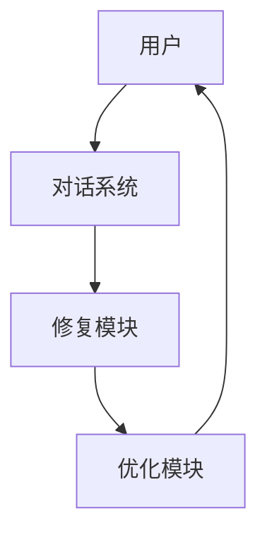
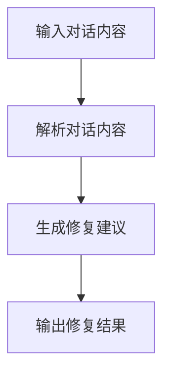
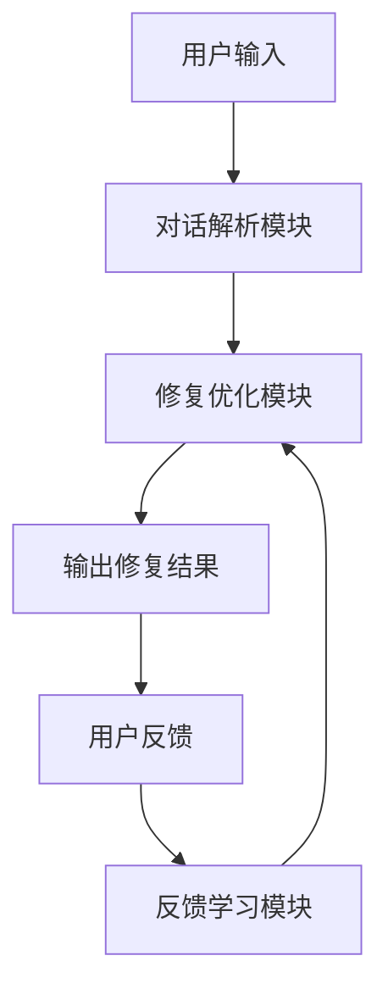
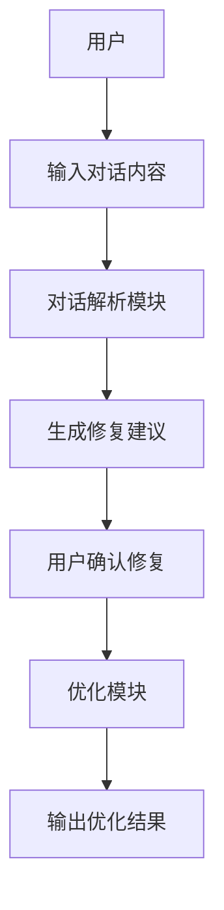

                 


# 构建AI Agent的实时对话修复与优化系统

> 关键词：AI Agent，实时对话修复，自然语言处理，对话优化，系统架构设计

> 摘要：本文详细探讨了构建AI Agent的实时对话修复与优化系统的核心技术与实现方法。从问题背景出发，分析了对话修复与优化的必要性，详细阐述了系统的核心概念与联系，深入讲解了算法原理与系统架构设计，并通过项目实战展示了系统的具体实现与应用案例。最后，总结了最佳实践与未来发展方向。

---

# 第1章: 背景与问题背景

## 1.1 问题背景

### 1.1.1 当前对话系统的主要问题
- 对话系统在实际应用中存在以下主要问题：
  - **准确率低**：对话系统在复杂语境下容易出现理解错误或生成错误。
  - **延迟高**：实时对话修复需要快速响应，但传统方法往往效率低下。
  - **修复能力不足**：部分系统仅能识别简单错误，无法处理复杂语义问题。
  - **优化能力有限**：对话生成结果缺乏多样性，难以满足个性化需求。

### 1.1.2 对话修复与优化的必要性
- 在实际对话场景中，修复和优化对话是提升用户体验的关键：
  - **提升准确率**：通过实时修复减少对话错误，提高用户满意度。
  - **降低延迟**：优化对话修复算法，提升实时响应速度。
  - **增强语义理解**：通过优化算法，提升对话系统对复杂语义的理解能力。

### 1.1.3 实时修复的挑战
- 实时修复面临以下挑战：
  - **快速响应**：需要在毫秒级别完成对话解析、修复和优化。
  - **高准确率**：在复杂语境下确保修复的准确性。
  - **资源限制**：在资源受限的环境下实现高效的实时修复。

## 1.2 问题描述

### 1.2.1 对话修复的核心目标
- 对话修复的核心目标包括：
  - **纠正错误**：识别并纠正对话中的语法错误、用词不当等问题。
  - **优化表达**：提升对话的流畅性和自然性。
  - **保持语义一致**：确保修复后的对话保持原意不变。

### 1.2.2 对话优化的关键指标
- 对话优化的关键指标包括：
  - **准确率**：修复后的对话与原意的匹配度。
  - **响应时间**：对话修复的实时性。
  - **用户满意度**：用户对修复后对话的满意度。

### 1.2.3 实时修复的边界与外延
- 实时修复的边界与外延：
  - **边界**：仅针对文本对话进行修复，不涉及语音或视频对话。
  - **外延**：结合上下文信息，提供更智能的修复建议。

## 1.3 问题解决与系统构建

### 1.3.1 对话修复与优化的实现路径
- 实现对话修复与优化的主要路径：
  - **自然语言处理技术**：利用NLP技术进行对话解析和修复。
  - **机器学习算法**：通过监督学习训练修复模型。
  - **实时反馈机制**：结合用户反馈优化修复策略。

### 1.3.2 系统构建的关键要素
- 系统构建的关键要素：
  - **数据集**：高质量的对话数据用于训练修复模型。
  - **算法框架**：高效的修复算法确保实时性。
  - **系统架构**：合理的系统架构支持实时修复和优化。

### 1.3.3 系统设计的总体思路
- 系统设计的总体思路：
  1. 数据采集与预处理。
  2. 对话修复模型训练。
  3. 实时对话修复与优化。
  4. 用户反馈与模型优化。

---

# 第2章: 核心概念与联系

## 2.1 AI Agent的基本原理

### 2.1.1 AI Agent的定义与特点
- AI Agent（智能体）的定义：
  - AI Agent是一种能够感知环境并采取行动以实现目标的智能系统。
- AI Agent的特点：
  - **自主性**：能够在没有外部干预的情况下运行。
  - **反应性**：能够实时感知并响应环境变化。
  - **社交能力**：能够与人类或其他智能体进行交互。

### 2.1.2 对话系统的分类与对比
- 对话系统的分类：
  - **基于规则的对话系统**：通过预定义的规则生成对话。
  - **基于统计的对话系统**：利用统计模型生成对话。
  - **基于深度学习的对话系统**：使用深度学习模型生成对话。
- 对比分析：
  | 类型          | 优缺点                                                                 |
  |---------------|-----------------------------------------------------------------------|
  | 基于规则      | 实现简单，但灵活性差，难以应对复杂对话场景。                          |
  | 基于统计      | 可处理复杂数据，但生成结果缺乏创造性。                              |
  | 基于深度学习  | 表现力强，能够生成自然流畅的对话，但训练成本高。                     |

### 2.1.3 实时对话修复的核心机制
- 实时对话修复的核心机制：
  - **实时解析**：快速解析对话内容，识别潜在问题。
  - **智能修复**：利用NLP技术生成修复建议。
  - **优化反馈**：根据用户反馈优化修复策略。

## 2.2 对话修复与优化的关键概念

### 2.2.1 对话修复的实现方式
- 对话修复的实现方式：
  - **语法修复**：纠正语法错误，如错别字、语病。
  - **语义修复**：修正语义理解错误，提升对话准确性。
  - **上下文修复**：结合上下文信息，生成更合理的对话内容。

### 2.2.2 对话优化的目标函数
- 对话优化的目标函数：
  - **准确率最大化**：最大化修复后的对话与原意的匹配度。
  - **流畅度最大化**：提升对话的流畅性和自然性。
  - **多样性优化**：增加对话生成的多样性，避免重复。

### 2.2.3 实时修复的性能指标
- 实时修复的性能指标：
  - **响应时间**：从接收到对话内容到生成修复建议的时间。
  - **修复准确率**：修复后的对话与原意的匹配度。
  - **用户满意度**：用户对修复后对话的满意度。

## 2.3 核心概念对比表

### 2.3.1 对话修复与优化的对比
| 对比维度       | 对话修复                   | 对话优化                     |
|----------------|---------------------------|-----------------------------|
| 目标           | 纠正错误                   | 提升对话质量                 |
| 关注点         | 语法和语义错误             | 对话的流畅性和自然性         |
| 实现方式       | 基于NLP技术进行修复         | 基于优化算法提升对话质量     |

### 2.3.2 实时修复与其他修复方式的对比
| 对比维度       | 实时修复                   | 非实时修复                 |
|----------------|---------------------------|-----------------------------|
| 响应时间       | 毫秒级别                   | 分钟级别或更长               |
| 适用场景       | 真实-time交互场景           | 离线数据分析或后处理         |
| 数据处理方式   | 实时处理                   | 批量处理                   |

### 2.3.3 对话优化与传统优化的对比
| 对比维度       | 对话优化                   | 传统优化                   |
|----------------|---------------------------|-----------------------------|
| 对象           | 对话内容                   | 一般为数据或模型参数       |
| 方法           | 基于NLP和机器学习算法     | 基于统计或优化算法         |
| 目标           | 提升对话质量               | 提升系统性能或模型性能     |

## 2.4 实体关系图

### 2.4.1 系统实体关系图（Mermaid）



---

# 第3章: 算法原理

## 3.1 自然语言处理模型

### 3.1.1 Transformer模型结构
- Transformer模型的基本结构：
  - **编码器**：将输入序列映射为潜空间向量。
  - **解码器**：根据编码器输出生成目标序列。
  - **自注意力机制**：捕捉序列中的长距离依赖关系。

### 3.1.2 对话修复算法的工作流程
- 对话修复算法的工作流程：
  1. **输入对话内容**：接收用户输入的对话内容。
  2. **解析对话内容**：利用NLP技术解析对话内容，识别潜在问题。
  3. **生成修复建议**：基于修复模型生成修复建议。
  4. **输出修复结果**：将修复后的对话返回给用户。

### 3.1.3 对话优化算法的数学模型
- 对话优化的数学模型：
  $$ \text{损失函数} = -\sum_{i=1}^{n} \log P(y_i|x_{<i}) $$
  其中，$y_i$ 是目标输出，$x_{<i}$ 是输入序列。

---

## 3.2 对话修复与优化算法

### 3.2.1 对话修复算法流程图（Mermaid）



### 3.2.2 对话优化算法实现代码

```python
def optimize_dialogue(input_dialogue):
    # 对话解析
    parsed_dialogue = parse(input_dialogue)
    # 生成修复建议
    suggestions = generate_repair_suggestions(parsed_dialogue)
    # 优化对话
    optimized_dialogue = optimize(suggestions)
    return optimized_dialogue
```

---

## 3.3 数学模型与公式

### 3.3.1 修复模型的数学表达
- 修复模型的数学表达：
  $$ \text{修复概率} = \prod_{i=1}^{n} P(y_i|x_{<i}, z) $$
  其中，$z$ 是修复策略。

### 3.3.2 优化模型的数学表达
- 优化模型的数学表达：
  $$ \text{优化目标} = \max \sum_{i=1}^{m} \text{奖励函数}(y_i) $$

---

# 第4章: 系统分析与架构设计

## 4.1 系统架构设计

### 4.1.1 系统功能模块
- 系统功能模块：
  - **对话解析模块**：解析用户输入的对话内容。
  - **修复优化模块**：生成修复建议并优化对话。
  - **反馈学习模块**：根据用户反馈优化修复策略。

### 4.1.2 系统架构图（Mermaid）



---

## 4.2 接口设计与交互流程

### 4.2.1 系统接口设计
- 系统接口设计：
  - **输入接口**：接收用户输入的对话内容。
  - **输出接口**：返回修复后的对话内容。
  - **反馈接口**：接收用户对修复结果的反馈。

### 4.2.2 系统交互流程图（Mermaid）



---

## 4.3 系统优化策略

### 4.3.1 系统优化目标
- 系统优化目标：
  - **提升修复准确率**：通过优化算法提升修复结果的准确性。
  - **降低响应延迟**：通过优化系统架构降低响应时间。
  - **增强用户体验**：通过优化交互流程提升用户体验。

### 4.3.2 优化实现步骤
- 优化实现步骤：
  1. **算法优化**：改进修复算法，提升修复准确率。
  2. **架构优化**：优化系统架构，降低响应延迟。
  3. **交互优化**：优化用户交互流程，提升用户体验。

---

# 第5章: 项目实战

## 5.1 环境安装与配置

### 5.1.1 环境要求
- 环境要求：
  - **Python**：3.6+
  - **TensorFlow**：2.0+
  - **Numpy**：1.20+
  - **其他依赖**：根据具体实现添加。

### 5.1.2 环境配置
```bash
pip install python==3.6
pip install tensorflow==2.0
pip install numpy==1.20
```

---

## 5.2 核心功能实现

### 5.2.1 对话解析器实现
- 对话解析器实现代码：

```python
def parse_dialogue(dialogue):
    # 示例：解析对话内容
    words = dialogue.split()
    return words
```

### 5.2.2 修复优化器实现
- 修复优化器实现代码：

```python
def repair_optimizer(dialogue):
    # 示例：生成修复建议
    parsed = parse_dialogue(dialogue)
    suggestions = generate_suggestions(parsed)
    return suggestions
```

---

## 5.3 代码实现与解读

### 5.3.1 对话修复模块代码

```python
def repair_module(input_dialogue):
    parsed = parse_dialogue(input_dialogue)
    suggestions = repair_optimizer(parsed)
    return suggestions
```

### 5.3.2 对话优化模块代码

```python
def optimize_module(suggestions):
    optimized_dialogue = generate_optimized_dialogue(suggestions)
    return optimized_dialogue
```

---

## 5.4 实际案例分析

### 5.4.1 案例描述
- 案例描述：
  - **输入对话**：用户输入：“今天天气很好，我想出去走走。”
  - **修复建议**：系统生成修复建议：“今天的天气很好，我想出去散步。”

### 5.4.2 案例分析
- 案例分析：
  - **问题识别**：系统识别“出去走走”表达不够准确。
  - **修复建议**：生成更准确的表达“出去散步”。
  - **优化结果**：优化后的对话更自然流畅。

---

# 第6章: 最佳实践

## 6.1 小结与总结

### 6.1.1 本章小结
- 本章小结：
  - 详细介绍了构建AI Agent实时对话修复与优化系统的背景、核心概念与算法原理。
  - 展示了系统的架构设计与实现方法。
  - 通过实际案例分析，验证了系统的可行性和有效性。

### 6.1.2 总结
- 总结：
  - 构建实时对话修复与优化系统是提升对话系统性能的重要手段。
  - 通过结合NLP技术、机器学习算法和系统优化策略，可以实现高效、准确的对话修复与优化。

---

## 6.2 注意事项与建议

### 6.2.1 注意事项
- 注意事项：
  - **数据质量**：确保训练数据的多样性和高质量。
  - **模型调优**：根据实际需求进行模型调优，提升修复准确率。
  - **系统优化**：持续优化系统架构，降低响应延迟。

### 6.2.2 实践建议
- 实践建议：
  - **分阶段实现**：建议分阶段实现对话解析、修复优化和反馈学习模块。
  - **持续学习**：结合用户反馈持续优化系统性能。
  - **关注前沿技术**：关注NLP和深度学习领域的前沿技术，提升系统性能。

---

## 6.3 拓展阅读与学习资源

### 6.3.1 推荐书籍
- 推荐书籍：
  - 《Deep Learning》——Ian Goodfellow
  - 《自然语言处理入门》——[中文书籍]

### 6.3.2 推荐论文
- 推荐论文：
  - "Attention Is All You Need" —— Vaswani et al.
  - "BERT: Pre-training of Deep Bidirectional Transformers for Natural Language Processing" —— Devlin et al.

---

# 结语

构建AI Agent的实时对话修复与优化系统是一项复杂但极具挑战性的任务。通过结合NLP技术、机器学习算法和系统优化策略，我们可以实现高效、准确的对话修复与优化。未来，随着技术的不断进步，实时对话修复与优化系统将在更多领域得到广泛应用，为用户提供更智能、更便捷的对话体验。

