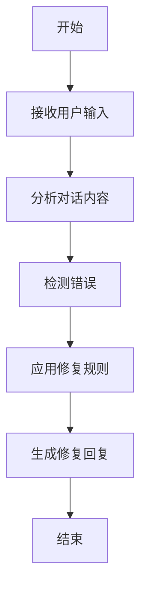
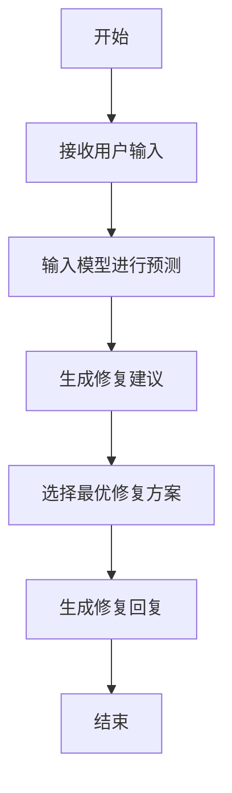
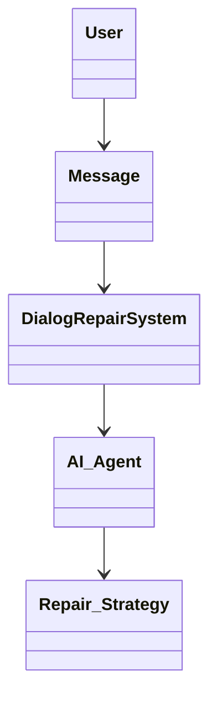
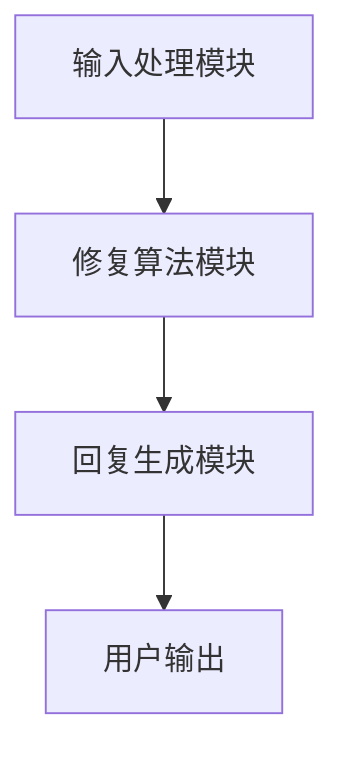
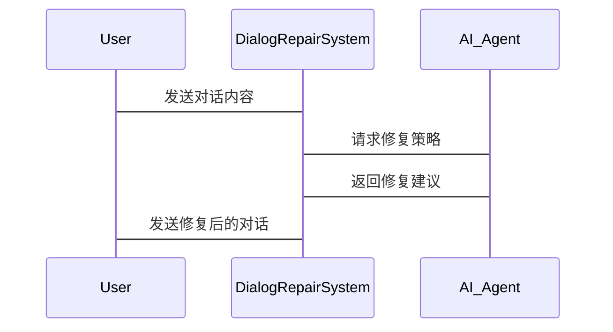

                 


# 构建AI Agent的实时对话修复系统

## 关键词
AI Agent, 实时对话修复, 自然语言处理, 对话系统, 机器学习

## 摘要
本文将详细介绍构建一个基于AI Agent的实时对话修复系统的各个方面。从背景到技术实现，再到系统架构和项目实战，全面解析该系统的构建过程和关键点。

---

## 第1章: 背景与问题背景

### 1.1 问题背景
#### 1.1.1 对话系统的发展与挑战
对话系统经历了从规则驱动到深度学习驱动的演变。当前，实时对话修复的需求日益增长，尤其是在智能客服、语音助手等领域。

#### 1.1.2 实时对话修复的必要性
实时对话修复能够提升用户体验，减少沟通障碍，提高对话效率。

#### 1.1.3 AI Agent在对话修复中的作用
AI Agent能够实时分析对话内容，识别问题，并生成准确的回复。

### 1.2 问题描述
#### 1.2.1 对话修复的核心问题
对话修复的核心问题包括错误检测、意图识别和上下文理解。

#### 1.2.2 实时修复的关键挑战
实时修复的关键挑战在于高效性、准确性和鲁棒性。

#### 1.2.3 AI Agent的实时性要求
AI Agent需要在极短的时间内完成对话修复，以保证实时性。

---

## 第2章: 核心概念与联系

### 2.1 对话修复系统的核心概念
#### 2.1.1 对话修复的定义与属性
对话修复是指在实时对话中自动检测和纠正错误或不连贯的地方。

#### 2.1.2 AI Agent的定义与功能
AI Agent是一种智能实体，能够理解和执行任务，具备自主决策能力。

#### 2.1.3 实时修复的特征与约束
实时修复需要快速响应，具备高准确性和鲁棒性。

### 2.2 核心概念对比表
#### 表2.1: 对话修复与传统对话系统的对比
| 特性           | 对话修复系统      | 传统对话系统 |
|----------------|-------------------|--------------|
| 实时性         | 高                | 低            |
| 自动修复       | 是                | 否            |
| 依赖AI Agent   | 是                | 一般否        |

#### 表2.2: AI Agent与传统对话系统的对比
| 特性           | AI Agent          | 传统对话系统 |
|----------------|-------------------|--------------|
| 自主决策能力   | 高                | 低            |
| 学习能力       | 高                | 低            |
| 实时响应       | 高                | 一般低        |

### 2.3 实体关系图
#### 图2.1: 对话修复系统的ER图
```mermaid
erDiagram
    user <--- message <--> dialog_repair_system
    dialog_repair_system --> ai_agent
    ai_agent --> repair_strategy
```

---

## 第3章: 对话修复系统的算法原理

### 3.1 对话修复算法概述
#### 3.1.1 基于规则的修复算法
基于规则的修复算法通过预定义的规则来检测和纠正错误。

#### 3.1.2 基于模型的修复算法
基于模型的修复算法利用深度学习模型来自动学习修复策略。

#### 3.1.3 混合修复算法
混合修复算法结合规则和模型的优势，提升修复准确性和效率。

### 3.2 算法流程图
#### 图3.1: 基于规则的修复流程图


#### 图3.2: 基于模型的修复流程图


### 3.3 算法实现代码
#### 代码3.1: 基于规则的修复算法实现
```python
def repair_dialog(user_input):
    # 分割输入句子
    sentences = user_input.split('.')
    for i in range(len(sentences)):
        # 检测语法错误
        if has_grammar_error(sentences[i]):
            # 应用修复规则
            repaired = apply_rule(sentences[i])
            sentences[i] = repaired
    return '.join(sentences)
```

#### 代码3.2: 基于模型的修复算法实现
```python
class RepairModel:
    def __init__(self, model):
        self.model = model

    def predict_repair(self, input_text):
        # 输入模型进行预测
        prediction = self.model.predict(input_text)
        return prediction
```

### 3.4 对话修复的数学模型与公式
#### 意图识别模型
$$ L = -\sum_{i=1}^{n} y_i \log p(y_i) $$

#### 修复策略模型
$$ \min_{\theta} \mathbb{E}_{(x,y)} [\text{修复错误}] $$

---

## 第4章: 系统分析与架构设计

### 4.1 系统功能设计
#### 4.1.1 需求分析
系统需要支持实时对话修复，具备高准确性和高效性。

#### 4.1.2 功能模块划分
- 用户输入接收模块
- 对话内容分析模块
- 错误检测模块
- 修复策略生成模块
- 回复生成模块

#### 图4.1: 领域模型类图


### 4.2 系统架构设计
#### 4.2.1 分层架构设计
- 数据层
- 业务逻辑层
- 表示层

#### 4.2.2 模块化架构设计
- 输入处理模块
- 修复算法模块
- 回复生成模块

#### 图4.2: 系统架构图


### 4.3 系统接口设计
#### 4.3.1 对外接口定义
- 输入接口：接收用户对话内容
- 输出接口：返回修复后的对话内容

#### 图4.3: 系统交互流程图


---

## 第5章: 项目实战

### 5.1 项目介绍
本项目旨在构建一个基于AI Agent的实时对话修复系统，应用于智能客服领域。

### 5.2 环境安装
- Python 3.8+
- TensorFlow 2.0+
- NLTK库

### 5.3 核心实现代码
#### 代码5.1: 对话修复系统实现
```python
def main():
    import nltk
    import tensorflow as tf

    # 初始化AI Agent
    agent = AI_Agent()

    while True:
        user_input = input("请输入对话内容：")
        repaired_dialog = agent.repair_dialog(user_input)
        print("修复后的对话：", repaired_dialog)

if __name__ == "__main__":
    main()
```

### 5.4 实际案例分析
案例：用户输入有语法错误，系统自动修复并生成正确的回复。

### 5.5 项目小结
通过本项目，我们实现了基于AI Agent的实时对话修复系统，具备高效性和准确性。

---

## 第6章: 最佳实践与注意事项

### 6.1 最佳实践
- 定期更新模型，提升修复准确率
- 优化算法，提高处理速度
- 增强系统鲁棒性，确保稳定运行

### 6.2 小结
本文详细讲解了构建AI Agent实时对话修复系统的各个方面，为实际应用提供了理论和实践指导。

### 6.3 注意事项
- 确保数据安全和隐私保护
- 定期监控系统性能，及时优化

### 6.4 拓展阅读
- 《深度学习》
- 《自然语言处理实战》

---

## 结论
构建一个基于AI Agent的实时对话修复系统是一项复杂但极具挑战性的任务。通过深入了解对话修复的核心概念、算法原理、系统架构，并结合实际项目实战，我们可以逐步实现这一目标，提升用户体验和对话效率。

