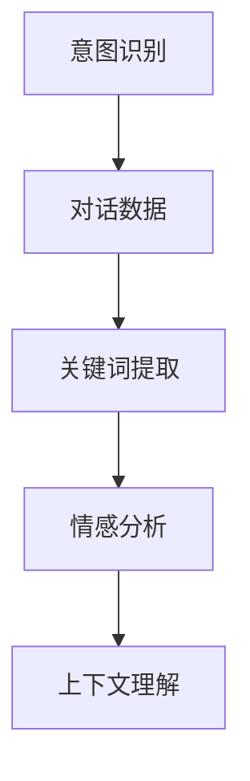
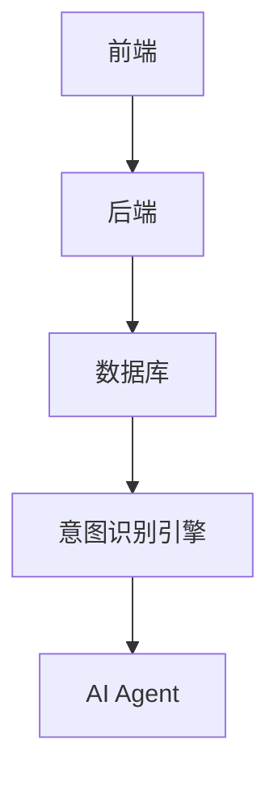

                 

# 《构建AI Agent的实时对话意图识别系统》

**关键词：** AI Agent, 对话意图识别, 实时处理, 深度学习, 系统架构

**摘要：** 本文将详细探讨构建一个实时对话意图识别系统的各个方面。从问题背景到系统架构设计，结合算法原理和项目实战，为您提供全面的指导，帮助您掌握构建高效AI Agent的技能。

---

## 目录大纲

### 第1章 背景介绍

#### 1.1 问题背景
- 1.1.1 对话意图识别的定义
- 1.1.2 当前技术的局限性
- 1.1.3 实际应用场景的需求

#### 1.2 问题描述
- 1.2.1 对话意图识别的核心目标
- 1.2.2 现有技术的挑战
- 1.2.3 用户需求与系统目标

#### 1.3 问题解决方法
- 1.3.1 AI Agent的基本概念
- 1.3.2 实时对话意图识别的必要性
- 1.3.3 解决方案的可行性分析

#### 1.4 边界与外延
- 1.4.1 系统功能的边界
- 1.4.2 相关技术的外延
- 1.4.3 应用场景的限制

#### 1.5 核心概念组成
- 1.5.1 对话数据的结构
- 1.5.2 意图识别的关键要素
- 1.5.3 系统组件的组成

### 第2章 核心概念与联系

#### 2.1 意图识别的基本原理
- 2.1.1 监督学习的基本原理
- 2.1.2 无监督学习的应用
- 2.1.3 半监督学习的优势

#### 2.2 不同模型的特征对比
- 2.2.1 基于规则的模型特点
- 2.2.2 统计模型的优势
- 2.2.3 深度学习模型的特征

#### 2.3 实体关系图

### 第3章 算法原理讲解

#### 3.1 基于规则的意图识别
- 3.1.1 算法流程
- 3.1.2 代码实现
- 3.1.3 数学模型

#### 3.2 统计模型的实现
- 3.2.1 算法流程
- 3.2.2 代码实现
- 3.2.3 数学模型

#### 3.3 深度学习模型的实现
- 3.3.1 算法流程
- 3.3.2 代码实现
- 3.3.3 数学模型

### 第4章 系统分析与架构设计

#### 4.1 问题场景介绍
- 4.1.1 系统功能需求
- 4.1.2 系统性能需求
- 4.1.3 系统安全性需求

#### 4.2 系统功能设计
- 4.2.1 领域模型设计
- 4.2.2 系统架构设计
- 4.2.3 系统接口设计
- 4.2.4 系统交互设计

#### 4.3 系统架构图

### 第5章 项目实战

#### 5.1 环境安装
- 5.1.1 开发工具安装
- 5.1.2 依赖库安装
- 5.1.3 环境配置

#### 5.2 系统核心实现
- 5.2.1 对话数据预处理
- 5.2.2 意图识别模型训练
- 5.2.3 系统集成与测试

#### 5.3 代码实现与解读
- 5.3.1 关键代码片段
- 5.3.2 代码解读
- 5.3.3 优化建议

#### 5.4 实际案例分析
- 5.4.1 案例背景
- 5.4.2 数据准备
- 5.4.3 系统实现
- 5.4.4 结果分析

#### 5.5 项目小结
- 5.5.1 成果总结
- 5.5.2 经验分享
- 5.5.3 改进建议

### 第6章 最佳实践、小结、注意事项与拓展阅读

#### 6.1 最佳实践
- 6.1.1 数据预处理技巧
- 6.1.2 模型调优建议
- 6.1.3 系统优化策略

#### 6.2 小结
- 6.2.1 本文总结
- 6.2.2 未来展望

#### 6.3 注意事项
- 6.3.1 开发中的常见问题
- 6.3.2 解决方案建议
- 6.3.3 未来技术趋势

#### 6.4 拓展阅读
- 6.4.1 推荐书籍
- 6.4.2 相关论文
- 6.4.3 在线资源

---

**总结：** 本文详细探讨了构建AI Agent实时对话意图识别系统的各个方面，从背景介绍到项目实战，结合理论与实践，为您提供全面的指导。通过系统的分析和实际案例的分析，帮助您掌握构建高效AI Agent的技能。

