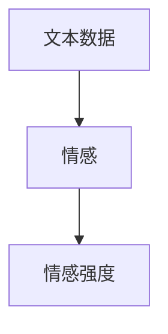
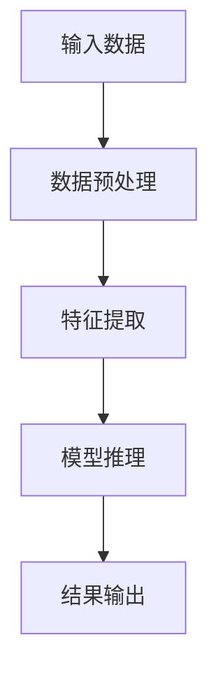

                 


# 构建AI Agent的实时情感分析引擎

> 关键词：实时情感分析、AI Agent、自然语言处理、深度学习、文本挖掘、系统架构

> 摘要：本文详细探讨构建AI Agent的实时情感分析引擎的关键技术与实现方法，涵盖情感分析的背景与核心概念、核心算法与模型、系统架构与设计、项目实战、优化与扩展、案例分析和总结等，帮助读者全面掌握实时情感分析的技术要点与应用实践。

---

# 第1章: 情感分析的背景与核心概念

## 1.1 情感分析的背景与问题背景
### 1.1.1 情感分析的定义与问题背景
情感分析是自然语言处理（NLP）中的重要任务，旨在分析文本中的情感倾向、强度和情感类型。随着社交媒体、客服系统和金融分析等领域的需求增长，实时情感分析成为关键的技术需求。

### 1.1.2 AI Agent在情感分析中的角色
AI Agent作为智能体，能够实时处理和分析情感信息，帮助决策者快速响应用户情感需求，提升用户体验和服务效率。

### 1.1.3 实时情感分析的需求与应用场景
实时情感分析的需求主要来源于对快速反馈的需求，应用场景包括社交媒体监控、客户反馈分析、金融舆情监控等。

## 1.2 情感分析的核心概念与问题描述
### 1.2.1 情感分析的基本概念
情感分析包括情感分类（判断情感倾向）和情感强度分析（量化情感强度）。情感类型通常包括正面、负面和中性。

### 1.2.2 实时情感分析的定义
实时情感分析是指在数据流中逐条处理文本，即时输出情感结果，要求低延迟和高吞吐量。

### 1.2.3 情感分析的边界与外延
情感分析的边界包括处理范围（文本长度）、情感类型和强度。外延包括多语言情感分析和跨领域应用。

### 1.2.4 情感分析的核心要素组成
- 输入：文本数据流
- 输出：情感类型和强度
- 中间过程：特征提取、模型训练和推理

## 1.3 情感分析的核心概念与联系
### 1.3.1 情感分析的核心概念原理
情感分析通过处理语言特征，利用统计或深度学习模型预测情感。

### 1.3.2 情感分析概念属性特征对比表格
```markdown
| 情感分析概念 | 特征属性 | 特征描述 |
|--------------|----------|----------|
| 输入数据     | 类型     | 文本数据流 |
| 输出结果     | 类型     | 情感类型和强度 |
| 模型类型     | 类型     | 传统机器学习、深度学习、预训练模型 |
| 数据处理     | 步骤     | 数据清洗、特征提取、模型训练 |
```

### 1.3.3 情感分析的ER实体关系图


## 1.4 本章小结
本章介绍了情感分析的背景、核心概念和应用场景，为后续章节奠定了基础。

---

# 第2章: 情感分析的核心算法与模型

## 2.1 情感分析的核心算法原理
### 2.1.1 基于传统机器学习的情感分析算法
传统算法包括支持向量机（SVM）和朴素贝叶斯（NB），基于特征工程和词袋模型。

### 2.1.2 基于深度学习的情感分析算法
深度学习模型如RNN、LSTM和Transformer在处理长文本和语义捕捉方面表现更优。

### 2.1.3 基于预训练语言模型的情感分析算法
利用BERT、GPT等预训练模型，通过微调任务提升情感分析性能。

## 2.2 情感分析的核心模型结构
### 2.2.1 传统机器学习模型（如SVM、NB）
- SVM：通过构建超平面进行分类，适用于高维特征空间。
- NB：基于贝叶斯定理，适用于特征独立性假设。

### 2.2.2 RNN与LSTM模型
- RNN：处理序列数据，但存在梯度消失问题。
- LSTM：通过门控机制缓解长序列训练问题。

### 2.2.3 Transformer模型与BERT
- Transformer：基于自注意力机制，提升并行计算效率。
- BERT：通过预训练任务捕捉上下文语义。

### 2.2.4 图神经网络模型
- 图神经网络：适用于处理知识图谱和实体关系，提升情感分析的语境理解。

## 2.3 情感分析算法的数学模型与公式
### 2.3.1 传统机器学习模型的数学公式
SVM的目标函数：
$$ \min_{w,b} \frac{1}{2}||w||^2 + C \sum_{i=1}^n \xi_i $$
约束条件：
$$ y_i(w \cdot x_i + b) \geq 1 - \xi_i $$

### 2.3.2 RNN与LSTM的数学公式
LSTM的门控机制：
$$ f_t = \sigma(W_f x_t + U_f h_{t-1} + b_f) $$
$$ i_t = \sigma(W_i x_t + U_i h_{t-1} + b_i) $$
$$ o_t = \sigma(W_o x_t + U_o h_{t-1} + b_o) $$
$$ h_t = f_t \cdot c_{t-1} + i_t \cdot tanh(W_o x_t + U_o h_{t-1} + b_o) $$

### 2.3.3 Transformer的数学公式
自注意力机制：
$$ Q = W_q h $$
$$ K = W_k h $$
$$ V = W_v h $$
$$ \text{Attention}(Q,K,V) = \text{softmax}\left(\frac{QK^T}{\sqrt{d_k}}\right)V $$

## 2.4 本章小结
本章介绍了情感分析的核心算法与模型，包括传统机器学习、深度学习和预训练模型，详细推导了数学公式和模型结构。

---

# 第3章: 实时情感分析的系统架构与设计

## 3.1 系统架构设计概述
### 3.1.1 系统架构的整体思路
实时情感分析系统需要高效处理数据流，要求低延迟和高吞吐量。

### 3.1.2 系统架构的模块划分
- 数据预处理模块：清洗和格式化输入文本。
- 特征提取模块：提取文本特征，如词向量和语法结构。
- 情感分析模块：基于训练好的模型进行推理。
- 结果展示模块：输出情感类型和强度。

## 3.2 系统架构的详细设计
### 3.2.1 系统功能设计
- 数据输入：支持多数据源和格式。
- 数据处理：清洗、分词和停用词处理。
- 模型推理：实时处理每条文本。
- 结果输出：存储和展示情感结果。

### 3.2.2 系统架构图


## 3.3 系统架构的优化与扩展
### 3.3.1 并行化处理
通过多线程和分布式计算提升处理速度。

### 3.3.2 模型轻量化
优化模型大小和计算复杂度，提升推理速度。

### 3.3.3 异常处理与容错机制
设计错误处理和恢复机制，确保系统稳定性。

## 3.4 本章小结
本章详细设计了实时情感分析系统的架构，包括模块划分、流程设计和优化策略。

---

# 第4章: 实时情感分析的项目实战

## 4.1 项目实战概述
### 4.1.1 项目背景与目标
构建一个实时情感分析系统，用于社交媒体监控。

### 4.1.2 项目需求分析
分析用户需求，明确功能模块和性能指标。

## 4.2 项目环境搭建
### 4.2.1 环境搭建步骤
安装Python、TensorFlow和Keras等依赖库。

## 4.3 项目核心实现
### 4.3.1 数据预处理
编写数据清洗和分词代码。

### 4.3.2 模型训练
训练情感分类模型，评估准确率和F1分数。

### 4.3.3 模型推理
实现实时推理接口，处理数据流。

## 4.4 项目优化与调优
### 4.4.1 模型优化
调整超参数，提升模型性能。

### 4.4.2 系统优化
优化数据处理和模型推理速度。

## 4.5 项目案例分析
### 4.5.1 案例背景与数据准备
分析社交媒体评论，准备训练数据。

### 4.5.2 模型训练与结果分析
训练模型并分析结果，优化系统性能。

## 4.6 本章小结
本章通过实战项目，详细展示了实时情感分析系统的实现过程，包括环境搭建、数据处理、模型训练和系统优化。

---

# 第5章: 实时情感分析的优化与扩展

## 5.1 模型优化与调优
### 5.1.1 参数调优
使用网格搜索和随机搜索优化模型参数。

### 5.1.2 模型压缩
通过剪枝和量化技术减少模型大小。

## 5.2 系统性能优化
### 5.2.1 数据处理优化
采用流处理框架如Kafka提升数据处理速度。

### 5.2.2 模型推理优化
使用GPU加速和并行计算提升推理效率。

## 5.3 情感分析的多模态扩展
### 5.3.1 文本与图像结合
分析图像中的情感信息，提升情感分析的准确性。

### 5.3.2 文本与语音结合
处理语音数据，分析语音情感。

## 5.4 模型部署与维护
### 5.4.1 模型部署
将模型部署到云平台，提供API接口。

### 5.4.2 模型维护
定期更新模型，适应数据分布变化。

## 5.5 本章小结
本章介绍了实时情感分析系统的优化与扩展方法，包括模型优化、系统性能提升和多模态分析。

---

# 第6章: 实时情感分析的案例分析与应用

## 6.1 案例分析概述
### 6.1.1 案例背景介绍
分析社交媒体上的用户评论，监控品牌声誉。

## 6.2 案例分析的具体实现
### 6.2.1 数据收集与预处理
收集评论数据，清洗和分词。

### 6.2.2 模型训练与部署
训练情感分类模型，部署到生产环境。

## 6.3 案例分析的结果与总结
### 6.3.1 分析结果展示
展示情感分析结果，监控品牌声誉变化。

## 6.4 本章小结
本章通过案例分析，展示了实时情感分析的实际应用和效果。

---

# 第7章: 实时情感分析的总结与展望

## 7.1 本章总结
### 7.1.1 核心知识点总结
总结实时情感分析的核心概念、算法和系统架构。

## 7.2 未来展望
### 7.2.1 技术发展趋势
预训练模型和多模态分析是未来发展方向。

### 7.2.2 应用场景拓展
情感分析将在更多领域如医疗和教育中发挥作用。

## 7.3 学习建议
### 7.3.1 深入学习建议
建议深入学习预训练模型和多模态分析技术。

## 7.4 本章小结
本章总结了实时情感分析的核心内容，并展望了未来的发展趋势。

---

# 参考文献
- 引用相关技术文献、书籍和论文，具体参考文献根据实际内容补充。

---

以上是《构建AI Agent的实时情感分析引擎》的完整目录大纲，涵盖了从基础到高级的技术要点，结合理论与实践，帮助读者全面掌握实时情感分析引擎的构建方法。

