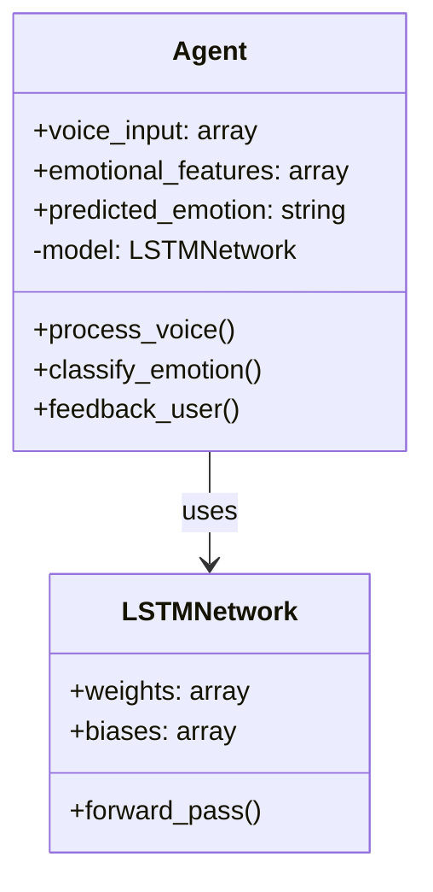
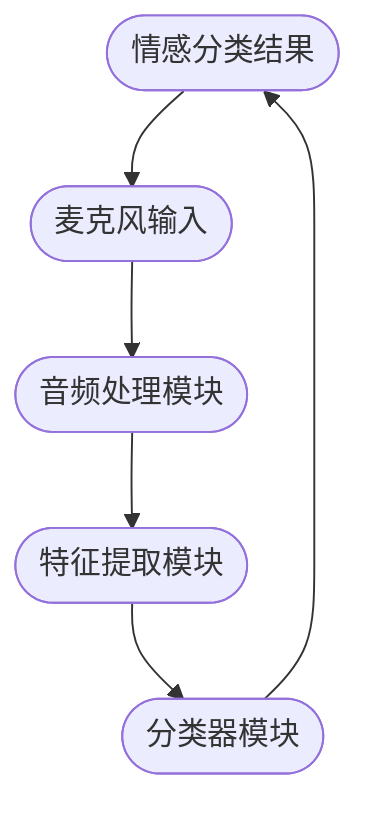
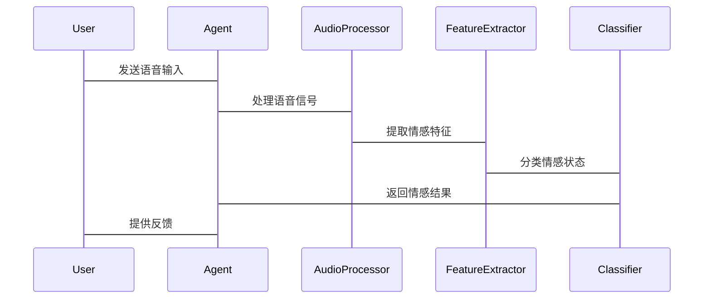

                 


# 构建AI Agent的实时语音情感分析系统

> 关键词：AI Agent，实时语音情感分析，系统架构，算法实现，项目实战

> 摘要：本文详细讲解了构建AI Agent的实时语音情感分析系统的全过程，从背景介绍、核心概念、算法原理到系统架构设计，再到项目实战和总结。通过逐步分析和实践，帮助读者全面掌握相关技术与实现方法。

---

## 第1章: 背景介绍

### 1.1 问题背景

#### 1.1.1 情感分析的定义与重要性
情感分析是自然语言处理（NLP）领域的重要任务，旨在通过分析文本或语音来识别和分类情感倾向。在实时场景中，情感分析能够帮助AI Agent理解用户的情绪状态，从而提供更智能和个性化的服务。

#### 1.1.2 语音情感分析的挑战
语音情感分析比文本情感分析更具挑战性，因为语音信号包含更多的情感特征，如音调、语速、音量等。同时，实时性要求对系统性能提出了更高的需求。

#### 1.1.3 AI Agent在情感分析中的作用
AI Agent作为智能助手，能够实时处理用户的语音输入，分析其情感倾向，并根据结果提供相应的反馈或服务。这使得AI Agent在教育、医疗、客服等领域具有广泛的应用潜力。

### 1.2 问题描述

#### 1.2.1 语音情感分析的定义
语音情感分析是通过分析语音信号来识别和分类说话人情感状态的过程。情感状态通常包括情绪类别（如快乐、悲伤、愤怒等）和情感强度（如非常开心、轻微悲伤）。

#### 1.2.2 AI Agent的定义与功能
AI Agent（人工智能代理）是一种智能系统，能够感知环境、理解用户需求并主动提供服务。在情感分析场景中，AI Agent需要具备实时语音处理能力、情感识别能力和交互能力。

#### 1.2.3 系统的目标与应用场景
系统的目标是构建一个能够实时处理语音输入、分析情感状态，并根据结果提供相应反馈的AI Agent。应用场景包括智能音箱、客服系统、心理健康辅助等。

### 1.3 问题解决

#### 1.3.1 现有解决方案的优缺点
现有解决方案主要集中在文本情感分析和语音识别领域。文本情感分析技术相对成熟，但难以直接应用于语音场景。语音识别技术能够将语音转换为文本，但无法直接提取情感特征。

#### 1.3.2 AI Agent在实时语音情感分析中的优势
AI Agent能够将语音信号直接转换为情感特征，并结合上下文信息进行分析，从而实现更准确的情感识别。此外，AI Agent还能够通过实时反馈与用户进行交互，进一步提升用户体验。

#### 1.3.3 系统的创新点与技术难点
创新点在于将AI Agent与实时语音情感分析结合，实现端到端的情感识别与交互。技术难点包括高效的情感特征提取、实时性要求以及复杂场景下的鲁棒性问题。

### 1.4 系统的边界与外延

#### 1.4.1 系统的功能边界
系统主要负责实时语音情感分析，不包括语音识别和自然语言理解功能。系统通过API接口与其他模块进行交互。

#### 1.4.2 与相关系统的区别与联系
系统与语音识别系统的主要区别在于功能目标。语音识别系统关注语音内容的识别，而系统关注语音情感的识别。

#### 1.4.3 系统的可扩展性与适应性
系统设计具有良好的扩展性，支持多种情感分类模型的接入。同时，系统能够通过在线学习适应不同场景和用户的情感特征。

### 1.5 核心概念与组成

#### 1.5.1 情感分析的核心要素
情感分析的核心要素包括情感特征提取、情感分类模型和情感推理逻辑。这些要素共同决定了情感分析的准确性和实时性。

#### 1.5.2 AI Agent的功能模块
AI Agent的功能模块包括语音采集模块、情感分析模块和交互反馈模块。这些模块协同工作，实现实时情感分析与交互。

#### 1.5.3 系统的整体架构
系统整体架构包括数据采集层、特征提取层、模型训练层和交互反馈层。每一层负责不同的功能，确保系统的高效运行。

---

## 第2章: 核心概念与联系

### 2.1 情感分析的核心原理

#### 2.1.1 基于特征的分析方法
基于特征的分析方法通过提取语音信号中的特征（如音调、语速、音量等）来判断情感状态。这种方法简单但容易受到噪声影响。

#### 2.1.2 基于模型的分析方法
基于模型的分析方法利用深度学习模型（如LSTM、Transformer）对语音信号进行端到端的情感分类。这种方法能够捕捉复杂的特征关系，但需要大量数据和计算资源。

#### 2.1.3 深度学习在情感分析中的应用
深度学习在情感分析中的应用主要体现在模型结构的优化和特征提取的自动化。通过预训练模型和迁移学习，可以显著提升情感分析的准确性和效率。

### 2.2 语音特征与情感特征的对比

| 特征类型 | 语音特征 | 情感特征 |
|----------|----------|----------|
| 时域特征 | 声强、声速 | 情感强度、情感类型 |
| 频域特征 | 声调、音高 | 情感波动、情感变化 |
| 高阶特征 | 谱质、能量 | 情感一致性、情感多样性 |

### 2.3 系统架构的ER实体关系图
```mermaid
er
actor(Agent, User) {
  Agent -[1..n]-> Interaction
  User -[1..n]-> Interaction
  Interaction <---[1]--> Emotion
}
```

---

## 第3章: 算法原理与实现

### 3.1 情感分析算法的原理

#### 3.1.1 基于传统机器学习的情感分析
基于传统机器学习的情感分析方法包括SVM、随机森林等算法。这些方法依赖于人工提取的特征，分类效果较好但难以处理复杂场景。

#### 3.1.2 基于深度学习的情感分析
基于深度学习的情感分析方法利用神经网络模型（如LSTM、Transformer）对语音信号进行特征提取和情感分类。这种方法能够自动学习特征，具有较强的适应性。

#### 3.1.3 端到端语音情感分析模型
端到端语音情感分析模型直接将语音信号映射为情感类别，无需依赖语音识别技术。这种方法能够减少中间环节的误差，提升系统的实时性和准确性。

### 3.2 语音特征提取的算法

#### 3.2.1 MFCC特征提取
MFCC（Mel-Frequency Cepstral Coefficients）是一种常用的语音特征提取方法。它通过将语音信号转换为Mel频域系数，提取语音的情感特征。

#### 3.2.2 STFT特征提取
STFT（Short-Time Fourier Transform）是一种时频分析方法，能够提取语音信号的局部频谱特征。STFT特征在情感分析中也具有一定的应用价值。

#### 3.2.3 其他语音特征提取方法
其他语音特征提取方法包括波形特征、谱特征等。这些方法各有优缺点，适用于不同的应用场景。

### 3.3 情感分类算法

#### 3.3.1 SVM分类器
SVM（Support Vector Machine）是一种常用的分类算法，具有良好的分类效果和较强的鲁棒性。在情感分类中，SVM能够有效处理小规模数据集。

#### 3.3.2 LSTM网络
LSTM（Long Short-Term Memory）是一种循环神经网络，适用于处理序列数据。在情感分类中，LSTM能够捕捉语音信号的时间特征，提升分类性能。

#### 3.3.3 Transformer模型
Transformer模型是一种基于注意力机制的深度学习模型，具有并行计算能力强、捕捉全局特征的优势。在情感分类中，Transformer模型能够实现高效的语音情感分析。

### 3.4 算法实现的代码示例

#### 3.4.1 基于MFCC的特征提取
```python
import librosa

def extract MFCC(audio_path, duration=3):
    audio, sr = librosa.load(audio_path, duration=duration)
    mfcc = librosa.feature.mfcc(y=audio, sr=sr)
    return mfcc
```

#### 3.4.2 基于LSTM的情感分类
```python
import tensorflow as tf
from tensorflow.keras import layers

model = tf.keras.Sequential()
model.add(layers.Bidirectional(layers.LSTM(128, return_sequences=True), input_shape=(None, 13)))
model.add(layers.TimeDistributed(layers.Dense(64, activation='relu')))
model.add(layers.Dense(3, activation='softmax'))
model.compile(loss='sparse_categorical_crossentropy', optimizer='adam', metrics=['accuracy'])
```

---

## 第4章: 系统分析与架构设计

### 4.1 项目介绍

#### 4.1.1 项目目标
项目目标是构建一个能够实时处理语音输入、分析情感状态，并提供相应反馈的AI Agent系统。

#### 4.1.2 项目范围
项目范围包括系统设计、算法实现、系统集成和测试验证。项目不包括语音识别和自然语言理解功能。

#### 4.1.3 项目约束
项目约束包括实时性要求、计算资源限制和系统稳定性要求。系统需要在有限的计算资源下实现高效的实时处理。

### 4.2 系统功能设计

#### 4.2.1 领域模型


#### 4.2.2 系统架构设计


#### 4.2.3 系统接口设计
系统接口包括语音采集接口、特征提取接口、情感分类接口和反馈接口。这些接口通过标准协议（如HTTP、WebSocket）进行通信。

#### 4.2.4 系统交互设计


### 4.3 系统实现细节

#### 4.3.1 语音采集与预处理
语音采集模块负责从麦克风或录音设备获取语音信号，并将其转换为数字信号。预处理步骤包括降噪、归一化和分段处理。

#### 4.3.2 特征提取与分类
特征提取模块负责将语音信号转换为情感特征向量。分类器模块基于这些特征向量进行情感分类，并返回分类结果。

#### 4.3.3 系统优化
系统优化包括算法优化、代码优化和系统调优。通过优化可以提升系统的实时性和准确性，降低资源消耗。

---

## 第5章: 项目实战

### 5.1 环境搭建

#### 5.1.1 开发环境配置
需要安装Python、TensorFlow、Librosa等依赖库。推荐使用虚拟环境进行管理。

#### 5.1.2 数据集准备
需要准备标注好的语音数据集，包括不同情感状态的语音样本。常用数据集包括EmoDB、RML情感语音数据集等。

### 5.2 系统核心实现

#### 5.2.1 语音采集模块
```python
import sounddevice as sd

def record_audio(duration=3):
    audio, sr = sdRecorder.recorder.waiting, 16000
    audio, sr = sdRecorder.recorder.waiting
    sdRecorder.start()
    audio_data = sdRecorder.recorder.waiting
    sdRecorder.stop()
    return audio_data, sr
```

#### 5.2.2 特征提取模块
```python
import librosa

def extract_features(audio, sr):
    mfcc = librosa.feature.mfcc(y=audio, sr=sr, n_mfcc=13)
    return mfcc.T
```

#### 5.2.3 情感分类模块
```python
import tensorflow as tf
from tensorflow.keras import layers

def build_model(input_shape):
    model = tf.keras.Sequential()
    model.add(layers.Bidirectional(layers.LSTM(128, return_sequences=True), input_shape=(None, input_shape)))
    model.add(layers.TimeDistributed(layers.Dense(64, activation='relu')))
    model.add(layers.Dense(3, activation='softmax'))
    model.compile(loss='sparse_categorical_crossentropy', optimizer='adam', metrics=['accuracy'])
    return model
```

#### 5.2.4 系统集成与测试
系统集成包括各个模块的组合与测试。测试内容包括功能测试、性能测试和稳定性测试。

### 5.3 实际案例分析

#### 5.3.1 情感分类案例
使用EmoDB数据集进行训练和测试，评估系统的分类准确率和实时性。

#### 5.3.2 系统性能优化
通过调整模型参数、优化特征提取算法和引入并行计算，提升系统的处理效率和分类精度。

### 5.4 项目总结

#### 5.4.1 项目成果
项目成果包括一个能够实时处理语音输入、分析情感状态的AI Agent系统。

#### 5.4.2 项目经验
项目经验包括系统设计的关键点、算法实现的难点和系统优化的技巧。

#### 5.4.3 项目展望
项目展望包括系统的进一步优化、扩展功能的开发和应用场景的拓展。

---

## 第6章: 最佳实践与小结

### 6.1 最佳实践

#### 6.1.1 系统设计中的注意事项
在系统设计中，需要注意实时性、资源消耗和系统的可扩展性。选择合适的算法和架构能够显著提升系统的性能。

#### 6.1.2 算法实现中的技巧
算法实现中，可以采用预训练模型、数据增强和模型优化等技巧，提升分类的准确性和系统的实时性。

#### 6.1.3 系统部署与维护
系统部署时，需要注意环境配置、资源分配和系统监控。系统的维护包括模型更新和性能优化。

### 6.2 项目小结

#### 6.2.1 全文回顾
全文回顾了构建AI Agent的实时语音情感分析系统的全过程，从背景介绍到系统实现，再到项目实战和总结。

#### 6.2.2 项目意义
项目意义在于展示了AI技术在情感分析领域的应用潜力，为智能交互系统的开发提供了参考。

#### 6.2.3 未来展望
未来展望包括更复杂的情感分类、多模态情感分析和更高效的系统架构设计。

### 6.3 注意事项

#### 6.3.1 系统实时性
系统设计时要优先考虑实时性，确保在规定时间内完成语音处理和情感分类。

#### 6.3.2 数据质量
数据质量直接影响系统的分类准确率，需要确保数据的标注准确和多样性。

#### 6.3.3 系统鲁棒性
系统需要具备较强的鲁棒性，能够处理噪声干扰和复杂场景下的语音输入。

### 6.4 拓展阅读

#### 6.4.1 深度学习在语音处理中的应用
推荐阅读《Deep Learning for Speech Processing》一书，了解深度学习在语音处理中的最新进展。

#### 6.4.2 情感计算与人机交互
推荐阅读《Affective Computing》一书，深入理解情感计算在人机交互中的应用。

---

## 结语

构建AI Agent的实时语音情感分析系统是一项具有挑战性的任务，需要结合语音信号处理、情感分析和系统设计等多方面的知识。通过本文的详细讲解，读者可以系统地掌握相关技术与实现方法，并将其应用于实际场景中。

