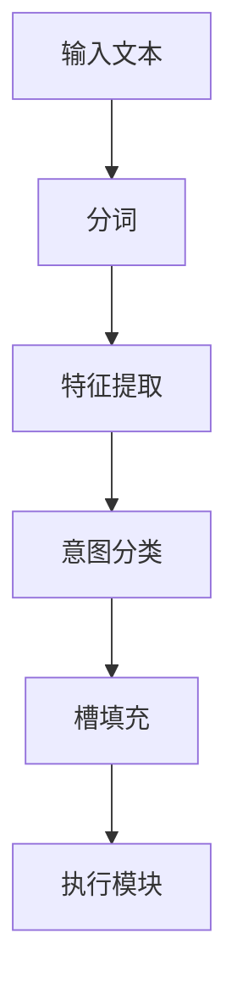

                 


# 构建AI Agent的对话意图识别系统

> 关键词：AI Agent，对话意图识别，自然语言处理，机器学习，深度学习

> 摘要：对话意图识别是构建AI Agent的核心技术之一，旨在理解用户在对话中的意图。本文从基础概念、算法原理到系统架构，详细探讨了如何构建一个高效准确的对话意图识别系统。通过对比分析传统算法与深度学习模型，结合实际项目案例，为读者提供从理论到实践的完整指南。

---

# 第一部分: 构建AI Agent的对话意图识别系统概述

---

## 第1章: 对话意图识别的背景与概述

### 1.1 对话意图识别的重要性

对话意图识别是人机交互中的关键环节，旨在理解用户在对话中的目标和需求。通过分析用户的输入，系统能够准确识别用户的意图，并执行相应的操作。

- **从人机交互到智能对话的演进**：早期的交互系统依赖于简单的关键词匹配，随着自然语言处理技术的发展，对话系统逐渐具备理解上下文和意图的能力。

- **对话意图识别的核心价值**：准确识别用户意图可以提升用户体验，降低误操作率，同时提高系统的智能化水平。

- **AI Agent在人机交互中的角色**：AI Agent不仅是信息的接收者和执行者，更是用户需求的洞察者和满足者。

---

### 1.2 对话意图识别的应用场景

对话意图识别技术广泛应用于多个领域：

- **智能客服**：通过识别用户的问题类型，自动匹配解决方案。
- **智能助手**：如Siri、Alexa，能够执行设置提醒、查询天气等任务。
- **智能音箱与智能家居**：通过语音指令控制家电或查询信息。

---

### 1.3 对话意图识别的技术挑战

尽管对话意图识别的重要性不言而喻，但其实现过程中面临诸多挑战：

- **数据多样性问题**：用户的表达方式多样，可能导致数据稀疏性。
- **语义理解的复杂性**：意图可能隐含在复杂的上下文中，难以直接识别。
- **实时性与准确性的平衡**：在实时对话中，系统需要在有限时间内完成意图识别。

---

### 1.4 AI Agent的基本概念

AI Agent是一种智能实体，能够感知环境并执行任务以满足用户需求。其核心要素包括：

- **感知能力**：通过传感器或输入接口获取信息。
- **推理能力**：基于获取的信息进行逻辑推理。
- **执行能力**：根据推理结果执行操作。

---

### 1.5 本章小结

本章从背景、应用、挑战和基本概念四个方面介绍了对话意图识别的重要性。理解这些内容是构建高效AI Agent的基础。

---

## 第2章: 对话意图识别的核心概念

### 2.1 对话意图识别的任务分类

对话意图识别的任务可以分为以下几类：

- **意图分类**：将对话内容归入预定义的意图类别。
- **意图检测**：识别对话中的具体意图。
- **意图槽填充**：在已识别的意图基础上，填充更多细节信息。

---

### 2.2 对话意图识别的关键技术

对话意图识别的关键技术包括：

- **自然语言处理（NLP）技术**：如分词、句法分析等。
- **机器学习与深度学习**：用于特征提取和模型训练。
- **预训练语言模型**：如BERT、GPT，能够捕捉上下文信息。

---

### 2.3 对话意图识别的特征工程

特征工程是意图识别的重要环节，常用的特征包括：

- **词袋模型**：将文本表示为词汇的集合。
- **TF-IDF特征**：基于词频和逆文档频率的加权。
- **语义向量特征**：如Word2Vec生成的词向量。

---

### 2.4 对话意图识别的评价指标

常用的评价指标包括：

- **准确率**：正确识别的样本数占总样本数的比例。
- **召回率**：正确识别的样本数占真实意图样本数的比例。
- **F1分数**：准确率和召回率的调和平均。

---

### 2.5 本章小结

本章详细介绍了对话意图识别的核心概念和技术，包括任务分类、关键技术、特征工程和评价指标。

---

## 第3章: 对话意图识别的算法原理

### 3.1 基于传统机器学习的算法

传统机器学习算法简单高效，适用于数据量较小的场景。

- **朴素贝叶斯算法**：基于条件概率的分类方法。
- **支持向量机（SVM）**：通过构建超平面实现分类。
- **决策树算法**：通过树状结构进行分类。

---

### 3.2 基于深度学习的算法

深度学习模型在复杂任务中表现更优。

- **循环神经网络（RNN）**：适合处理序列数据。
- **Transformer架构**：通过自注意力机制捕捉长距离依赖。
- **混合模型**：结合预训练语言模型和传统模型的优势。

---

### 3.3 对话意图识别的算法流程

算法流程包括数据预处理、特征提取、模型训练和评估。

- **数据预处理**：清洗、分词、去停用词。
- **特征提取**：将文本转换为数值表示。
- **模型训练**：基于训练数据优化模型参数。
- **模型评估**：通过测试集验证模型性能。

---

### 3.4 本章小结

本章详细探讨了对话意图识别的算法原理，从传统机器学习到深度学习，为后续实现提供理论基础。

---

## 第4章: 对话意图识别的数学模型与公式

### 4.1 基于条件概率的意图分类

条件概率公式如下：

$$ P(y|x) = \frac{P(x|y)P(y)}{P(x)} $$

其中，$y$ 表示意图类别，$x$ 表示输入文本。

---

### 4.2 深度学习模型的损失函数

常用的损失函数包括交叉熵损失：

$$ \text{Loss} = -\frac{1}{N}\sum_{i=1}^{N} \sum_{j=1}^{C} y_{ij} \log p_{ij} $$

其中，$N$ 表示样本数，$C$ 表示类别数。

---

### 4.3 模型训练与优化

训练过程中，通过反向传播算法优化模型参数：

$$ \theta_{\text{new}} = \theta_{\text{old}} - \eta \frac{\partial L}{\partial \theta} $$

其中，$\eta$ 表示学习率。

---

## 第5章: 对话意图识别的系统架构设计

### 5.1 系统功能设计

系统功能包括：

- **意图分类模块**：识别用户意图。
- **槽填充模块**：提取意图中的细节信息。
- **执行模块**：根据意图执行操作。

---

### 5.2 系统架构图



---

### 5.3 接口设计

系统接口包括：

- **输入接口**：接收用户输入的文本或语音信号。
- **输出接口**：返回意图识别结果或执行操作。

---

## 第6章: 对话意图识别的项目实战

### 6.1 环境安装

安装必要的库：

```bash
pip install numpy
pip install scikit-learn
pip install transformers
```

---

### 6.2 核心代码实现

基于BERT的意图分类代码示例：

```python
from transformers import BertTokenizer, BertModel
import torch

tokenizer = BertTokenizer.from_pretrained('bert-base-chinese')
model = BertModel.from_pretrained('bert-base-chinese')

def classify_intention(text):
    inputs = tokenizer(text, return_tensors='pt')
    outputs = model(**inputs)
    last_layer = outputs.last_hidden_state
    pooled_output = torch.mean(last_layer, dim=1)
    return pooled_output
```

---

### 6.3 案例分析

以智能客服为例，识别用户的意图并执行对应操作。

---

## 第7章: 对话意图识别的最佳实践与总结

### 7.1 小结

对话意图识别是构建AI Agent的关键技术，其准确性和实时性直接影响用户体验。

### 7.2 注意事项

- 数据质量直接影响模型性能。
- 模型调优需要结合实际场景需求。
- 需要关注模型的可解释性和透明度。

### 7.3 未来趋势

- 预训练语言模型的优化。
- 多模态意图识别的发展。
- 智能对话系统的实时性提升。

### 7.4 拓展阅读

推荐阅读《深度学习入门：基于Python的理论与实践》和《自然语言处理实战：基于Python的序列模型》。

---

## 本章小结

通过对对话意图识别的系统性探讨，本文为构建高效准确的AI Agent提供了理论和技术支持，为读者提供了从理论到实践的完整指南。

