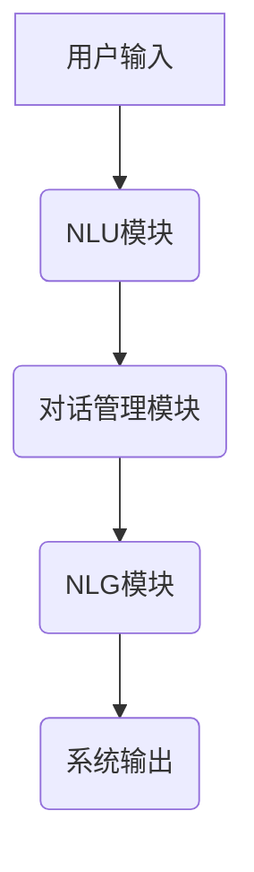
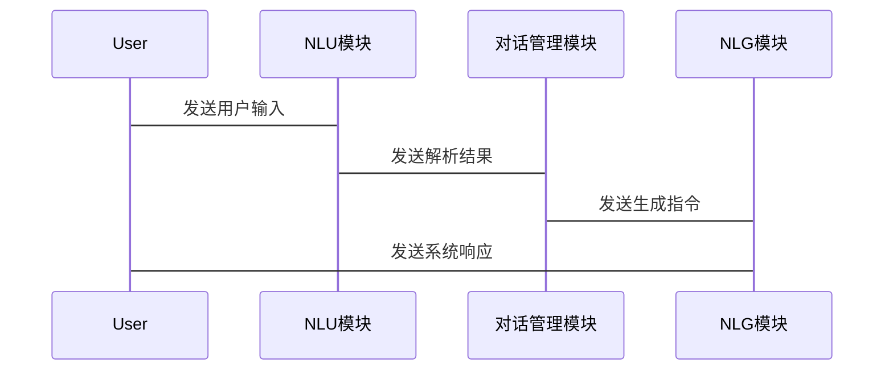

                 

# 构建AI Agent的对话管理系统

## 关键词：
AI Agent, 对话管理, 自然语言处理, 机器学习, 对话系统, 智能对话

## 摘要：
本文系统地探讨了构建AI Agent对话管理系统的各个方面，从基本概念到核心算法，从系统设计到实战部署。文章首先介绍了AI Agent的基本概念和对话管理系统的应用场景，然后深入分析了对话管理的核心概念与原理，包括自然语言理解（NLU）、自然语言生成（NLG）、对话状态管理与对话策略。接着，文章详细讲解了基于规则、统计和深度学习的对话管理算法，并通过数学公式和流程图对算法原理进行了深入剖析。随后，文章从系统架构设计、接口设计和交互设计的角度，详细阐述了对话管理系统的实现过程。最后，通过一个实际项目案例，展示了如何从环境搭建到代码实现，逐步构建一个完整的对话管理系统。本文还讨论了系统的优化与部署方法，并总结了构建AI Agent对话管理系统的最佳实践。

---

# 第1章: AI Agent对话管理系统的概述

## 1.1 AI Agent的基本概念
### 1.1.1 什么是AI Agent
AI Agent（人工智能代理）是一种能够感知环境、自主决策并执行任务的智能实体。它可以是一个软件程序，也可以是一个硬件设备，其核心目标是通过与用户或系统的交互，完成特定的任务或提供智能服务。

### 1.1.2 AI Agent的核心特征
- **智能性**：能够理解用户需求并生成合适的响应。
- **自主性**：无需外部干预，自主完成任务。
- **反应性**：能够实时感知环境并调整行为。
- **学习能力**：通过数据和经验不断优化自身的性能。

### 1.1.3 对话管理在AI Agent中的作用
对话管理是AI Agent与用户交互的核心模块，负责理解用户意图、维护对话上下文并生成合适的回应。

## 1.2 对话管理系统的应用场景
### 1.2.1 智能客服
通过对话管理系统，AI Agent可以自动处理用户的咨询、解决问题并提供帮助。

### 1.2.2 智能助手
例如Siri、Alexa等智能助手，通过对话管理系统与用户进行交互，完成日程管理、信息查询等任务。

### 1.2.3 智能对话机器人
在教育、医疗、金融等领域，对话管理系统可以构建智能对话机器人，提供个性化的服务。

## 1.3 对话管理系统的挑战与机遇
### 1.3.1 技术挑战
- 对话的理解和生成需要高精度的自然语言处理技术。
- 对话状态的维护需要复杂的状态管理算法。

### 1.3.2 应用机会
- 提升用户体验，降低人工成本。
- 开拓新的业务场景，如智能医疗、智能教育等。

### 1.3.3 未来趋势
- 多模态对话系统：结合视觉、听觉等多模态信息，提升对话的自然性和准确性。
- 跨语言对话系统：支持多语言对话，实现全球范围内的智能服务。

## 1.4 本章小结
本章介绍了AI Agent的基本概念和对话管理系统的应用场景，分析了对话管理系统面临的挑战与未来的发展趋势。

---

# 第2章: 对话管理系统的核心概念与原理

## 2.1 自然语言理解（NLU）与生成（NLG）
### 2.1.1 NLU的基本原理
NLU通过自然语言处理技术将用户的输入文本转化为结构化的信息，例如提取实体、意图等。

$$
\text{输入: } \text{"我需要预订一张去北京的机票"}
$$

$$
\text{输出: } \text{意图=预订机票，实体=北京}
$$

### 2.1.2 NLG的基本原理
NLG将结构化的信息转化为自然语言文本，例如生成回答、描述结果等。

$$
\text{输入: } \text{航班信息}
$$

$$
\text{输出: } \text{“航班CA1234将于明天上午10点从上海起飞。”}
$$

### 2.1.3 NLU与NLG的关系
NLU和NLG是对话管理系统的核心模块，NLU负责理解用户输入，NLG负责生成系统输出。

## 2.2 对话状态管理
### 2.2.1 对话上下文的表示
对话上下文可以通过状态变量表示，例如当前对话阶段、用户需求、系统响应等。

$$
\text{状态变量: } \text{stage, user\_intent, system\_response}
$$

### 2.2.2 对话状态的更新
根据用户的输入和系统响应，不断更新对话状态。

$$
\text{输入: } \text{“我需要经济舱”}
$$

$$
\text{更新后状态: } \text{stage=选择舱位，user\_intent=选择舱位}
$$

### 2.2.3 对话历史的存储与应用
对话历史用于记录过去的对话内容，帮助系统理解上下文。

## 2.3 对话策略
### 2.3.1 基于规则的对话策略
通过预定义的规则来生成系统响应，例如根据用户的意图选择相应的回复。

### 2.3.2 基于机器学习的对话策略
通过训练数据生成对话策略，例如使用深度学习模型预测最佳的系统响应。

### 2.3.3 基于强化学习的对话策略
通过强化学习优化对话策略，例如使用策略梯度算法最大化对话的奖励值。

## 2.4 本章小结
本章详细讲解了对话管理系统的核心概念，包括NLU、NLG、对话状态管理和对话策略，并分析了它们之间的关系。

---

# 第3章: 对话管理系统的算法原理

## 3.1 基于规则的对话管理算法
### 3.1.1 规则的定义与实现
通过预定义的规则来生成系统响应，例如：

$$
\text{规则: 如果用户意图是“预订机票”，则回复“请提供您的出发地和目的地。”}
$$

### 3.1.2 规则的优缺点
- 优点：实现简单，易于理解。
- 缺点：难以处理复杂场景，缺乏灵活性。

### 3.1.3 规则的适用场景
适用于简单的对话场景，例如客服自动应答。

## 3.2 基于统计的对话管理算法
### 3.2.1 统计模型的基本原理
通过统计方法计算对话的条件概率，选择最可能的系统响应。

$$
P(\text{系统响应}| \text{用户输入}) = \frac{\text{用户输入的频率}}{\text{总输入次数}}
$$

### 3.2.2 统计模型的实现步骤
1. 收集对话数据。
2. 计算条件概率。
3. 选择概率最高的系统响应。

### 3.2.3 统计模型的优缺点
- 优点：能够处理复杂场景。
- 缺点：依赖于数据质量，可能出现偏差。

## 3.3 基于深度学习的对话管理算法
### 3.3.1 神经网络的基本原理
通过深度学习模型（如Transformer）生成对话响应。

$$
\text{输入: } \text{用户输入}
$$

$$
\text{输出: } \text{系统响应}
$$

### 3.3.2 序列到序列模型的实现
使用序列到序列模型，将用户输入映射为系统响应。

### 3.3.3 基于Transformer的对话管理
基于Transformer模型的对话管理系统，通过自注意力机制捕捉对话中的关键信息。

## 3.4 对比分析
### 3.4.1 不同算法的对比表格
| 算法类型 | 优缺点 | 适用场景 |
|---------|--------|----------|
| 基于规则 | 实现简单，但缺乏灵活性 | 简单场景 |
| 基于统计 | 能处理复杂场景，但依赖数据质量 | 中等复杂度 |
| 基于深度学习 | 高精度，但实现复杂 | 复杂场景 |

### 3.4.2 算法选择的依据
根据具体场景的需求选择算法，简单场景使用规则或统计模型，复杂场景使用深度学习模型。

## 3.5 本章小结
本章分析了基于规则、统计和深度学习的对话管理算法，并通过对比分析帮助读者选择合适的算法。

---

# 第4章: 对话管理系统的数学模型与公式

## 4.1 基于概率论的对话模型
### 4.1.1 贝叶斯定理的应用
通过贝叶斯定理计算对话的条件概率。

$$
P(A|B) = \frac{P(B|A)P(A)}{P(B)}
$$

### 4.1.2 马尔可夫链的实现
通过马尔可夫链建模对话过程。

$$
P(x_t|x_{t-1}) = \text{转移概率}
$$

### 4.1.3 概率分布的计算
通过概率分布计算对话的生成概率。

## 4.2 基于神经网络的对话模型
### 4.2.1 Transformer模型的数学公式
Transformer模型的编码和解码过程。

$$
\text{编码器输入: } x_1, x_2, \ldots, x_n
$$

$$
\text{解码器输入: } y_1, y_2, \ldots, y_m
$$

### 4.2.2 注意力机制的数学推导
注意力机制的计算公式。

$$
\text{注意力权重: } \alpha_{ij} = \frac{\exp(s_{ij})}{\sum_{k} \exp(s_{ik})}
$$

### 4.2.3 损失函数的计算
使用交叉熵损失函数优化模型。

$$
\text{损失函数: } \mathcal{L} = -\sum_{i=1}^n y_i \log p(y_i)
$$

## 4.3 对话策略的优化算法
### 4.3.1 基于梯度下降的优化
使用梯度下降算法优化对话策略。

$$
\theta_{t+1} = \theta_t - \eta \nabla_{\theta} \mathcal{L}
$$

### 4.3.2 基于强化学习的优化
通过强化学习优化对话策略。

$$
\text{奖励函数: } R(s, a) = \text{奖励值}
$$

### 4.3.3 算法的收敛性分析
分析算法的收敛性，确保优化过程能够收敛到最优解。

## 4.4 本章小结
本章通过数学公式详细讲解了对话管理系统的算法原理，包括概率论模型和深度学习模型。

---

# 第5章: 对话管理系统的系统分析与架构设计

## 5.1 系统功能设计
### 5.1.1 用户需求分析
通过用户调研和需求分析，确定系统的功能需求。

### 5.1.2 系统功能模块划分
将系统划分为NLU模块、对话管理模块、NLG模块等。

### 5.1.3 系统功能流程
通过流程图展示系统的功能流程。

## 5.2 系统架构设计
### 5.2.1 系统架构的分层设计
将系统划分为数据层、业务逻辑层和用户界面层。

### 5.2.2 系统架构的模块划分
模块包括NLU模块、对话管理模块、NLG模块、用户界面模块等。

### 5.2.3 系统架构的通信方式
通过RESTful API实现模块之间的通信。

## 5.3 系统接口设计
### 5.3.1 接口定义
定义NLU模块和对话管理模块之间的接口。

### 5.3.2 接口实现
通过JSON格式传递数据。

## 5.4 系统交互设计
### 5.4.1 交互流程
通过序列图展示系统的交互流程。

## 5.5 本章小结
本章详细讲解了对话管理系统的系统分析与架构设计，包括功能设计、架构设计、接口设计和交互设计。

---

# 第6章: 对话管理系统的优化与部署

## 6.1 系统优化
### 6.1.1 数据优化
通过数据增强、数据清洗等方法优化训练数据。

### 6.1.2 模型优化
通过调整超参数、优化算法等方法提升模型性能。

### 6.1.3 系统优化
通过优化代码、减少资源消耗等方法提升系统的运行效率。

## 6.2 系统部署
### 6.2.1 环境搭建
安装必要的依赖库，例如Python、TensorFlow等。

### 6.2.2 服务部署
通过Flask或Django等框架搭建对话管理系统的Web服务。

### 6.2.3 容器化部署
使用Docker容器化部署系统，确保系统的稳定性和可扩展性。

## 6.3 本章小结
本章讨论了对话管理系统的优化与部署方法，包括数据优化、模型优化、系统优化和服务部署。

---

# 第7章: 总结与展望

## 7.1 本章总结
本文系统地探讨了构建AI Agent对话管理系统的各个方面，从基本概念到核心算法，从系统设计到实战部署。

## 7.2 未来展望
未来，对话管理系统将朝着多模态、多语言、个性化方向发展，同时需要进一步提升系统的可解释性和安全性。

## 7.3 注意事项
在实际应用中，需要注意数据隐私、模型鲁棒性等问题。

## 7.4 拓展阅读
推荐读者阅读相关领域的经典论文和书籍，进一步深入学习对话管理系统的实现与优化。

## 7.5 本章小结
本章总结了全文的主要内容，并展望了对话管理系统的未来发展方向。

---

# 参考文献
（此处列出相关文献和资源）

---

# 附录
（此处列出代码示例和补充材料）

