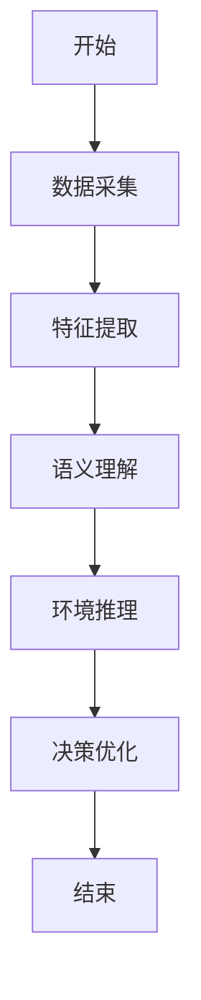
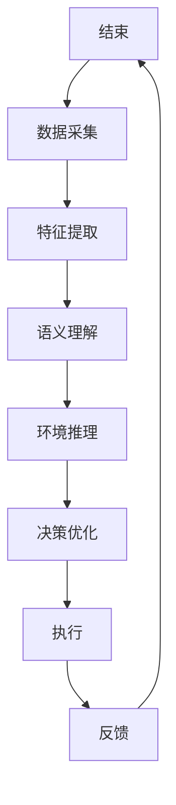
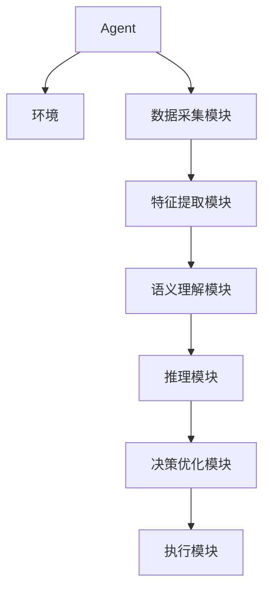
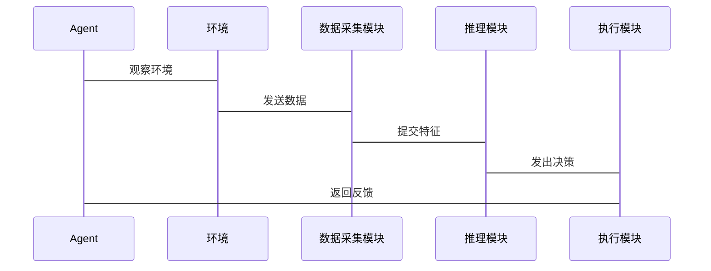

                 


# 构建AI Agent的情境感知能力：环境适应性

## 关键词：AI Agent，情境感知能力，环境适应性，动态环境，实时反馈，自适应系统，多模态数据

## 摘要：  
本文深入探讨了构建AI Agent情境感知能力的核心技术与方法，重点分析了环境适应性在动态复杂环境中的实现路径。文章从背景介绍、核心概念、算法原理、系统架构到项目实战，全面解析了AI Agent如何通过多模态数据处理、实时反馈机制和自适应推理能力实现对环境的精准感知与智能应对。通过对具体案例的分析，本文为读者提供了从理论到实践的完整指导，帮助开发者构建具备高度环境适应性的AI Agent系统。

---

## 第1章：背景介绍

### 1.1 问题背景

#### 1.1.1 AI Agent的定义与特点  
AI Agent（人工智能代理）是指能够感知环境、自主决策并执行任务的智能体。其核心特点包括：  
1. **自主性**：无需外部干预，自主完成任务。  
2. **反应性**：能够实时感知环境变化并做出反应。  
3. **目标导向性**：基于目标驱动行为。  
4. **学习能力**：通过数据和经验不断优化性能。  

#### 1.1.2 情境感知能力的定义与重要性  
情境感知能力是指AI Agent能够理解当前环境状态、识别场景特征并预测未来趋势的能力。它是AI Agent实现环境适应性的基础，决定了其在动态复杂环境中的表现。  

#### 1.1.3 当前AI Agent在环境适应性中的挑战  
1. **动态环境的不确定性**：环境状态不断变化，AI Agent需要快速调整策略。  
2. **多模态数据的融合**：来自不同传感器的数据（如视觉、听觉、文本）需要高效融合。  
3. **实时性要求高**：在某些场景（如自动驾驶）中，延迟可能导致严重后果。  

---

### 1.2 问题描述

#### 1.2.1 情境感知能力的核心问题  
- 如何从多源异构数据中提取有用信息？  
- 如何构建动态环境下的实时反馈机制？  
- 如何实现感知与决策的快速耦合？  

#### 1.2.2 环境适应性中的关键挑战  
1. **环境的动态性**：环境状态的快速变化需要AI Agent具备快速响应能力。  
2. **数据的不完整性**：部分数据缺失可能影响感知准确性。  
3. **决策的鲁棒性**：在不确定性环境中，决策需要具备较强的鲁棒性。  

#### 1.2.3 情境感知能力与AI Agent的结合  
情境感知能力是AI Agent实现环境适应性的关键，通过感知环境信息、理解场景特征并做出智能决策，AI Agent能够在复杂环境中完成任务。

---

### 1.3 问题解决

#### 1.3.1 情境感知能力的实现方法  
1. **多模态数据融合**：整合视觉、听觉、文本等多种数据源，提升感知精度。  
2. **实时反馈机制**：通过传感器和执行器的闭环反馈，实现快速调整。  
3. **动态推理模型**：基于实时数据构建动态推理模型，预测环境变化。  

#### 1.3.2 环境适应性技术的创新点  
1. **动态感知算法**：基于深度学习的实时感知技术，提升环境适应性。  
2. **多模态数据处理**：通过融合多种数据源，提升感知的全面性。  
3. **自适应决策模型**：结合强化学习和迁移学习，增强决策的鲁棒性。  

#### 1.3.3 情境感知能力的实现路径  
1. 数据采集与预处理：获取多模态数据并进行标准化处理。  
2. 感知模型构建：基于深度学习构建感知模型。  
3. 实时推理与决策：结合动态环境进行实时推理和决策优化。  

---

### 1.4 边界与外延

#### 1.4.1 情境感知能力的边界  
- 感知范围：AI Agent只能感知其传感器覆盖的范围。  
- 理解深度：受限于模型能力，可能无法完全理解复杂场景。  

#### 1.4.2 环境适应性的外延  
- 系统扩展性：支持多种环境和任务场景的扩展。  
- 跨领域应用：情境感知能力可以应用于自动驾驶、智能助手、机器人等多种场景。  

#### 1.4.3 相关概念的对比与区分  
1. **情境感知与环境建模**：情境感知侧重于实时感知，环境建模侧重于构建环境模型。  
2. **动态环境与静态环境**：动态环境强调变化性，静态环境强调稳定性。  

---

### 1.5 核心概念结构与组成

#### 1.5.1 情境感知能力的核心要素  
1. **感知模块**：负责数据采集与初步分析。  
2. **理解模块**：负责场景特征提取与语义理解。  
3. **推理模块**：负责环境变化预测与决策优化。  

#### 1.5.2 环境适应性的组成模块  
1. **实时反馈机制**：通过传感器和执行器实现闭环控制。  
2. **动态推理模型**：基于实时数据构建动态推理模型。  
3. **自适应决策系统**：根据环境变化动态调整决策策略。  

#### 1.5.3 核心概念的结构化分析  
通过构建层次化的概念框架，明确各模块之间的关系与作用。

---

## 第2章：情境感知能力的核心原理

### 2.1 情境感知的原理分析

#### 2.1.1 感知机制的原理  
- **多模态数据融合**：通过多种传感器（如摄像头、麦克风、GPS）获取数据，结合特征提取技术进行融合。  
- **实时性要求**：感知过程需要在极短的时间内完成，以适应动态环境。  

#### 2.1.2 理解机制的原理  
- **语义理解**：通过自然语言处理技术（如BERT）对文本数据进行语义分析。  
- **场景特征提取**：基于深度学习模型（如CNN、RNN）提取场景特征。  

#### 2.1.3 推理机制的原理  
- **动态预测**：基于时间序列模型（如LSTM）预测未来环境变化。  
- **因果推理**：通过因果关系模型分析环境变化的驱动因素。  

#### 2.1.4 自适应机制的原理  
- **强化学习**：通过强化学习算法（如Q-Learning）优化决策策略。  
- **迁移学习**：将已知环境的知识迁移到未知环境，提升适应性。  

---

### 2.2 核心概念的对比分析

#### 2.2.1 不同情境感知方法的特征对比（表格形式）  

| 方法               | 优点                           | 缺点                           |
|--------------------|--------------------------------|---------------------------------|
| 基于规则的方法     | 实现简单，易于解释             | 无法应对复杂动态环境           |
| 基于统计的方法     | 能够处理大量数据               | 对特征工程依赖较高             |
| 基于深度学习的方法 | 表现能力强，能够处理复杂模式   | 计算资源消耗大，需要大量数据   |

#### 2.2.2 不同环境适应性技术的优缺点对比（表格形式）  

| 技术               | 优点                           | 缺点                           |
|--------------------|--------------------------------|---------------------------------|
| 实时反馈机制       | 响应速度快，能够快速调整策略   | 实时性要求高，可能引入延迟     |
| 自适应决策系统     | 决策灵活，适应性强             | 需要复杂算法支持，计算开销大   |
| 多模态数据处理     | 提升感知精度                   | 数据融合难度大，需协调不同模态 |

---

### 2.3 实体关系图与流程图

#### 2.3.1 情境感知能力的ER实体关系图

```mermaid
erDiagram
    agent {
        id
        name
        state
    }
    environment {
        id
        type
        status
    }
    perception {
        id
        data
        timestamp
    }
    agent --> environment : operates in
    agent --> perception : observes
    environment --> perception : emits
```

#### 2.3.2 情境感知能力的流程图



---

## 第3章：算法原理

### 3.1 感知算法

#### 3.1.1 多模态数据融合算法  
- **算法流程**：  
  1. 数据预处理：对多模态数据进行标准化和增强处理。  
  2. 特征提取：分别提取各模态的特征向量。  
  3. 融合：使用注意力机制或加权融合方法将特征向量进行融合。  

#### 3.1.2 实现代码  
```python
import numpy as np

def multi_modal_fusion(modalities):
    # 假设 modalities 是一个字典，包含不同模态的特征向量
    features = []
    for modality in modalities.values():
        features.append(modality['features'])
    # 使用加权融合
    weights = np.random.rand(len(modalities))
    fused_feature = np.average(features, axis=0, weights=weights/np.sum(weights))
    return fused_feature
```

---

#### 3.1.3 数学模型与公式  
$$
\text{融合特征} = \sum_{i=1}^{n} w_i x_i
$$  
其中，$w_i$ 是模态 $i$ 的权重，$x_i$ 是模态 $i$ 的特征向量。

---

### 3.2 理解算法

#### 3.2.1 语义理解算法  
- **算法流程**：  
  1. 文本预处理：分词、去停用词。  
  2. 语义表示：使用BERT模型生成语义向量。  
  3. 语义匹配：计算语义向量的相似度，判断语义是否匹配。  

#### 3.2.2 实现代码  
```python
import transformers

model = transformers.BertTokenizer.from_pretrained('bert-base-cased')
inputs = model.encode_plus(text, return_tensors='pt', padding=True, truncation=True)
outputs = model.bert(inputs['input_ids'], attention_mask=inputs['attention_mask'])
```

---

#### 3.2.3 数学模型与公式  
$$
\text{相似度} = \cos(\theta_1, \theta_2)
$$  
其中，$\theta_1$ 和 $\theta_2$ 是两个文本的语义向量夹角。

---

### 3.3 推理算法

#### 3.3.1 动态预测算法  
- **算法流程**：  
  1. 数据预处理：将历史数据转化为时间序列。  
  2. 模型训练：使用LSTM进行时间序列建模。  
  3. 预测：基于当前状态预测未来趋势。  

#### 3.3.2 实现代码  
```python
import torch
import torch.nn as nn

class LSTM(nn.Module):
    def __init__(self, input_size, hidden_size):
        super(LSTM, self).__init__()
        self.lstm = nn.LSTM(input_size, hidden_size)
        self.linear = nn.Linear(hidden_size, 1)
    
    def forward(self, x):
        out, _ = self.lstm(x)
        out = self.linear(out[-1])
        return out
```

---

#### 3.3.3 数学模型与公式  
$$
y_t = \alpha y_{t-1} + \beta x_t + \gamma
$$  
其中，$y_t$ 是预测值，$y_{t-1}$ 是前一时刻的值，$x_t$ 是当前输入，$\alpha$、$\beta$、$\gamma$ 是模型参数。

---

## 第4章：系统分析与架构设计

### 4.1 问题场景介绍

#### 4.1.1 项目介绍  
- **项目目标**：构建一个具备环境适应性的AI Agent系统。  
- **项目范围**：支持多种环境和任务场景，具备实时反馈机制。  

#### 4.1.2 问题场景  
- **动态环境**：环境状态不断变化，AI Agent需要实时调整策略。  
- **多模态数据**：需要处理多种类型的数据源。  
- **实时反馈**：系统需要快速响应用户的指令并反馈结果。  

---

### 4.2 系统功能设计

#### 4.2.1 系统功能模块  
1. **数据采集模块**：负责采集多模态数据。  
2. **感知模块**：对数据进行预处理和特征提取。  
3. **理解模块**：进行语义分析和场景理解。  
4. **推理模块**：预测环境变化并优化决策。  
5. **执行模块**：根据决策结果执行动作。  

#### 4.2.2 系统功能流程图  



---

### 4.3 系统架构设计

#### 4.3.1 系统架构图  



---

### 4.4 系统接口设计

#### 4.4.1 接口描述  
1. **数据接口**：提供传感器数据的读取接口。  
2. **推理接口**：提供环境推理和决策优化的API。  
3. **执行接口**：提供动作执行的控制接口。  

---

### 4.5 系统交互序列图  



---

## 第5章：项目实战

### 5.1 环境安装

#### 5.1.1 项目依赖  
1. Python 3.8+  
2. PyTorch  
3. Transformers  
4. Mermaid  

#### 5.1.2 安装步骤  
```bash
pip install numpy torch transformers mermaid
```

---

### 5.2 系统核心实现

#### 5.2.1 感知模块实现  
```python
import numpy as np

def multi_modal_fusion(modalities):
    features = []
    for modality in modalities.values():
        features.append(modality['features'])
    weights = np.random.rand(len(modalities))
    fused_feature = np.average(features, axis=0, weights=weights/np.sum(weights))
    return fused_feature
```

---

#### 5.2.2 语义理解模块实现  
```python
import transformers

model = transformers.BertTokenizer.from_pretrained('bert-base-cased')
inputs = model.encode_plus(text, return_tensors='pt', padding=True, truncation=True)
outputs = model.bert(inputs['input_ids'], attention_mask=inputs['attention_mask'])
```

---

#### 5.2.3 推理模块实现  
```python
import torch
import torch.nn as nn

class LSTM(nn.Module):
    def __init__(self, input_size, hidden_size):
        super(LSTM, self).__init__()
        self.lstm = nn.LSTM(input_size, hidden_size)
        self.linear = nn.Linear(hidden_size, 1)
    
    def forward(self, x):
        out, _ = self.lstm(x)
        out = self.linear(out[-1])
        return out
```

---

### 5.3 实际案例分析

#### 5.3.1 案例背景  
假设我们正在构建一个智能助手AI Agent，需要在动态办公环境中实现情境感知能力。  

#### 5.3.2 案例分析  
1. **数据采集**：通过摄像头和麦克风采集办公环境的图像和声音数据。  
2. **特征提取**：使用CNN提取图像特征，使用MFCC提取音频特征。  
3. **语义理解**：对用户指令进行语义分析，生成相应的执行指令。  
4. **环境推理**：预测办公环境的未来变化，优化决策策略。  

---

## 第6章：最佳实践

### 6.1 小结

#### 6.1.1 核心知识点回顾  
- 情境感知能力是AI Agent实现环境适应性的关键。  
- 多模态数据融合、实时反馈机制和自适应推理是实现环境适应性的核心技术。  

#### 6.1.2 实践中的注意事项  
1. 数据质量：确保数据采集的准确性和完整性。  
2. 模型优化：不断优化感知和推理模型，提升性能。  
3. 实时性保障：确保系统在动态环境中能够快速响应。  

---

### 6.2 注意事项

#### 6.2.1 数据安全与隐私保护  
在处理多模态数据时，需要注意数据的安全性和隐私保护。  

#### 6.2.2 系统的可扩展性  
设计系统时，需要考虑未来可能的扩展需求。  

#### 6.2.3 系统的鲁棒性  
在复杂动态环境中，系统需要具备较强的鲁棒性，以应对各种异常情况。  

---

### 6.3 拓展阅读

#### 6.3.1 相关技术领域  
1. 多模态数据处理技术  
2. 实时反馈机制设计  
3. 动态环境下的强化学习  

#### 6.3.2 推荐书籍与论文  
1. 《Deep Learning》——Ian Goodfellow  
2. 《Reinforcement Learning: Theory and Algorithms》——Sutton, Richard S., and Andrew G. Barto  

---

## 第7章：未来展望

### 7.1 情境感知能力的发展趋势

#### 7.1.1 技术进步  
- 更高效的多模态数据处理算法。  
- 更强大的实时推理模型。  

#### 7.1.2 应用场景扩展  
- 智能驾驶：更复杂的环境感知能力。  
- 智能机器人：更高的环境适应性。  

---

### 7.2 环境适应性技术的挑战与机遇

#### 7.2.1 挑战  
1. 多模态数据的高效融合。  
2. 动态环境下的实时性要求。  
3. 系统的可解释性与透明性。  

#### 7.2.2 机遇  
1. 新算法的出现：如生成式AI和大语言模型的引入。  
2. 计算能力的提升：如GPU和TPU的普及。  

---

## 总结  

构建AI Agent的情境感知能力是一项复杂而具有挑战性的任务，但其在各个领域的广泛应用前景广阔。通过本文的深入分析，我们了解了情境感知能力的核心原理、算法实现和系统设计，同时通过实际案例展示了如何将理论应用于实践。未来，随着技术的不断进步，AI Agent的情境感知能力将更加智能化和多样化，为人类社会的发展带来更大的价值。

