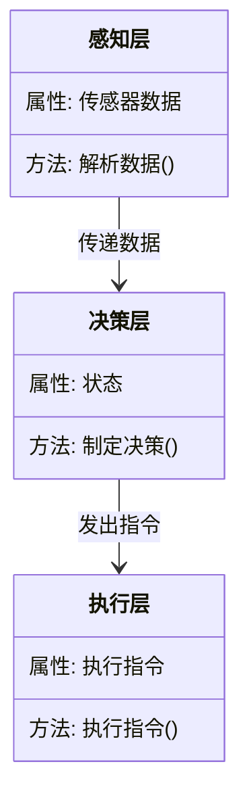

                 


# 构建AI Agent的技术栈选择：权衡与决策

## 关键词：AI Agent、技术栈、权衡、决策、算法、架构设计

## 摘要：构建AI Agent涉及多方面的技术栈选择，每个选择都需权衡性能、可扩展性、开发效率和成本。本文系统性地分析AI Agent的核心概念、算法原理、系统架构，并通过实例展示技术栈的选择过程，为读者提供清晰的决策路径。

---

## 第1章: AI Agent基础概念与问题背景

### 1.1 AI Agent的定义与核心特征

AI Agent是一种智能体，能够感知环境并采取行动以实现目标。其核心特征包括自主性、反应性、目标导向和情境感知。AI Agent广泛应用于自动驾驶、智能助手、机器人等领域。

### 1.2 技术栈选择的背景与问题描述

在构建AI Agent时，选择合适的技术栈至关重要。不同的算法和框架在性能、开发效率和可扩展性上各有优劣。本文将分析这些因素，帮助读者做出明智的选择。

---

## 第2章: AI Agent技术栈的核心概念与联系

### 2.1 AI Agent的组成部分

AI Agent由感知层、决策层和执行层组成。感知层通过传感器收集数据，决策层基于数据做出决策，执行层负责执行决策。

### 2.2 核心概念的属性对比

| 技术栈 | 优点 | 缺点 |
|--------|------|------|
| 强化学习 | 高效性 | 需大量数据 |
| 监督学习 | 简单 | 依赖标注数据 |

### 2.3 实体关系图（ER图）

```mermaid
erDiagram
    actor 用户 {
        string 用户ID
        string 用户名
        string 用户角色
    }
    actor 系统 {
        string 系统ID
        string 系统名称
        string 系统版本
    }
    actor 服务提供方 {
        string 服务提供方ID
        string 服务名称
        string 服务版本
    }
    用户 --> 系统 : 使用
    系统 --> 服务提供方 : 依赖
```

---

## 第3章: AI Agent的算法原理

### 3.1 强化学习算法

#### 3.1.1 Q-learning算法

Q-learning是一种基于值的强化学习算法，通过更新Q表来学习最优策略。

$$ Q(s, a) = r + \gamma \max_{a'} Q(s', a') $$

#### 3.1.2 DQN算法

DQN结合深度神经网络和Q-learning，通过经验回放和目标网络提升性能。

### 3.2 监督学习算法

#### 3.2.1 线性回归

线性回归用于预测目标变量与特征变量之间的线性关系。

$$ y = \beta x + \epsilon $$

---

## 第4章: AI Agent的系统架构设计

### 4.1 项目场景介绍

设计一个AI Agent用于自动驾驶，需要实时处理传感器数据并做出驾驶决策。

### 4.2 系统功能设计



---

## 第5章: 项目实战

### 5.1 环境安装

安装Python、TensorFlow和OpenCV等库。

```bash
pip install numpy tensorflow
```

### 5.2 核心代码实现

实现一个简单的强化学习AI Agent。

```python
import numpy as np
import tensorflow as tf

model = tf.keras.Sequential([
    tf.keras.layers.Dense(64, activation='relu'),
    tf.keras.layers.Dense(10, activation='softmax')
])
model.compile(optimizer='adam', loss='sparse_categorical_crossentropy', metrics=['accuracy'])
model.fit(x_train, y_train, epochs=10)
```

### 5.3 案例分析

分析AI Agent在自动驾驶中的应用，讨论算法选择和系统设计的影响。

### 5.4 项目总结

总结项目经验，强调技术栈选择的重要性。

---

## 第6章: 最佳实践与小结

### 6.1 注意事项

选择技术栈时，需考虑性能、可扩展性和开发效率。

### 6.2 未来展望

随着技术进步，AI Agent将更加智能化和高效。

### 6.3 拓展阅读

推荐阅读《深度学习》和《强化学习入门》。

---

通过以上内容，我们系统性地分析了构建AI Agent的技术栈选择，帮助读者做出明智的决策。希望本文能为AI Agent的开发提供有价值的参考。

