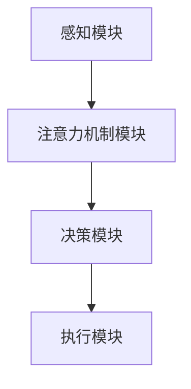

                 


# 构建AI Agent的注意力机制设计

> 关键词：AI Agent，注意力机制，深度学习，自然语言处理，强化学习，系统架构，项目实战

> 摘要：本文深入探讨AI Agent的注意力机制设计，从理论到实践，系统地分析其核心概念、算法原理、系统架构及项目实现。通过详细讲解和案例分析，帮助读者全面理解并掌握注意力机制在AI Agent中的应用。

---

# 正文

## 第一部分：AI Agent与注意力机制的背景介绍

### 第1章：AI Agent与注意力机制概述

#### 1.1 AI Agent的基本概念

##### 1.1.1 什么是AI Agent
AI Agent（人工智能代理）是一种能够感知环境、做出决策并执行任务的智能体。它通过传感器获取信息，利用计算模型处理信息，并通过执行器与环境交互。

##### 1.1.2 AI Agent的核心特点
- **自主性**：无需外部干预，自主决策。
- **反应性**：实时感知环境并做出响应。
- **目标导向**：基于目标驱动行为。
- **社会性**：能够与其他Agent或人类交互协作。

##### 1.1.3 AI Agent的应用场景
- **自然语言处理**：如智能对话系统。
- **计算机视觉**：如自动驾驶。
- **游戏AI**：如智能NPC。
- **机器人控制**：如工业自动化。

#### 1.2 注意力机制的基本概念

##### 1.2.1 注意力机制的定义
注意力机制是一种模拟人类注意力的选择性关注机制，用于在信息处理中聚焦关键部分，提升处理效率和准确性。

##### 1.2.2 注意力机制的核心原理
注意力机制通过计算输入数据中各部分的相关性，生成权重分布，以决定哪些信息应被重点关注。

##### 1.2.3 注意力机制在AI Agent中的作用
- **信息筛选**：在大量数据中筛选关键信息。
- **决策优化**：通过关注关键信息提升决策质量。
- **资源分配**：合理分配计算资源。

#### 1.3 本章小结
本章介绍了AI Agent的基本概念及其应用场景，并详细阐述了注意力机制的定义和作用，为后续内容打下基础。

---

## 第二部分：注意力机制的核心概念与联系

### 第2章：注意力机制的核心原理

#### 2.1 注意力机制的数学模型

##### 2.1.1 注意力机制的数学公式
注意力机制的核心公式为：
$$
\text{Attention}(Q, K, V) = \text{softmax}\left(\frac{QK^T}{\sqrt{d_k}}\right)V
$$
其中，$Q$、$K$、$V$分别为查询、键、值矩阵，$d_k$为键的维度。

##### 2.1.2 注意力机制的计算流程
1. **查询、键、值的计算**：通过线性变换将输入数据分解为查询、键、值。
2. **计算相似度**：通过点积计算各元素之间的相似度。
3. **生成权重**：使用Softmax函数归一化相似度，生成注意力权重。
4. **加权求和**：根据权重对值进行加权求和，得到最终结果。

##### 2.1.3 注意力机制的实现方式
- **自注意力机制**：用于序列数据，计算每个位置与其他位置的注意力。
- **交叉注意力机制**：用于跨模态数据，如图像和文本之间的交互。

#### 2.2 注意力机制与AI Agent的关系

##### 2.2.1 注意力机制在AI Agent中的应用
- **自然语言处理**：如对话系统中的语义理解。
- **视觉处理**：如图像识别中的关键区域关注。
- **多任务学习**：如同时处理多种任务时的资源分配。

##### 2.2.2 注意力机制对AI Agent性能的提升
- **提升准确性**：通过关注关键信息提高模型准确率。
- **减少计算开销**：通过权重分配优化计算效率。
- **增强可解释性**：注意力权重可帮助理解模型决策过程。

##### 2.2.3 注意力机制的优化方法
- **多头注意力**：通过并行计算多个注意力头，提升模型表达能力。
- **位置编码**：在序列模型中引入位置信息，增强模型对顺序的敏感性。

#### 2.3 本章小结
本章详细讲解了注意力机制的数学模型和计算流程，并分析了其在AI Agent中的应用和优化方法。

---

## 第三部分：注意力机制的算法原理与实现

### 第3章：注意力机制的算法原理

#### 3.1 注意力机制的算法流程

##### 3.1.1 输入处理
将输入数据转化为查询、键、值矩阵。

##### 3.1.2 查询、键、值的计算
通过线性变换生成查询、键、值。

##### 3.1.3 注意力权重的计算
计算相似度并生成权重。

##### 3.1.4 加权求和与输出
根据权重对值进行加权求和，输出结果。

#### 3.2 注意力机制的优化算法

##### 3.2.1 多头注意力机制
多头注意力通过并行计算多个头，提升模型的表达能力。

##### 3.2.2 层次化注意力机制
层次化注意力通过分层计算，增强模型对复杂结构的捕捉能力。

##### 3.2.3 位置编码与注意力机制的结合
通过引入位置编码，增强模型对顺序信息的敏感性。

#### 3.3 本章小结
本章详细讲解了注意力机制的算法流程和优化方法，为后续实现打下基础。

---

## 第四部分：注意力机制的系统分析与架构设计

### 第4章：AI Agent注意力机制的系统分析

#### 4.1 问题场景介绍

##### 4.1.1 问题背景
在复杂的环境中，AI Agent需要高效处理多源信息。

##### 4.1.2 问题描述
如何在多任务环境下优化注意力分配，提升决策效率。

##### 4.1.3 问题解决思路
引入注意力机制，动态分配计算资源，关注关键信息。

#### 4.2 系统功能设计

##### 4.2.1 领域模型设计
- **输入处理模块**：解析输入数据，生成查询、键、值。
- **注意力计算模块**：计算注意力权重，生成加权结果。
- **决策模块**：基于加权结果做出决策。

##### 4.2.2 系统功能模块划分
- **感知模块**：获取环境信息。
- **注意力机制模块**：处理信息，生成权重。
- **决策模块**：基于权重结果做出决策。
- **执行模块**：执行决策动作。

##### 4.2.3 功能模块之间的关系
各模块协同工作，感知环境信息，通过注意力机制处理信息，生成决策，最终执行动作。

#### 4.3 系统架构设计

##### 4.3.1 系统架构图


##### 4.3.2 系统组件之间的交互关系
感知模块将环境信息传递给注意力机制模块，计算权重后传递给决策模块，最终由执行模块执行动作。

##### 4.3.3 系统接口设计
- **输入接口**：接收环境信息。
- **输出接口**：输出决策结果。
- **内部接口**：模块之间的数据交互接口。

#### 4.4 本章小结
本章分析了AI Agent注意力机制的系统架构，并通过图表展示了各模块的关系和交互流程。

---

## 第五部分：注意力机制的项目实战

### 第5章：注意力机制的实现与应用

#### 5.1 环境安装与配置

##### 5.1.1 开发环境的选择
推荐使用Python 3.8及以上版本，安装必要的库如TensorFlow、PyTorch。

##### 5.1.2 Python库的安装
```bash
pip install numpy tensorflow
```

##### 5.1.3 环境配置注意事项
确保GPU支持，安装NVIDIA显卡驱动和对应的TensorFlow GPU版本。

#### 5.2 系统核心实现

##### 5.2.1 注意力机制的代码实现
```python
import numpy as np

def attention(Q, K, V, d_k):
    # 计算相似度
    scores = np.dot(Q, K.T) / np.sqrt(d_k)
    # 计算权重
    weights = np.softmax(scores, axis=-1)
    # 加权求和
    output = np.dot(weights, V)
    return output

# 示例数据
Q = np.random.randn(1, 5, 10)
K = np.random.randn(1, 5, 10)
V = np.random.randn(1, 5, 10)
d_k = 10

output = attention(Q, K, V, d_k)
print(output)
```

##### 5.2.2 多头注意力机制的实现
```python
def multi_head_attention(Q, K, V, num_heads, d_k):
    # 分头
    head_Q = Q
    head_K = K
    head_V = V
    # 计算相似度和权重
    scores = np.dot(head_Q, head_K.T) / np.sqrt(d_k)
    weights = np.softmax(scores, axis=-1)
    # 加权求和
    output = np.dot(weights, head_V)
    # 合并头
    output = output.reshape(-1, num_heads, d_k)
    return output

# 示例数据
Q = np.random.randn(1, 5, 20)
K = np.random.randn(1, 5, 20)
V = np.random.randn(1, 5, 20)
num_heads = 2
d_k = 10

output = multi_head_attention(Q, K, V, num_heads, d_k)
print(output)
```

#### 5.3 项目实战案例分析

##### 5.3.1 案例背景
设计一个基于自然语言处理的AI对话系统。

##### 5.3.2 实现步骤
1. **数据预处理**：将对话文本转化为词向量。
2. **注意力机制设计**：实现多头注意力机制。
3. **模型训练**：使用训练数据优化模型参数。
4. **系统集成**：将模型集成到对话系统中。

##### 5.3.3 代码实现与分析
```python
# 数据预处理
def text_to_vector(text, vocab):
    return [vocab[word] for word in text.split()]

# 注意力机制实现
class MultiHeadAttention:
    def __init__(self, d_model, num_heads):
        self.num_heads = num_heads
        self.d_k = d_model // num_heads
        self.W_q = np.random.randn(d_model, d_model)
        self.W_k = np.random.randn(d_model, d_model)
        self.W_v = np.random.randn(d_model, d_model)
        self.W_o = np.random.randn(d_model, d_model)

    def forward(self, x):
        batch_size, n, d_model = x.shape
        # 分头
        Q = x @ self.W_q
        K = x @ self.W_k
        V = x @ self.W_v
        # 展开维度
        Q = Q.reshape(batch_size, n, self.num_heads, self.d_k)
        K = K.reshape(batch_size, n, self.num_heads, self.d_k)
        V = V.reshape(batch_size, n, self.num_heads, self.d_k)
        # 计算相似度
        scores = (Q @ K.transpose(-2, -1)) / np.sqrt(self.d_k)
        weights = np.softmax(scores, axis=-1)
        # 加权求和
        output = (V @ weights).reshape(batch_size, n, self.num_heads, self.d_k)
        # 合并头
        output = output @ self.W_o
        return output
```

##### 5.3.4 项目小结
通过案例分析，展示了如何将注意力机制应用于实际项目，并详细讲解了实现步骤和代码。

---

## 第六部分：最佳实践与未来展望

### 第6章：最佳实践与未来展望

#### 6.1 小结
本文系统地探讨了AI Agent注意力机制的设计，从理论到实践，详细讲解了其核心概念、算法原理、系统架构和项目实现。

#### 6.2 注意事项
- **数据质量**：确保输入数据的质量，避免噪声干扰。
- **计算效率**：优化注意力机制的计算流程，降低计算开销。
- **模型可解释性**：通过可视化注意力权重，增强模型的可解释性。

#### 6.3 未来展望
- **更复杂的注意力机制**：如动态注意力、自适应注意力。
- **跨模态注意力**：在多模态数据处理中应用注意力机制。
- **边缘计算中的应用**：在边缘计算环境下优化注意力机制的资源分配。

---

## 结语

通过本文的详细讲解，读者可以全面理解AI Agent注意力机制的设计与实现。从理论到实践，本文为读者提供了丰富的知识和实用的代码示例，帮助他们在实际项目中有效应用注意力机制，提升AI Agent的性能和效率。

---

## 参考文献

- Vaswani, A., et al. "Attention Is All You Need." Advances in Neural Information Processing Systems, 2017.
- Zhang, Y., et al. "Positional Encoding with Hierarchical Attention for Sequence Modeling." arXiv preprint arXiv:1904.09719, 2019.
- Bahdanau, D., et al. "Neural Machine Translation with Bounded Context-Aware Attention." arXiv preprint arXiv:1603.08024, 2016.

---

通过以上结构和内容，您可以开始撰写完整的文章。每部分的内容需要进一步扩展，确保逻辑清晰、内容详实。同时，使用代码示例和图表辅助说明，将帮助读者更好地理解注意力机制的设计与实现。

