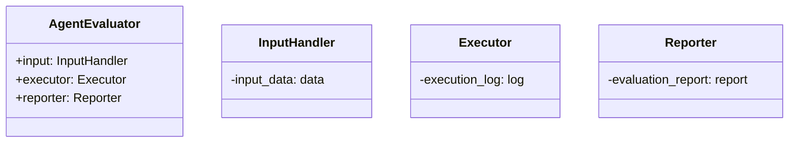
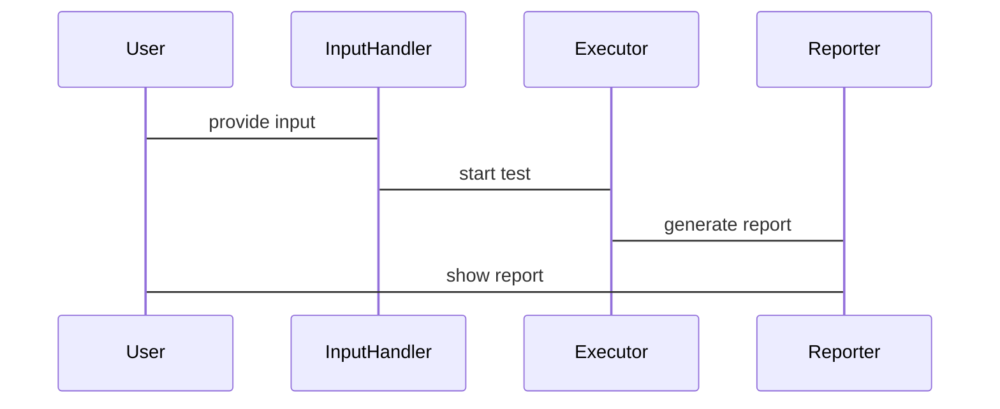

                 


# 构建AI Agent的测试与评估框架

> 关键词：AI Agent，测试框架，评估指标，算法设计，系统架构

> 摘要：AI Agent的测试与评估是确保其性能和质量的关键环节。本文将详细探讨构建AI Agent测试与评估框架的核心概念、算法原理、系统架构设计及项目实战，通过具体案例分析，为读者提供一个全面的框架设计指南。

---

# 第1章: AI Agent的基本概念与测试评估的重要性

## 1.1 AI Agent的定义与核心能力

### 1.1.1 AI Agent的定义

AI Agent（人工智能代理）是指能够感知环境并采取行动以实现目标的智能实体。AI Agent可以是软件程序、机器人或其他智能系统，其核心目标是通过自主决策和行动来优化特定任务的执行效果。

### 1.1.2 AI Agent的核心能力

AI Agent的能力主要体现在以下几个方面：

- **感知能力**：通过传感器、数据输入等方式获取环境信息。
- **推理能力**：基于获取的信息进行逻辑推理和决策。
- **学习能力**：通过经验或数据优化自身的性能。
- **交互能力**：与用户、系统或其他AI Agent进行有效沟通与协作。

### 1.1.3 AI Agent的分类与应用场景

AI Agent可以根据功能、智能水平和环境类型进行分类：

- **按功能**：任务型AI Agent（如智能助手）和学习型AI Agent（如机器学习模型）。
- **按智能水平**：弱人工智能（如Siri）和强人工智能（如通用AI）。
- **按环境类型**：静态环境和动态环境。

AI Agent广泛应用于智能客服、自动驾驶、智能家居、游戏AI等领域。

## 1.2 测试与评估在AI Agent开发中的重要性

### 1.2.1 为什么需要测试与评估

AI Agent的开发过程复杂，涉及算法设计、数据处理、系统集成等多个环节。测试与评估是确保AI Agent在实际应用中稳定、高效运行的关键步骤。

### 1.2.2 测试与评估的目标与范围

测试与评估的目标是验证AI Agent的功能是否符合预期，性能是否达到要求，用户体验是否良好。其范围包括功能测试、性能测试、用户体验测试和安全测试。

### 1.2.3 测试与评估对AI Agent性能的影响

通过测试与评估，可以发现AI Agent的潜在问题，优化其算法和设计，提升整体性能和用户体验。

---

# 第2章: AI Agent测试与评估框架的背景与意义

## 2.1 AI Agent开发的挑战

### 2.1.1 复杂性与不确定性

AI Agent需要在复杂和动态的环境中做出决策，这增加了开发和测试的难度。

### 2.1.2 多目标优化与权衡

AI Agent的设计往往需要在多个目标之间进行权衡，例如效率与准确性的平衡。

### 2.1.3 动态环境适应性

AI Agent需要能够快速适应环境的变化，这对测试与评估提出了更高的要求。

## 2.2 测试与评估框架的必要性

### 2.2.1 统一的评估标准

框架为不同AI Agent的测试与评估提供了统一的指标和方法。

### 2.2.2 框架化的方法论

框架化的方法论使得测试与评估过程更加系统化和可重复。

### 2.2.3 提高开发效率与质量

通过框架化的方法，可以显著提高开发效率，并确保AI Agent的质量。

## 2.3 框架设计的核心目标

### 2.3.1 可扩展性与可定制性

框架应支持不同类型的AI Agent测试与评估需求。

### 2.3.2 跨平台支持

框架需要兼容不同的操作系统和硬件平台。

### 2.3.3 可视化与可解释性

框架应提供直观的可视化工具和可解释的评估结果，便于开发者理解和优化。

---

# 第3章: AI Agent能力评估的核心指标

## 3.1 任务完成度

### 3.1.1 任务正确性

评估AI Agent完成任务的准确性，例如在智能客服中，是否正确理解用户需求。

### 3.1.2 任务效率

衡量AI Agent完成任务的速度，例如响应时间。

### 3.1.3 任务一致性

评估AI Agent在相同条件下多次执行任务的一致性。

## 3.2 性能评估指标

### 3.2.1 响应时间

AI Agent对用户输入的响应速度。

### 3.2.2 资源消耗

AI Agent在运行过程中占用的计算资源。

### 3.2.3 系统稳定性

AI Agent在长时间运行中的稳定性。

## 3.3 用户体验指标

### 3.3.1 用户满意度

用户对AI Agent的使用体验的满意度。

### 3.3.2 用户操作便捷性

用户与AI Agent交互的难易程度。

### 3.3.3 用户反馈分析

通过用户反馈优化AI Agent的设计。

---

# 第4章: AI Agent测试与评估框架的设计原则

## 4.1 模块化设计

框架应模块化，包括输入处理、测试执行、结果分析和报告生成模块。

## 4.2 标准化接口

框架需要提供标准化的接口，便于不同模块的集成。

## 4.3 可扩展性

框架应支持扩展，以适应不同类型的AI Agent测试需求。

## 4.4 可视化与可解释性

框架应提供直观的可视化工具，帮助开发者理解和优化测试结果。

---

# 第5章: 典型的评估算法与实现

## 5.1 基于规则的评估算法

### 5.1.1 算法原理

基于预定义的规则对AI Agent的行为进行评估。

### 5.1.2 实现步骤

1. 定义规则。
2. 输入行为数据。
3. 根据规则进行评估。

### 5.1.3 代码示例

```python
def rule_based_assessment(agent_behavior, rules):
    score = 0
    for rule in rules:
        if rule.match(agent_behavior):
            score += rule.weight
    return score
```

## 5.2 基于日志的分析算法

### 5.2.1 算法原理

通过分析日志数据，评估AI Agent的行为。

### 5.2.2 实现步骤

1. 数据采集。
2. 数据分析。
3. 结果评估。

### 5.2.3 代码示例

```python
import logging

class LogAnalyzer:
    def __init__(self, log_file):
        self.log_file = log_file

    def analyze(self):
        with open(self.log_file, 'r') as f:
            for line in f:
                # 分析日志内容并进行评估
                pass
```

## 5.3 基于强化学习的评估算法

### 5.3.1 算法原理

使用强化学习对AI Agent的性能进行评估。

### 5.3.2 实现步骤

1. 定义奖励函数。
2. 通过强化学习训练模型。
3. 评估模型性能。

### 5.3.3 代码示例

```python
class ReinforcementLearningAgent:
    def __init__(self, state_space, action_space):
        self.state_space = state_space
        self.action_space = action_space
        # 初始化策略网络

    def act(self, state):
        # 根据策略选择动作
        pass

    def learn(self, state, action, reward):
        # 更新策略网络
        pass
```

---

# 第6章: 系统架构与实现

## 6.1 系统功能设计

### 6.1.1 领域模型设计

使用Mermaid类图展示系统的组成部分。



### 6.1.2 系统架构设计

使用Mermaid架构图展示系统的整体架构。


### 6.1.3 系统交互设计

使用Mermaid序列图展示系统交互流程。



## 6.2 核心功能实现

### 6.2.1 环境安装

安装所需的依赖库，如Python、TensorFlow、Keras等。

### 6.2.2 代码实现

实现框架的核心功能，包括输入处理、测试执行和结果报告生成。

### 6.2.3 功能实现分析

详细分析每个模块的功能实现，确保系统整体协调运行。

---

# 第7章: 项目实战

## 7.1 项目背景与目标

以智能客服代理的测试框架为例，展示如何构建和使用评估框架。

## 7.2 环境安装

安装所需的工具和库，如Python、Flask、Jupyter Notebook等。

## 7.3 代码实现

实现智能客服代理的测试框架，包括数据输入、测试执行和结果报告生成。

## 7.4 功能实现分析

详细分析每个模块的功能实现，展示如何优化AI Agent的性能和用户体验。

---

# 第8章: 最佳实践与总结

## 8.1 框架设计的关键点

强调模块化设计、标准化接口和可视化工具的重要性。

## 8.2 注意事项

提醒开发者在实际应用中注意数据隐私、系统稳定性和用户体验优化。

## 8.3 未来展望

展望AI Agent测试与评估框架的发展趋势，如智能化、自动化和跨平台支持。

---

# 结语

构建AI Agent的测试与评估框架是一项复杂而重要的任务。通过本文的详细讲解，读者可以深入了解AI Agent的核心概念、测试与评估的必要性，以及如何设计和实现一个高效的测试与评估框架。希望本文能够为读者提供有价值的指导和启发，帮助他们在实际项目中取得成功。

--- 

以上是基于用户提供的《构建AI Agent的测试与评估框架》的思考过程和详细内容。

