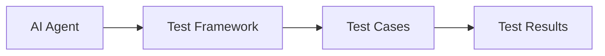
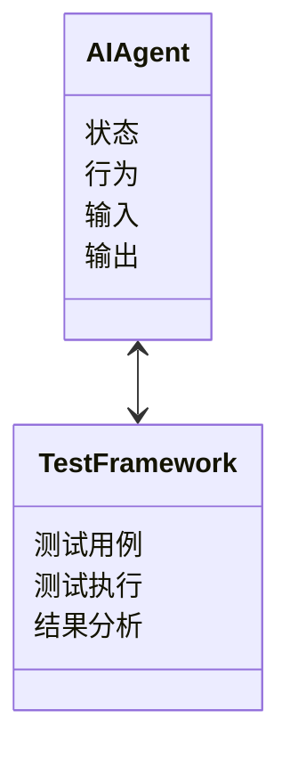
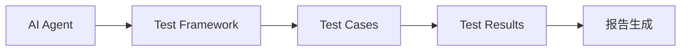
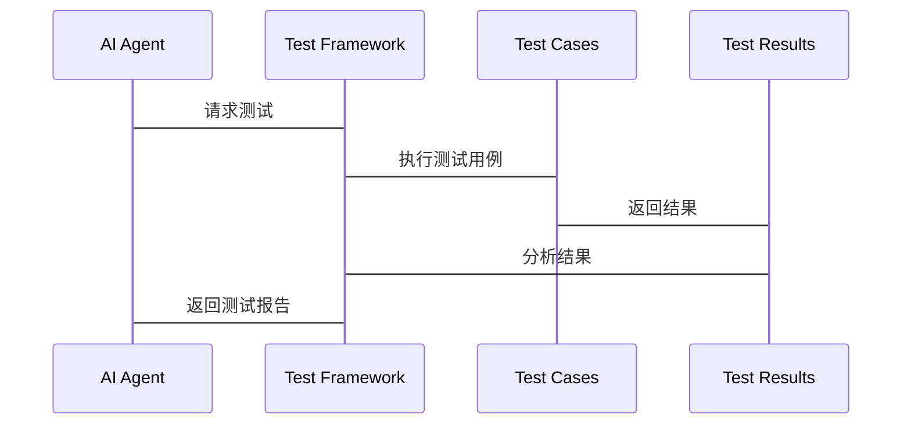

                 


# 构建AI Agent的测试框架：确保性能和可靠性

> 关键词：AI Agent，测试框架，性能，可靠性，算法原理，系统架构，项目实战

> 摘要：构建一个高效的AI Agent测试框架是确保AI Agent性能和可靠性的重要步骤。本文从AI Agent的基本概念出发，详细讲解了测试框架的核心原理、算法设计、系统架构，并通过实际案例展示了如何设计和实现一个AI Agent测试框架。通过本文，读者将能够掌握构建高性能、高可靠的AI Agent测试框架的关键技术。

---

## 第一部分: AI Agent测试框架的背景与基础

### 第1章: AI Agent与测试框架概述

#### 1.1 AI Agent的基本概念
- **1.1.1 AI Agent的定义与核心要素**  
  AI Agent（智能体）是指在特定环境中能够感知并自主行动以实现目标的实体。其核心要素包括感知能力、决策能力、行动能力和学习能力。

- **1.1.2 AI Agent的分类与应用场景**  
  AI Agent可以分为基于规则的Agent、基于模型的Agent和基于学习的Agent。应用场景包括自动驾驶、智能客服、推荐系统等。

- **1.1.3 测试框架在AI Agent中的作用**  
  测试框架用于评估AI Agent在不同场景下的性能、可靠性和用户体验，确保其在实际应用中表现优异。

#### 1.2 测试框架的基本原理
- **1.2.1 测试框架的定义与特点**  
  测试框架是一种用于自动化测试的工具或平台，具有模块化、可扩展性和高复用性的特点。

- **1.2.2 AI Agent测试框架的核心目标**  
  AI Agent测试框架的目标是通过自动化测试评估AI Agent的性能、可靠性和用户体验，发现问题并优化其表现。

- **1.2.3 测试框架的组成与功能**  
  测试框架通常包括测试用例管理、测试执行引擎、结果分析模块和报告生成模块。

---

## 第二部分: AI Agent测试框架的核心概念与联系

### 第2章: AI Agent的核心要素与测试框架的关系

#### 2.1 AI Agent的结构与功能
- **2.1.1 AI Agent的输入输出模型**  
  AI Agent通过感知环境输入信息，经过内部处理后输出行动或结果。

- **2.1.2 AI Agent的行为决策机制**  
  AI Agent通过算法和模型进行决策，选择最优的行动方案。

- **2.1.3 AI Agent的性能指标**  
  性能指标包括响应时间、准确率、成功率和用户体验评分。

#### 2.2 测试框架的原理与设计
- **2.2.1 测试框架的设计原则**  
  包括模块化设计、可扩展性、可重复性和高效性。

- **2.2.2 AI Agent测试框架的核心算法**  
  测试框架通常使用随机测试、覆盖率测试和性能测试等算法。

- **2.2.3 测试框架的实现方式**  
  包括基于规则的测试、基于模型的测试和基于学习的测试。

#### 2.3 AI Agent与测试框架的实体关系图
- **2.3.1 ER实体关系图**  
  下图展示了AI Agent、测试框架、测试用例和测试结果之间的关系。
```mermaid
erd
    AI Agent {
        类别：String
        功能：String
    }
    Test Framework {
        模块：String
        功能：String
    }
    Test Cases {
        用例ID：Integer
        描述：String
        状态：String
    }
    Test Results {
        结果ID：Integer
        结果：String
        时间戳：Timestamp
    }
    AI Agent --> Test Framework
    Test Cases --> Test Results
```

- **2.3.2 测试框架与AI Agent的交互流程图**


#### 2.4 本章小结
本章详细介绍了AI Agent的核心要素及其与测试框架的关系，为后续章节的算法设计和系统架构奠定了基础。

---

## 第三部分: AI Agent测试框架的算法原理

### 第3章: 测试框架的算法设计

#### 3.1 测试框架的算法概述
- **3.1.1 测试框架的核心算法**  
  包括随机测试算法、覆盖率测试算法和性能测试算法。

- **3.1.2 算法的数学模型**  
  使用概率模型和统计模型来评估测试结果的准确性。

- **3.1.3 算法的实现步骤**  
  包括测试用例生成、测试执行、结果收集和结果分析。

#### 3.2 算法的详细实现
- **3.2.1 算法的伪代码实现**  
  ```python
  def test_framework_algorithm():
      for each test_case in test_cases:
          execute_test(test_case)
          collect_results(results)
          analyze_results(results)
  ```

- **3.2.2 算法的流程图**  
  ```mermaid
  graph TD
      A[开始] --> B[输入测试用例]
      B --> C[执行测试]
      C --> D[输出结果]
  ```

#### 3.3 算法的数学模型与公式
- **3.3.1 测试框架的性能指标公式**  
  $$ \text{性能指标} = \frac{\text{正确数}}{\text{总数}} $$

- **3.3.2 测试框架的可靠性公式**  
  $$ \text{可靠性} = 1 - \text{错误率} $$

#### 3.4 本章小结
本章详细讲解了测试框架的核心算法及其数学模型，为后续章节的系统设计和项目实战奠定了算法基础。

---

## 第四部分: AI Agent测试框架的系统架构设计

### 第4章: 系统分析与架构设计

#### 4.1 系统功能设计
- **4.1.1 领域模型**  
  下图展示了AI Agent测试框架的领域模型。


- **4.1.2 系统架构图**  
  下图展示了AI Agent测试框架的系统架构。


#### 4.2 系统接口设计
- **4.2.1 测试框架与AI Agent的交互接口**  
  包括输入接口和输出接口。

- **4.2.2 测试框架与测试用例的交互接口**  
  包括用例管理接口和执行接口。

#### 4.3 系统交互图


#### 4.4 本章小结
本章详细设计了AI Agent测试框架的系统架构，为后续章节的项目实战提供了系统设计依据。

---

## 第五部分: AI Agent测试框架的项目实战

### 第5章: 项目实战

#### 5.1 环境安装与配置
- **5.1.1 开发环境**  
  需要安装Python、Jupyter Notebook和相关测试框架库。

- **5.1.2 测试环境**  
  需要配置虚拟机或云平台进行测试。

#### 5.2 核心实现
- **5.2.1 测试用例生成**  
  ```python
  def generate_test_cases():
      test_cases = []
      for i in range(100):
          test_cases.append(f"test_{i}")
      return test_cases
  ```

- **5.2.2 测试执行与结果分析**  
  ```python
  def execute_test(test_case):
      # 执行测试
      result = run_test(test_case)
      return result
  ```

- **5.2.3 测试报告生成**  
  ```python
  def generate_report(results):
      # 生成报告
      report = analyze_results(results)
      return report
  ```

#### 5.3 案例分析与优化
- **5.3.1 测试结果分析**  
  通过分析测试结果，找出AI Agent的性能瓶颈。

- **5.3.2 系统优化**  
  根据测试结果，优化AI Agent的算法和架构。

#### 5.4 本章小结
本章通过实际案例展示了如何设计和实现一个AI Agent测试框架，并通过测试结果分析和系统优化，进一步提升了AI Agent的性能和可靠性。

---

## 第六部分: 总结与最佳实践

### 第6章: 总结与最佳实践

#### 6.1 本章小结
总结了本文的主要内容，包括AI Agent的基本概念、测试框架的核心原理、算法设计、系统架构和项目实战。

#### 6.2 最佳实践
- **6.2.1 测试框架设计的注意事项**  
  包括模块化设计、可扩展性设计和高可用性设计。

- **6.2.2 测试框架的优化建议**  
  包括性能优化、算法优化和系统架构优化。

#### 6.3 注意事项
- 在设计测试框架时，需要充分考虑系统的可扩展性和可维护性。

#### 6.4 拓展阅读
- 推荐阅读相关领域的书籍和论文，深入研究AI Agent和测试框架的最新技术。

---

通过本文的系统讲解和实际案例分析，读者将能够掌握构建高性能、高可靠的AI Agent测试框架的关键技术，并在实际项目中加以应用。

