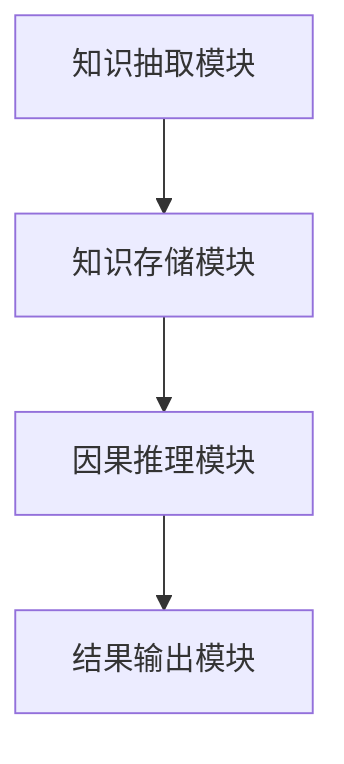

                 


# 构建AI Agent的知识图谱因果推理引擎

> 关键词：知识图谱、因果推理、AI Agent、因果图模型、潜在结果框架

> 摘要：本篇文章将探讨如何构建AI Agent的知识图谱因果推理引擎，通过逐步分析推理，详细讲解知识图谱的构建方法、因果推理的理论与算法，以及如何将两者结合，设计出高效的推理引擎。文章内容涵盖了从基础知识到实际应用的完整流程，帮助读者系统地理解并掌握相关技术。

---

## 第一部分：构建AI Agent的知识图谱因果推理引擎概述

### 第1章：AI Agent与知识图谱概述

#### 1.1 AI Agent的基本概念

##### 1.1.1 AI Agent的定义与分类
- **定义**：AI Agent是一种智能体，能够感知环境并采取行动以实现特定目标。
- **分类**：基于智能水平，分为反应式和认知式AI Agent；基于应用场景，分为任务型和社交型AI Agent。

##### 1.1.2 知识图谱在AI Agent中的作用
- **知识表示**：知识图谱为AI Agent提供结构化的知识库，支持复杂推理。
- **决策支持**：通过知识图谱，AI Agent能够做出更智能的决策。
- **学习与进化**：知识图谱帮助AI Agent不断学习和优化自身能力。

##### 1.1.3 知识图谱因果推理引擎的背景与意义
- **背景**：随着AI Agent的应用需求增加，传统基于相关性的推理方法已无法满足复杂场景的需求。
- **意义**：因果推理引擎能够使AI Agent理解因果关系，从而做出更准确的预测和决策。

---

### 第2章：知识图谱的基本概念

#### 2.1 知识抽取与实体识别

##### 2.1.1 知识抽取的定义与方法
- **定义**：从文本中提取结构化知识的过程。
- **方法**：基于规则的抽取、统计学习模型、深度学习模型（如BERT）。
- **示例**：从“猫喜欢喝牛奶”中提取“猫”、“喜欢”、“牛奶”三元组。

##### 2.1.2 实体识别的技术与工具
- **技术**：利用NLP技术识别文本中的实体（如人名、地名、组织名）。
- **工具**：spaCy、Stanford NLP、HanLP。

##### 2.1.3 实体链接与消歧
- **实体链接**：将识别出的实体映射到知识库中的标准实体。
- **消歧**：解决同名实体的不同含义（如“苹果”可以指水果或公司）。

#### 2.2 知识图谱的表示与存储

##### 2.2.1 知识图谱的表示方法
- **RDF（资源描述框架）**：通过三元组（主语、谓词、宾语）表示知识。
- **知识图谱嵌入**：将实体和关系映射到低维向量空间（如Word2Vec、GloVe）。

##### 2.2.2 知识图谱的存储技术
- **图数据库**：如Neo4j，支持高效的图结构查询。
- **RDF存储**：如Jena，支持RDF数据的存储与推理。

##### 2.2.3 知识图谱的压缩与优化
- **压缩方法**：通过聚类、合并等方式减少存储空间。
- **优化策略**：索引优化、查询优化，提升查询效率。

#### 2.3 知识图谱的推理与扩展

##### 2.3.1 知识图谱的推理方法
- **基于规则的推理**：利用逻辑规则（如“如果A，则B”）进行推理。
- **基于学习的推理**：使用机器学习模型（如神经网络）进行推理。

##### 2.3.2 知识图谱的扩展技术
- **链接预测**：预测知识图谱中缺失的边。
- **属性预测**：预测实体的属性值。
- **知识融合**：将多个来源的知识图谱合并。

##### 2.3.3 知识图谱的质量评估与优化
- **质量指标**：覆盖率、准确性、一致性。
- **优化方法**：去噪、填补缺失值、消除冲突。

---

## 第三部分：因果推理的理论与算法

### 第3章：因果推理的理论基础

#### 3.1 因果关系的基本概念

##### 3.1.1 因果关系的定义与特征
- **定义**：因果关系是指一个事件（原因）导致另一个事件（结果）发生的必然联系。
- **特征**：时间顺序性、可重复性、可干预性。

##### 3.1.2 因果关系与相关关系的区别
- **相关关系**：变量之间的统计关联，不考虑因果方向。
- **因果关系**：变量之间的因果联系，强调原因与结果的内在联系。

##### 3.1.3 因果关系的表示方法
- **因果图模型**：用有向图表示变量之间的因果关系。
- **潜在结果框架**：通过潜在结果（如反事实）定义因果效应。

#### 3.2 因果推理的数学模型

##### 3.2.1 随机变量与概率分布
- **随机变量**：变量可能取多个值，每个值对应一个概率。
- **概率分布**：变量取各个值的概率的集合。

##### 3.2.2 因果图模型
- **DAG（有向无环图）**：用于表示变量之间的因果关系，确保没有循环。
- **结构学习**：从数据中学习因果图的结构（如贝叶斯网络）。

##### 3.2.3 因果效应的计算
- **平均处理效应（ATE）**：处理对整个群体的平均效果。
- **条件处理效应（CATE）**：处理对特定子群体的条件效果。

---

### 第4章：因果推理的经典算法

#### 4.1 随机化方法

##### 4.1.1 随机化方法的基本思想
- **思想**：通过随机分配处理来识别因果效应。
- **应用**：实验设计中的随机对照试验（RCT）。

##### 4.1.2 随机森林与因果推理
- **随机森林**：一种基于树的集成方法，用于估计因果效应。
- **示例**：使用随机森林估计变量之间的因果关系。

#### 4.2 因果图模型

##### 4.2.1 因果图模型的基本结构
- **结构学习**：通过数据学习因果图的结构。
- **因果推断**：在已知因果图的情况下，估计因果效应。

##### 4.2.2 结构学习的算法
- **贝叶斯网络学习**：基于概率推理学习因果图。
- **PC算法**：通过条件独立性测试学习因果图的结构。

#### 4.3 潜在结果框架

##### 4.3.1 潜在结果框架的基本思想
- **思想**：通过反事实推理估计潜在结果。
- **应用**：估计处理对结果的影响。

##### 4.3.2 潜在结果的估计方法
- **匹配方法**：通过匹配样本估计因果效应。
- **倾向评分**：通过机器学习模型估计处理的倾向评分，调整结果。

---

## 第四部分：构建AI Agent的知识图谱因果推理引擎

### 第5章：知识图谱中的因果推理

#### 5.1 知识图谱中的因果推理方法

##### 5.1.1 知识图谱的因果推理框架
- **框架设计**：结合知识图谱和因果推理，构建因果推理框架。
- **核心步骤**：知识抽取、因果建模、因果推理、结果解释。

##### 5.1.2 知识图谱的因果推理算法
- **基于规则的算法**：通过逻辑规则进行因果推理。
- **基于学习的算法**：使用神经网络模型进行因果推理。

#### 5.2 基于图结构的因果推理算法

##### 5.2.1 图结构的因果推理方法
- **路径分析**：分析变量之间的因果路径。
- **因果效应传播**：通过图结构传播因果效应。

##### 5.2.2 图神经网络与因果推理
- **图神经网络**：用于处理图结构数据，支持因果推理。
- **示例**：使用图神经网络进行知识图谱中的因果推理。

---

## 第五部分：项目实战：构建AI Agent的知识图谱因果推理引擎

### 第6章：知识图谱因果推理引擎的实现

#### 6.1 项目背景与目标
- **背景**：构建一个支持因果推理的AI Agent，应用于智能问答、推荐系统等领域。
- **目标**：实现知识图谱的构建、因果推理引擎的设计与实现。

#### 6.2 系统功能设计

##### 6.2.1 知识抽取模块
- **功能**：从文本中抽取结构化知识，构建知识图谱。
- **实现**：使用NLP工具（如spaCy、BERT）进行实体识别、关系抽取。

##### 6.2.2 因果推理模块
- **功能**：基于知识图谱，进行因果推理，输出因果关系。
- **实现**：设计因果图模型，使用因果推理算法（如PC算法、潜在结果框架）进行推理。

#### 6.3 系统架构设计

##### 6.3.1 系统架构图


##### 6.3.2 接口设计
- **知识抽取接口**：接受文本输入，输出结构化知识。
- **因果推理接口**：接受因果关系查询，输出因果推理结果。

#### 6.4 项目实现与测试

##### 6.4.1 环境搭建
- **工具安装**：安装Python、TensorFlow、Neo4j等工具。
- **依赖管理**：使用pip安装相关库（如networkx、pytorch）。

##### 6.4.2 核心代码实现

###### 6.4.2.1 知识抽取模块
```python
import spacy

nlp = spacy.load("en_core_web_sm")

def extract_entities(text):
    doc = nlp(text)
    entities = []
    for ent in doc.ents:
        entities.append((ent.text, ent.label_))
    return entities
```

###### 6.4.2.2 因果推理模块
```python
from networkx import DiGraph

def build_causal_graph(data):
    g = DiGraph()
    for cause, effect in data:
        g.add_edge(cause, effect)
    return g
```

#### 6.5 项目总结与优化

##### 6.5.1 项目总结
- **成果**：成功构建了一个知识图谱因果推理引擎，支持AI Agent的智能推理。
- **经验**：因果推理需要结合具体场景，知识图谱的质量直接影响推理效果。

##### 6.5.2 优化方向
- **算法优化**：研究更高效的因果推理算法。
- **知识图谱优化**：引入更多领域知识，提升推理准确性。

---

## 第六部分：扩展与未来展望

### 第7章：知识图谱因果推理引擎的扩展与应用

#### 7.1 当前技术的局限性
- **数据依赖性**：因果推理严重依赖高质量的数据。
- **计算复杂度**：复杂因果图的推理计算量大。
- **可解释性**：因果推理的可解释性仍需提升。

#### 7.2 未来研究方向
- **因果图的动态更新**：研究如何动态更新因果图，适应数据变化。
- **多模态因果推理**：结合文本、图像等多种数据源进行因果推理。
- **因果推理的可解释性研究**：提升因果推理的可解释性，便于用户理解和信任。

#### 7.3 最佳实践与注意事项
- **数据质量**：确保知识图谱的数据质量和完整性。
- **算法选择**：根据具体场景选择合适的因果推理算法。
- **系统优化**：优化系统架构，提升推理效率。

---

## 结语

通过本文的详细讲解，我们系统地探讨了如何构建AI Agent的知识图谱因果推理引擎，从基础知识到实际应用，为读者提供了完整的解决方案。未来，随着技术的不断发展，知识图谱因果推理引擎将在更多领域发挥重要作用，为AI Agent的发展提供更强大的支持。

---

* 每部分详细内容将在后续逐步展开，欢迎持续关注。

