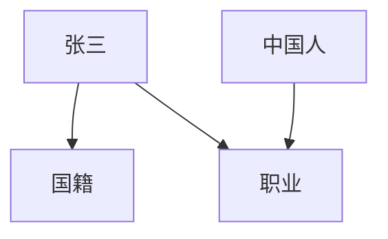
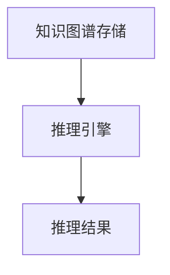
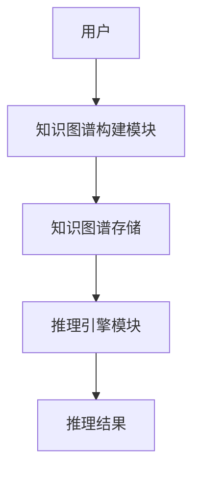

                 


# 构建AI Agent的知识图谱推理引擎优化

## 关键词：知识图谱、AI Agent、推理引擎、优化、机器学习、自然语言处理、系统架构

## 摘要：  
本文详细探讨了构建AI Agent的知识图谱推理引擎的优化方法。首先介绍了知识图谱和AI Agent的基本概念，分析了知识图谱推理引擎的核心原理和算法。然后，通过系统分析与架构设计，提出了优化方案，并通过实际项目实战验证了优化效果。最后，总结了最佳实践和注意事项，为读者提供了全面的指导。

---

# 第1章 知识图谱与AI Agent的背景介绍

## 1.1 知识图谱的定义与特点

### 1.1.1 知识图谱的定义
知识图谱是一种以图结构形式表示知识的语义网络，由实体和关系构成，用于描述真实世界中的概念及其关系。知识图谱通过结构化的形式将分散的数据整合起来，形成可计算的语义网络。

### 1.1.2 知识图谱的核心特点
知识图谱具有以下特点：
1. **结构化**：以图结构的形式表示，支持复杂的语义关系。
2. **可扩展性**：支持大规模数据的整合和推理。
3. **语义丰富性**：能够表达实体之间的复杂关系。
4. **动态更新**：支持实时数据的更新和维护。

### 1.1.3 知识图谱与传统数据库的区别
知识图谱与传统数据库的主要区别在于：
- 数据结构：知识图谱是图结构，而传统数据库通常是关系型或文档型。
- 数据关系：知识图谱强调实体之间的语义关系，而传统数据库关注事务的完整性。
- 数据处理：知识图谱支持复杂的语义推理，而传统数据库主要支持简单的查询操作。

## 1.2 AI Agent的基本概念

### 1.2.1 AI Agent的定义
AI Agent是一种智能体，能够感知环境、执行任务并做出决策。它通过与用户交互，利用知识图谱中的信息进行推理和决策，以提供智能化的服务。

### 1.2.2 AI Agent的核心功能
AI Agent的核心功能包括：
1. **感知环境**：通过传感器或用户输入获取信息。
2. **推理决策**：基于知识图谱进行推理，做出最优决策。
3. **执行任务**：根据决策结果执行具体操作，如发送邮件或查询数据库。

### 1.2.3 AI Agent与传统软件的区别
AI Agent与传统软件的主要区别在于：
- 智能性：AI Agent具备学习和推理能力，而传统软件通常只是执行固定的操作。
- 适应性：AI Agent能够根据环境变化调整行为，而传统软件行为固定。
- 交互性：AI Agent能够与用户进行自然语言交互，而传统软件通常通过固定界面进行交互。

## 1.3 知识图谱与AI Agent的结合

### 1.3.1 知识图谱在AI Agent中的作用
知识图谱为AI Agent提供了丰富的语义信息，使其能够理解上下文、推理实体关系，并做出更智能的决策。

### 1.3.2 AI Agent的知识图谱构建
AI Agent的知识图谱构建需要考虑数据的来源、清洗、抽取和存储。常用的知识图谱构建方法包括基于规则的构建和基于学习的构建。

### 1.3.3 知识图谱推理在AI Agent中的应用
知识图谱推理在AI Agent中的应用主要体现在语义理解、实体识别、关系推理和意图识别等方面。

---

# 第2章 知识图谱推理引擎的核心概念与联系

## 2.1 知识图谱推理引擎的原理

### 2.1.1 推理引擎的基本原理
推理引擎通过输入实体和关系，利用推理算法生成新的知识。常见的推理算法包括基于规则的推理和基于学习的推理。

### 2.1.2 知识图谱推理的数学模型
知识图谱推理的数学模型可以表示为：
$$
\text{头实体} \text{关系} \text{尾实体}
$$

### 2.1.3 推理引擎的输入输出关系
推理引擎的输入是实体和关系，输出是推理结果。例如，输入“张三是中国人”，关系“国籍”，输出“张三是中国人”。

## 2.2 知识图谱推理引擎的实体关系图



## 2.3 知识图谱推理引擎的架构图



---

# 第3章 知识图谱推理引擎的算法原理

## 3.1 知识图谱构建算法

### 3.1.1 基于规则的构建算法
基于规则的构建算法通过预定义规则从文本中抽取实体和关系。例如，使用正则表达式提取公司名称和职位信息。

### 3.1.2 基于学习的构建算法
基于学习的构建算法利用机器学习模型（如CRF和RNN）从文本中学习特征，自动抽取实体和关系。

### 3.1.3 知识图谱构建的数学模型
知识图谱构建的数学模型可以表示为：
$$
f(x) = \arg\max_{y} P(y|x)
$$

## 3.2 知识图谱推理算法

### 3.2.1 基于规则的推理算法
基于规则的推理算法通过预定义规则进行推理。例如，如果A是B的父亲，B是C的父亲，则A是C的祖父。

### 3.2.2 基于学习的推理算法
基于学习的推理算法利用深度学习模型（如知识图谱嵌入）进行推理。例如，使用TransE模型将实体和关系映射到向量空间。

### 3.2.3 知识图谱推理的数学模型
知识图谱推理的数学模型可以表示为：
$$
\text{头实体} \text{关系} \text{尾实体} = \text{得分}
$$

---

# 第4章 系统分析与架构设计方案

## 4.1 系统功能设计

### 4.1.1 知识图谱构建模块
知识图谱构建模块负责从多种数据源（如文本、数据库）抽取实体和关系，构建知识图谱。

### 4.1.2 推理引擎模块
推理引擎模块负责根据知识图谱和用户输入进行推理，生成推理结果。

### 4.1.3 用户交互模块
用户交互模块负责与用户进行交互，接收输入并输出推理结果。

## 4.2 系统架构设计



## 4.3 系统接口设计

### 4.3.1 知识图谱构建接口
知识图谱构建接口负责从数据源抽取实体和关系，构建知识图谱。

### 4.3.2 推理引擎接口
推理引擎接口负责接收实体和关系，生成推理结果。

### 4.3.3 用户交互接口
用户交互接口负责与用户进行交互，接收输入并输出推理结果。

---

# 第5章 项目实战

## 5.1 环境安装

### 5.1.1 知识图谱构建工具安装
安装必要的知识图谱构建工具，如Python的networkx库。

### 5.1.2 推理引擎安装
安装推理引擎，如基于TensorFlow的深度学习模型。

### 5.1.3 开发环境配置
配置开发环境，如安装Python、Jupyter Notebook等。

## 5.2 系统核心实现

### 5.2.1 知识图谱构建代码实现
使用Python编写知识图谱构建代码，如：
```python
import networkx as nx
G = nx.Graph()
G.add_edge('张三', '国籍')
G.add_edge('张三', '职业')
G.add_edge('国籍', '中国人')
```

### 5.2.2 推理引擎代码实现
使用深度学习模型进行推理，如：
```python
import tensorflow as tf
model = tf.keras.Sequential()
model.add(tf.keras.layers.Dense(64, activation='relu'))
model.add(tf.keras.layers.Dense(1, activation='sigmoid'))
model.compile(optimizer='adam', loss='binary_crossentropy')
```

### 5.2.3 用户交互界面实现
实现用户交互界面，如基于Flask的Web界面。

## 5.3 实际案例分析
通过实际案例分析推理引擎的优化效果，如优化推理速度和准确率。

---

# 第6章 最佳实践与总结

## 6.1 最佳实践
1. **数据质量**：确保知识图谱数据的准确性和完整性。
2. **模型选择**：根据具体任务选择合适的推理算法。
3. **系统优化**：优化推理引擎的性能，如并行计算和缓存优化。

## 6.2 小结
本文详细探讨了构建AI Agent的知识图谱推理引擎的优化方法，通过理论分析和实际案例，展示了如何优化推理引擎的性能和准确率。

## 6.3 注意事项
1. **数据隐私**：注意数据隐私和安全问题。
2. **模型泛化能力**：确保模型具有良好的泛化能力。
3. **系统维护**：定期维护和更新知识图谱。

## 6.4 拓展阅读
推荐阅读相关领域的最新论文和书籍，如《知识图谱构建与应用》。

---

# 结语
构建AI Agent的知识图谱推理引擎优化是一个复杂的系统工程，需要结合理论与实践，不断优化和改进。通过本文的分析和实战，读者可以更好地理解知识图谱推理引擎的优化方法，并在实际项目中加以应用。

