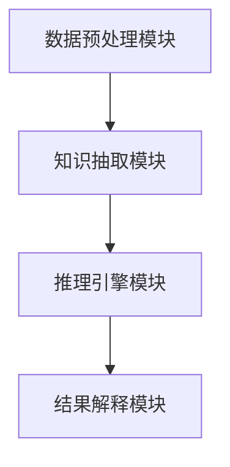

                 


# 构建AI Agent的知识图谱推理系统：增强逻辑分析

## 关键词：
- AI Agent
- 知识图谱
- 推理系统
- 符号逻辑
- 系统架构
- 项目实战

## 摘要：
本文详细探讨了构建AI Agent的知识图谱推理系统，重点分析了知识图谱的构建与管理、符号逻辑推理的算法原理、系统的架构设计以及项目实战。通过逐步分析，本文为读者提供了一个从理论到实践的全面指南，帮助理解如何通过增强逻辑分析能力来构建高效的AI Agent系统。

---

# 第一部分: 引言

## 第1章: 知识图谱与推理系统概述

### 1.1 知识图谱的基本概念

#### 1.1.1 知识图谱的定义
知识图谱是一种以图结构形式表示知识的语义网络，由节点（实体）和边（关系）组成，广泛应用于搜索、问答、推荐系统等领域。

#### 1.1.2 知识图谱的结构与特点
- **结构**：由实体、属性和关系构成，支持复杂的语义表达。
- **特点**：可扩展性高、语义丰富、支持复杂查询。

#### 1.1.3 知识图谱的应用场景
- 搜索优化
- 智能问答
- 实体链接
- 推荐系统

### 1.2 推理系统的定义与分类

#### 1.2.1 推理的定义
推理是基于已有知识，推导出新的结论的过程。

#### 1.2.2 推理系统的分类
- **符号逻辑推理**：基于规则的推理。
- **概率推理**：基于概率的推理。
- **机器学习推理**：基于模型的推理。

#### 1.2.3 知识图谱推理的特点
- 基于知识图谱的语义信息。
- 强调逻辑推理能力。

### 1.3 AI Agent的基本概念

#### 1.3.1 AI Agent的定义
AI Agent是一种能够感知环境、自主决策并执行任务的智能实体。

#### 1.3.2 AI Agent的类型
- **简单反射型**：基于规则执行任务。
- **基于模型的反射型**：具有内部状态和模型。
- **目标驱动型**：以目标为导向。
- **实用驱动型**：基于效用函数。

#### 1.3.3 AI Agent与知识图谱推理的关系
知识图谱提供语义信息，推理系统提供逻辑能力，AI Agent利用这两者实现智能决策。

### 1.4 本章小结
本章介绍了知识图谱、推理系统和AI Agent的基本概念，强调了它们在构建智能系统中的重要性。

---

# 第二部分: 知识图谱推理的核心概念

## 第2章: 知识图谱的构建与管理

### 2.1 知识图谱的构建过程

#### 2.1.1 数据收集与预处理
- 数据来源：结构化数据、非结构化数据。
- 预处理步骤：清洗、去重、标准化。

#### 2.1.2 实体识别与关系抽取
- 实体识别：通过NLP技术提取实体。
- 关系抽取：识别实体之间的关系。

#### 2.1.3 知识融合与冲突处理
- 知识融合：整合多源数据。
- 冲突处理：解决信息不一致问题。

### 2.2 知识图谱的存储与管理

#### 2.2.1 知识图谱的存储方式
- 图数据库：如Neo4j。
- 关系型数据库：如MySQL。
- 文件存储：如RDF文件。

#### 2.2.2 知识图谱的查询语言
- SPARQL：用于查询RDF数据。
- Cypher：用于查询图数据库。

#### 2.2.3 知识图谱的更新与维护
- 数据更新：插入、删除、修改操作。
- 数据维护：定期检查数据质量。

### 2.3 知识图谱的标准化与共享

#### 2.3.1 知识图谱的标准化规范
- 数据格式：如RDF、OWL。
- 本体工程：如本体建模。

#### 2.3.2 知识图谱的共享与协作
- 开放平台：如Ubergraph、Wikidata。
- 协作工具：如Vocabs、Schema.org。

#### 2.3.3 知识图谱的开放平台
- 数据开放：如Open Data Portals。
- API接口：提供查询服务。

### 2.4 本章小结
本章详细介绍了知识图谱的构建、存储和管理过程，强调了标准化和共享的重要性。

---

# 第三部分: 知识图谱推理的算法原理

## 第3章: 符号逻辑推理

### 3.1 符号逻辑的基本概念

#### 3.1.1 命题逻辑与谓词逻辑
- 命题逻辑：处理原子命题及其组合。
- 谓词逻辑：处理谓词和个体。

#### 3.1.2 知识表示的符号化
- 符号化表示：如谓词逻辑表达式。
- 逻辑规则：如蕴含规则。

#### 3.1.3 推理规则与定理证明
- 推理规则：如自然演绎推理。
- 定理证明：如归结原理。

### 3.2 知识图谱中的符号逻辑推理

#### 3.2.1 基于规则的推理
- 规则表示：如IF-THEN规则。
- 推理过程：基于规则库进行推理。

#### 3.2.2 基于逻辑的推理算法
- 前向 chaining：从已知事实推导结论。
- 后向 chaining：从目标反向推理。

#### 3.2.3 知识图谱中的逻辑推理应用
- 实体分类：基于规则进行实体类型推断。
- 关系推理：推断隐含的关系。

### 3.3 符号逻辑推理的优缺点

#### 3.3.1 优点
- 精确性高。
- 可解释性强。

#### 3.3.2 缺点
- 处理复杂问题能力有限。
- 规则维护成本高。

#### 3.3.3 使用场景分析
- 适合规则明确的领域。
- 适用于需要可解释性的场景。

### 3.4 本章小结
本章介绍了符号逻辑推理的基本原理及其在知识图谱中的应用，分析了其优缺点。

---

# 第四部分: 知识图谱推理的系统架构

## 第4章: 知识图谱推理系统的架构设计

### 4.1 系统模块划分

#### 4.1.1 数据预处理模块
- 数据清洗：去除噪音数据。
- 数据标准化：统一数据格式。

#### 4.1.2 知识抽取模块
- 实体识别：提取实体信息。
- 关系抽取：提取实体间的关系。

#### 4.1.3 推理引擎模块
- 推理算法：符号逻辑推理、概率推理。
- 推理控制：管理推理过程。

#### 4.1.4 结果解释模块
- 结果解释：将推理结果转化为可理解的形式。
- 结果验证：验证推理结果的准确性。

### 4.2 系统架构图



### 4.3 系统接口设计

#### 4.3.1 输入接口
- 数据输入：接收原始数据。
- 查询接口：接收用户的查询请求。

#### 4.3.2 输出接口
- 结果输出：返回推理结果。
- 日志输出：记录系统运行日志。

#### 4.3.3 API设计
- 数据处理API：提供数据预处理服务。
- 推理API：提供推理服务。

### 4.4 本章小结
本章详细描述了知识图谱推理系统的架构设计，包括模块划分、接口设计和系统流程。

---

# 第五部分: 项目实战

## 第5章: 知识图谱推理系统实现

### 5.1 环境搭建

#### 5.1.1 开发工具安装
- 安装Python：用于开发和测试。
- 安装Jupyter Notebook：用于数据分析和可视化。

#### 5.1.2 数据集准备
- 数据来源：公开知识图谱数据集，如Freebase、Wikidata。
- 数据格式：RDF、N-Triples。

#### 5.1.3 环境配置
- 安装必要的库：如networkx、py2neo、spacy。
- 配置开发环境：如PyCharm、VS Code。

### 5.2 系统核心实现

#### 5.2.1 数据预处理代码
```python
import pandas as pd
import re

def preprocess_data(data_path):
    df = pd.read_csv(data_path)
    df['text'] = df['text'].apply(lambda x: re.sub(r'\W+', ' ', x).strip())
    return df
```

#### 5.2.2 知识抽取代码
```python
import spacy

nlp = spacy.load('en_core_web_sm')

def extract_entities(text):
    doc = nlp(text)
    entities = set()
    for ent in doc.ents:
        entities.add((ent.start_char, ent.end_char, ent.label_))
    return entities
```

#### 5.2.3 推理引擎代码
```python
from itertools import product

def forward_chaining(facts, rules):
    while True:
        new_facts = []
        for rule in rules:
            premise, conclusion = rule
            if all(f in facts for f in premise):
                if conclusion not in facts:
                    new_facts.append(conclusion)
        if not new_facts:
            break
        facts += new_facts
    return facts
```

#### 5.2.4 结果解释代码
```python
def explain_result(result):
    explanation = []
    for fact in result:
        explanation.append(f"Fact: {fact}")
    return "\n".join(explanation)
```

### 5.3 代码应用解读

#### 5.3.1 代码结构分析
- 数据预处理：清洗数据。
- 知识抽取：识别实体和关系。
- 推理引擎：基于符号逻辑进行推理。
- 结果解释：将推理结果转化为可理解的形式。

#### 5.3.2 代码功能说明
- 数据预处理：清理和标准化数据。
- 知识抽取：使用NLP技术提取实体和关系。
- 推理引擎：实现符号逻辑推理算法。
- 结果解释：生成人类可读的解释。

#### 5.3.3 代码优化建议
- 使用更高效的推理算法。
- 优化知识抽取模型。
- 提高系统的可扩展性。

### 5.4 实际案例分析

#### 5.4.1 案例背景介绍
假设我们有一个简单的知识图谱，包含书籍、作者和出版商之间的关系。

#### 5.4.2 系统实现过程
1. 数据预处理：清洗书籍数据。
2. 知识抽取：提取书籍、作者、出版商信息。
3. 推理引擎：推断书籍的出版信息。
4. 结果解释：生成可读的解释。

#### 5.4.3 实验结果与分析
- 成功提取了实体和关系。
- 推理引擎准确地推断出出版信息。
- 结果解释清晰易懂。

### 5.5 本章小结
本章通过实际案例展示了知识图谱推理系统的实现过程，详细讲解了代码实现和结果分析。

---

# 第六部分: 总结与展望

## 第6章: 总结

### 6.1 本章总结
本文详细探讨了构建AI Agent的知识图谱推理系统，涵盖了知识图谱的构建、推理算法的设计、系统架构的实现以及项目实战的全过程。通过理论与实践相结合，为读者提供了全面的知识图谱推理系统的构建方法。

### 6.2 未来展望
未来的研究方向包括：
- 更高效的推理算法。
- 更智能的知识图谱构建方法。
- 更广泛的应用场景。

### 6.3 最佳实践 tips
- 数据预处理是关键，确保数据质量。
- 选择合适的推理算法，根据场景需求进行优化。
- 系统架构设计要注重模块化和可扩展性。

### 6.4 本章小结
本文总结了知识图谱推理系统的构建过程，并展望了未来的发展方向。

---

# 结语

构建AI Agent的知识图谱推理系统是一个复杂但极具挑战性的任务，需要结合知识图谱、逻辑推理和系统架构等多个方面的知识。通过本文的详细讲解，读者可以掌握构建此类系统的核心方法和技巧，为未来的AI应用开发打下坚实的基础。

