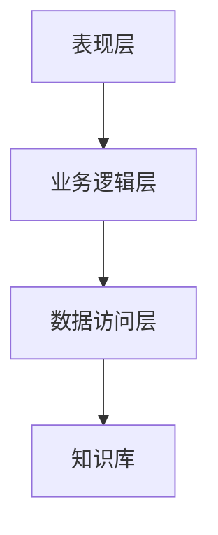

                 


# 构建AI Agent的知识图谱推理解释器

> 关键词：知识图谱，AI Agent，推理解释器，推理算法，系统架构，项目实战

> 摘要：本文详细探讨了如何构建一个基于知识图谱的AI Agent推理解释器，涵盖背景介绍、核心概念、算法原理、系统架构设计及项目实战。通过分析推理过程，本文揭示了推理解释器在AI Agent中的重要性，并提供了具体的实现方案和最佳实践。

---

## 第1章 知识图谱与AI Agent概述

### 1.1 知识图谱的基本概念

知识图谱是一种以图结构形式表示知识的语义网络，节点代表实体或概念，边表示它们之间的关系。其特点包括：

- **语义性**：通过关系和属性描述实体间的联系。
- **结构化**：数据以结构化的形式存储，便于计算机处理。
- **可扩展性**：支持动态添加新知识和关系。

知识图谱的应用场景包括搜索引擎优化、智能问答系统和推荐系统等。

### 1.2 AI Agent的核心概念

AI Agent是具有感知环境和自主决策能力的智能体。它通过与环境交互，利用传感器获取信息，并通过执行器采取行动。AI Agent的基本功能包括感知、推理、规划和执行。

### 1.3 知识图谱推理解释器的背景与意义

推理解释器是AI Agent的核心模块，负责从知识图谱中推理出隐含信息并生成人类可理解的解释。其在自然语言处理、智能问答和自动化决策系统中具有重要意义。

---

## 第2章 知识图谱推理解释器的核心概念

### 2.1 知识图谱推理解释器的结构与组成

推理解释器由以下模块组成：

- **知识抽取模块**：从文本或数据库中提取结构化知识。
- **知识存储模块**：将抽取的知识存储在图数据库中。
- **推理引擎模块**：基于知识图谱进行推理。
- **解释生成模块**：将推理结果转化为自然语言解释。

### 2.2 推理算法与解释方法

- **基于规则的推理**：通过预定义的逻辑规则进行推理，适用于规则明确的场景。
- **基于概率的推理**：利用概率论计算事件发生的可能性，适用于不确定性较高的场景。
- **基于图结构的推理**：通过遍历图结构进行推理，适用于复杂关系的场景。

---

## 第3章 知识图谱推理算法详解

### 3.1 基于规则的推理算法

#### 3.1.1 规则定义与匹配

规则通常表示为条件-动作对，例如：
$$
\text{如果}(A \text{且} B) \Rightarrow \text{则} C
$$

规则匹配过程如下：
1. 匹配条件部分。
2. 触发动作部分。

### 3.2 基于概率的推理算法

#### 3.2.1 贝叶斯网络的应用

贝叶斯网络是一种有向无环图，节点代表随机变量，边代表因果关系。计算概率的公式为：
$$
P(A|B) = \frac{P(B|A) \cdot P(A)}{P(B)}
$$

### 3.3 基于图结构的推理算法

#### 3.3.1 图遍历算法

深度优先搜索（DFS）和广度优先搜索（BFS）是常用的图遍历算法，用于发现图中的所有节点或路径。

---

## 第4章 系统分析与架构设计

### 4.1 系统功能设计

系统功能模块包括：
- 知识抽取模块：使用正则表达式或NLP技术提取实体和关系。
- 知识存储模块：使用图数据库（如Neo4j）存储知识。
- 推理引擎模块：实现推理算法。
- 解释生成模块：将推理结果转化为自然语言。

### 4.2 系统架构设计

系统采用分层架构：
1. 表现层：接收用户输入并展示结果。
2. 业务逻辑层：处理推理请求。
3. 数据访问层：与知识库交互。

系统架构图如下：



---

## 第5章 项目实战

### 5.1 环境安装

安装所需的依赖：
- 图数据库：Neo4j
- 推理库：RDFlib
- NLP工具：spaCy

### 5.2 核心实现代码

```python
from rdflib import Graph, Literal, BNode, RDF

# 创建知识图谱
g = Graph()
g.add((BNode('n1'), RDF.type, Literal('Person')))
g.add((BNode('n1'), Literal('name'), Literal('Alice')))
```

### 5.3 案例分析

假设知识图谱中有以下关系：
- Alice是Bob的朋友。
- Bob是Charlie的朋友。

推理Alice是Charlie的朋友的过程：
1. 从Alice出发，遍历朋友关系到达Bob。
2. 从Bob出发，遍历朋友关系到达Charlie。

---

## 第6章 总结与建议

### 6.1 总结

本文详细探讨了构建知识图谱推理解释器的各个方面，从理论到实践，为AI Agent的开发提供了指导。

### 6.2 注意事项

- 确保知识抽取的准确性。
- 选择合适的推理算法以适应不同场景。
- 定期更新知识库以保持系统的准确性。

### 6.3 拓展阅读

建议阅读相关书籍和论文，深入理解知识图谱和推理算法。

---

通过以上内容，我们系统地介绍了如何构建一个基于知识图谱的AI Agent推理解释器，涵盖了从理论到实践的各个方面。希望本文能为相关领域的研究和开发提供有价值的参考。

