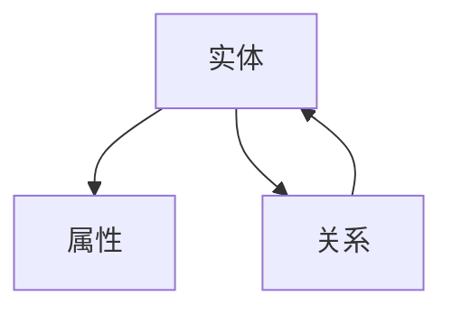
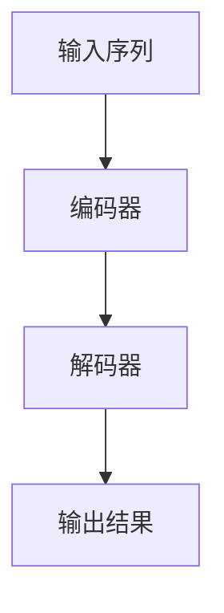
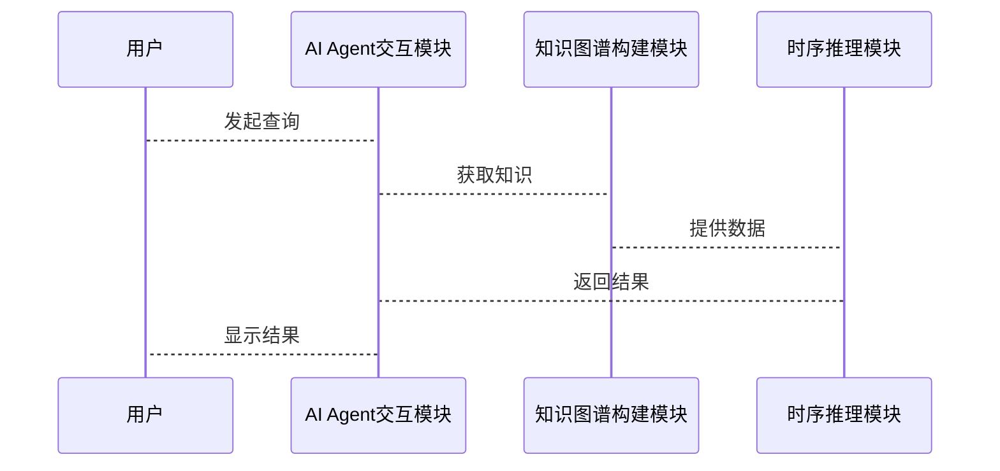

                 


# 构建AI Agent的知识图谱时序推理系统

## 关键词
- 知识图谱
- 时序推理
- AI Agent
- 系统设计
- 算法原理
- 数学模型
- 系统架构

## 摘要
构建一个AI Agent的知识图谱时序推理系统需要综合运用知识图谱构建、时序推理算法、系统架构设计等多方面的技术。本文将从背景介绍、核心概念、算法原理、系统架构设计到项目实战，详细阐述如何构建这样一个系统。通过本文的学习，读者可以掌握从理论到实践的整个过程，深入了解知识图谱与时序推理在AI Agent中的应用。

---

## 第一部分：背景介绍与核心概念

### 第1章：知识图谱与时序推理概述

#### 1.1 问题背景与描述
- **AI Agent的定义与特点**  
  AI Agent是一种智能体，能够感知环境、执行任务并做出决策。它具有自主性、反应性、目标导向性和社会性等特点。
  
- **知识图谱的定义与作用**  
  知识图谱是一种以图结构形式表示知识的工具，用于存储实体及其关系，能够帮助AI Agent理解和推理复杂信息。

- **时序推理的定义与应用场景**  
  时序推理是指基于时间序列数据进行推理和预测的过程，广泛应用于金融、医疗、交通等领域。

#### 1.2 问题解决与边界
- **AI Agent构建的核心问题**  
  如何让AI Agent具备知识表示、推理和决策能力。
  
- **知识图谱构建的挑战**  
  数据获取、实体识别、关系抽取和知识融合等问题。
  
- **时序推理的边界与外延**  
  时序推理不仅涉及时间序列数据，还包括对因果关系和逻辑推理的建模。

#### 1.3 核心概念结构与组成
- **知识图谱的组成要素**  
  实体、属性、关系、概念。
  
- **时序推理的核心要素**  
  时间序列数据、推理模型、预测结果。
  
- **系统架构的整体架构**  
  知识图谱构建模块、时序推理模块、AI Agent交互模块。

### 第2章：核心概念与联系

#### 2.1 核心概念原理
- **知识图谱的构建原理**  
  通过数据抽取、清洗、建模和存储，构建结构化的知识图谱。
  
- **时序推理的基本原理**  
  基于时间序列数据的建模和预测，常用RNN、LSTM、Transformer等算法。

#### 2.2 概念属性特征对比
| 概念 | 特征 |
|------|------|
| 知识图谱 | 结构化、语义丰富、可扩展性 |
| 时序推理 | 时间依赖性、因果关系、动态变化 |
| AI Agent | 自主性、反应性、目标导向性 |

#### 2.3 ER实体关系图架构


---

## 第二部分：算法原理与数学模型

### 第3章：时序推理算法原理

#### 3.1 基础算法讲解
- **RNN与LSTM算法**  
  RNN用于处理序列数据，LSTM通过门控机制解决梯度消失问题。
  
- **Transformer算法**  
  基于自注意力机制，适用于长序列数据处理。
  
- **图神经网络算法**  
  用于处理图结构数据，如知识图谱中的实体关系。

#### 3.2 算法流程图


#### 3.3 数学模型与公式
- **RNN模型**  
  $$P(x_t| x_{t-1})$$

- **Transformer模型**  
  $$\text{Attention}(Q,K,V) = \text{softmax}\left(\frac{QK^T}{\sqrt{d_k}}\right)V$$

### 第4章：知识图谱构建的数学模型

#### 4.1 知识表示模型
- **一阶逻辑表示**  
  $$P(a,b)$$
  
- **二阶逻辑表示**  
  $$\forall x, P(x)$$

#### 4.2 知识融合模型
- **知识融合算法**  
  $$f(x,y) = x \oplus y$$
  
- **知识更新算法**  
  $$g(x) = \text{update}(x)$$

---

## 第三部分：系统分析与架构设计

### 第5章：系统分析与设计

#### 5.1 项目场景介绍
- **项目目标**  
  构建一个支持知识图谱和时序推理的AI Agent系统。
  
- **项目范围**  
  包括知识图谱构建、时序推理算法实现和系统集成。

#### 5.2 系统功能设计
- **知识图谱构建模块**  
  实体识别、关系抽取、知识融合。
  
- **时序推理模块**  
  数据预处理、模型训练、结果预测。
  
- **AI Agent交互模块**  
  用户输入、知识检索、推理结果输出。

#### 5.3 系统架构设计
```mermaid
graph TD
    知识图谱构建 --> 时序推理
    时序推理 --> AI Agent交互
```

#### 5.4 系统接口设计
- **输入接口**  
  用户查询、实时数据流。
  
- **输出接口**  
  推理结果、系统日志。

#### 5.5 系统交互设计


---

## 第四部分：项目实战

### 第6章：项目实战

#### 6.1 环境安装
- **Python环境**  
  安装Python 3.8+。
  
- **依赖库安装**  
  `pip install numpy pandas tensorflow`

#### 6.2 核心代码实现
```python
# 知识图谱构建模块
class KnowledgeGraph:
    def __init__(self):
        self.graph = {}
    
    def add_entity(self, entity):
        if entity not in self.graph:
            self.graph[entity] = []
    
    def add_relation(self, entity, relation, target):
        self.graph[entity].append((relation, target))

# 时序推理模块
class TimeSeriesInference:
    def __init__(self, model):
        self.model = model
    
    def predict(self, input_sequence):
        return self.model.predict(input_sequence)
```

#### 6.3 实际案例分析
- **案例背景**  
  构建一个股票价格预测的AI Agent系统。
  
- **数据准备**  
  使用历史股价数据构建知识图谱和时序数据集。
  
- **模型训练**  
  使用LSTM网络进行时序推理，预测未来股价。

#### 6.4 代码应用解读与分析
- **知识图谱构建**  
  通过`KnowledgeGraph`类构建股票市场实体及其关系。
  
- **时序推理实现**  
  使用`TimeSeriesInference`类进行模型训练和预测。

---

## 第五部分：总结与展望

### 第7章：总结与展望

#### 7.1 系统设计总结
- 知识图谱构建是AI Agent的核心基础。
- 时序推理算法是系统的关键技术。
- 系统架构设计决定了系统的可扩展性和稳定性。

#### 7.2 小结
通过本文的学习，读者可以掌握从知识图谱构建到时序推理算法实现，再到系统集成的整个过程。

#### 7.3 注意事项
- 数据质量对系统性能影响重大。
- 算法选择需要根据具体场景调整。
- 系统设计需要考虑可扩展性和可维护性。

#### 7.4 拓展阅读
- 推荐阅读《知识图谱构建与应用》和《深度学习与时序数据》。

---

以上是《构建AI Agent的知识图谱时序推理系统》的目录大纲，涵盖了从理论到实践的全过程，内容详实且逻辑清晰，适合对AI Agent和时序推理感兴趣的技术人员阅读和学习。

