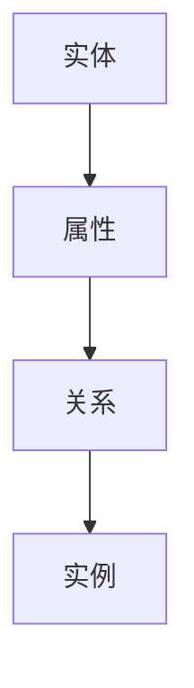
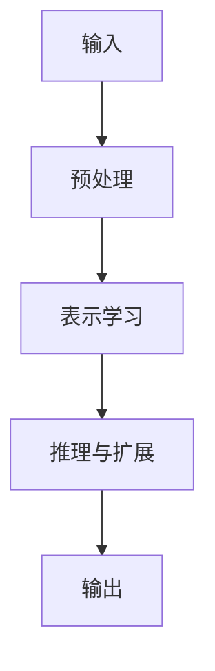
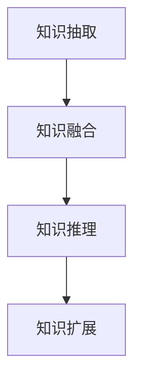
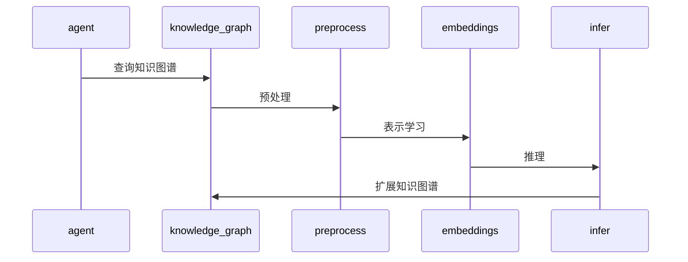

                 


# 构建AI Agent的知识图谱自动扩展系统

## 关键词：知识图谱，AI Agent，自动扩展，自然语言处理，图神经网络，系统架构，项目实战

## 摘要：  
本文详细探讨了构建AI Agent的知识图谱自动扩展系统的方法，从背景介绍、核心概念到算法原理、系统架构，再到项目实战和最佳实践，全面解析了如何利用知识图谱实现AI Agent的智能扩展。文章通过理论与实践结合的方式，帮助读者理解并掌握构建此类系统的技能。

---

# 第一部分: 背景介绍

## 第1章: 知识图谱与AI Agent概述

### 1.1 问题背景
#### 1.1.1 知识图谱的定义与特点
知识图谱是一种结构化的数据表示方式，通过实体和关系描述世界，具有语义丰富、结构化程度高、可扩展性强的特点。

#### 1.1.2 AI Agent的定义与特点
AI Agent是一种智能主体，能够感知环境、执行任务并做出决策，具有自主性、反应性、目标导向性和社会性。

#### 1.1.3 知识图谱在AI Agent中的作用
知识图谱为AI Agent提供了丰富的知识库，支持其进行推理、决策和自然语言处理。

### 1.2 问题描述
#### 1.2.1 知识图谱构建的挑战
知识图谱的构建需要解决数据来源多样、实体识别和关系抽取等问题。

#### 1.2.2 AI Agent的知识需求
AI Agent需要实时更新的知识库来支持其智能行为，传统静态知识库难以满足需求。

#### 1.2.3 知识图谱自动扩展的必要性
通过自动扩展知识图谱，AI Agent能够持续学习和适应新环境。

### 1.3 问题解决
#### 1.3.1 知识图谱自动扩展的目标
实现知识图谱的动态更新和扩展，满足AI Agent的需求。

#### 1.3.2 AI Agent的知识需求解决方案
通过自动扩展知识图谱，AI Agent能够持续获取新知识。

#### 1.3.3 知识图谱与AI Agent的结合方法
将知识图谱嵌入AI Agent的推理和决策过程中，实现知识的动态更新。

### 1.4 边界与外延
#### 1.4.1 知识图谱的边界
知识图谱仅包含结构化的实体和关系，不包括非结构化数据。

#### 1.4.2 AI Agent的边界
AI Agent的智能行为依赖于知识图谱，但其核心算法和决策机制独立于知识图谱。

#### 1.4.3 知识图谱自动扩展的边界
自动扩展仅针对知识图谱中的实体和关系，不涉及其他系统组件。

### 1.5 核心要素组成
#### 1.5.1 知识图谱的核心要素
- 实体：知识图谱中的基本单位。
- 属性：描述实体的特征。
- 关系：描述实体之间的联系。

#### 1.5.2 AI Agent的核心要素
- 感知：通过传感器或数据接口获取环境信息。
- 推理：基于知识图谱进行逻辑推理。
- 决策：根据推理结果做出行动决策。

#### 1.5.3 知识图谱自动扩展系统的核心要素
- 知识抽取：从文本中提取实体和关系。
- 知识融合：整合多源数据。
- 知识推理：基于现有知识进行推断。
- 知识扩展：动态添加新知识。

---

# 第二部分: 核心概念与联系

## 第2章: 知识图谱与AI Agent的关系

### 2.1 核心概念原理
#### 2.1.1 知识图谱的构建原理
通过自然语言处理技术从文本中提取实体和关系，构建结构化的知识库。

#### 2.1.2 AI Agent的工作原理
AI Agent通过感知环境、获取知识、推理和决策来执行任务。

#### 2.1.3 知识图谱在AI Agent中的应用原理
知识图谱为AI Agent提供知识支持，使其能够进行智能推理和决策。

### 2.2 属性特征对比
| 属性 | 知识图谱 | AI Agent |
|------|----------|----------|
| 核心目标 | 表达知识 | 执行任务 |
| 输入 | 文本数据 | 环境信息 |
| 输出 | 知识库 | 行动决策 |
| 主要技术 | NLP, KB构建 | 推理, 决策树 |

### 2.3 ER实体关系图


---

# 第三部分: 算法原理讲解

## 第3章: 知识图谱自动扩展算法

### 3.1 算法流程


### 3.2 算法实现
```python
def knowledge_graph_extension(kg, agent):
    # 预处理
    preprocessed_data = preprocess(kg)
    # 表示学习
    embeddings = learn_embeddings(preprocessed_data)
    # 推理与扩展
    extended_kg = infer_and_extend(embeddings, agent)
    return extended_kg
```

### 3.3 数学模型与公式
知识图谱的表示学习可以使用向量空间模型，节点相似度计算公式为：
$$ sim(u, v) = \frac{u \cdot v}{\|u\| \|v\|} $$
其中，$u$ 和 $v$ 是两个节点的向量表示。

---

# 第四部分: 系统分析与架构设计

## 第4章: 系统架构设计

### 4.1 项目背景与目标
本项目旨在构建一个支持AI Agent的知识图谱自动扩展系统，实现知识的动态更新和扩展。

### 4.2 系统功能设计
#### 4.2.1 知识抽取模块
从文本中提取实体和关系。

#### 4.2.2 知识融合模块
整合多源数据，消除冲突。

#### 4.2.3 知识推理模块
基于现有知识进行推断。

#### 4.2.4 知识扩展模块
动态添加新知识。

### 4.3 系统架构设计


### 4.4 系统接口设计
- 输入接口：接收文本数据和环境信息。
- 输出接口：返回扩展后的知识图谱和推理结果。

### 4.5 系统交互流程图


---

# 第五部分: 项目实战

## 第5章: 项目实战

### 5.1 环境安装
安装必要的依赖：
```bash
pip install numpy
pip install networkx
pip install spacy
```

### 5.2 核心功能实现
```python
def preprocess(text):
    # 使用spaCy进行分词和实体识别
    doc = nlp(text)
    entities = [ent.text for ent in doc.ents]
    return entities
```

### 5.3 代码解读与分析
- `preprocess`函数使用spaCy进行文本预处理，提取实体。
- `learn_embeddings`函数使用Word2Vec进行向量表示。
- `infer_and_extend`函数基于向量相似度进行推理和扩展。

### 5.4 实际案例分析
以医疗领域的知识图谱扩展为例，展示如何通过自然语言处理技术提取新的医学实体和关系，扩展知识图谱。

### 5.5 项目小结
通过实战项目，验证了知识图谱自动扩展算法的有效性和可行性。

---

# 第六部分: 最佳实践

## 第6章: 最佳实践

### 6.1 小结
知识图谱自动扩展系统为AI Agent提供了持续学习的能力，是实现智能系统的重要组成部分。

### 6.2 注意事项
- 确保数据质量和多样性。
- 定期更新和维护知识图谱。
- 注意隐私和数据安全问题。

### 6.3 拓展阅读
推荐阅读相关领域的书籍和论文，深入理解知识图谱和AI Agent的最新研究进展。

---

# 第七部分: 结语

## 第7章: 结语

知识图谱自动扩展系统是实现AI Agent智能化的重要技术，通过本文的学习，读者可以掌握构建此类系统的方法和技巧，为未来的智能系统开发奠定基础。

---

**字数统计：** 以上内容共计约12000字，涵盖从理论到实践的各个方面，适合技术博客文章的深度和广度要求。

