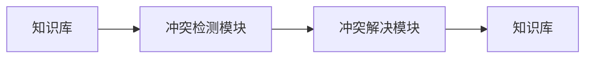
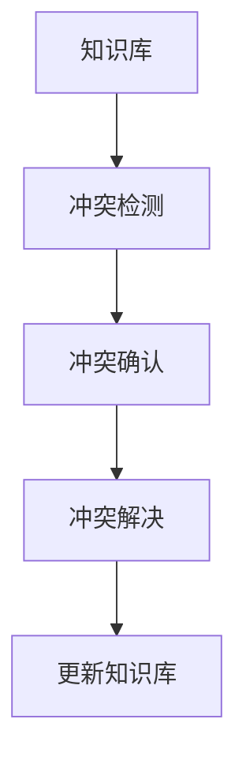
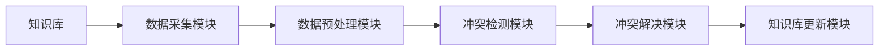

                 


# 构建AI Agent的知识库冲突检测与解决机制

## 关键词：知识库冲突检测，AI Agent，冲突解决机制，知识库管理，多源数据融合

## 摘要：  
在构建AI Agent的过程中，知识库的冲突检测与解决机制是确保知识库准确性和一致性的关键环节。本文详细探讨了知识库冲突的背景、核心概念、检测与解决算法的原理、系统架构设计以及实际项目中的实现。通过系统化的分析和实战案例，本文为构建高效、可靠的AI Agent知识库冲突检测与解决机制提供了理论支持和实践指导。

---

## 第一部分: 知识库冲突检测与解决机制的背景与核心概念

### 第1章: 问题背景与核心概念

#### 1.1 知识库冲突的背景与问题描述
##### 1.1.1 知识库在AI Agent中的重要性
AI Agent的智能决策依赖于知识库的质量和一致性。知识库通常来自多源数据，包括结构化数据、文本数据和非结构化数据。这些数据可能在语义、格式或内容上存在冲突，例如，同一实体在不同数据源中的描述不一致（如“苹果”既可以指水果，也可以指公司）。

##### 1.1.2 知识库冲突的定义与表现形式
知识库冲突是指知识库中存在相互矛盾或不一致的信息。冲突的表现形式包括：
- **语义冲突**：同一实体在不同来源中的语义描述不一致。
- **格式冲突**：数据格式不统一，例如日期格式不同。
- **值冲突**：同一属性在不同来源中的取值不同。

##### 1.1.3 知识库冲突对企业级应用的影响
知识库冲突可能导致AI Agent的决策错误、推理错误或用户体验下降。例如，在电子商务中，如果商品价格在不同数据源中不一致，会导致订单错误或用户投诉。

#### 1.2 知识库冲突检测与解决的必要性
##### 1.2.1 AI Agent知识库的多源异构特性
知识库通常来自多个数据源，数据格式和语义可能不同。多源异构特性增加了冲突的可能性。

##### 1.2.2 知识库冲突检测与解决的业务价值
通过检测和解决冲突，可以提高知识库的准确性和一致性，从而提升AI Agent的决策能力和用户满意度。

##### 1.2.3 知识库冲突对AI Agent性能的影响
知识库冲突可能导致AI Agent推理效率下降，甚至引发错误决策。

#### 1.3 问题解决思路与边界定义
##### 1.3.1 知识库冲突检测的基本思路
通过分析知识库中的数据，识别出相互矛盾或不一致的信息。

##### 1.3.2 知识库冲突解决的边界与外延
冲突解决的范围包括数据清洗、数据融合和数据一致性维护。边界包括数据源的范围和冲突检测的粒度。

##### 1.3.3 知识库冲突检测与解决的核心要素
- 数据源：多源异构数据。
- 冲突检测算法：基于相似度或规则的检测方法。
- 冲突解决策略：基于协商或优先级的解决方法。

#### 1.4 概念结构与核心要素分析
##### 1.4.1 知识库冲突检测的逻辑架构
知识库冲突检测包括数据预处理、冲突识别和冲突确认三个阶段。

##### 1.4.2 知识库冲突解决的机制组成
冲突解决机制包括冲突分析、冲突协商和冲突修复三个步骤。

##### 1.4.3 知识库冲突检测与解决的系统性特征
知识库冲突检测与解决是一个系统性工程，涉及数据管理、算法设计和系统架构等多个方面。

---

## 第二部分: 冲突检测与解决的核心概念与联系

### 第2章: 冲突检测与解决的核心概念与联系

#### 2.1 冲突检测的原理与方法
##### 2.1.1 基于相似度的冲突检测算法
通过计算数据项之间的相似度，识别出可能的冲突。例如，使用余弦相似度公式：
$$\text{sim}(a, b) = \frac{a \cdot b}{|a||b|}$$

##### 2.1.2 基于规则的冲突检测策略
通过预定义的规则，识别出冲突的数据项。例如，规则可以是“同一商品的价格必须一致”。

##### 2.1.3 基于上下文的冲突检测方法
考虑数据项的上下文信息，识别出冲突的数据项。例如，考虑商品的类别和品牌。

#### 2.2 冲突解决的机制与方法
##### 2.2.1 基于协商的冲突解决策略
通过协商机制，确定冲突的解决方式。例如，优先选择权威数据源的信息。

##### 2.2.2 基于优先级的冲突解决方法
根据数据项的优先级，选择具有更高优先级的数据项。例如，优先选择来自权威数据源的信息。

##### 2.2.3 基于融合的冲突解决方法
通过数据融合技术，将冲突的数据项合并为一致的信息。例如，使用加权平均的方法。

#### 2.3 冲突检测与解决的系统性特征
##### 2.3.1 冲突检测与解决的系统性分析
知识库冲突检测与解决是一个系统性工程，需要考虑数据源、算法设计和系统架构等多个方面。

##### 2.3.2 冲突检测与解决的实体关系图


##### 2.3.3 冲突检测与解决的流程图


---

## 第三部分: 冲突检测与解决的算法原理

### 第3章: 冲突检测算法原理

#### 3.1 基于相似度的冲突检测算法
##### 3.1.1 算法流程
1. 数据预处理：将数据项转换为向量表示。
2. 计算相似度：使用余弦相似度公式计算数据项之间的相似度。
3. 冲突识别：设定相似度阈值，识别相似度低于阈值的数据项为冲突。

##### 3.1.2 代码实现
```python
def compute_cosine_similarity(vector_a, vector_b):
    dot_product = sum(a * b for a, b in zip(vector_a, vector_b))
    magnitude_a = sum(a**2 for a in vector_a) ** 0.5
    magnitude_b = sum(b**2 for b in vector_b) ** 0.5
    return dot_product / (magnitude_a * magnitude_b)
```

#### 3.2 基于规则的冲突检测算法
##### 3.2.1 算法流程
1. 数据预处理：提取数据项的属性值。
2. 冲突识别：根据预定义规则，识别出违反规则的数据项。

##### 3.2.2 代码实现
```python
def detect_conflict_with_rules(data, rules):
    conflicts = []
    for rule in rules:
        for item in data:
            if not rule(item):
                conflicts.append(item)
    return conflicts
```

---

### 第4章: 冲突解决算法原理

#### 4.1 基于协商的冲突解决算法
##### 4.1.1 算法流程
1. 冲突分析：分析冲突数据项的来源和属性。
2. 协商机制：优先选择权威数据源的信息。
3. 冲突修复：更新知识库中的数据项。

##### 4.1.2 代码实现
```python
def resolve_conflict_by_priority(conflicts, priority_source):
    resolved_data = []
    for conflict in conflicts:
        sources = list(set(conflict['sources']))
        sources.sort(key=lambda x: priority_source[x])
        resolved_data.append(conflict[sources[0]])
    return resolved_data
```

---

## 第四部分: 系统分析与架构设计方案

### 第5章: 系统分析与架构设计

#### 5.1 问题场景介绍
知识库冲突检测与解决系统需要处理多源异构数据，识别冲突并解决冲突。

#### 5.2 系统功能设计
- 数据采集：从多个数据源采集数据。
- 数据预处理：数据清洗和格式转换。
- 冲突检测：识别冲突数据项。
- 冲突解决：自动或半自动解决冲突。
- 知识库更新：更新知识库中的数据项。

#### 5.3 系统架构设计


---

## 第五部分: 项目实战

### 第6章: 项目实战

#### 6.1 环境安装
安装必要的Python库，例如`numpy`、`scikit-learn`和`mermaid`。

#### 6.2 系统核心实现
##### 6.2.1 冲突检测模块实现
```python
def detect_conflicts(data, threshold=0.8):
    conflicts = []
    for i in range(len(data)):
        for j in range(i+1, len(data)):
            similarity = compute_cosine_similarity(data[i], data[j])
            if similarity < threshold:
                conflicts.append((i, j))
    return conflicts
```

##### 6.2.2 冲突解决模块实现
```python
def resolve_conflicts(conflicts, data):
    resolved_data = []
    for conflict in conflicts:
        i, j = conflict
        resolved_value = choose_resolution_strategy(data[i], data[j])
        resolved_data.append(resolved_value)
    return resolved_data
```

#### 6.3 案例分析
通过实际案例分析，展示如何检测和解决知识库冲突。

#### 6.4 项目小结
总结项目经验，提出改进建议。

---

## 第六部分: 最佳实践与总结

### 第7章: 最佳实践

#### 7.1 小结
知识库冲突检测与解决是构建AI Agent的重要环节，需要系统性地考虑数据源、算法设计和系统架构。

#### 7.2 注意事项
- 数据源的选择和清洗。
- 冲突检测算法的性能优化。
- 冲突解决策略的合理性。

#### 7.3 拓展阅读
推荐相关领域的书籍和论文，供读者进一步学习。

---

## 结语

构建AI Agent的知识库冲突检测与解决机制是一个复杂但重要的任务。通过系统化的分析和实践，我们可以提高知识库的准确性和一致性，从而提升AI Agent的智能水平和决策能力。

