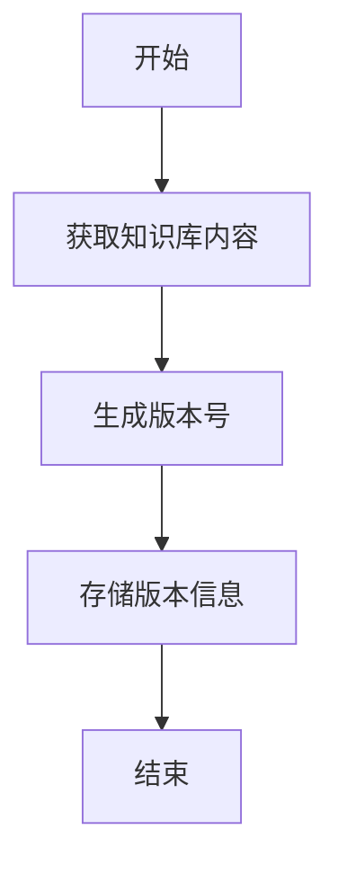
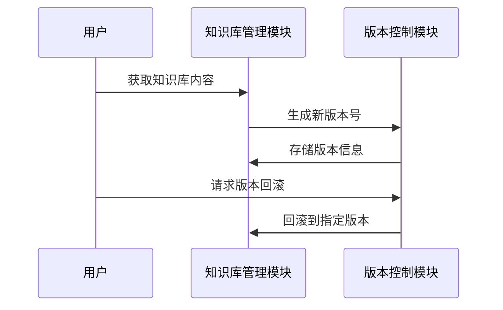

                 


# 构建AI Agent的知识库版本控制系统

## 关键词：知识库、版本控制、AI Agent、系统架构、系统设计

## 摘要：  
在AI Agent开发中，知识库是其核心能力的基石，但随着知识库的不断更新和扩展，版本控制变得至关重要。本文详细探讨如何构建AI Agent的知识库版本控制系统，涵盖背景分析、核心算法、系统架构、项目实战及最佳实践，为开发者提供全面的解决方案。

---

## 第一部分：知识库版本控制的背景与核心概念

### 第1章：知识库版本控制的背景与问题背景

#### 1.1 问题背景与问题描述

- **1.1.1 AI Agent的知识库管理需求**  
  AI Agent依赖知识库进行推理和决策。随着知识库的动态更新，版本控制需求日益显著。知识库可能包含规则、事实、策略等，需支持回滚和版本比较。

- **1.1.2 知识库版本控制的重要性**  
  知识库版本控制确保在更新过程中保持可追溯性，便于调试和恢复。版本控制还能优化协作开发流程，支持多版本并行开发。

- **1.1.3 当前知识库版本控制的挑战**  
  知识库的动态性和复杂性增加了版本控制的难度。传统版本控制工具（如Git）难以直接应用于知识库，需开发专用解决方案。

#### 1.2 问题解决与边界定义

- **1.2.1 知识库版本控制的目标**  
  实现对知识库的版本管理，支持版本回滚、版本比较和多版本并行开发。

- **1.2.2 知识库版本控制的边界**  
  专注于知识库的版本管理，不涉及代码或其他资产。重点解决动态知识库的版本问题。

- **1.2.3 知识库版本控制的外延**  
  可扩展至支持分布式协作和增量更新，但本文仅讨论核心功能。

#### 1.3 核心概念与概念结构

- **1.3.1 知识库版本控制的核心概念**  
  包括版本号、版本元数据、版本存储和版本操作。

- **1.3.2 知识库版本控制的概念结构**  
  知识库由多个版本组成，每个版本包含特定的知识内容。版本之间可比较和合并。

- **1.3.3 知识库版本控制的核心要素**  
  版本号、版本内容、版本元数据（如创建时间、修改者）。

---

## 第二部分：知识库版本控制的核心概念与联系

### 第2章：知识库版本控制的核心概念原理

#### 2.1 知识库版本控制的原理

- **2.1.1 知识库版本控制的基本原理**  
  通过记录知识库的变化，支持版本回滚和版本切换。每个版本存储知识库的状态快照。

- **2.1.2 知识库版本控制的独特性**  
  知识库内容可能是动态的，版本控制需处理内容的增量变化。

- **2.1.3 知识库版本控制的实现机制**  
  使用树状结构存储版本，支持版本分支和合并。

#### 2.2 知识库版本控制的核心属性特征对比

- **2.2.1 知识库版本控制的属性特征**  
  版本号、版本内容、版本元数据、版本操作。

- **2.2.2 属性特征对比表格**  
  | 属性 | 描述 |
  |------|------|
  | 版本号 | 独特标识符 |
  | 版本内容 | 知识库快照 |
  | 版本元数据 | 附加信息（时间戳、作者） |
  | 版本操作 | 添加、删除、修改 |

- **2.2.3 属性特征的优缺点分析**  
  版本号：确保唯一性，便于回滚。版本内容：便于比较和恢复。版本元数据：支持审计和追溯。

#### 2.3 知识库版本控制的ER实体关系图

```mermaid
er
actor: 用户
version: 版本
artifact: 知识库内容
relationship: 用户通过版本控制操作实现知识库内容的版本管理，生成版本记录
```

---

## 第三部分：知识库版本控制的算法原理

### 第3章：知识库版本控制的算法原理

#### 3.1 知识库版本控制的算法原理

- **3.1.1 算法的基本原理**  
  记录每次知识库的修改，生成新的版本。支持版本回滚和版本切换。

- **3.1.2 算法的实现步骤**  
  1. 获取当前知识库内容。  
  2. 生成新的版本号。  
  3. 存储版本信息。  
  4. 提供版本切换功能。

- **3.1.3 算法的优缺点分析**  
  优点：支持版本回滚和比较。缺点：存储开销较大。

#### 3.2 算法的数学模型与公式

- **数学模型**  
  知识库版本控制的数学模型可表示为：  
  $$ V_n = f(V_{n-1}, delta) $$  
  其中，$V_n$ 表示第n个版本，$V_{n-1}$ 表示前一版本，$delta$ 表示修改。

- **公式推导**  
  假设初始版本为 $V_0$，每次修改生成新的版本：  
  $$ V_1 = f(V_0, delta_1) $$  
  $$ V_2 = f(V_1, delta_2) $$  
  以此类推。

#### 3.3 算法的mermaid流程图



#### 3.4 算法的Python源代码实现

```python
def knowledge_base_version_control(contents):
    version = 1
    while True:
        # 获取当前知识库内容
        current_contents = contents[version]
        # 生成版本号
        version += 1
        # 存储版本信息
        save_version(current_contents)
```

---

## 第四部分：知识库版本控制的系统架构设计

### 第4章：知识库版本控制的系统架构设计

#### 4.1 系统功能设计

- **功能模块**  
  1. 知识库管理模块：存储知识库内容。  
  2. 版本控制模块：生成和管理版本。  
  3. 冲突解决模块：处理版本冲突。

#### 4.2 系统架构设计


#### 4.3 系统接口设计

- **主要接口**  
  1. `create_version(contents)`：创建新版本。  
  2. `rollback_version(version_number)`：回滚到指定版本。  
  3. `compare_versions(v1, v2)`：比较两个版本。

#### 4.4 系统交互设计



---

## 第五部分：知识库版本控制的项目实战

### 第5章：知识库版本控制的项目实战

#### 5.1 环境安装

- **依赖项**  
  需要安装的知识库存储工具和版本控制工具。

#### 5.2 核心代码实现

```python
def save_version(contents):
    # 存储当前版本内容
    pass
```

#### 5.3 功能实现与代码解读

- **代码解读**  
  实现版本控制的核心功能，包括版本生成和存储。

#### 5.4 实际案例分析

- **案例分析**  
  通过具体案例展示如何在实际项目中应用知识库版本控制系统。

#### 5.5 项目小结

- **项目总结**  
  知识库版本控制系统在实际项目中的应用效果和经验教训。

---

## 第六部分：知识库版本控制的最佳实践

### 第6章：知识库版本控制的最佳实践

#### 6.1 最佳实践 tips

- **版本管理策略**：采用增量存储，减少存储开销。  
- **版本冲突解决**：自动检测冲突，并提供解决建议。

#### 6.2 小结

- **总结回顾**  
  本文详细讲解了知识库版本控制的各个方面，为构建AI Agent的知识库版本控制系统提供了全面的解决方案。

#### 6.3 注意事项

- **注意事项**  
  在实际应用中，需注意版本回滚的性能问题和版本冲突的处理。

#### 6.4 拓展阅读

- **推荐资源**  
  推荐相关书籍和论文，供读者深入学习。

---

## 总结

构建AI Agent的知识库版本控制系统是一项复杂的任务，需要综合考虑版本控制的原理、算法设计、系统架构和实际应用。本文通过详细分析和实例，为开发者提供了全面的指导，帮助其高效实现知识库版本控制。未来，随着AI技术的发展，知识库版本控制将变得更加重要，值得持续研究和优化。

