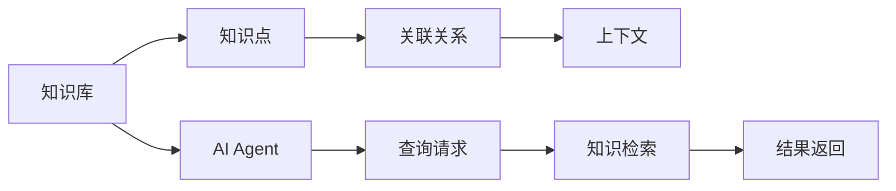
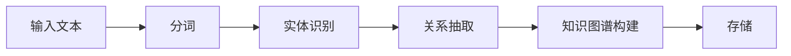
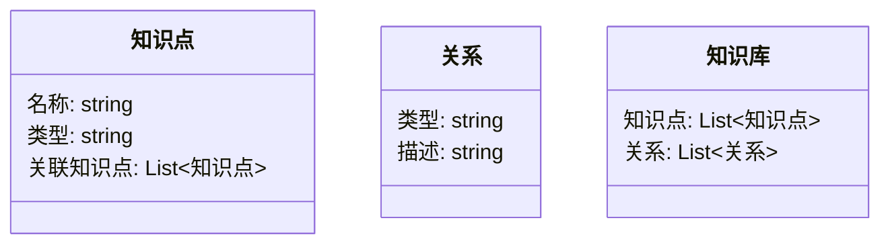
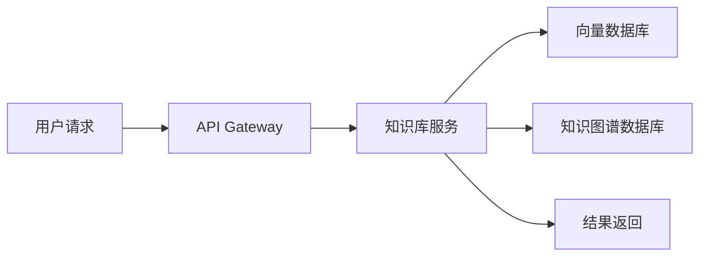

                 


# 构建AI Agent的知识库管理系统

## 关键词：AI Agent、知识库管理、知识图谱、向量数据库、系统架构

## 摘要：  
本文详细探讨了构建AI Agent的知识库管理系统的背景、核心概念、算法原理、系统架构及实现方案。通过分析知识库管理与AI Agent的交互机制，结合向量数据库和知识图谱的构建技术，提出了一套完整的系统设计方案，并通过实际案例展示了系统的实现与应用。

---

# 第一部分: 背景介绍

## 第1章: 问题背景与目标

### 1.1 问题背景
#### 1.1.1 AI Agent的概念与应用场景
AI Agent（人工智能代理）是指能够感知环境、自主决策并执行任务的智能实体。它广泛应用于自然语言处理、智能推荐、自动驾驶等领域。例如，在智能客服中，AI Agent能够通过对话理解用户需求，并调用知识库中的信息提供解决方案。

#### 1.1.2 知识库管理系统的必要性
AI Agent的智能性依赖于知识库的支持。知识库管理系统的任务是存储、组织和检索知识，为AI Agent提供高效的知识服务。例如，在医疗领域，AI Agent需要快速检索医学知识库以辅助诊断。

#### 1.1.3 当前技术挑战与解决方案
传统的数据库技术难以满足AI Agent对结构化和非结构化知识的高效检索需求。知识图谱和向量数据库的结合为解决这一问题提供了新的思路，通过语义理解和向量化表示，实现知识的高效组织和检索。

### 1.2 问题描述
#### 1.2.1 知识库管理的核心问题
知识库管理的核心问题包括知识的表示、存储、检索和更新。传统的基于关键字的检索方法难以支持语义理解，而基于向量的检索方法能够更好地捕捉知识的语义关联。

#### 1.2.2 AI Agent的知识需求与挑战
AI Agent需要实时获取动态更新的知识，并能够根据上下文进行推理。这要求知识库管理系统具备高可用性、可扩展性和实时性。

#### 1.2.3 系统设计的目标与边界
系统设计的目标是为AI Agent提供高效、可靠的知识服务。系统的边界包括知识的存储、检索和更新，但不包括AI Agent的具体行为逻辑。

---

## 第2章: 核心概念与联系

### 2.1 核心概念原理
#### 2.1.1 知识库管理系统的定义与属性
知识库管理系统（KMS）是一种用于存储、组织和检索知识的系统。其核心属性包括知识的结构化表示、高效检索和动态更新。

#### 2.1.2 AI Agent与知识库的关系
AI Agent通过知识库管理系统获取知识，并根据知识进行推理和决策。知识库是AI Agent的核心依赖，决定了其智能性。

#### 2.1.3 知识库的表示方式
知识库的表示方式包括基于符号的表示和基于向量的表示。符号表示适用于规则推理，向量表示适用于语义理解。

### 2.2 核心概念对比表
| 比较项 | 知识库管理系统 | AI Agent |
|--------|----------------|-----------|
| 定义    | 知识的存储与检索系统 | 智能实体，具备感知和决策能力 |
| 输入    | 结构化或非结构化的知识数据 | 用户需求或环境信息 |
| 输出    | 知识检索结果 | 行为决策 |
| 依赖    | 数据库技术 | 知识库管理系统 |

### 2.3 实体关系图


---

# 第二部分: 算法原理与数学模型

## 第3章: 知识库构建算法

### 3.1 向量数据库原理
#### 3.1.1 向量空间模型
向量空间模型将知识表示为向量，通过向量的相似度计算进行检索。例如，使用余弦相似度计算两个向量的相似性。

#### 3.1.2 基于余弦相似度的检索
余弦相似度公式为：
$$\cos\theta = \frac{\sum_{i=1}^{n} x_i y_i}{\sqrt{\sum_{i=1}^{n} x_i^2} \cdot \sqrt{\sum_{i=1}^{n} y_i^2}}$$

#### 3.1.3 向量索引与压缩技术
向量索引技术（如ANN）用于提高向量检索的效率，压缩技术用于减少存储空间。

### 3.2 知识图谱构建
#### 3.2.1 实体识别与抽取
实体识别是将文本中的实体提取出来，例如使用命名实体识别（NER）技术。

#### 3.2.2 关系抽取与推理
关系抽取是识别文本中的关系，例如“张三是李四的朋友”。推理是基于已知关系进行推导。

#### 3.2.3 知识图谱的存储与查询
知识图谱可以存储为三元组（主语、谓词、宾语），查询时可以使用SPARQL语言。

### 3.3 算法流程图


---

## 第4章: 数学模型与公式

### 4.1 向量空间模型的数学表示
向量空间模型将每个知识点表示为一个向量，例如：
$$v_i = (v_{i1}, v_{i2}, \ldots, v_{in})$$

### 4.2 余弦相似度的计算
余弦相似度计算公式：
$$\text{similarity}(v_1, v_2) = \frac{v_1 \cdot v_2}{\|v_1\| \|v_2\|}$$

---

# 第三部分: 系统分析与架构设计

## 第5章: 系统架构设计

### 5.1 问题场景介绍
AI Agent的知识库管理系统需要支持高并发、低延迟的查询请求。

### 5.2 系统功能设计
#### 5.2.1 领域模型类图


#### 5.2.2 系统架构图


### 5.3 接口设计与交互流程
#### 5.3.1 API接口设计
API接口包括：
- GET /knowledge?query=...
- POST /knowledge?update=...

#### 5.3.2 交互流程图


---

## 第6章: 项目实战

### 6.1 环境安装
安装Python和相关依赖：
```bash
pip install numpy faiss-cpu spacy
```

### 6.2 核心实现
向量数据库实现：
```python
import numpy as np
from faiss import IndexFlatL2, add_vector

index = IndexFlatL2(d=dimension)
vectors = [...]  # 向量列表
index.add(vectors)
```

知识图谱构建：
```python
from spacy.lang.zh import Chinese
nlp = Chinese()
doc = nlp(text)
for ent in doc.ents:
    print(ent.text, ent.label)
```

### 6.3 案例分析与解读
通过案例分析，展示系统在实际应用中的表现和优化方向。

---

## 第7章: 总结与展望

### 7.1 总结
本文详细介绍了构建AI Agent的知识库管理系统的背景、核心概念、算法原理和系统架构。通过实际案例展示了系统的实现与应用。

### 7.2 展望
未来的研究方向包括更高效的向量检索算法、更智能的知识图谱构建方法，以及与AI Agent的更深度集成。

---

## 第8章: 最佳实践 tips

### 8.1 注意事项
- 确保知识库的实时更新
- 注意数据隐私和安全

### 8.2 小结
构建AI Agent的知识库管理系统是一项复杂但极具挑战性的任务，需要结合多种技术手段。

---

通过以上步骤，我们可以逐步构建一个高效、智能的AI Agent的知识库管理系统，为AI Agent提供强有力的知识支持。

