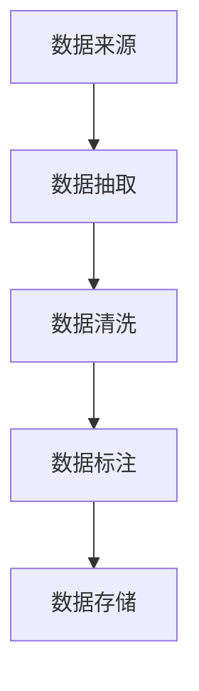
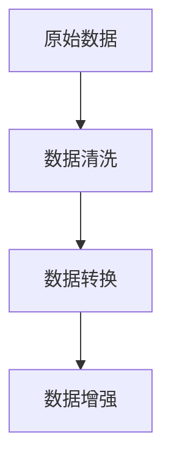
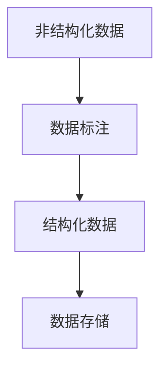
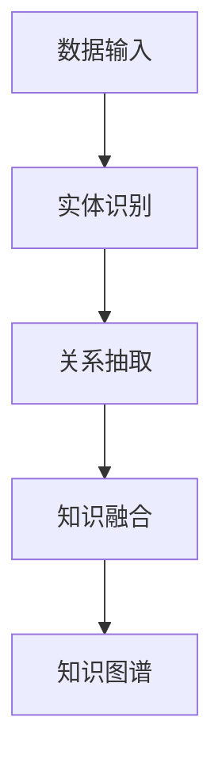
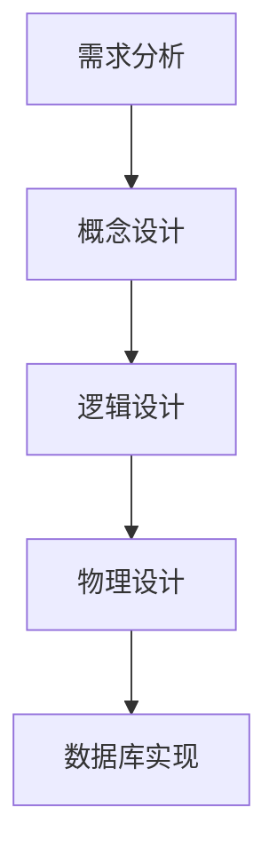
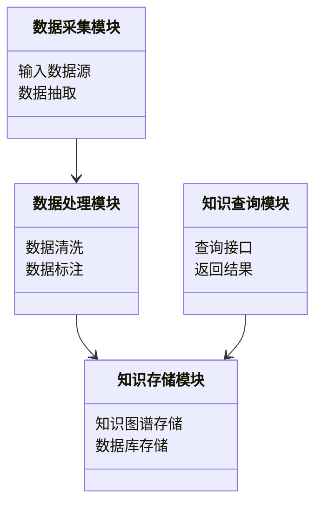
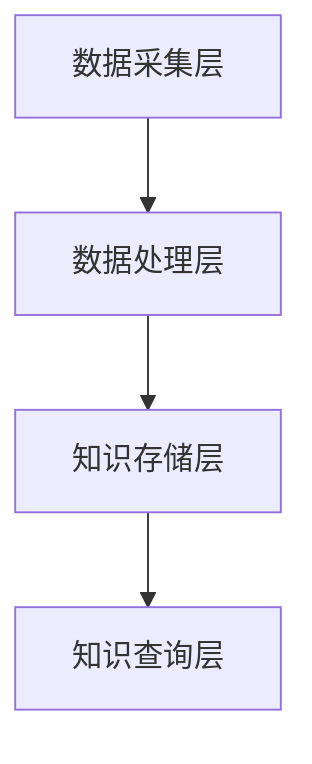

                 


# 《构建AI Agent的知识库：数据收集与组织》

## 关键词：AI Agent、知识库、数据收集、数据组织、知识图谱、数据预处理、系统架构

## 摘要：构建AI Agent的知识库是实现智能系统的核心任务之一。本文将详细探讨数据收集与组织的全过程，从数据收集的基本方法到知识库的构建与优化，结合实际案例和系统架构设计，为读者提供全面的指导。

---

## 第1章：AI Agent与知识库概述

### 1.1 AI Agent的基本概念

AI Agent（智能体）是指能够感知环境、执行任务并做出决策的智能系统。它可以分为**简单反射型Agent**、**基于模型的反射型Agent**、**目标驱动型Agent**和**效用驱动型Agent**。AI Agent的核心功能包括感知、推理、规划和执行。

#### 核心概念对比

| 类型                | 描述                                                                 |
|---------------------|--------------------------------------------------------------------|
| 简单反射型Agent    | 基于当前感知直接做出反应，无内部状态。                                   |
| 基于模型的反射型Agent | 使用内部模型表示环境，并根据模型进行推理和决策。                       |
| 目标驱动型Agent     | 根据预设目标进行规划和执行，追求目标的最优化。                         |
| 效用驱动型Agent     | 根据效用函数评估不同行动的结果，选择最优策略。                         |

### 1.2 知识库的定义与分类

知识库是AI Agent的核心组成部分，用于存储和管理知识。知识库可以分为**结构化知识库**（如数据库）、**非结构化知识库**（如文本库）和**半结构化知识库**（如XML文件）。知识库的特点包括**可扩展性**、**可维护性**和**可查询性**。

### 1.3 数据收集与知识库构建的目标

数据收集的目标是获取高质量的数据，支持知识库的构建。知识库构建的目标是将数据组织成结构化的知识表示，支持AI Agent的智能推理。数据收集与知识库构建的边界在于数据的来源和处理范围。

### 1.4 知识库构建的核心要素

知识库构建的核心要素包括**数据来源的多样性**、**数据结构的规范性**和**知识关联的逻辑性**。

---

## 第2章：数据收集的基本方法

### 2.1 数据收集的渠道与方式

数据收集的渠道包括**结构化数据**（如数据库）、**非结构化数据**（如文本、图像）和**混合数据**（如JSON格式）。数据收集的方式包括**API调用**、**网络爬取**和**数据标注**。

#### 数据来源对比

| 数据类型   | 描述                                                                 |
|------------|--------------------------------------------------------------------|
| 结构化数据 | 数据有明确的结构，如表格形式，便于处理和分析。                   |
| 非结构化数据 | 数据无固定结构，如文本、图像，需要预处理。                     |
| 混合数据    | 结合结构化和非结构化数据，具有复杂性。                           |

### 2.2 数据收集的工具与技术

数据收集的工具包括**数据抽取工具**（如BeautifulSoup）、**数据清洗工具**（如Pandas）和**数据标注工具**（如Label Studio）。

#### 数据收集流程



---

## 第3章：数据预处理技术

### 3.1 数据清洗与转换

数据清洗的目标是去除噪声数据，提高数据质量。数据转换包括**数据格式转换**（如JSON转CSV）和**数据标准化**（如归一化）。

#### 数据清洗流程



### 3.2 数据标注与结构化

数据标注的目标是将非结构化数据转化为结构化数据。数据标注的方法包括**手工标注**和**自动标注**。

#### 数据标注流程



---

## 第4章：知识库的构建

### 4.1 知识图谱的构建

知识图谱是一种以图结构表示知识的方法。构建知识图谱需要进行**实体识别**、**关系抽取**和**知识融合**。

#### 知识图谱构建流程



### 4.2 数据库设计

数据库设计的目标是将知识库中的数据组织成适合查询的结构。数据库设计包括**需求分析**、**概念设计**和**逻辑设计**。

#### 数据库设计流程



---

## 第5章：系统架构设计

### 5.1 问题场景介绍

系统需求是构建一个支持AI Agent的知识库系统，实现数据的高效存储和快速查询。

### 5.2 系统功能设计

系统功能包括数据采集模块、数据处理模块、知识存储模块和知识查询模块。

#### 系统功能模块



### 5.3 系统架构设计

系统架构采用分层架构，包括数据采集层、数据处理层、知识存储层和知识查询层。

#### 系统架构图



---

## 第6章：项目实战

### 6.1 项目介绍

项目目标是构建一个支持问答的AI Agent知识库，使用Python语言实现数据采集、处理和存储。

### 6.2 核心实现

```python
import json
import pandas as pd

def data_cleaning(data):
    # 数据清洗函数
    cleaned_data = []
    for item in data:
        if 'name' in item and 'age' in item:
            cleaned_data.append(item)
    return cleaned_data

def data_structuring(data):
    # 数据结构化函数
    structured_data = []
    for item in data:
        structured_data.append({
            'name': item['name'],
            'age': item['age']
        })
    return structured_data

# 数据采集
data = [
    {'name': 'Alice', 'age': 30},
    {'name': 'Bob', 'age': 25},
    {'name': 'Charlie', 'age': 35}
]

# 数据清洗
cleaned_data = data_cleaning(data)

# 数据结构化
structured_data = data_structuring(cleaned_data)

# 数据存储
with open('structured_data.json', 'w') as f:
    json.dump(structured_data, f)
```

### 6.3 项目总结

通过本项目，读者可以掌握数据采集、清洗、结构化和存储的基本方法。

---

## 第7章：安全与伦理

### 7.1 数据隐私与安全

数据隐私问题是知识库构建中的重要挑战。需要采取加密存储和访问控制等措施。

### 7.2 模型安全与伦理

模型安全包括防止对抗攻击和模型滥用。伦理问题包括数据的公平性和透明性。

---

## 第8章：总结与展望

### 8.1 全书总结

本文详细介绍了AI Agent知识库的构建过程，从数据收集到知识库组织，为读者提供了全面的指导。

### 8.2 未来展望

未来的挑战包括数据隐私、模型安全和知识库的动态更新。未来的发展方向包括图神经网络和分布式知识库。

---

## 小结

通过本文的详细讲解，读者可以掌握AI Agent知识库构建的核心技术，为实际项目提供参考。

