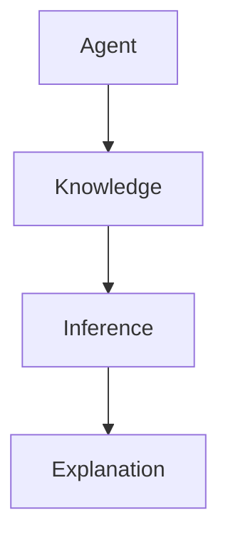
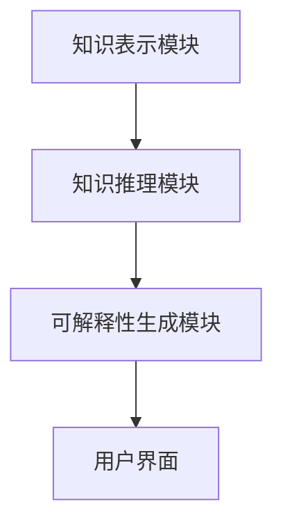

                 


# 构建AI Agent的知识推理可解释性框架

## 关键词：AI Agent，知识推理，可解释性，知识图谱，符号逻辑，概率推理，系统架构

## 摘要：本文系统地探讨了构建AI Agent的知识推理可解释性框架的核心概念、算法原理、系统架构和实现方案。文章首先介绍了AI Agent和知识推理的基本概念及其在可解释性框架中的重要性，然后详细分析了知识推理的数学模型和算法原理，接着提出了基于知识图谱的可解释性框架的设计方法，最后通过实际案例展示了如何构建和实现该框架，并总结了关键技术和未来研究方向。

---

# 第1章: AI Agent与知识推理的背景介绍

## 1.1 AI Agent的基本概念

### 1.1.1 什么是AI Agent

AI Agent（人工智能代理）是指能够感知环境、自主决策并执行任务的智能实体。AI Agent可以是软件程序、机器人或其他智能系统，其核心目标是通过感知和行动与环境交互，以实现特定目标。AI Agent的关键特征包括自主性、反应性、目标导向性和社交能力。

### 1.1.2 AI Agent的分类

AI Agent可以根据功能、智能水平和应用场景进行分类：

1. **按功能分类**：
   - **反应式Agent**：基于当前感知做出反应，不依赖于内部状态。
   - **认知式Agent**：具备复杂推理和规划能力，能够处理抽象任务。
   - **协作式Agent**：能够与其他Agent或人类协同工作。

2. **按智能水平分类**：
   - **简单反射型Agent**：基于简单的规则做出反应。
   - **基于模型的反射型Agent**：具备内部模型，能够进行推理和规划。
   - **目标导向型Agent**：具有明确的目标，并采取行动以实现目标。
   - **效用导向型Agent**：通过最大化效用函数来优化决策。

3. **按应用场景分类**：
   - **软件Agent**：如推荐系统、聊天机器人。
   - **物理Agent**：如自动驾驶汽车、工业机器人。

### 1.1.3 知识推理在AI Agent中的作用

知识推理是AI Agent实现智能决策的核心能力。AI Agent需要通过知识推理来理解环境、处理信息并做出合理的决策。知识推理帮助AI Agent从已知的事实中推导出新的结论，从而具备解决问题和自主学习的能力。

---

## 1.2 知识推理的定义与特点

### 1.2.1 知识推理的定义

知识推理是指通过逻辑推理、概率计算或其他方法，从已知的知识库中推导出新的知识或结论的过程。知识推理的核心在于将隐含的知识显式化，并基于这些推理结果做出决策。

### 1.2.2 知识推理的核心要素

知识推理涉及以下几个关键要素：

1. **知识表示**：知识如何在系统中表示，如符号逻辑、概率分布或知识图谱。
2. **推理规则**：用于从已知事实推导新结论的规则或算法。
3. **推理引擎**：执行推理操作的软件或算法，如逻辑推理引擎或概率推理引擎。
4. **知识库**：存储已知事实和背景知识的数据结构。

### 1.2.3 知识推理与传统推理的区别

传统的逻辑推理主要基于符号逻辑，而现代的知识推理结合了符号逻辑和概率推理，更加注重知识的不确定性和复杂性。知识推理通常涉及动态环境和实时决策，因此需要结合领域知识和上下文信息。

---

## 1.3 可解释性框架的必要性

### 1.3.1 可解释性在AI系统中的重要性

可解释性是指AI系统在做出决策时，能够提供清晰、合理且易于理解的解释。可解释性在AI Agent中至关重要，尤其是在医疗、法律、金融等领域，用户和利益相关者需要了解AI的决策过程和依据。

### 1.3.2 知识推理可解释性面临的挑战

知识推理的可解释性面临以下挑战：

1. **复杂性**：知识推理涉及复杂的逻辑和概率计算，解释需要简洁明了。
2. **动态性**：动态环境中，推理过程可能频繁变化，解释需要实时更新。
3. **不确定性**：知识推理通常涉及不确定性和模糊性，解释需要处理这些不确定性。

### 1.3.3 构建可解释性框架的目标

构建可解释性框架的目标是通过清晰的知识表示和推理过程，提供可追溯、可解释的推理结果。可解释性框架需要记录推理过程、推理依据和推理结果，并能够将这些信息转化为用户易于理解的形式。

---

# 第2章: 知识推理的核心概念与联系

## 2.1 知识表示的核心原理

### 2.1.1 知识表示的基本方法

知识表示是知识推理的基础，常见的知识表示方法包括：

1. **符号逻辑表示**：使用符号和逻辑规则表示知识，如命题逻辑和一阶逻辑。
2. **知识图谱表示**：通过图结构表示实体及其关系，如RDF、RDFS和OWL。
3. **概率表示**：使用概率分布表示知识的不确定性，如贝叶斯网络。

### 2.1.2 知识图谱的构建过程

知识图谱的构建过程通常包括以下步骤：

1. **数据采集**：从结构化数据、文本数据和知识库中采集数据。
2. **数据清洗**：去除噪声数据，确保数据的准确性和一致性。
3. **实体识别**：识别数据中的实体及其关系。
4. **知识融合**：将多个来源的知识进行合并，消除冲突。
5. **知识存储**：将构建的知识图谱存储在数据库中。

### 2.1.3 知识表示的数学模型

知识表示的数学模型可以通过符号逻辑和图论来描述。例如，知识图谱可以用图论中的三元组（头实体、关系、尾实体）表示，符号逻辑可以用命题逻辑或一阶逻辑表示。

---

## 2.2 知识推理的算法原理

### 2.2.1 基于符号逻辑的推理算法

基于符号逻辑的推理算法包括：

1. **命题逻辑推理**：通过真值表和逻辑推理规则进行推理。
2. **一阶逻辑推理**：使用谓词逻辑进行推理，支持量化和变量。
3. **定理证明**：通过定理证明器验证逻辑公式的正确性。

### 2.2.2 基于概率的推理算法

基于概率的推理算法包括：

1. **贝叶斯推理**：通过贝叶斯网络计算条件概率。
2. **马尔可夫链推理**：通过马尔可夫链模型进行概率推理。
3. **隐马尔可夫模型**：用于序列数据的概率推理。

### 2.2.3 知识图谱中的推理流程

知识图谱中的推理流程通常包括以下步骤：

1. **知识表示**：将知识表示为三元组或图结构。
2. **推理规则**：定义推理规则，如等价关系、蕴含关系。
3. **推理引擎**：执行推理操作，生成新的三元组。
4. **结果验证**：验证推理结果的正确性。

---

## 2.3 可解释性框架的实体关系图

可解释性框架的实体关系图可以通过Mermaid流程图表示：



---

# 第3章: 知识推理算法的数学模型

## 3.1 符号逻辑推理的数学基础

### 3.1.1 命题逻辑的基本公式

命题逻辑的基本公式包括命题符号、逻辑连接词和逻辑运算符。例如：

- $p \land q$ 表示“p且q”。
- $p \lor q$ 表示“p或q”。
- $\neg p$ 表示“非p”。

### 3.1.2 一阶逻辑的表达式

一阶逻辑的表达式包括谓词、函数和量词。例如：

- $\forall x (P(x) \rightarrow Q(x))$ 表示“对于所有x，如果P(x)为真，则Q(x)为真”。

### 3.1.3 逻辑推理的规则系统

逻辑推理的规则系统包括命题逻辑和一阶逻辑的推理规则，如析取引入、合取消除等。

---

## 3.2 概率推理的数学模型

### 3.2.1 贝叶斯网络的构建

贝叶斯网络是一种概率图模型，通过节点表示变量，边表示条件依赖关系。贝叶斯网络的构建过程包括：

1. **确定变量**：识别问题中的变量。
2. **定义条件概率**：为每个变量定义其父节点的条件概率。
3. **构建网络**：绘制变量之间的关系图。

### 3.2.2 条件概率公式

条件概率公式为：

$$P(A|B) = \frac{P(A \cap B)}{P(B)}$$

其中，$P(A|B)$ 表示在B发生的条件下，A发生的概率。

### 3.2.3 马尔可夫链的应用

马尔可夫链是一种描述系统状态转移的概率模型。马尔可夫链的核心假设是“无记忆性”，即未来状态仅依赖于当前状态。

---

## 3.3 知识图谱中的推理公式

### 3.3.1 知识图谱的三元组表示

知识图谱的三元组表示为：

$$ (头实体, 关系, 尾实体) $$

例如，三元组（张三，居住在，北京）表示张三居住在北京。

### 3.3.2 知识推理的规则表示

知识推理的规则可以表示为逻辑规则，例如：

$$ 如果所有A都是B，则C是B。 $$

### 3.3.3 知识图谱的合并与推理

知识图谱的合并与推理可以通过推理引擎实现，如通过SPARQL查询语言进行推理。

---

# 第4章: 系统分析与架构设计方案

## 4.1 问题场景介绍

### 4.1.1 AI Agent的知识推理需求

AI Agent需要具备以下知识推理能力：

1. **知识表示**：能够表示复杂的知识和关系。
2. **知识推理**：能够基于知识库进行推理和决策。
3. **可解释性**：能够提供推理过程和结果的解释。

### 4.1.2 可解释性框架的应用场景

可解释性框架的应用场景包括：

1. **医疗诊断**：解释AI诊断过程。
2. **法律咨询**：解释AI法律推理过程。
3. **金融决策**：解释AI投资决策过程。

### 4.1.3 系统设计的目标

系统设计的目标是构建一个可解释的知识推理框架，能够支持AI Agent在复杂环境中的智能决策。

---

## 4.2 系统功能设计

### 4.2.1 知识表示模块

知识表示模块负责将知识表示为结构化的形式，如知识图谱或符号逻辑。知识表示模块需要支持多种知识表示方法，如RDF和一阶逻辑。

### 4.2.2 知识推理模块

知识推理模块负责根据知识库和推理规则进行推理，生成推理结果。知识推理模块支持符号逻辑推理和概率推理。

### 4.2.3 可解释性生成模块

可解释性生成模块负责将推理过程和结果转化为可解释的形式，如自然语言解释或可视化图表。

---

## 4.3 系统架构设计

### 4.3.1 系统架构图

系统架构图可以通过Mermaid流程图表示：



### 4.3.2 系统接口设计

系统接口设计包括：

1. **知识表示接口**：用于知识库的读写和查询。
2. **推理接口**：用于推理规则的定义和执行。
3. **解释接口**：用于生成和展示可解释的推理结果。

### 4.3.3 系统交互流程

系统交互流程包括：

1. **知识表示**：用户输入知识，知识表示模块将其表示为结构化的形式。
2. **知识推理**：用户定义推理规则，推理模块执行推理。
3. **结果解释**：解释生成模块将推理结果转化为可理解的形式。
4. **用户反馈**：用户查看解释并提供反馈。

---

# 第5章: 项目实战

## 5.1 环境安装

构建AI Agent的知识推理可解释性框架需要以下环境：

1. **编程语言**：Python 3.8+
2. **知识表示库**：RDFlib、networkx
3. **推理引擎**：Pylog、pycog
4. **可视化工具**：Mermaid、Graphviz

### 5.1.1 安装Python环境

使用以下命令安装Python环境：

```bash
python3 --version
pip install --upgrade pip
```

### 5.1.2 安装依赖库

使用以下命令安装依赖库：

```bash
pip install rdflib networkx pylog pycog
```

---

## 5.2 系统核心实现源代码

### 5.2.1 知识表示模块

知识表示模块的实现代码：

```python
from rdflib import Graph, Literal, BNode, Namespace, RDF

# 定义命名空间
ns = Namespace("http://example.com/")

# 创建知识图谱
g = Graph()

# 添加三元组
g.add((ns.A, ns.hasProperty, Literal("red")))
g.add((ns.A, ns.hasShape, Literal("circle")))
```

### 5.2.2 知识推理模块

知识推理模块的实现代码：

```python
from pylog import wam

# 定义逻辑规则
rules = [
    ("所有A都是B", "如果X是A，则X是B"),
    ("所有B都是C", "如果X是B，则X是C")
]

# 执行推理
engine = wam.Engine(rules)
engine.add_fact("A", "isA", "A类")
engine.add_rule("如果X是A，则X是B", "规则1")
engine.add_rule("如果X是B，则X是C", "规则2")
```

### 5.2.3 可解释性生成模块

可解释性生成模块的实现代码：

```python
def generate_explanation(rule, fact):
    return f"根据规则{rule}，{fact}推导出结论。"
```

---

## 5.3 代码应用解读与分析

### 5.3.1 知识表示模块的实现

知识表示模块使用RDFlib库将知识表示为三元组，支持RDF格式的数据存储和查询。

### 5.3.2 知识推理模块的实现

知识推理模块使用Pylog库进行逻辑推理，支持命题逻辑和一阶逻辑的推理规则。

### 5.3.3 可解释性生成模块的实现

可解释性生成模块通过定义函数生成自然语言解释，将推理过程和结果转化为用户易于理解的形式。

---

## 5.4 实际案例分析

### 5.4.1 案例背景介绍

假设我们有一个AI Agent需要进行医疗诊断，知识库包含疾病症状和诊断规则。

### 5.4.2 知识表示

将疾病症状表示为知识图谱：

```python
g.add((ns.Fever, ns.hasSymptom, Literal("发烧")))
g.add((ns.Fever, ns.hasSymptom, Literal("咳嗽")))
```

### 5.4.3 知识推理

基于知识库进行推理，生成诊断结论：

```python
engine.add_fact("Patient", "hasSymptom", "发烧")
engine.add_fact("Patient", "hasSymptom", "咳嗽")
engine.run()
```

### 5.4.4 可解释性生成

解释诊断过程：

```python
print(generate_explanation("规则1", "Patient有发烧症状"))
print(generate_explanation("规则2", "Patient有咳嗽症状"))
```

---

## 5.5 项目小结

通过实际案例分析，我们展示了如何构建AI Agent的知识推理可解释性框架。知识表示模块将知识表示为结构化的形式，知识推理模块基于知识库进行推理，可解释性生成模块将推理过程和结果转化为可理解的形式。

---

# 第6章: 总结与展望

## 6.1 总结

本文系统地探讨了构建AI Agent的知识推理可解释性框架的核心概念、算法原理、系统架构和实现方案。通过理论分析和实际案例，我们展示了如何构建一个可解释的知识推理框架，支持AI Agent在复杂环境中的智能决策。

## 6.2 展望

未来的研究方向包括：

1. **复杂知识推理**：研究更复杂的知识推理方法，如深度学习和强化学习。
2. **动态可解释性**：研究动态环境下的可解释性生成方法。
3. **多模态推理**：研究结合文本、图像等多种模态信息的知识推理方法。

---

## 附录: 最佳实践与注意事项

### 6.3 最佳实践

1. **明确需求**：在构建可解释性框架时，明确需求和目标。
2. **选择合适的工具**：根据需求选择合适的知识表示和推理工具。
3. **注重可解释性**：在设计和实现过程中，注重推理过程的可解释性。

### 6.4 注意事项

1. **数据质量**：确保知识库的数据质量和一致性。
2. **推理规则的正确性**：确保推理规则的正确性和完整性。
3. **解释的清晰性**：确保生成的解释清晰易懂，便于用户理解和使用。

---

通过本文的探讨，我们希望能够为构建AI Agent的知识推理可解释性框架提供理论支持和实践指导，帮助读者更好地理解和应用这一技术。

