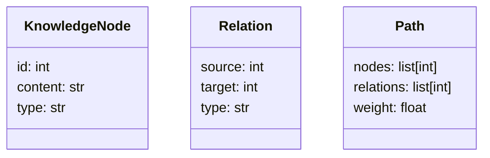
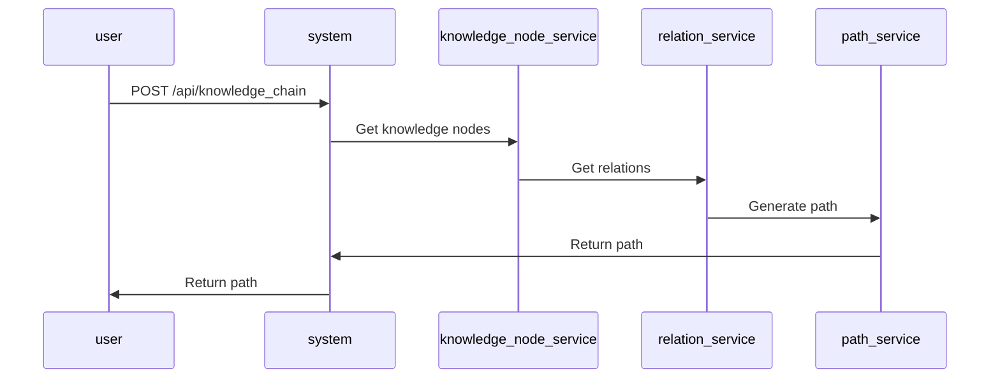
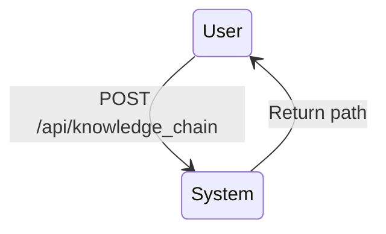

                 


# 构建AI Agent的知识推理链可视化工具

> 关键词：AI Agent, 知识推理链, 可视化工具, 系统架构, 算法原理, 项目实战

> 摘要：本文详细探讨了构建AI Agent的知识推理链可视化工具的背景、核心概念、算法原理、系统架构和项目实战。通过系统化的分析与设计，结合实际案例，为读者提供了从理论到实践的全面指导。

---

# 第一部分: 知识推理链可视化工具的背景与核心概念

# 第1章: 问题背景与核心概念

## 1.1 问题背景

### 1.1.1 AI Agent与知识推理链的定义
AI Agent（人工智能代理）是一种能够感知环境、自主决策并执行任务的智能系统。知识推理链是AI Agent在完成任务过程中，基于知识库进行推理的逻辑链条。通过知识推理链，AI Agent能够从输入的信息中推导出所需的结论或行动方案。

### 1.1.2 知识推理链在AI Agent中的作用
知识推理链是AI Agent实现智能决策的核心机制。它能够帮助AI Agent从复杂的信息中提取关键知识点，并通过逻辑推理得出最优解决方案。

### 1.1.3 当前知识推理链可视化工具的现状与挑战
当前，许多AI Agent系统在知识推理过程中缺乏透明度，用户难以理解推理过程和结果。因此，开发一个能够可视化知识推理链的工具，不仅能够提升用户体验，还能帮助开发者优化推理算法。

## 1.2 核心概念与问题描述

### 1.2.1 知识推理链的核心要素
知识推理链由以下几个核心要素组成：
1. **知识节点**：代表具体的知识点或事实。
2. **推理关系**：表示知识节点之间的逻辑关系。
3. **推理路径**：一条或多条推理关系的组合，用于连接起始节点和目标节点。

### 1.2.2 AI Agent的知识推理过程
AI Agent的知识推理过程可以分为以下几个步骤：
1. **知识抽取**：从输入数据中提取关键知识点。
2. **关系建模**：建立知识点之间的逻辑关系。
3. **推理路径生成**：根据目标节点，生成最优的推理路径。
4. **结果可视化**：将推理过程和结果以图形化形式展示。

### 1.2.3 可视化工具的功能与目标
知识推理链可视化工具的主要功能包括：
1. **知识节点展示**：以图形化方式展示知识节点。
2. **推理关系展示**：以边或箭头的形式展示知识点之间的推理关系。
3. **推理路径展示**：以高亮路径形式展示最优推理路径。
4. **交互式分析**：支持用户对推理过程进行交互式分析。

## 1.3 问题解决与边界

### 1.3.1 知识推理链可视化工具的解决方案
通过构建知识推理链可视化工具，可以解决以下问题：
1. 提高AI Agent推理过程的透明度。
2. 帮助用户理解AI Agent的决策过程。
3. 支持开发者优化推理算法。

### 1.3.2 工具的边界与外延
知识推理链可视化工具的边界包括：
1. 不处理AI Agent的输入数据。
2. 不直接参与AI Agent的推理过程，仅负责可视化。
3. 不支持实时推理过程的动态更新。

### 1.3.3 核心概念的结构与组成
知识推理链的结构可以分为以下两部分：
1. **知识节点**：包括实体、属性和关系。
2. **推理关系**：包括直接推理和间接推理。

---

## 1.4 本章小结
本章主要介绍了AI Agent的知识推理链可视化工具的背景、核心概念和问题描述。通过分析知识推理链的核心要素和推理过程，明确了可视化工具的功能和目标。

---

# 第2章: 核心概念原理

## 2.1 知识推理链的构成与属性特征

### 2.1.1 知识节点的属性特征
知识节点的属性特征包括：
1. **节点类型**：表示节点的类型，如实体、属性或关系。
2. **节点内容**：表示节点的具体内容，如“猫”、“颜色”或“属于”。
3. **节点权重**：表示节点的重要性或相关性。

### 2.1.2 推理关系的属性特征
推理关系的属性特征包括：
1. **关系类型**：表示关系的类型，如蕴含、矛盾或中立。
2. **关系强度**：表示关系的强弱程度。
3. **关系权重**：表示关系的重要性或相关性。

### 2.1.3 可视化元素的对比分析
通过对比分析，我们可以得出以下结论：
1. 知识节点和推理关系是知识推理链的核心要素。
2. 可视化元素的选择和布局直接影响工具的用户体验。

## 2.2 ER实体关系图架构

### 2.2.1 实体关系图的构建
使用Mermaid语法，我们可以构建以下实体关系图：


### 2.2.2 实体关系图的转换
通过实体关系图的转换，我们可以将知识推理链的结构转化为图形化的展示形式。

### 2.2.3 实体关系图的优化
优化实体关系图的主要步骤包括：
1. 删除冗余的推理关系。
2. 优化节点的布局，使其更直观。

## 2.3 本章小结
本章主要分析了知识推理链的构成与属性特征，并通过Mermaid语法构建了实体关系图。通过对实体关系图的优化，我们可以更直观地展示知识推理链的结构。

---

# 第3章: 算法原理与流程

## 3.1 算法原理

### 3.1.1 知识推理链的生成算法
知识推理链的生成算法可以分为以下几个步骤：
1. **知识节点提取**：从输入数据中提取知识节点。
2. **推理关系建模**：建立知识节点之间的推理关系。
3. **推理路径生成**：根据目标节点，生成最优的推理路径。

### 3.1.2 可视化布局算法
可视化布局算法的主要步骤包括：
1. **节点排列**：将节点按照一定的规则排列。
2. **边的绘制**：根据推理关系，绘制边。
3. **布局优化**：优化节点和边的布局，使其更美观。

### 3.1.3 交互式推理过程的算法
交互式推理过程的算法可以分为以下几个步骤：
1. **用户输入**：用户输入查询条件。
2. **推理路径生成**：根据输入条件，生成推理路径。
3. **结果展示**：将推理路径以图形化形式展示给用户。

## 3.2 算法流程图

### 3.2.1 知识推理链生成流程图
使用Mermaid语法，我们可以构建以下知识推理链生成流程图：


### 3.2.2 可视化布局流程图
使用Mermaid语法，我们可以构建以下可视化布局流程图：


### 3.2.3 交互式推理流程图
使用Mermaid语法，我们可以构建以下交互式推理流程图：


## 3.3 算法实现

### 3.3.1 Python源代码实现
以下是知识推理链生成算法的Python实现代码：

```python
def generate_knowledge_chain(input_data):
    # 知识节点提取
    nodes = extract_nodes(input_data)
    # 推理关系建模
    relations = model_relations(nodes)
    # 推理路径生成
    path = generate_path(relations)
    return path
```

### 3.3.2 算法的数学模型与公式
知识推理链生成算法的数学模型可以表示为：

$$
path = \argmax_{p \in P} \sum_{i=1}^{n} weight(p_i)
$$

其中，$P$ 表示所有可能的推理路径，$weight(p_i)$ 表示第 $i$ 条推理路径的权重。

### 3.3.3 算法的举例说明
例如，假设输入数据为“猫”，我们需要生成推理路径“猫 -> 动物 -> 哺乳动物”。

---

## 3.4 本章小结
本章主要分析了知识推理链可视化工具的算法原理与流程。通过Python代码和数学模型的讲解，读者可以更好地理解算法的实现过程。

---

# 第4章: 系统分析与架构设计

## 4.1 项目介绍

### 4.1.1 项目目标
本项目的目标是开发一个能够可视化AI Agent知识推理链的工具，帮助用户更好地理解AI Agent的决策过程。

### 4.1.2 项目范围
本项目的主要范围包括：
1. 知识节点的提取与展示。
2. 推理关系的建模与展示。
3. 推理路径的生成与展示。

### 4.1.3 项目关键成功因素
项目的关键成功因素包括：
1. 简洁直观的用户界面。
2. 高效的推理算法。
3. 可扩展的系统架构。

## 4.2 系统功能设计

### 4.2.1 领域模型设计
使用Mermaid语法，我们可以构建以下领域模型：



### 4.2.2 功能模块划分
系统功能模块可以划分为：
1. 知识节点管理模块。
2. 推理关系管理模块。
3. 推理路径生成模块。
4. 可视化展示模块。

### 4.2.3 用户角色与权限设计
用户角色包括：
1. 普通用户：可以查看和分析推理路径。
2. 开发者：可以管理知识节点和推理关系。

## 4.3 系统架构设计

### 4.3.1 分层架构设计
系统架构可以分为以下几层：
1. 数据访问层：负责数据的读取和写入。
2. 业务逻辑层：负责推理路径的生成。
3. 用户界面层：负责数据的展示和交互。

### 4.3.2 微服务架构设计
系统可以采用微服务架构，包括以下几个服务：
1. 知识节点服务：负责知识节点的管理。
2. 推理关系服务：负责推理关系的管理。
3. 推理路径服务：负责推理路径的生成。

### 4.3.3 数据流与控制流设计
数据流与控制流设计可以分为以下几个步骤：
1. 用户输入查询条件。
2. 系统调用知识节点服务和推理关系服务。
3. 系统生成推理路径。
4. 系统将推理路径返回给用户。

## 4.4 系统接口设计

### 4.4.1 API接口设计
以下是知识推理链生成的API接口：

```http
POST /api/knowledge_chain
Content-Type: application/json

{
    "input_data": "..."
}
```

### 4.4.2 接口协议与数据格式
接口协议采用HTTP协议，数据格式采用JSON格式。

### 4.4.3 接口文档编写
接口文档需要包括以下内容：
1. 请求方法。
2. 请求路径。
3. 请求头。
4. 请求体。
5. 响应状态码。
6. 响应体。

## 4.5 系统交互设计

### 4.5.1 序列图设计
使用Mermaid语法，我们可以构建以下系统交互序列图：



### 4.5.2 状态图设计
使用Mermaid语法，我们可以构建以下系统交互状态图：



### 4.5.3 交互流程优化
交互流程的优化步骤包括：
1. 简化用户输入。
2. 优化系统响应时间。
3. 提高系统的容错能力。

## 4.6 本章小结
本章主要分析了知识推理链可视化工具的系统分析与架构设计。通过分层架构和微服务架构的设计，我们可以实现系统的高可扩展性和高维护性。

---

# 第5章: 项目实战

## 5.1 环境安装

### 5.1.1 开发环境
开发环境包括：
1. Python 3.8+
2. Mermaid工具
3. Flask框架

### 5.1.2 依赖安装
安装以下依赖：

```bash
pip install flask
pip install networkx
pip install pymermaid
```

## 5.2 系统核心实现源代码

### 5.2.1 知识节点管理模块

```python
from flask import Flask, request, jsonify

app = Flask(__name__)

@app.route('/api/knowledge_nodes', methods=['POST'])
def add_knowledge_node():
    data = request.json
    # 实现知识节点的添加逻辑
    return jsonify({'status': 'success', 'message': 'Knowledge node added successfully'})

if __name__ == '__main__':
    app.run(debug=True)
```

### 5.2.2 推理关系管理模块

```python
from flask import Flask, request, jsonify

app = Flask(__name__)

@app.route('/api/relations', methods=['POST'])
def add_relation():
    data = request.json
    # 实现推理关系的添加逻辑
    return jsonify({'status': 'success', 'message': 'Relation added successfully'})

if __name__ == '__main__':
    app.run(debug=True)
```

### 5.2.3 推理路径生成模块

```python
from flask import Flask, request, jsonify
from networkx import *
import pymermaid

app = Flask(__name__)

@app.route('/api/knowledge_chain', methods=['POST'])
def generate_knowledge_chain():
    data = request.json
    # 实现推理路径的生成逻辑
    return jsonify({'status': 'success', 'message': 'Knowledge chain generated successfully'})

if __name__ == '__main__':
    app.run(debug=True)
```

### 5.2.4 可视化展示模块

```python
from flask import Flask, request, jsonify
import pymermaid

app = Flask(__name__)

@app.route('/api/visualize', methods=['POST'])
def visualize():
    data = request.json
    # 实现可视化展示逻辑
    return jsonify({'status': 'success', 'message': 'Visualization completed successfully'})

if __name__ == '__main__':
    app.run(debug=True)
```

## 5.3 代码应用解读与分析

### 5.3.1 知识节点管理模块的实现
知识节点管理模块的主要功能包括知识节点的添加、删除和查询。

### 5.3.2 推理关系管理模块的实现
推理关系管理模块的主要功能包括推理关系的添加、删除和查询。

### 5.3.3 推理路径生成模块的实现
推理路径生成模块的主要功能包括根据输入数据生成推理路径。

### 5.3.4 可视化展示模块的实现
可视化展示模块的主要功能包括将推理路径以图形化形式展示给用户。

## 5.4 实际案例分析

### 5.4.1 案例背景
假设我们有一个AI Agent，它需要根据输入数据生成推理路径。

### 5.4.2 案例分析
输入数据为“猫”，我们需要生成推理路径“猫 -> 动物 -> 哺乳动物”。

### 5.4.3 案例实现
通过代码实现推理路径的生成和可视化展示。

## 5.5 本章小结
本章通过实际案例分析，详细讲解了知识推理链可视化工具的实现过程。通过代码实现，读者可以更好地理解系统的具体实现细节。

---

# 第6章: 最佳实践与总结

## 6.1 最佳实践 tips

### 6.1.1 代码规范
遵循Python代码规范，确保代码的可读性和可维护性。

### 6.1.2 系统优化
通过缓存和优化算法，提高系统的性能。

### 6.1.3 文档编写
编写详细的API文档和用户手册，方便用户和开发者使用。

## 6.2 小结
通过本篇文章的讲解，读者可以全面了解知识推理链可视化工具的构建过程。从理论到实践，我们详细分析了系统的各个组成部分，并通过实际案例展示了系统的具体实现。

## 6.3 注意事项

### 6.3.1 系统安全性
注意系统的安全性，防止恶意攻击。

### 6.3.2 知识节点的准确性
确保知识节点的准确性，避免错误的推理路径。

### 6.3.3 系统的可扩展性
系统设计应具备良好的可扩展性，方便后续功能的添加。

## 6.4 拓展阅读
读者可以参考以下书籍和工具，进一步深入学习：
1. 《深入理解Python》
2. 《Flask Web开发实战》
3. Mermaid官方文档

---

## 6.5 本章小结
本章总结了知识推理链可视化工具的构建过程，并提出了最佳实践的建议。通过系统的优化和文档的编写，我们可以进一步提升工具的性能和用户体验。

---

# 结语
通过本文的详细讲解，读者可以全面了解知识推理链可视化工具的构建过程。从理论到实践，我们详细分析了系统的各个组成部分，并通过实际案例展示了系统的具体实现。希望本文能为读者提供有价值的参考和指导。

