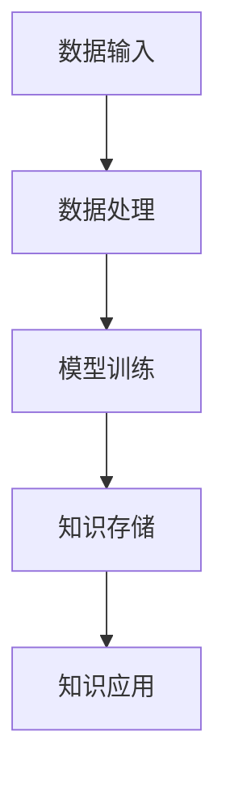

                 


# 构建AI Agent的知识获取Pipeline：从非结构化数据中学习

> **关键词**：AI Agent, 知识获取, 非结构化数据, 机器学习, 深度学习, Pipeline设计

> **摘要**：本文详细探讨了构建AI Agent的知识获取Pipeline，重点从非结构化数据中进行学习。文章首先介绍AI Agent和知识获取Pipeline的基本概念，然后分析非结构化数据的特点和处理方法，接着讲解基于机器学习和深度学习的算法原理，最后通过项目实战展示知识获取Pipeline的设计与实现。本文旨在帮助读者系统地理解如何从非结构化数据中构建高效的AI Agent知识获取系统。

---

## 第1章：AI Agent与知识获取Pipeline概述

### 1.1 AI Agent的基本概念

#### 1.1.1 AI Agent的定义与特点
- **AI Agent**：智能体（Agent）是指在环境中能够感知并自主行动以实现目标的实体。
- **特点**：
  - **自主性**：无需外部干预，自主决策。
  - **反应性**：能够感知环境并实时调整行为。
  - **目标导向**：所有行动以实现特定目标为导向。
  - **社会能力**：能够与其他Agent或人类进行交互协作。

#### 1.1.2 知识获取在AI Agent中的重要性
- **知识获取**：AI Agent通过从数据中学习，获取知识以支持决策和行动。
- **重要性**：
  - 提供决策所需的信息和背景知识。
  - 支持Agent在复杂环境中的自主性。
  - 使Agent能够处理动态变化的环境。

#### 1.1.3 非结构化数据的特点与挑战
- **非结构化数据**：
  - 文本（如新闻文章、社交媒体帖子）。
  - 图像、视频等多模态数据。
- **特点**：
  - 格式多样，无固定结构。
  - 需要复杂的处理方法提取有用信息。
- **挑战**：
  - 数据量大，难以直接处理。
  - 信息提取困难，需要上下文理解。

---

### 1.2 知识获取Pipeline的目标与意义

#### 1.2.1 知识获取Pipeline的定义
- **知识获取Pipeline**：从非结构化数据中提取、处理、存储和应用知识的流程。
- **目标**：
  - 提供结构化的知识表示。
  - 支持AI Agent的决策和行动。
  - 实现高效的知识更新和维护。

#### 1.2.2 知识获取Pipeline的意义
- **提升效率**：自动化处理非结构化数据，减少人工干预。
- **增强决策能力**：通过结构化知识，提高决策的准确性和效率。
- **支持复杂场景**：应对多模态数据和复杂环境，增强AI Agent的适应能力。

---

## 第2章：非结构化数据处理与知识表示

### 2.1 非结构化数据处理

#### 2.1.1 文本预处理
- **分词**：将文本分割成有意义的词语或短语。
- **去除停用词**：移除常见无意义词汇（如“的”、“了”）。
- **词干提取**：将词转换为基本形式（如“running”→“run”）。
- **词袋模型**：统计词频，表示文本内容。

#### 2.1.2 信息抽取
- **命名实体识别（NER）**：识别文本中的实体（如人名、地点）。
- **关系抽取**：识别实体之间的关系（如“公司收购”）。
- **事件抽取**：识别文本中的事件（如“公司发布新产品”）。

#### 2.1.3 数据增强
- **方法**：
  - 同义词替换：将部分词语替换为同义词。
  - 数据扰动：在文本中添加或删除部分信息。
  - 句子重组：重新排列句子结构。

---

### 2.2 知识表示与推理

#### 2.2.1 知识图谱构建
- **知识图谱**：将实体及其关系表示为图结构。
- **构建方法**：
  - 手动构建：专家编写知识。
  - 自动构建：通过文本挖掘生成知识。
- **示例**：构建“公司-产品”关系的知识图谱。

#### 2.2.2 知识表示学习
- **向量表示**：将实体和关系表示为低维向量。
- **方法**：
  - Word2Vec：通过上下文预测词向量。
  - Node2Vec：通过图结构学习节点向量。

#### 2.2.3 知识推理
- **推理算法**：
  - 基于规则的推理：使用逻辑规则进行推理。
  - 基于概率的推理：使用概率模型进行推理。
  - 基于图的推理：通过知识图谱进行路径推理。

---

## 第3章：基于机器学习的知识获取

### 3.1 机器学习基础

#### 3.1.1 监督学习
- **定义**：通过标记数据训练模型，使其能够预测新数据的标签。
- **算法**：
  - 线性回归：预测连续值。
  - 支持向量机（SVM）：分类任务。
  - 随机森林：特征重要性分析。

#### 3.1.2 无监督学习
- **定义**：通过未标记数据发现数据内在结构。
- **算法**：
  - K均值聚类：将数据分成K个簇。
  - 层次聚类：构建层次化的簇结构。
  - 主成分分析（PCA）：降维技术。

#### 3.1.3 半监督学习
- **定义**：结合少量标记数据和大量未标记数据进行学习。
- **算法**：
  - 标签传播：基于图结构传播标签。
  - 半监督SVM：利用少量标记数据和大量未标记数据进行分类。

---

### 3.2 基于深度学习的知识获取

#### 3.2.1 深度学习基础
- **定义**：通过多层神经网络学习数据的高层次特征。
- **常用模型**：
  - 卷积神经网络（CNN）：处理图像数据。
  - 循环神经网络（RNN）：处理序列数据。
  - Transformer：基于自注意力机制的模型。

#### 3.2.2 文本编码与表示
- **文本编码**：
  - 词嵌入（Word Embedding）：将词映射为低维向量。
  - 文本嵌入（Text Embedding）：将整个文本映射为低维向量。
- **算法**：
  - Word2Vec：通过训练语言模型生成词向量。
  - BERT：基于Transformer的预训练语言模型。

#### 3.2.3 知识图谱嵌入
- **知识嵌入**：
  - 将知识图谱中的实体和关系嵌入到低维空间。
  - 使用TransE、TransH等模型进行嵌入学习。

---

## 第4章：知识获取Pipeline的系统架构

### 4.1 系统功能设计

#### 4.1.1 数据输入模块
- **功能**：接收非结构化数据输入。
- **实现**：支持文本、图像等多种数据格式。

#### 4.1.2 数据处理模块
- **功能**：对输入数据进行预处理、特征提取。
- **实现**：包括文本分词、图像增强等操作。

#### 4.1.3 模型训练模块
- **功能**：训练知识表示模型。
- **实现**：使用深度学习模型进行端到端训练。

#### 4.1.4 知识存储模块
- **功能**：存储处理后的知识表示。
- **实现**：使用数据库或知识图谱存储结构化知识。

#### 4.1.5 知识应用模块
- **功能**：将知识应用于实际任务。
- **实现**：包括分类、推理等应用。

### 4.2 系统架构设计

#### 4.2.1 系统架构图


#### 4.2.2 接口设计
- **数据输入接口**：接收非结构化数据。
- **模型训练接口**：提供训练参数和数据。
- **知识应用接口**：接收查询请求，返回结果。

#### 4.2.3 交互流程
```mermaid
sequenceDiagram
    participant 用户
    participant 数据处理模块
    participant 模型训练模块
    participant 知识应用模块
    用户 -> 数据处理模块：输入数据
    数据处理模块 -> 模型训练模块：传递处理后的数据
    模型训练模块 -> 知识应用模块：提供训练好的知识表示
    用户 -> 知识应用模块：进行查询或任务
    知识应用模块 -> 用户：返回结果
```

---

## 第5章：知识获取Pipeline的项目实战

### 5.1 项目背景

#### 5.1.1 项目目标
- 构建一个从非结构化文本中提取实体和关系的知识获取Pipeline。

#### 5.1.2 数据集选择
- 数据集：新闻文章文本。
- 数据预处理：分词、去除停用词。

### 5.2 项目实现

#### 5.2.1 环境安装
```bash
pip install numpy
pip install scikit-learn
pip install spacy
```

#### 5.2.2 数据准备
```python
import spacy

nlp = spacy.load("en_core_web_sm")
text = "Apple is a technology company."
doc = nlp(text)
for token in doc:
    print(token.text, token.pos_)
```

#### 5.2.3 模型实现
```python
from sklearn.feature_extraction.text import TfidfVectorizer
from sklearn.svm import SVC

vectorizer = TfidfVectorizer()
model = SVC()
# 训练模型并进行预测
```

#### 5.2.4 结果分析
- 实体识别结果：提取出“Apple”和“technology”。
- 关系抽取结果：识别出“Apple”是“technology company”。

---

## 第6章：优化与扩展

### 6.1 性能优化

#### 6.1.1 数据预处理优化
- 使用更高效的分词工具，如spaCy或jieba。
- 增加并行处理，加速数据处理流程。

#### 6.1.2 模型优化
- 调整模型超参数，如学习率、正则化系数。
- 使用集成学习，结合多个模型的结果。

#### 6.1.3 知识表示优化
- 使用更复杂的嵌入方法，如BERT。
- 增加上下文信息，提升表示的准确性。

### 6.2 知识获取Pipeline的扩展

#### 6.2.1 多模态数据处理
- 结合图像和文本数据，提升知识获取的全面性。
- 使用多模态模型，如ViLBERT。

#### 6.2.2 大模型的应用
- 使用大语言模型（如GPT-3）进行文本生成和理解。
- 将大模型与知识图谱结合，增强推理能力。

#### 6.2.3 知识图谱的动态更新
- 实时更新知识图谱，保持知识的时效性。
- 使用流数据处理技术，动态更新知识表示。

---

## 第7章：总结与展望

### 7.1 总结
- 本文详细介绍了构建AI Agent的知识获取Pipeline，从非结构化数据中提取和表示知识的方法。
- 通过理论分析和项目实战，展示了如何设计和实现高效的Pipeline。

### 7.2 展望
- **未来研究方向**：
  - 多模态数据处理：结合文本、图像等多种数据源。
  - 可解释性研究：提高知识获取的透明性和可解释性。
  - 智能化更新：实现知识的自动更新和维护。
- **技术发展趋势**：
  - 增强学习：通过强化学习优化知识获取流程。
  - 联邦学习：在分布式环境中进行知识获取。

---

通过本文的学习，读者可以掌握从非结构化数据中构建AI Agent知识获取Pipeline的核心方法和技巧，为实际应用提供有力的支持。

