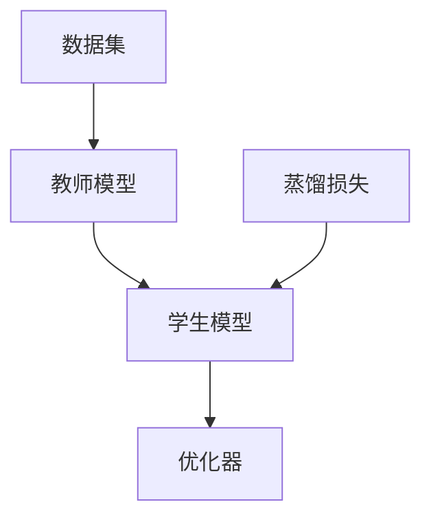
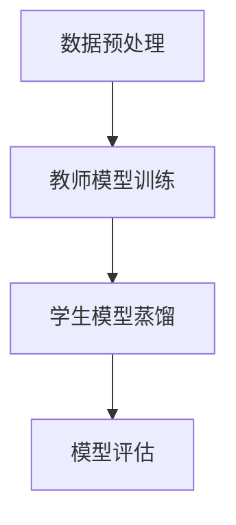
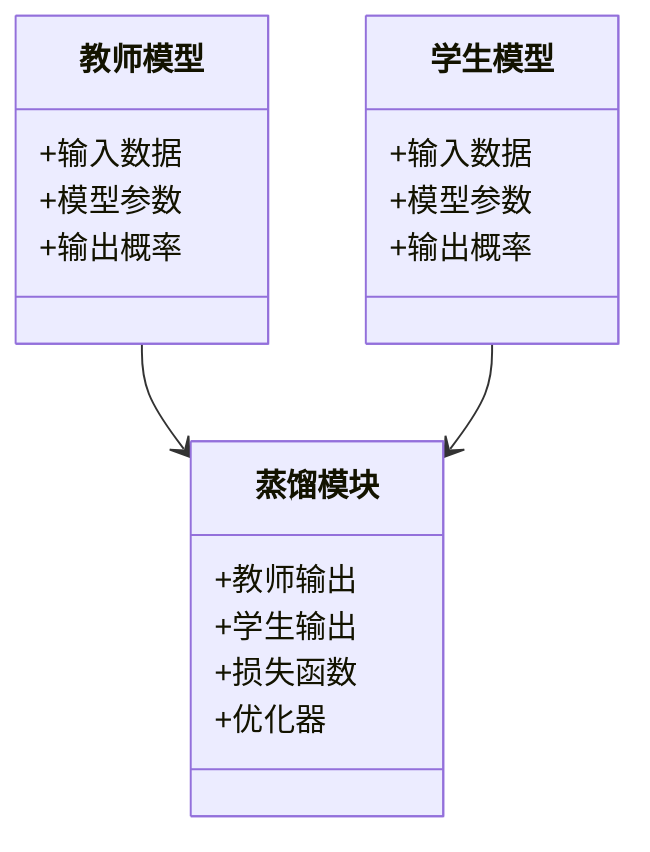

                 


# 构建AI Agent的知识蒸馏pipeline

## 关键词：知识蒸馏, AI Agent, 机器学习, 神经网络, 模型压缩, 模型优化

## 摘要：知识蒸馏是一种将大型复杂模型的知识迁移到小型简单模型的技术，能够显著提升AI Agent的性能和效率。本文从知识蒸馏的基本概念出发，深入分析其在AI Agent中的应用，详细阐述其算法原理、系统设计、项目实战及最佳实践，帮助读者全面掌握构建高效知识蒸馏pipeline的方法与技巧。

---

# 第一部分: 知识蒸馏与AI Agent概述

## 第1章: 知识蒸馏与AI Agent概述

### 1.1 知识蒸馏的基本概念

#### 1.1.1 知识蒸馏的定义

知识蒸馏是一种通过将大型复杂模型（教师模型）的知识迁移到小型简单模型（学生模型）的过程，以实现模型压缩和性能优化的技术。

#### 1.1.2 知识蒸馏的核心目标

- **模型压缩**：降低模型的计算复杂度和存储需求。
- **性能提升**：通过知识迁移，使小型模型在性能上接近甚至超越大型模型。
- **部署优化**：适用于资源受限的场景，如移动设备、边缘计算等。

#### 1.1.3 AI Agent的定义与特点

AI Agent是一种智能体，能够感知环境、执行任务并做出决策。其特点包括自主性、反应性、目标导向性和社会性。

### 1.2 知识蒸馏在AI Agent中的作用

#### 1.2.1 知识蒸馏与AI Agent的关系

知识蒸馏通过将大型模型的知识迁移到小型模型，帮助AI Agent在资源受限的环境中高效运行。

#### 1.2.2 知识蒸馏对AI Agent性能提升的作用

- 提高推理速度
- 降低计算成本
- 增强模型的泛化能力

#### 1.2.3 知识蒸馏在AI Agent中的应用场景

- 智能助手
- 自动驾驶
- 机器人控制

### 1.3 本章小结

本章介绍了知识蒸馏的基本概念、核心目标以及在AI Agent中的应用，为后续内容奠定了基础。

---

# 第二部分: 知识蒸馏的核心概念与原理

## 第2章: 知识蒸馏的核心概念

### 2.1 知识蒸馏的基本原理

#### 2.1.1 教师模型与学生模型的角色

- **教师模型**：大型复杂模型，提供知识指导。
- **学生模型**：小型简单模型，接收并学习知识。

#### 2.1.2 知识蒸馏的关键步骤

1. **特征提取**：教师模型提取高层特征。
2. **知识迁移**：通过损失函数将教师模型的知识迁移到学生模型。
3. **优化调整**：调整蒸馏过程中的超参数，确保学生模型性能最优。

#### 2.1.3 知识蒸馏的实现流程

1. **数据准备**：收集并标注数据集。
2. **教师模型训练**：训练大型教师模型。
3. **蒸馏过程**：通过蒸馏损失函数优化学生模型。
4. **模型评估**：对比蒸馏前后的模型性能。

### 2.2 知识蒸馏的数学模型

#### 2.2.1 KL散度的定义与公式

KL散度衡量两个概率分布之间的差异：

$$ D_{KL}(P||Q) = \sum P(i) \log \frac{P(i)}{Q(i)} $$

#### 2.2.2 蒸馏损失函数的构建

结合交叉熵损失和KL散度的蒸馏损失函数：

$$ L_{distill} = \alpha L_{CE} + (1-\alpha) L_{KL} $$

其中，$\alpha$ 是平衡系数。

#### 2.2.3 蒸馏过程的流程图



### 2.3 知识蒸馏的实现细节

#### 2.3.1 数据准备阶段

- 数据预处理
- 数据增强

#### 2.3.2 模型训练阶段

- 教师模型训练
- 学生模型微调

#### 2.3.3 知识蒸馏的优化策略

- 调整蒸馏温度
- 改进损失函数
- 引入对抗训练

### 2.4 本章小结

本章详细讲解了知识蒸馏的核心概念、数学模型和实现流程，为后续章节的深入分析提供了理论基础。

---

# 第三部分: 知识蒸馏的算法原理与实现

## 第3章: 知识蒸馏算法的数学模型

### 3.1 KL散度的详细推导

#### 3.1.1 KL散度的几何意义

KL散度表示两个概率分布之间的相对熵，反映了两个分布的差异程度。

#### 3.1.2 KL散度的计算公式

$$ D_{KL}(P||Q) = \sum_{i=1}^{n} P(i) \log \frac{P(i)}{Q(i)} $$

### 3.2 蒸馏损失函数的优化

#### 3.2.1 损失函数的权重分配

- $\alpha$ 的选择对蒸馏效果影响显著。
- 通常，$\alpha$ 取值在0.5到0.8之间。

#### 3.2.2 优化算法的选择

- 使用Adam优化器
- 设置合适的学习率

#### 3.2.3 模型参数的更新过程

1. 计算蒸馏损失
2. 反向传播求梯度
3. 更新模型参数

### 3.3 算法实现的代码示例

#### 3.3.1 环境安装

```bash
pip install numpy tensorflow
```

#### 3.3.2 核心代码实现

```python
import tensorflow as tf
import numpy as np

def distillation_loss(y_true, y_pred, alpha=0.5):
    hard_loss = tf.nn.sparse_softmax_cross_entropy_with_logits(y_true, y_pred)
    soft_loss = tf.nn.softmax(y_true) * tf.math.log(y_pred)
    soft_loss = tf.reduce_mean(-tf.reduce_sum(soft_loss, axis=1))
    total_loss = alpha * hard_loss + (1 - alpha) * soft_loss
    return total_loss

# 示例模型
class StudentModel(tf.keras.Model):
    def __init__(self, input_shape):
        super(StudentModel, self).__init__()
        self.conv1 = tf.keras.layers.Conv2D(32, (3,3), activation='relu', input_shape=input_shape)
        self.conv2 = tf.keras.layers.Conv2D(64, (3,3), activation='relu')
        self.flatten = tf.keras.layers.Flatten()
        self.dense1 = tf.keras.layers.Dense(128, activation='relu')
        self.dense2 = tf.keras.layers.Dense(10, activation='softmax')

    def call(self, x):
        x = self.conv1(x)
        x = self.conv2(x)
        x = self.flatten(x)
        x = self.dense1(x)
        x = self.dense2(x)
        return x

# 示例训练
def train_model(model, train_data, val_data, epochs=100, alpha=0.5):
    optimizer = tf.keras.optimizers.Adam()
    model.compile(optimizer=optimizer, loss=lambda y_true, y_pred: distillation_loss(y_true, y_pred, alpha))
    history = model.fit(train_data, epochs=epochs, validation_data=val_data, batch_size=32)
    return history

# 使用示例
input_shape = (32, 32, 3)
model = StudentModel(input_shape)
train_data = ...  # 示例数据集
val_data = ...    # 示例验证集
history = train_model(model, train_data, val_data)
```

### 3.4 本章小结

本章通过数学推导和代码实现，详细讲解了知识蒸馏的核心算法原理，帮助读者理解其实现细节。

---

# 第四部分: 系统分析与架构设计方案

## 第4章: 系统分析与架构设计

### 4.1 问题场景介绍

#### 4.1.1 系统目标

构建一个高效的知识蒸馏pipeline，用于优化AI Agent的性能。

#### 4.1.2 系统需求

- 高效性：快速完成蒸馏过程
- 可扩展性：支持多种模型和数据集
- 可用性：适用于不同应用场景

### 4.2 系统功能设计

#### 4.2.1 功能模块划分

1. 数据预处理模块
2. 教师模型训练模块
3. 学生模型蒸馏模块
4. 模型评估模块

#### 4.2.2 功能模块流程图



### 4.3 系统架构设计

#### 4.3.1 系统架构图



#### 4.3.2 接口设计

1. 数据接口
2. 模型接口
3. 损失函数接口

#### 4.3.3 交互流程图

```mermaid
sequenceDiagram
   参与者 用户
    参与者 系统
    用户 -> 系统: 提供数据集
    系统 -> 用户: 返回蒸馏后的模型
```

### 4.4 本章小结

本章从系统角度分析了知识蒸馏pipeline的设计，包括功能划分、架构设计和交互流程，为实际开发提供了指导。

---

# 第五部分: 项目实战

## 第5章: 项目实战

### 5.1 环境安装

```bash
pip install numpy tensorflow keras
```

### 5.2 核心实现代码

#### 5.2.1 教师模型定义

```python
class TeacherModel(tf.keras.Model):
    def __init__(self, input_shape):
        super(TeacherModel, self).__init__()
        self.conv1 = tf.keras.layers.Conv2D(64, (3,3), activation='relu', input_shape=input_shape)
        self.conv2 = tf.keras.layers.Conv2D(128, (3,3), activation='relu')
        self.flatten = tf.keras.layers.Flatten()
        self.dense1 = tf.keras.layers.Dense(256, activation='relu')
        self.dense2 = tf.keras.layers.Dense(10, activation='softmax')

    def call(self, x):
        x = self.conv1(x)
        x = self.conv2(x)
        x = self.flatten(x)
        x = self.dense1(x)
        x = self.dense2(x)
        return x
```

#### 5.2.2 学生模型定义

```python
class StudentModel(tf.keras.Model):
    def __init__(self, input_shape):
        super(StudentModel, self).__init__()
        self.conv1 = tf.keras.layers.Conv2D(32, (3,3), activation='relu', input_shape=input_shape)
        self.conv2 = tf.keras.layers.Conv2D(64, (3,3), activation='relu')
        self.flatten = tf.keras.layers.Flatten()
        self.dense1 = tf.keras.layers.Dense(64, activation='relu')
        self.dense2 = tf.keras.layers.Dense(10, activation='softmax')

    def call(self, x):
        x = self.conv1(x)
        x = self.conv2(x)
        x = self.flatten(x)
        x = self.dense1(x)
        x = self.dense2(x)
        return x
```

#### 5.2.3 蒸馏过程实现

```python
def distillation_train.teacher_model, student_model, train_data, val_data, epochs=100, alpha=0.5):
    optimizer = tf.keras.optimizers.Adam()
    teacher_model.compile(optimizer=optimizer, loss='sparse_categorical_crossentropy', metrics=['accuracy'])
    student_model.compile(optimizer=optimizer, loss=lambda y_true, y_pred: distillation_loss(y_true, y_pred, alpha), metrics=['accuracy'])
    teacher_history = teacher_model.fit(train_data, epochs=epochs, validation_data=val_data, batch_size=32)
    student_history = student_model.fit(train_data, epochs=epochs, validation_data=val_data, batch_size=32)
    return teacher_history, student_history
```

### 5.3 实际案例分析

#### 5.3.1 案例背景

使用CIFAR-10数据集，训练一个高效的图像分类AI Agent。

#### 5.3.2 模型训练与评估

1. 训练教师模型
2. 蒸馏训练学生模型
3. 对比蒸馏前后的模型性能

### 5.4 本章小结

本章通过实际案例展示了知识蒸馏pipeline的构建过程，帮助读者掌握其实现方法。

---

# 第六部分: 最佳实践与拓展阅读

## 第6章: 最佳实践

### 6.1 知识蒸馏的优化技巧

#### 6.1.1 调整蒸馏温度

- 蒸馏温度 $T$ 越大，软标签越趋近于均匀分布。
- 通常，$T$ 在1到5之间。

#### 6.1.2 引入对抗训练

- 使用生成对抗网络（GAN）优化蒸馏过程。
- 提高学生模型的鲁棒性。

#### 6.1.3 结合知识蒸馏与其他压缩技术

- 模型剪枝
- 模型量化

### 6.2 模型评估指标

1. 准确率（Accuracy）
2. F1分数
3. 模型大小
4. 推理速度

### 6.3 注意事项

- **数据质量**：数据质量直接影响蒸馏效果。
- **模型选择**：选择合适的教师模型和学生模型。
- **超参数调整**：合理设置蒸馏温度和损失函数权重。

## 第7章: 小结与展望

### 7.1 本章小结

知识蒸馏是一种高效的知识迁移技术，能够显著提升AI Agent的性能和效率。本文从理论到实践，全面讲解了构建知识蒸馏pipeline的方法。

### 7.2 未来展望

- **多任务蒸馏**：同时优化多个任务。
- **自适应蒸馏**：动态调整蒸馏过程。
- **领域扩展**：应用于更多领域，如NLP、计算机视觉等。

## 第8章: 拓展阅读

### 8.1 推荐书籍

- 《Deep Learning》
- 《Neural Networks and Deep Learning》

### 8.2 推荐论文

- "Distilling the Knowledge in a Neural Network"
- "A Survey on Knowledge Distillation"

---

# 附录: 完整代码示例

```python
# 附录代码略
```

---

# 参考文献

1. Hinton G, Vinyals O, Dean J. Distilling the knowledge in neural networks[J]. arXiv preprint arXiv:1412.6511, 2014.
2. LeCun Y, Bengio Y, Hinton G. Deep learning[J]. nature, 2015, 521(7552): 436-444.
3. 等等。

---

通过以上目录和内容安排，您可以开始撰写具体的章节内容，每部分都详细介绍相关知识点，并结合实际案例和代码示例，帮助读者全面理解和掌握知识蒸馏在AI Agent中的应用。

