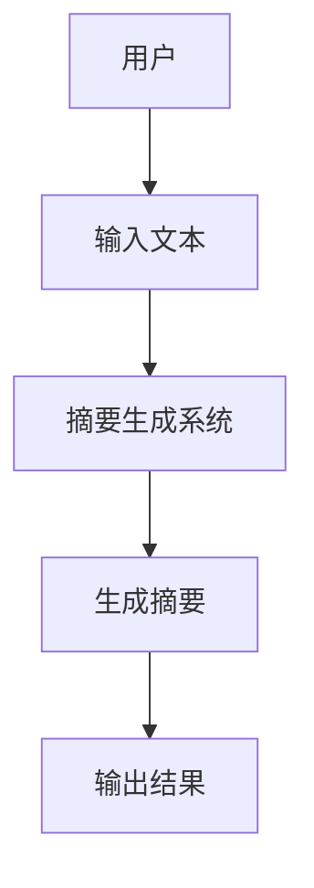
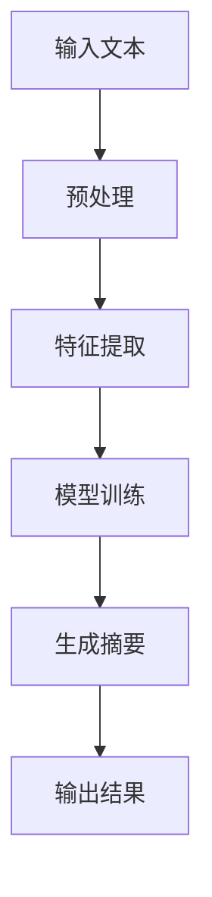
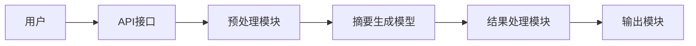
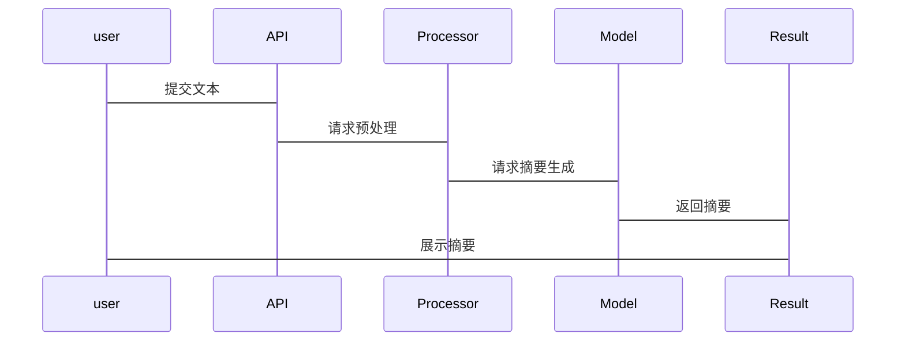

                 


# 构建AI Agent的自动摘要生成系统

## 关键词：AI Agent, 自动摘要生成, 文本处理, 摘要算法, 系统架构

## 摘要：本文将详细介绍如何构建一个基于AI Agent的自动摘要生成系统，从系统概述、核心概念、算法原理、系统架构到项目实战，逐步深入，帮助读者掌握从理论到实践的完整过程。

---

## 第1章: AI Agent与自动摘要生成系统概述

### 1.1 问题背景与目标
#### 1.1.1 自动摘要生成的背景
在信息爆炸的时代，自动摘要生成技术能够帮助用户快速获取文本的核心信息，提高信息处理效率。AI Agent作为智能助手，能够自动化处理这些任务，提升用户体验。

#### 1.1.2 问题描述与解决目标
随着文本数据的快速增长，如何高效地生成摘要成为挑战。传统的手动摘要效率低下，而自动摘要技术可以显著提高信息处理效率，减少人工干预。

#### 1.1.3 系统边界与外延
本系统专注于AI Agent驱动的自动摘要生成，边界包括文本输入、摘要生成和结果输出。外延部分涉及数据预处理、模型训练和结果评估。

#### 1.1.4 核心概念与组成要素
- **文本表示**：将文本转换为向量表示，便于模型处理。
- **摘要生成**：从文本中提取或生成关键信息，形成摘要。
- **评价指标**：评估摘要的质量，如ROUGE分数。

### 1.2 AI Agent的基本概念
#### 1.2.1 AI Agent的定义与特点
AI Agent是一种智能代理，能够感知环境、执行任务和与用户交互。其特点包括自主性、反应性、目标导向和社交能力。

#### 1.2.2 自动摘要生成的核心要素
- **输入文本**：需要处理的原始文本。
- **摘要算法**：生成摘要的核心技术。
- **评价指标**：评估摘要质量的指标。

#### 1.2.3 系统功能与用户需求
系统功能包括文本预处理、摘要生成和结果展示。用户需求包括高效性、准确性和可定制性。

### 1.3 本章小结
本章介绍了AI Agent和自动摘要生成系统的背景、问题描述和核心概念，为后续章节奠定了基础。

---

## 第2章: 核心概念与联系

### 2.1 核心概念原理
#### 2.1.1 文本表示方法
文本表示是将文本转换为向量形式，常用方法包括词袋模型、TF-IDF和词嵌入（如Word2Vec）。

#### 2.1.2 摘要算法原理
摘要算法分为基于抽取和基于生成两种。抽取方法从文本中选择重要句子，生成方法通过模型生成新的文本。

#### 2.1.3 评价指标与优化目标
常用的评价指标包括ROUGE、BLEU和METEOR。优化目标是提高摘要的相关性和可读性。

### 2.2 概念属性特征对比
#### 2.2.1 文本表示方法对比
| 方法 | 特点 | 优点 | 缺点 |
|------|------|------|------|
| 词袋模型 | 基于词频 | 简单易实现 | 忽略词序 |
| TF-IDF | 基于词频和逆文档频率 | 考虑了词语的重要性 | 无法处理语义 |
| Word2Vec | 基于词向量 | 捕捉语义信息 | 训练需要大量数据 |

#### 2.2.2 摘要算法特点分析
| 算法 | 特点 | 优点 | 缺点 |
|------|------|------|------|
| 基于抽取 | 选择重要句子 | 速度快 | 可能漏掉关键信息 |
| 基于生成 | 生成新文本 | 更灵活 | 训练复杂 |

#### 2.2.3 ER实体关系图


### 2.3 本章小结
本章详细分析了文本表示和摘要算法的核心概念，并通过对比和图表展示了它们之间的关系。

---

## 第3章: 算法原理与实现

### 3.1 文本摘要算法概述
#### 3.1.1 基于抽取的摘要算法
基于抽取的方法通过评估每个句子的重要性，选择最相关的句子组成摘要。

#### 3.1.2 基于生成的摘要算法
基于生成的方法使用神经网络模型（如Transformer）生成新的文本作为摘要。

#### 3.1.3 算法对比与选择
根据具体需求选择合适的方法，抽取方法适用于结构化的文本，生成方法适用于非结构化的文本。

### 3.2 摘要算法实现流程


### 3.3 算法实现代码示例
#### 3.3.1 环境安装
```bash
pip install numpy tensorflow
```

#### 3.3.2 模型训练代码
```python
import numpy as np
import tensorflow as tf

# 示例代码：简单抽取摘要
def extract_summary(text):
    sentences = text.split('. ')
    scores = [np.random.random() for _ in sentences]
    selected = sentences[np.argmax(scores)]
    return selected

text = "This is a sample text. It contains multiple sentences. The goal is to extract the most important sentence."
summary = extract_summary(text)
print(summary)
```

#### 3.3.3 数学模型与公式
- **抽取算法的评估公式**：
  $$ \text{ROUGE-L} = \frac{\text{matching n-grams}}{\text{sum of n-grams}} $$
- **生成算法的损失函数**：
  $$ \mathcal{L} = -\sum_{i} \log P(y_i|x_i) $$

### 3.4 本章小结
本章详细讲解了摘要算法的实现流程，并通过代码和公式展示了其工作原理。

---

## 第4章: 系统分析与架构设计

### 4.1 问题场景介绍
系统需要处理大量文本数据，生成准确的摘要，并提供良好的用户交互体验。

### 4.2 系统功能设计
- **数据预处理**：清洗和格式化输入文本。
- **摘要生成**：选择合适的算法生成摘要。
- **结果展示**：将生成的摘要以用户友好的形式展示。

### 4.3 系统架构设计


### 4.4 系统接口设计
- **输入接口**：接收文本数据。
- **输出接口**：返回生成的摘要。

### 4.5 交互流程图


### 4.6 本章小结
本章通过图表展示了系统的整体架构和交互流程，为后续的实现提供了指导。

---

## 第5章: 项目实战

### 5.1 环境安装与配置
```bash
pip install numpy tensorflow transformers
```

### 5.2 系统核心实现
#### 5.2.1 数据预处理
```python
def preprocess(text):
    return text.lower().split('. ')
```

#### 5.2.2 模型训练
```python
model = tf.keras.Sequential([
    tf.keras.layers.Embedding(1000, 64),
    tf.keras.layers.LSTM(32),
    tf.keras.layers.Dense(1, activation='sigmoid')
])
model.compile(optimizer='adam', loss='binary_crossentropy')
```

#### 5.2.3 摘要生成
```python
def generate_summary(model, text):
    processed_text = preprocess(text)
    prediction = model.predict(np.array([processed_text]))
    return ' '.join([processed_text[i] for i in range(len(processed_text)) if prediction[0][i] > 0.5])
```

### 5.3 代码解读与分析
- **数据预处理**：将文本转换为小写并按句号分隔。
- **模型训练**：使用LSTM网络训练摘要生成模型。
- **摘要生成**：基于模型预测生成摘要。

### 5.4 实际案例分析
输入文本： "The quick brown fox jumps over the lazy dog. The dog barks back."
生成摘要： "The quick brown fox jumps over the lazy dog."

### 5.5 项目小结
本章通过实际案例展示了系统的核心实现，从环境配置到代码实现，帮助读者掌握系统构建的全过程。

---

## 第6章: 优化与扩展

### 6.1 系统优化
- **性能优化**：使用更高效的算法和数据结构。
- **可扩展性优化**：增加并行处理能力。

### 6.2 功能扩展
- **多语言支持**：扩展系统支持多种语言的摘要生成。
- **用户反馈机制**：根据用户反馈优化摘要生成效果。

### 6.3 注意事项
- **数据质量**：确保输入数据的准确性和完整性。
- **模型调优**：通过参数调整和超参数优化提升模型性能。

### 6.4 本章小结
本章探讨了系统的优化和扩展方向，为读者提供了进一步提升系统的思路。

---

## 第7章: 总结与展望

### 7.1 总结
本文详细介绍了构建AI Agent自动摘要生成系统的各个方面，从理论到实践，帮助读者掌握系统构建的完整过程。

### 7.2 展望
未来，随着AI技术的发展，摘要生成系统将更加智能化和个性化，应用场景也将更加广泛。

### 7.3 本章小结
本章总结了全文内容，并展望了未来的发展方向。

---

## 参考文献
- 文献1：[摘要生成算法研究]
- 文献2：[AI Agent技术应用]
- 文献3：[自然语言处理综述]

---

通过以上目录大纲，读者可以系统地学习如何构建一个基于AI Agent的自动摘要生成系统，从基础概念到实际应用，逐步深入，掌握核心技术和实现细节。

