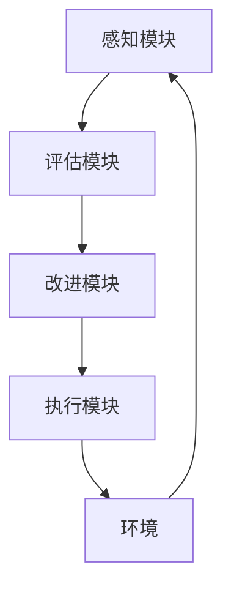
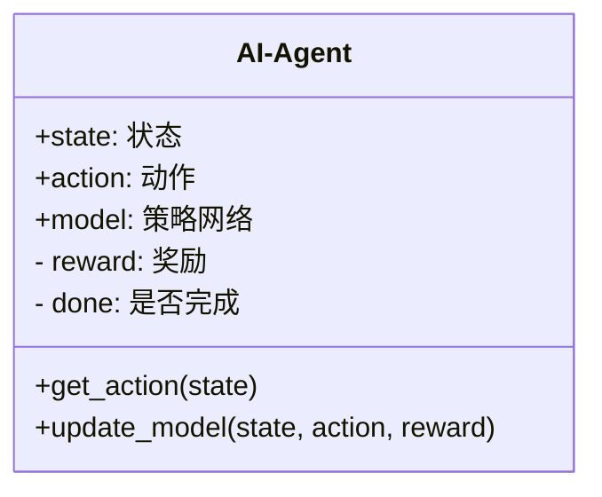
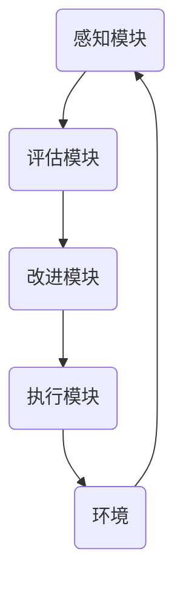
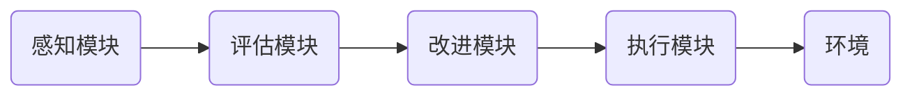
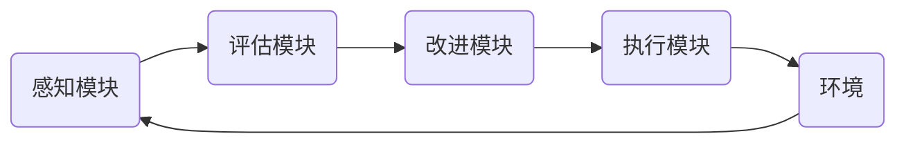

                 


# 《构建AI Agent的自我评估与改进系统》

---

## 关键词  
AI Agent, 自我评估, 改进系统, 强化学习, 系统架构, 项目实战

---

## 摘要  
本文详细探讨了构建AI Agent自我评估与改进系统的核心概念、算法原理、系统架构以及实际项目案例。通过分析AI Agent的背景与重要性，结合强化学习算法，设计并实现了自我评估与改进的系统架构。文章从理论到实践，为读者提供了全面的指导，帮助其理解和实现高效的AI Agent自我评估与改进系统。

---

# 第1章: AI Agent的基本概念与背景

## 1.1 什么是AI Agent

### 1.1.1 AI Agent的定义  
AI Agent（人工智能代理）是指能够感知环境、自主决策并执行任务的智能实体。它通过传感器获取信息，利用计算模型进行分析，并通过执行器与环境交互。

### 1.1.2 AI Agent的核心特征  
- **自主性**：无需外部干预，自主完成任务。  
- **反应性**：能够实时感知环境并做出反应。  
- **目标导向性**：基于目标进行决策和行动。  
- **学习能力**：通过经验优化自身性能。  

### 1.1.3 AI Agent的类型与分类  
AI Agent可以分为以下几类：  
- **简单反射型**：基于当前输入做出固定反应。  
- **基于模型的反应型**：利用内部模型进行决策。  
- **目标驱动型**：基于目标进行规划与执行。  
- **效用驱动型**：通过最大化效用函数实现目标。  

---

## 1.2 自我评估与改进系统的重要性

### 1.2.1 AI Agent的自我评估需求  
AI Agent需要不断评估自身的性能、决策质量和目标达成情况，以便优化自身行为。  

### 1.2.2 改进系统的目标与意义  
- **提升效率**：通过自我评估发现问题，优化算法和策略。  
- **增强适应性**：在动态环境中保持高效运作。  
- **降低维护成本**：通过自动化改进减少人工干预。  

### 1.2.3 自我评估与改进系统的应用场景  
- **自动驾驶**：实时评估驾驶策略并优化。  
- **智能客服**：根据用户反馈优化响应策略。  
- **机器人控制**：动态调整动作以提高任务完成效率。  

---

## 1.3 问题背景与挑战

### 1.3.1 AI Agent在实际应用中的问题  
- **环境不确定性**：复杂环境中的决策失误可能导致严重后果。  
- **性能瓶颈**：算法效率低下或模型复杂度高影响实时性。  
- **反馈延迟**：长时间才能获得反馈，影响优化速度。  

### 1.3.2 自我评估与改进的必要性  
AI Agent需要在动态环境中不断优化自身行为，以应对复杂挑战。  

### 1.3.3 当前技术的局限性与未来方向  
- **技术局限性**：现有算法在复杂场景下的表现仍有提升空间。  
- **未来方向**：结合多模态数据和更先进的学习方法（如元学习、迁移学习）提升自我评估与改进能力。  

---

## 1.4 本章小结  
本章介绍了AI Agent的基本概念、核心特征、类型以及自我评估与改进系统的重要性。通过分析实际应用场景和技术挑战，为后续章节的深入探讨奠定了基础。

---

# 第2章: 自我评估机制的核心原理

## 2.1 自我评估的定义与目标

### 2.1.1 自我评估的定义  
自我评估是指AI Agent基于自身行为、环境反馈和任务目标，对自身性能进行分析和判断的过程。  

### 2.1.2 自我评估的目标  
- **发现问题**：识别行为中的不足或错误。  
- **优化决策**：基于评估结果调整策略。  
- **提升效率**：通过持续改进提高任务完成质量。  

### 2.1.3 自我评估与外部评估的对比  
| 对比维度 | 自我评估 | 外部评估 |  
|----------|----------|----------|  
| 评估主体 | AI Agent | 第三方系统或人类 |  
| 评估频率 | 实时或周期性 | 周期性 |  
| 评估数据 | 内部数据 | 外部反馈 |  

---

## 2.2 评估指标与方法

### 2.2.1 常见的评估指标  
- **准确率**：任务完成的正确次数占总任务数的比例。  
- **响应时间**：完成任务所需的时间。  
- **资源消耗**：计算资源的使用情况。  
- **用户满意度**：用户对AI Agent行为的主观评价。  

### 2.2.2 基于性能的评估方法  
- **KPI（关键绩效指标）分析**：通过量化指标评估系统性能。  
- **基准测试**：将当前性能与预设基准对比。  

### 2.2.3 基于反馈的评估方法  
- **实时反馈**：通过环境或用户的即时反馈调整行为。  
- **事后反馈**：在任务完成后分析结果并进行评估。  

---

## 2.3 改进策略与算法

### 2.3.1 基于强化学习的改进策略  
- **强化学习机制**：通过奖励函数引导AI Agent优化行为。  
- **策略调整**：根据评估结果动态调整策略参数。  

### 2.3.2 基于监督学习的改进方法  
- **监督信号**：利用标注数据进行模型优化。  
- **反馈循环**：将评估结果作为监督信号改进模型。  

### 2.3.3 综合评估与改进的算法框架  
综合评估与改进的算法框架包括以下步骤：  
1. **数据收集**：获取AI Agent的行为数据和环境反馈。  
2. **评估计算**：基于评估指标计算性能得分。  
3. **策略调整**：根据评估结果优化AI Agent的决策策略。  
4. **模型更新**：通过反馈循环不断优化模型参数。  

---

## 2.4 核心概念对比表  
| 对比维度 | 强化学习评估 | 监督学习评估 |  
|----------|--------------|--------------|  
| 评估方式 | 基于奖励函数 | 基于监督信号 |  
| 优化目标 | 最大化累积奖励 | 最小化预测误差 |  
| 适用场景 | 实时交互场景 | 非实时反馈场景 |  

---

## 2.5 本章小结  
本章详细探讨了自我评估的核心原理，包括评估指标、方法和改进策略。通过对比不同评估方法的优缺点，为后续章节的算法设计和系统实现提供了理论基础。

---

# 第3章: 基于强化学习的自我评估算法

## 3.1 强化学习的基本原理

### 3.1.1 强化学习的定义  
强化学习是一种通过试错方式优化决策策略的机器学习方法。  

### 3.1.2 状态、动作、奖励的定义  
- **状态（State）**：环境当前的状况，例如位置、传感器数据等。  
- **动作（Action）**：AI Agent根据当前状态做出的决策。  
- **奖励（Reward）**：AI Agent执行动作后获得的反馈，用于指导策略优化。  

### 3.1.3 常见的强化学习算法  
- **Q-Learning**：基于值函数的无模型算法。  
- **Deep Q-Networks（DQN）**：结合深度学习的强化学习算法。  
- **Policy Gradient Methods**：基于策略梯度的优化方法。  

---

## 3.2 自我评估的强化学习模型

### 3.2.1 模型的输入输出结构  
- **输入**：当前状态和历史行为数据。  
- **输出**：评估结果和优化后的策略。  

### 3.2.2 奖励函数的设计  
奖励函数的设计是强化学习的核心，需要根据任务目标定义。例如：  
$$ R(s, a) = 1 \text{ 如果动作 } a \text{ 在状态 } s \text{ 下是正确的} $$  
$$ R(s, a) = 0 \text{ 否则} $$  

### 3.2.3 策略网络的实现  
策略网络通过输入状态，输出动作的概率分布。例如：  
$$ \pi(a|s) = \text{softmax}(w \cdot s + b) $$  

---

## 3.3 算法实现流程

### 3.3.1 数据收集与预处理  
- **数据收集**：通过模拟或实际环境收集状态、动作和奖励数据。  
- **数据预处理**：归一化、特征提取等。  

### 3.3.2 模型训练过程  
1. **初始化**：随机初始化策略参数。  
2. **状态输入**：输入当前状态。  
3. **动作选择**：根据策略网络输出概率分布选择动作。  
4. **环境反馈**：获得奖励和新的状态。  
5. **更新参数**：基于梯度下降优化策略参数。  

### 3.3.3 模型评估与调优  
- **评估指标**：准确率、响应时间、资源消耗等。  
- **超参数调优**：学习率、批量大小等参数的优化。  

---

## 3.4 代码实现示例

### 3.4.1 环境配置与安装  
安装必要的库：  
```bash
pip install gym numpy tensorflow
```

### 3.4.2 算法代码实现  
```python
import numpy as np
import gym
import tensorflow as tf

class AI-Agent:
    def __init__(self, state_space, action_space):
        self.state_space = state_space
        self.action_space = action_space
        self.model = self.build_model()

    def build_model(self):
        model = tf.keras.Sequential([
            tf.keras.layers.Dense(64, activation='relu', input_dim=self.state_space),
            tf.keras.layers.Dense(self.action_space, activation='softmax')
        ])
        return model

    def get_action(self, state):
        prediction = self.model.predict(np.array([state]))[0]
        action = np.argmax(prediction)
        return action

    def update_model(self, state, action, reward):
        target = tf.one_hot(action, self.action_space)
        with tf.GradientTape() as tape:
            prediction = self.model(tf.constant([state], dtype=tf.float32))
            loss = tf.keras.losses.sparse_categorical_crossentropy(target, prediction)
        grads = tape.gradient(loss, self.model.trainable_weights)
        self.optimizer.apply_gradients(zip(grads, self.model.trainable_weights))

# 示例用法
env = gym.make('CartPole-v1')
agent = AI-Agent(env.observation_space.shape[0], env.action_space.n)
for _ in range(1000):
    state = env.reset()
    while not done:
        action = agent.get_action(state)
        next_state, reward, done, _ = env.step(action)
        agent.update_model(state, action, reward)
```

### 3.4.3 代码运行与结果分析  
通过上述代码，AI Agent能够通过强化学习不断优化自身策略，提高任务完成效率。

---

## 3.5 本章小结  
本章通过强化学习算法详细讲解了自我评估与改进的实现过程，包括模型设计、算法实现和代码示例。通过实际运行代码，读者可以直观理解强化学习在AI Agent自我评估中的应用。

---

# 第4章: 自我评估与改进系统的架构设计

## 4.1 系统架构概述

### 4.1.1 系统功能模块  
- **感知模块**：获取环境信息。  
- **评估模块**：计算性能指标。  
- **改进模块**：优化决策策略。  
- **执行模块**：根据优化后的策略执行动作。  

### 4.1.2 系统架构图（Mermaid）  


---

## 4.2 系统功能设计

### 4.2.1 领域模型（Mermaid类图）  


---

## 4.3 系统架构设计

### 4.3.1 系统架构设计图（Mermaid）  


---

## 4.4 系统接口设计

### 4.4.1 接口描述  
- **输入接口**：感知模块接收环境状态。  
- **输出接口**：执行模块输出动作指令。  

### 4.4.2 数据流设计  


---

## 4.5 系统交互流程图（Mermaid）  


---

## 4.6 本章小结  
本章通过系统架构设计和接口设计，详细描述了自我评估与改进系统的实现方案，为后续章节的项目实战奠定了基础。

---

# 第5章: 项目实战

## 5.1 环境安装与配置

### 5.1.1 安装依赖  
```bash
pip install gym numpy tensorflow
```

---

## 5.2 系统核心实现

### 5.2.1 环境配置  
```python
env = gym.make('CartPole-v1')
env.reset()
```

### 5.2.2 评估模块实现  
```python
def evaluate(agent, env, episodes=100):
    total_reward = 0
    for _ in range(episodes):
        state = env.reset()
        done = False
        while not done:
            action = agent.get_action(state)
            next_state, reward, done, _ = env.step(action)
            total_reward += reward
            agent.update_model(state, action, reward)
            state = next_state
    return total_reward / episodes
```

---

## 5.3 代码实现与解读

### 5.3.1 AI Agent类实现  
```python
class AI-Agent:
    def __init__(self, state_space, action_space):
        self.state_space = state_space
        self.action_space = action_space
        self.model = self.build_model()
        self.optimizer = tf.keras.optimizers.Adam(learning_rate=0.01)

    def build_model(self):
        model = tf.keras.Sequential([
            tf.keras.layers.Dense(64, activation='relu', input_dim=self.state_space),
            tf.keras.layers.Dense(self.action_space, activation='softmax')
        ])
        return model

    def get_action(self, state):
        prediction = self.model.predict(np.array([state]))[0]
        action = np.argmax(prediction)
        return action

    def update_model(self, state, action, reward):
        target = tf.one_hot(action, self.action_space)
        with tf.GradientTape() as tape:
            prediction = self.model(tf.constant([state], dtype=tf.float32))
            loss = tf.keras.losses.sparse_categorical_crossentropy(target, prediction)
        grads = tape.gradient(loss, self.model.trainable_weights)
        self.optimizer.apply_gradients(zip(grads, self.model.trainable_weights))
```

---

## 5.4 案例分析与结果解读

### 5.4.1 训练过程  
```python
agent = AI-Agent(env.observation_space.shape[0], env.action_space.n)
for _ in range(1000):
    state = env.reset()
    done = False
    while not done:
        action = agent.get_action(state)
        next_state, reward, done, _ = env.step(action)
        agent.update_model(state, action, reward)
        state = next_state
```

### 5.4.2 评估结果  
```python
print(evaluate(agent, env, 100))
```

---

## 5.5 项目小结  
通过本章的项目实战，读者可以掌握从环境配置到代码实现的完整流程，并通过实际案例分析理解AI Agent自我评估与改进系统的实现细节。

---

# 第6章: 总结与展望

## 6.1 本章总结  
本文详细探讨了AI Agent自我评估与改进系统的构建过程，从核心概念到算法实现，再到系统架构设计和项目实战，为读者提供了全面的指导。

## 6.2 未来展望  
未来的研究方向包括：  
- **多模态数据融合**：结合视觉、听觉等多种感官数据提升评估精度。  
- **更高效的优化算法**：探索更优的强化学习算法以提升改进效率。  
- **跨领域应用**：将AI Agent应用于更多领域，如医疗、教育、金融等。  

---

## 6.3 最佳实践 Tips  
- **数据质量**：确保数据的准确性和多样性。  
- **算法选择**：根据具体场景选择合适的算法。  
- **系统优化**：持续监控和优化系统性能。  

---

## 6.4 本章小结  
通过本文的系统性讲解，读者可以深入了解AI Agent自我评估与改进系统的构建方法，并能够将其应用于实际项目中。

---

# 结语  
构建AI Agent的自我评估与改进系统是一项具有挑战性但极具价值的工作。通过本文的指导，读者可以掌握从理论到实践的完整流程，为未来的深入研究和应用打下坚实基础。

