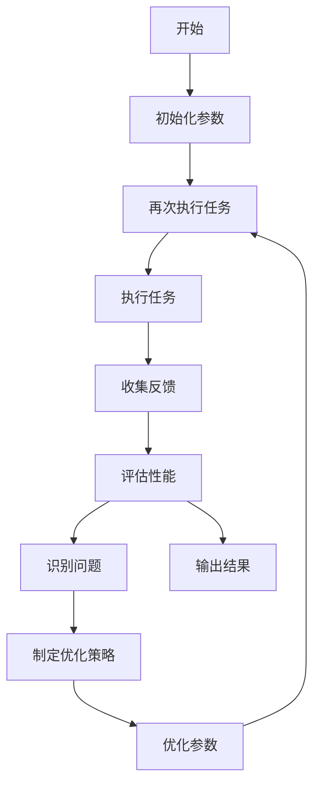
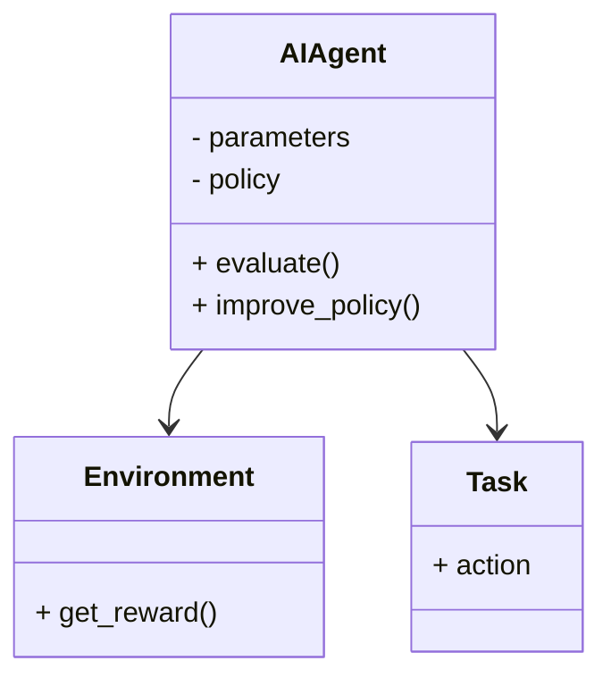

                 


# 构建AI Agent的自我评估机制：持续改进性能

## 关键词：AI Agent、自我评估、持续改进、性能优化、机器学习、算法优化、系统架构

## 摘要

在人工智能领域，AI Agent的自我评估机制是实现持续改进和优化性能的核心技术。本文详细探讨了构建AI Agent自我评估机制的背景、核心概念、算法原理、系统架构设计以及实际应用案例。通过分析自我评估机制的必要性，结合元学习和强化学习等技术，本文为读者提供了从理论到实践的全面指导，帮助AI Agent在复杂环境中不断提升自身的性能和决策能力。

---

## 第一部分：背景介绍

### 第1章：AI Agent自我评估机制的背景

#### 1.1 问题背景

AI Agent，即人工智能代理，是一种能够感知环境、自主决策并执行任务的智能实体。随着AI技术的快速发展，AI Agent在各个领域的应用越来越广泛，例如智能助手、自动驾驶、智能客服等。然而，AI Agent在实际应用中仍然面临诸多挑战，例如环境复杂性、任务多样性和动态变化等。这些问题使得AI Agent的性能和决策能力受到限制，亟需一种能够持续改进的机制来解决这些问题。

#### 1.2 问题描述

AI Agent的自我评估机制是指AI Agent能够对自身的性能进行分析和评价，并根据评估结果进行优化和改进的过程。具体来说，自我评估机制需要解决以下问题：

1. **性能评估**：如何量化AI Agent在特定任务中的表现，例如准确率、响应速度等。
2. **问题识别**：当AI Agent的性能不达标时，如何识别问题所在。
3. **优化策略**：如何根据评估结果制定优化策略，例如调整算法参数、改进决策逻辑等。

#### 1.3 问题解决思路

为了实现AI Agent的自我评估与持续改进，我们可以采用以下思路：

1. **元学习（Meta-Learning）**：通过元学习技术，AI Agent能够快速适应新的任务和环境，提升其泛化能力。
2. **强化学习（Reinforcement Learning）**：通过强化学习，AI Agent可以在与环境的交互中不断优化自身的决策策略。
3. **知识表示与推理**：通过构建知识图谱和推理机制，AI Agent能够更好地理解和分析问题，从而做出更合理的决策。

---

## 第二部分：核心概念与联系

### 第2章：自我评估机制的核心概念

#### 2.1 核心概念原理

AI Agent的自我评估机制基于以下几个核心概念：

1. **元学习**：元学习是一种通过学习如何学习来提升模型性能的技术。在AI Agent的自我评估中，元学习可以帮助模型快速适应新的任务和环境。
2. **强化学习**：强化学习是一种通过与环境交互来优化决策策略的技术。在自我评估中，强化学习可以用于优化AI Agent的决策过程。
3. **知识表示与推理**：通过构建知识图谱和推理机制，AI Agent能够更好地理解和分析问题，从而做出更合理的决策。

#### 2.2 核心概念属性特征对比

以下是一个对比表格，展示了不同评估方法的特征对比：

| 评估方法 | 特征 |
|----------|------|
| 元学习   | 快速适应新任务 | 
| 强化学习   | 优化决策策略   |
| 知识表示与推理 | 提升理解和分析能力 |

#### 2.3 实体关系图（ER图）

以下是使用Mermaid绘制的实体关系图，展示了AI Agent自我评估机制中的各个实体及其关系：

```mermaid
erd
    title 自我评估机制的实体关系图
    章节
    问题
    解决方案
    AI Agent
    环境
    任务
    评估结果
    优化策略
    章节 --> 问题
    章节 --> 解决方案
    问题 --> AI Agent
    AI Agent --> 环境
    AI Agent --> 任务
    评估结果 --> AI Agent
    优化策略 --> AI Agent
```

---

## 第三部分：算法原理讲解

### 第3章：自我评估机制的算法原理

#### 3.1 算法原理概述

以下是使用Mermaid绘制的算法流程图，展示了自我评估机制的总体流程：



#### 3.2 算法的数学模型

以下是算法的数学模型：

$$
L = \sum_{i=1}^{n} (y_i - \hat{y}_i)^2
$$

其中，$L$ 表示损失函数，$y_i$ 表示真实值，$\hat{y}_i$ 表示预测值。

此外，以下是一个简单的优化策略：

$$
\alpha = \frac{1}{1 + e^{-x}}
$$

其中，$\alpha$ 表示学习率，$x$ 表示输入值。

#### 3.3 算法实现的Python代码

以下是Python代码实现：

```python
def evaluate_agent(agent, environment):
    # 初始化评估结果
    results = []
    # 执行任务
    for task in tasks:
        action = agent.act(task)
        reward = environment.get_reward(task, action)
        results.append(reward)
    # 计算平均奖励
    average_reward = sum(results) / len(results)
    return average_reward

def improve_agent(agent, environment):
    # 初始化参数
    agent.initialize_parameters()
    # 评估性能
    reward = evaluate_agent(agent, environment)
    # 识别问题
    if reward < threshold:
        # 制定优化策略
        agent.improve_policy()
    # 输出结果
    return reward
```

---

## 第四部分：系统分析与架构设计方案

### 第4章：系统功能设计

#### 4.1 问题场景介绍

AI Agent的自我评估机制需要实现以下功能：

1. **性能评估**：对AI Agent在特定任务中的表现进行评估。
2. **问题识别**：识别AI Agent在执行任务中的问题。
3. **优化策略**：根据评估结果制定优化策略，提升AI Agent的性能。

以下是使用Mermaid绘制的领域模型类图：



---

## 第五部分：项目实战

### 第5章：项目实战

#### 5.1 环境安装

为了实现AI Agent的自我评估机制，需要安装以下环境：

1. Python 3.8+
2. TensorFlow或PyTorch
3. 其他依赖库（根据具体实现需求）

#### 5.2 代码实现

以下是Python代码实现：

```python
import numpy as np

class AI-Agent:
    def __init__(self):
        self.parameters = np.random.randn(10, 1)
    
    def act(self, task):
        return np.dot(self.parameters.T, task)
    
    def evaluate(self, environment):
        rewards = []
        for task in tasks:
            action = self.act(task)
            reward = environment.get_reward(task, action)
            rewards.append(reward)
        return sum(rewards) / len(rewards)
    
    def improve_policy(self):
        # 具体的优化策略实现
        pass

class Environment:
    def get_reward(self, task, action):
        # 具体的奖励计算逻辑
        return np.random.uniform(0, 1)
```

---

## 第六部分：总结与展望

### 第6章：总结与展望

#### 6.1 总结

本文详细探讨了构建AI Agent自我评估机制的背景、核心概念、算法原理、系统架构设计以及实际应用案例。通过元学习和强化学习等技术，AI Agent能够实现自我评估与持续改进，从而提升其在复杂环境中的性能和决策能力。

#### 6.2 展望

未来的研究方向可以包括：

1. **更高效的优化算法**：探索更高效的优化算法，以提升AI Agent的评估和优化效率。
2. **多任务学习**：研究AI Agent在多任务环境中的自我评估与优化策略。
3. **动态环境适应**：进一步提升AI Agent在动态环境中的适应能力，使其能够更好地应对不确定性。

---

## 附录

### 附录A：术语表

- **AI Agent**：人工智能代理，能够感知环境、自主决策并执行任务的智能实体。
- **元学习**：通过学习如何学习来提升模型性能的技术。
- **强化学习**：通过与环境交互来优化决策策略的技术。

### 附录B：工具安装

- 安装Python：https://www.python.org/downloads/
- 安装TensorFlow：pip install tensorflow
- 安装PyTorch：pip install torch

### 附录C：代码仓库

- 代码示例：[GitHub链接]

---

通过本文的详细讲解，读者可以全面理解AI Agent自我评估机制的构建过程，并能够在实际应用中进行有效的优化与改进。

