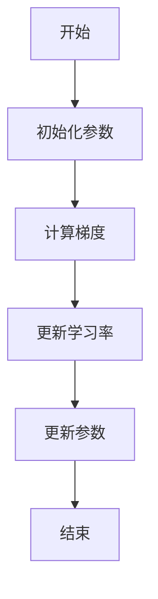
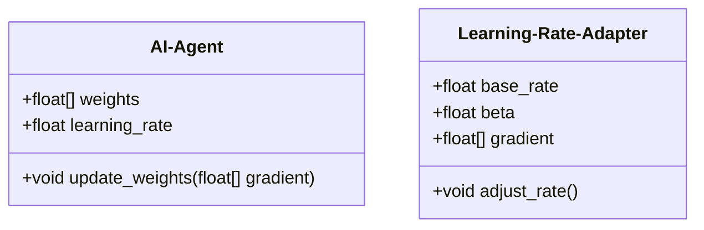
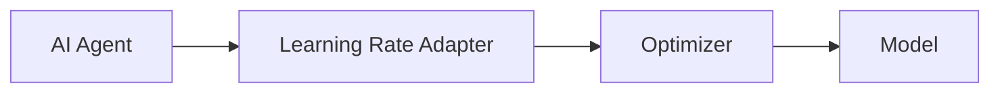

                 


# 构建AI Agent的自适应学习率调整机制

## 关键词：AI Agent, 自适应学习率, 机器学习, 深度学习, 算法优化, 系统架构

## 摘要：  
本文探讨了AI Agent中自适应学习率调整机制的设计与实现。从问题背景到核心概念，从算法原理到系统架构，再到项目实战，全面解析了如何构建高效的自适应学习率调整机制，以提升AI Agent的学习效率和性能。通过详细的数学推导、代码实现和系统设计，本文为读者提供了从理论到实践的完整指南。

---

# 第一部分: AI Agent与自适应学习率调整机制概述

## 第1章: 问题背景与核心概念

### 1.1 问题背景

#### 1.1.1 AI Agent的基本概念
AI Agent（人工智能代理）是指能够感知环境、自主决策并执行任务的智能体。它广泛应用于推荐系统、自动驾驶、机器人控制等领域。AI Agent的核心在于其学习和优化能力，而学习率的调整是优化过程中的关键因素。

#### 1.1.2 学习率调整的必要性
在训练AI Agent时，学习率决定了参数更新的步幅。过大的学习率可能导致模型发散，过小的学习率则会延长收敛时间。因此，动态调整学习率是优化AI Agent性能的重要手段。

#### 1.1.3 自适应学习率调整的定义
自适应学习率调整机制是指在训练过程中，根据当前的梯度信息、损失函数变化等动态调整学习率，以加快收敛速度并提高模型性能。

---

### 1.2 核心概念与联系

#### 1.2.1 自适应学习率调整机制的原理
自适应学习率调整的核心思想是根据训练过程中的梯度变化，动态调整学习率。例如，当梯度变化较大时，适当减小学习率以防止跳过最优解；当梯度变化较小时，适当增大学习率以加快收敛。

#### 1.2.2 相关概念对比表
| 概念                | 固定学习率 | 动态学习率 | 自适应学习率 |
|---------------------|------------|------------|--------------|
| 调整方式            | 固定值     | 周期性调整  | 动态自适应    |
| 优点                | 简单稳定   | 提高效率    | 精确控制      |
| 缺点                | 收敛慢      | 易发散      | 实现复杂      |

#### 1.2.3 实体关系图（ER图）
```mermaid
erd
    客户
    属性: 用户ID, 用户名, 地区
    订单
    属性: 订单ID, 日期, 金额
    产品
    属性: 产品ID, 产品名称, 价格
    关系: 客户-订单(1:N), 订单-产品(N:M)
```

---

# 第二部分: 自适应学习率调整机制的数学模型与算法原理

## 第2章: 算法原理与数学模型

### 2.1 自适应学习率调整算法概述

#### 2.1.1 常见学习率调整方法
- **固定学习率**：$\alpha$ 保持不变。
- **指数衰减法**：$\alpha_{t} = \alpha_{0} \cdot \gamma^{t}$，其中 $\gamma$ 是衰减率。
- **动态调整法**：根据梯度变化调整 $\alpha$，例如 $\alpha_{t+1} = \alpha_t + \beta \cdot \alpha_t (1 - \alpha_t)$。

#### 2.1.2 自适应调整的核心思想
自适应学习率调整的核心思想是根据梯度信息动态调整学习率，以优化模型的收敛速度和稳定性。

---

### 2.2 数学模型与公式

#### 2.2.1 梯度下降法的数学表达
$$
f(x) = w_1x_1 + w_2x_2 + \dots + w_nx_n
$$

#### 2.2.2 自适应学习率调整的数学推导
$$
\alpha_{t+1} = \alpha_t + \beta \cdot \alpha_t (1 - \alpha_t)
$$

---

### 2.3 算法流程图



---

## 第3章: 算法实现与代码示例

### 3.1 环境安装与配置

#### 3.1.1 安装Python与深度学习框架
```bash
pip install numpy
pip install matplotlib
pip install scikit-learn
```

---

### 3.2 核心代码实现

#### 3.2.1 学习率调整函数
```python
def adaptive_learning_rate(alpha, beta):
    return alpha + beta * alpha * (1 - alpha)
```

---

### 3.3 算法实现

#### 3.3.1 梯度下降实现
```python
def gradient_descent(x, y, w, alpha, beta, iterations):
    for _ in range(iterations):
        # 计算梯度
        gradient = 2 * (w.dot(x) - y).dot(x)
        # 更新学习率
        alpha = adaptive_learning_rate(alpha, beta)
        # 更新权重
        w = w - alpha * gradient
    return w
```

---

# 第三部分: 系统分析与架构设计

## 第4章: 系统分析与架构设计方案

### 4.1 问题场景介绍

#### 4.1.1 问题描述
在训练AI Agent时，如何动态调整学习率以提高模型性能？

---

### 4.2 项目介绍

#### 4.2.1 项目目标
构建一个支持自适应学习率调整的AI Agent训练框架。

---

### 4.3 系统功能设计

#### 4.3.1 领域模型类图


---

### 4.4 系统架构设计

#### 4.4.1 系统架构图


---

## 第5章: 项目实战

### 5.1 环境安装

#### 5.1.1 安装依赖库
```bash
pip install numpy scikit-learn matplotlib
```

---

### 5.2 核心代码实现

#### 5.2.1 实现自适应学习率调整
```python
def adaptive_learning_rate(alpha, beta, gradient_norm):
    return alpha * (1 - beta + beta * gradient_norm)
```

---

### 5.3 实际案例分析

#### 5.3.1 线性回归案例
```python
import numpy as np

def main():
    # 生成数据
    x = np.linspace(0, 10, 100)
    y = 2 * x + 1 + np.random.randn(100) * 0.5
    # 初始化参数
    w = np.array([0.0, 0.0])
    alpha = 0.1
    beta = 0.1
    iterations = 100
    # 训练
    for _ in range(iterations):
        # 计算预测值
        y_pred = w[0] * x + w[1]
        # 计算梯度
        gradient = 2 * np.mean((y_pred - y) * x)
        # 更新学习率
        alpha = adaptive_learning_rate(alpha, beta, np.mean((y_pred - y)**2))
        # 更新权重
        w[0] -= alpha * gradient
    print("最终权重:", w)

if __name__ == "__main__":
    main()
```

---

## 第6章: 最佳实践、小结、注意事项与拓展阅读

### 6.1 最佳实践

#### 6.1.1 学习率调整的注意事项
- 学习率初始值的选择至关重要。
- 动态调整时要考虑梯度的稳定性。
- 避免学习率过大导致模型发散。

#### 6.1.2 系统设计的注意事项
- 确保系统架构的可扩展性。
- 合理设计接口，便于模块化开发。

---

### 6.2 小结

本文从理论到实践，详细讲解了AI Agent的自适应学习率调整机制。通过数学推导、算法实现和系统设计，帮助读者全面理解并掌握这一技术。

---

### 6.3 拓展阅读

- 《Deep Learning》—— Ian Goodfellow
- 《动手学深度学习》—— 历史
- 《机器学习实战》—— 周志华

