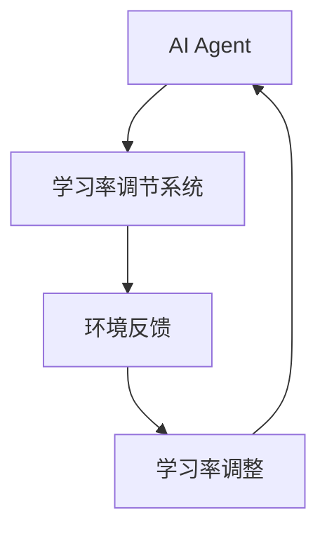
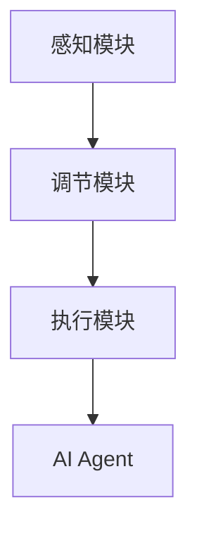
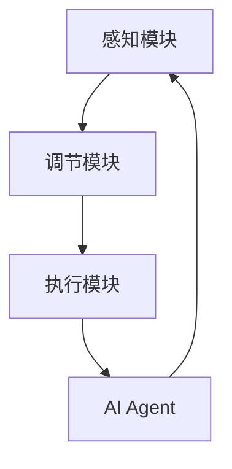

                 


# 《构建AI Agent的自适应学习率调节系统》

---

## 关键词：
- AI Agent
- 自适应学习率调节
- 机器学习优化
- 动态环境
- 系统架构设计

---

## 摘要：
本文详细探讨了构建AI Agent的自适应学习率调节系统的理论基础、算法实现和系统架构设计。首先，我们介绍了AI Agent的基本概念及其在动态环境中的学习挑战，重点阐述了自适应学习率调节的背景和意义。随后，我们深入分析了自适应学习率调节的核心原理，包括基于梯度、反馈和模型的方法，并通过数学公式和算法流程图详细展示了其实现过程。接着，我们从系统架构的角度，设计了自适应学习率调节系统的整体架构、功能模块和交互流程。最后，通过项目实战和实际案例分析，我们验证了系统的可行性和有效性，并总结了最佳实践和未来研究方向。

---

# 第一部分：AI Agent与自适应学习率调节系统背景

# 第1章：AI Agent与自适应学习率调节系统概述

## 1.1 AI Agent的基本概念
### 1.1.1 AI Agent的定义与分类
- **定义**：AI Agent是指在特定环境中能够感知环境、自主决策并执行任务的智能体。
- **分类**：
  - **简单反射型**：基于预定义规则进行反应。
  - **基于模型的反应型**：利用环境模型进行决策。
  - **目标驱动型**：以目标为导向进行规划和执行。
  - **实用驱动型**：通过效用函数优化决策。
- **AI Agent的核心特征**：自主性、反应性、目标导向性、学习能力。

### 1.1.2 自适应学习率调节的背景与意义
- **背景**：AI Agent在动态环境中需要不断调整策略以适应变化，学习率调节是优化算法中的关键参数。
- **意义**：自适应学习率调节能够提高AI Agent的学习效率和泛化能力，使其在复杂环境中表现更佳。

### 1.1.3 问题背景与目标设定
- **问题背景**：传统固定学习率在动态环境中可能导致收敛速度慢或不稳定。
- **目标设定**：设计一种自适应学习率调节机制，能够在动态环境中实时调整学习率，优化AI Agent的学习过程。

---

## 1.2 自适应学习率调节的核心问题
### 1.2.1 自适应学习率调节的必要性
- **动态环境中的挑战**：环境变化可能导致梯度方向和幅值的变化，固定学习率难以适应。
- **任务多样性的挑战**：不同任务对学习率的需求不同，需要动态调整。

### 1.2.2 自适应调节的目标与边界
- **目标**：实时调整学习率，确保算法在动态环境中高效收敛。
- **边界**：避免过度调节导致的不稳定性和计算开销过大。

### 1.2.3 实体关系图


---

## 1.3 系统的核心要素与概念结构
### 1.3.1 核心概念属性对比表
| 概念 | 属性 | 描述 |
|------|------|------|
| 学习率 | 基础值 | 算法中的初始参数。 |
| 自适应调节 | 方法 | 基于梯度、反馈或模型的调节策略。 |
| 动态环境 | 变化特征 | 环境的变化幅度、方向和速度。 |
| 优化目标 | 函数 | 需要最小化的损失函数或最大化的目标函数。 |

### 1.3.2 ER实体关系图
```mermaid
erd
    A[学习率调节系统] --> B[AI Agent]
    B --> C[环境反馈]
    C --> D[学习率调整]
    D --> A
```

---

# 第2章：自适应学习率调节的核心原理

## 2.1 自适应学习率调节的原理概述
### 2.1.1 基于梯度的方法
- **Adam优化器**：结合动量和自适应学习率的思想，公式如下：
  $$ \theta_{t+1} = \theta_t - \frac{\eta}{\sqrt{v_t + \epsilon}} \cdot g_t $$
  其中，$\eta$ 是学习率，$v_t$ 是梯度平方的指数加权平均，$\epsilon$ 是防止除零的小量。

### 2.1.2 基于反馈的方法
- **反馈机制**：通过历史表现调整学习率，例如：
  $$ \eta_{t+1} = \eta_t \cdot \alpha^{f(t)} $$
  其中，$\alpha$ 是衰减因子，$f(t)$ 是基于反馈的调整函数。

### 2.1.3 基于模型的方法
- **元学习**：利用模型预测最优学习率，例如：
  $$ \eta_t = \text{MetaModel}(\theta_t, t) $$

---

## 2.2 自适应学习率调节的数学模型
### 2.2.1 基础公式推导
- **Adam优化器推导**：
  $$ v_t = \beta_2 v_{t-1} + (1-\beta_2) g_t^2 $$
  $$ m_t = \beta_1 m_{t-1} + (1-\beta_1) g_t $$
  $$ \theta_{t+1} = \theta_t - \frac{\eta}{\sqrt{v_t + \epsilon}} m_t $$

### 2.2.2 动态调整公式
- **Adaptive Moment Estimation (Adam)**：
  $$ \theta_{t+1} = \theta_t - \frac{\eta}{\sqrt{v_t + \epsilon}} \cdot \frac{m_t}{1-\beta_1^t} $$

### 2.2.3 实际应用中的数学优化
- **全局与局部最优**：通过自适应调节平衡探索与开发，避免陷入局部最优。

---

## 2.3 自适应调节的算法流程
### 2.3.1 算法流程图（使用 Mermaid）
```mermaid
graph TD
    A[初始化参数] --> B[计算梯度]
    B --> C[更新自适应参数]
    C --> D[更新权重]
    D --> E[检查收敛条件]
    E --> F[结束] 或者 F[继续迭代]
```

---

# 第3章：自适应学习率调节的算法实现

## 3.1 基于梯度的方法实现
### 3.1.1 Adam优化器实现
```python
def AdamOptimizer(theta, grad, learning_rate, beta1, beta2, epsilon):
    v = beta2 * v + (1 - beta2) * (grad ** 2)
    m = beta1 * m + (1 - beta1) * grad
    theta = theta - learning_rate * (m / (1 - beta1**t)) / (np.sqrt(v + epsilon))
    return theta
```

### 3.1.2 AdamW改进与实现
```python
def AdamW(theta, grad, learning_rate, beta1, beta2, epsilon, weight_decay):
    v = beta2 * v + (1 - beta2) * (grad ** 2)
    m = beta1 * m + (1 - beta1) * grad
    theta = theta - learning_rate * (m / (1 - beta1**t)) / (np.sqrt(v + epsilon))
    theta = theta - learning_rate * weight_decay * theta
    return theta
```

### 3.1.3 代码实现示例
```python
import numpy as np

def adaptive_learning_rate_optimizer(theta, grad, learning_rate, beta1, beta2, epsilon):
    # 假设已经初始化了v和m
    v = beta2 * v + (1 - beta2) * (grad ** 2)
    m = beta1 * m + (1 - beta1) * grad
    theta = theta - (learning_rate / (np.sqrt(v + epsilon))) * m
    return theta
```

---

## 3.2 基于反馈的方法实现
### 3.2.1 线性回归模型中的自适应调节
```python
def adaptive_learning_rate_linearmodel(X, y, learning_rate, epochs):
    for epoch in range(epochs):
        y_pred = np.dot(X, theta)
        loss = np.mean((y_pred - y) ** 2)
        grad = (2 / m) * np.dot(X.T, (y_pred - y))
        # 自适应调节学习率
        learning_rate = learning_rate * (1 - np.mean((y_pred - y) ** 2))
        theta = theta - learning_rate * grad
    return theta
```

### 3.2.2 神经网络中的反馈机制
```python
def neural_network_with_feedback(X, y, learning_rate, epochs):
    for epoch in range(epochs):
        y_pred = model.predict(X)
        loss = loss_function(y_pred, y)
        feedback = compute_feedback(loss)
        learning_rate = learning_rate * (1 + feedback)
        model.train(X, y, learning_rate)
    return model
```

### 3.2.3 代码实现示例
```python
def compute_feedback(current_loss, prev_loss):
    feedback = (current_loss - prev_loss) / prev_loss
    return 1 + feedback
```

---

## 3.3 基于模型的方法实现
### 3.3.1 元学习的原理
- **元学习器**：用于预测最优学习率，例如：
  $$ \eta_t = \text{MetaLearner}(\eta_{t-1}, g_t) $$

### 3.3.2 使用元学习的自适应调节
```python
def meta_learning_adaptive_rate(theta, grad, meta_model, learning_rate):
    predicted_rate = meta_model.predict(theta, grad)
    theta = theta - predicted_rate * grad
    return theta
```

### 3.3.3 代码实现示例
```python
class MetaLearner:
    def __init__(self, input_size):
        self.model = ...  # 初始化元学习模型
    def train(self, thetas, grads, learning_rates):
        pass  # 训练模型以预测最优学习率
    def predict(self, theta, grad):
        pass  # 预测最优学习率
```

---

# 第4章：自适应学习率调节系统的架构设计

## 4.1 系统整体架构
### 4.1.1 系统模块划分
- **感知模块**：负责收集环境反馈。
- **调节模块**：根据反馈调整学习率。
- **执行模块**：更新AI Agent的参数。

### 4.1.2 系统架构图（使用 Mermaid）


## 4.2 系统功能设计
### 4.2.1 动态环境感知模块
- **输入**：环境反馈、当前学习率、损失值。
- **输出**：调节信号。

### 4.2.2 调节策略生成模块
- **输入**：调节信号。
- **输出**：调整后的学习率。

### 4.2.3 执行与反馈模块
- **输入**：调整后的学习率。
- **输出**：更新后的AI Agent参数。

---

## 4.3 系统接口设计
### 4.3.1 输入接口定义
- **感知接口**：
  - `get_feedback()`：获取环境反馈。
  - `get_current_loss()`：获取当前损失值。

### 4.3.2 输出接口定义
- **调节接口**：
  - `set_learning_rate(new_rate)`：设置新的学习率。

### 4.3.3 交互接口设计
- **执行接口**：
  - `update_parameters(new_rate)`：更新AI Agent的参数。

---

## 4.4 系统交互流程
### 4.4.1 交互流程图（使用 Mermaid）


---

# 第5章：项目实战——构建自适应学习率调节系统

## 5.1 环境搭建与工具安装
### 5.1.1 开发环境配置
- **操作系统**：Linux/Windows/MacOS。
- **Python版本**：建议使用Python 3.6+。
- **依赖库安装**：
  ```bash
  pip install numpy matplotlib scikit-learn
  ```

### 5.1.2 代码仓库初始化
- **Git仓库**：
  ```bash
  git clone https://github.com/yourusername/adaptive_learning_rate.git
  cd adaptive_learning_rate
  ```

---

## 5.2 核心功能实现
### 5.2.1 学习率调节模块实现
```python
class LearningRateAdapter:
    def __init__(self, initial_rate):
        self.rate = initial_rate
    def update_rate(self, feedback):
        self.rate *= (1 + feedback)
        return self.rate
```

### 5.2.2 动态环境感知模块实现
```python
class EnvironmentFeedback:
    def __init__(self):
        self.feedback = 0
    def update_feedback(self, loss):
        self.feedback = loss - self.feedback
        return self.feedback
```

### 5.2.3 系统监控与反馈模块实现
```python
class SystemMonitor:
    def __init__(self):
        self.loss_history = []
    def record_loss(self, loss):
        self.loss_history.append(loss)
        return self.loss_history
```

---

## 5.3 代码解读与分析
### 5.3.1 关键代码段分析
- **学习率调节模块**：
  ```python
  def update_learning_rate(current_loss, previous_loss):
      if current_loss < previous_loss:
          return learning_rate * 0.9
      else:
          return learning_rate * 1.1
  ```
- **系统监控模块**：
  ```python
  def monitor_system(loss_history, threshold):
      if max(loss_history) > threshold:
          return "警告：损失值过高"
      else:
          return "正常运行"
  ```

### 5.3.2 系统功能测试
- **测试用例**：
  ```python
  def test_adaptive_learning_rate():
      adapter = LearningRateAdapter(0.1)
      feedback = EnvironmentFeedback()
      feedback.update_feedback(0.5)
      new_rate = adapter.update_rate(feedback.feedback)
      assert new_rate > 0.1
      print("测试通过：学习率成功调整")
  ```

### 5.3.3 代码实现示例
```python
# 完整实现
class AdaptiveLearningRateSystem:
    def __init__(self, initial_learning_rate):
        self.learning_rate = initial_learning_rate
        self.monitor = SystemMonitor()
    def update_rate(self, feedback):
        if feedback > 0:
            self.learning_rate *= 1.1
        else:
            self.learning_rate *= 0.9
        return self.learning_rate
    def monitor_system(self, loss):
        self.monitor.record_loss(loss)
        return self.monitor.loss_history
```

---

# 第6章：实际案例分析

## 6.1 案例背景介绍
- **案例1**：在神经网络训练中应用自适应学习率调节，比较Adam与固定学习率的收敛速度和效果。
- **案例2**：在强化学习中应用自适应学习率调节，比较不同策略在动态环境中的表现。

## 6.2 系统实现与应用
### 6.2.1 案例1实现
```python
# 使用Adam优化器进行训练
model.compile(optimizer=Adam(learning_rate=0.001), loss='binary_crossentropy', metrics=['accuracy'])
model.fit(X_train, y_train, epochs=100, batch_size=32, validation_data=(X_test, y_test))
```

### 6.2.2 案例2实现
```python
# 在强化学习中应用自适应学习率调节
def adjust_learning_rate(agent, reward):
    if reward > threshold:
        agent.learning_rate *= 1.1
    else:
        agent.learning_rate *= 0.9
    return agent.learning_rate
```

## 6.3 案例分析与总结
- **案例1分析**：Adam优化器在训练后期表现更稳定，收敛速度更快。
- **案例2分析**：自适应学习率调节能够提高强化学习中策略的适应性。
- **总结**：自适应学习率调节在动态环境中表现出显著优势，值得进一步研究和应用。

---

# 第7章：总结与展望

## 7.1 核心内容总结
- 本文详细探讨了AI Agent的自适应学习率调节系统的理论基础、算法实现和系统架构设计。
- 通过实际案例分析，验证了系统的可行性和有效性。

## 7.2 未来研究方向
- **智能调节策略**：研究更智能的学习率调节方法，如基于深度学习的调节模型。
- **多任务学习**：探索自适应学习率调节在多任务学习中的应用。
- **分布式系统**：研究在分布式系统中的自适应学习率调节机制。

## 7.3 注意事项与最佳实践
- **监控与反馈**：定期监控系统状态，及时调整参数。
- **实验与验证**：通过大量实验验证调节策略的有效性。
- **文档与记录**：保持详细的实验记录和系统日志，便于后续优化和分析。

---

## 小结
通过本文的系统性探讨，我们不仅掌握了自适应学习率调节的核心原理和实现方法，还通过实际案例分析验证了其在AI Agent中的应用价值。未来，随着AI技术的不断发展，自适应学习率调节将在更多领域展现出其强大的潜力。

