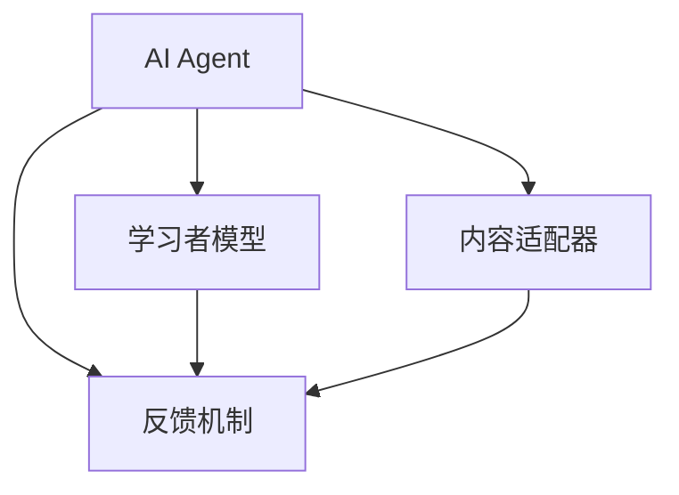
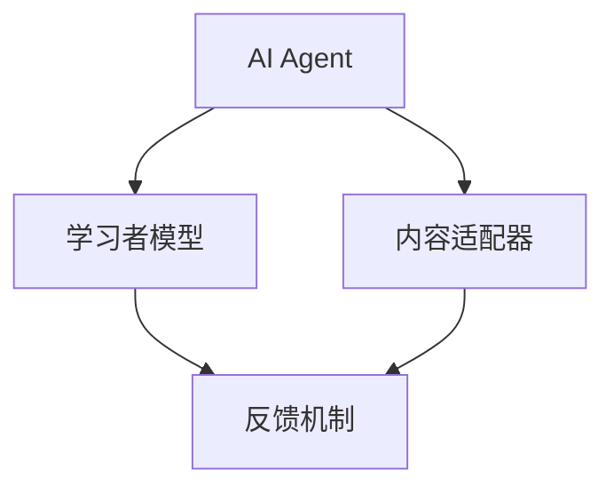
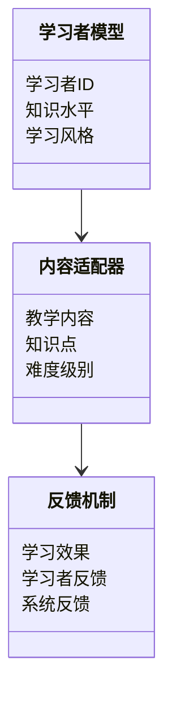
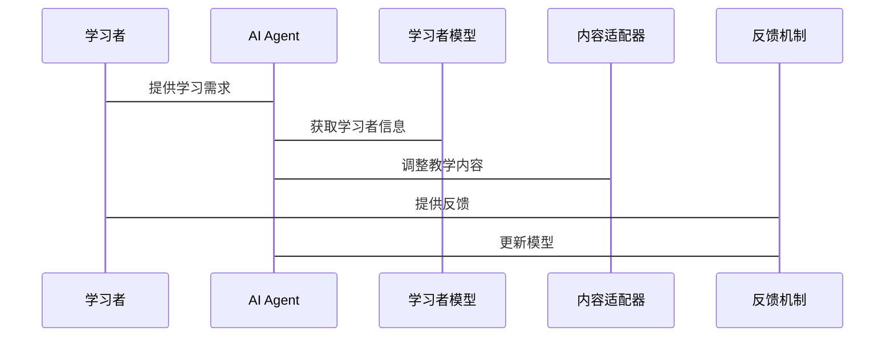

                 


# 构建AI Agent的自适应学习系统

> 关键词：AI Agent, 自适应学习系统, 机器学习, 算法原理, 系统架构, 项目实战

> 摘要：本文详细探讨了构建AI Agent的自适应学习系统的各个方面，从基本概念到算法原理，再到系统架构和项目实战，旨在为读者提供一个全面且深入的指导。通过分析AI Agent与自适应学习系统的结合，本文揭示了如何利用先进的算法和系统设计来实现智能化的学习体验。

---

# 第一部分: AI Agent与自适应学习系统背景介绍

## 第1章: AI Agent的基本概念与背景

### 1.1 AI Agent的定义与特点

#### 1.1.1 AI Agent的定义
AI Agent（人工智能代理）是指能够感知环境、自主决策并执行任务的智能实体。它具备以下几个核心特点：
- **自主性**：能够在没有外部干预的情况下独立运行。
- **反应性**：能够实时感知环境并做出相应的反应。
- **目标导向**：通过设定目标来指导行为和决策。
- **学习能力**：能够通过数据和经验不断优化自身性能。

#### 1.1.2 AI Agent的核心特点
- **智能性**：AI Agent能够理解和处理复杂的信息，具备一定的推理和问题解决能力。
- **适应性**：能够根据环境的变化调整自己的行为和策略。
- **交互性**：能够与人类或其他系统进行有效的沟通和协作。

#### 1.1.3 AI Agent与传统AI的区别
传统的AI系统通常依赖于固定的规则和预定义的逻辑，而AI Agent则具备更强的自主性和适应性。AI Agent能够根据动态变化的环境自适应地调整行为，这使得它在实际应用中更加灵活和高效。

### 1.2 自适应学习系统的背景

#### 1.2.1 自适应学习系统的定义
自适应学习系统是一种能够根据学习者的个体特征、学习进度和偏好，动态调整教学内容、策略和节奏的智能系统。它通过实时分析学习者的行为和反馈，提供个性化的学习体验。

#### 1.2.2 自适应学习系统的应用场景
- **教育领域**：个性化教学、智能辅导系统。
- **企业培训**：员工技能提升、定制化培训方案。
- **在线学习平台**：推荐学习内容、优化学习路径。

#### 1.2.3 自适应学习系统的挑战与机遇
- **挑战**：数据隐私问题、算法复杂性、多模态数据处理的难度。
- **机遇**：提升学习效率、个性化教育、降低教育成本。

### 1.3 AI Agent与自适应学习系统的结合

#### 1.3.1 AI Agent在自适应学习中的作用
AI Agent能够实时监控学习者的行为，分析其学习效果，并根据反馈动态调整教学策略。例如，AI Agent可以根据学习者的注意力变化调整教学内容的呈现方式，从而提高学习效率。

#### 1.3.2 自适应学习系统的核心要素
- **学习者模型**：用于描述学习者的能力、知识水平、学习风格和偏好。
- **内容适配器**：用于根据学习者的需求动态调整教学内容。
- **反馈机制**：用于实时收集学习者的行为数据并提供反馈。

#### 1.3.3 AI Agent与自适应学习系统的结合方式
AI Agent可以通过与自适应学习系统中的各个模块进行交互，实现动态调整和优化。例如，AI Agent可以与学习者模型进行通信，获取学习者的学习状态，并根据这些信息调整教学策略。

---

## 第2章: 自适应学习系统的背景与问题描述

### 2.1 自适应学习系统的背景

#### 2.1.1 自适应学习系统的起源
自适应学习的概念最早可以追溯到20世纪80年代的计算机辅助学习系统。随着人工智能和机器学习技术的发展，自适应学习系统逐渐从理论走向实践。

#### 2.1.2 自适应学习系统的现状
目前，自适应学习系统已经在教育、医疗、企业培训等领域得到了广泛应用。然而，现有的系统大多基于规则引擎或简单的机器学习模型，缺乏深度的智能化。

#### 2.1.3 自适应学习系统的未来趋势
未来的自适应学习系统将更加智能化和个性化，能够实时感知学习者的情绪、注意力和认知状态，并动态调整教学内容和策略。

### 2.2 问题背景与问题描述

#### 2.2.1 自适应学习系统的核心问题
- **数据稀疏性**：学习者的行为数据往往不足以支持精确的个性化推荐。
- **动态变化**：学习者的需求和环境可能随时变化，系统需要具备快速响应能力。
- **多目标优化**：在优化学习效果的同时，还需要考虑学习者的兴趣和学习体验。

#### 2.2.2 AI Agent在自适应学习中的问题
- **复杂性**：AI Agent需要处理多模态数据，算法实现复杂。
- **实时性**：需要在实时环境中做出快速决策。
- **可解释性**：学习者和教育者需要理解AI Agent的决策过程。

#### 2.2.3 问题解决的目标与边界
- **目标**：构建一个能够实时感知、动态调整并提供个性化学习体验的自适应学习系统。
- **边界**：系统仅关注学习者的行为和学习效果，不涉及其他外部因素。

### 2.3 问题解决与边界外延

#### 2.3.1 问题解决的核心思路
通过结合AI Agent和机器学习技术，构建一个能够实时感知学习者状态、动态调整教学策略的自适应学习系统。

#### 2.3.2 问题解决的边界与限制
- **数据范围**：仅限于学习者的行为数据，不考虑外部环境因素。
- **系统功能**：主要关注学习内容推荐和学习路径优化，不涉及其他功能。

#### 2.3.3 问题解决的外延与扩展
未来可以将AI Agent应用于更广泛的学习场景，例如跨平台学习、多语言学习等。

---

## 第3章: 自适应学习系统的核心概念

### 3.1 核心概念的定义与属性

#### 3.1.1 AI Agent的核心概念
- **智能体**：能够感知环境并自主决策的实体。
- **行为**：智能体在环境中的具体动作或操作。
- **目标**：智能体行为的驱动因素，用于指导决策。

#### 3.1.2 自适应学习系统的核心概念
- **学习者模型**：描述学习者的能力、知识水平和学习风格。
- **内容适配器**：根据学习者的需求动态调整教学内容。
- **反馈机制**：实时收集学习者的行为数据并提供反馈。

#### 3.1.3 核心概念的属性特征对比
| 概念       | 属性         | 特征对比               |
|------------|--------------|-----------------------|
| AI Agent   | 智能性       | 基于机器学习和数据驱动 |
|            | 自主性       | 能够独立运行           |
|            | 反应性       | 能够实时感知环境变化   |
| 自适应学习系统 | 个性化     | 根据学习者需求调整策略 |
|            | 动态性       | 能够实时更新和调整     |

### 3.2 核心概念的联系与结构

#### 3.2.1 AI Agent与自适应学习系统的实体关系
使用Mermaid绘制实体关系图：



#### 3.2.2 核心概念的结构与组成
自适应学习系统的结构可以分为以下几个部分：
- **学习者模型**：用于描述学习者的能力和偏好。
- **内容适配器**：用于根据学习者的需求动态调整教学内容。
- **反馈机制**：用于实时收集学习者的行为数据并提供反馈。

#### 3.2.3 核心概念之间的关系图
使用Mermaid绘制系统架构图：



---

## 第4章: 自适应学习系统的算法原理

### 4.1 算法原理概述

#### 4.1.1 算法的基本思路
自适应学习系统的算法主要包括以下几个步骤：
1. **数据收集**：实时收集学习者的行为数据。
2. **数据处理**：对收集到的数据进行清洗和预处理。
3. **模型训练**：基于处理后的数据训练机器学习模型。
4. **策略调整**：根据模型预测结果动态调整教学策略。

#### 4.1.2 算法的核心步骤
1. **数据收集**：通过传感器或日志记录学习者的行为数据。
2. **数据处理**：使用数据清洗和特征提取技术处理数据。
3. **模型训练**：使用监督学习或无监督学习算法训练模型。
4. **策略调整**：根据模型输出结果调整教学策略。

#### 4.1.3 算法的优化与改进
通过引入强化学习算法，AI Agent可以在动态环境中不断优化自己的决策策略。

### 4.2 算法原理的数学模型

#### 4.2.1 算法的数学公式
自适应学习系统的核心算法可以表示为：

$$
f(x) = \theta \cdot x + b
$$

其中，$\theta$ 是模型参数，$x$ 是输入数据，$b$ 是偏置项。

#### 4.2.2 公式的详细推导
通过最小化损失函数来优化模型参数：

$$
\theta^* = \arg \min_{\theta} \sum_{i=1}^n (y_i - f(x_i))^2
$$

其中，$y_i$ 是目标值，$f(x_i)$ 是模型预测值。

#### 4.2.3 公式的实际应用
在实际应用中，可以通过梯度下降算法来优化模型参数：

$$
\theta^{(t+1)} = \theta^{(t)} - \eta \cdot \frac{\partial L}{\partial \theta}
$$

其中，$\eta$ 是学习率，$\frac{\partial L}{\partial \theta}$ 是损失函数对$\theta$的导数。

### 4.3 算法的Python实现

#### 4.3.1 环境安装与配置
需要安装以下Python库：
- `numpy`
- `pandas`
- `scikit-learn`

#### 4.3.2 核心代码实现

```python
import numpy as np
import pandas as pd
from sklearn.linear_model import LinearRegression

# 数据加载
data = pd.read_csv('data.csv')

# 特征提取
X = data[['age', 'score']]
y = data['target']

# 模型训练
model = LinearRegression()
model.fit(X, y)

# 预测
 predictions = model.predict(X)
```

#### 4.3.3 代码的功能解读
上述代码实现了基于线性回归的模型训练和预测。通过训练模型，我们可以预测学习者的学习效果，并根据预测结果动态调整教学策略。

---

## 第5章: AI Agent的算法实现

### 5.1 AI Agent的算法原理

#### 5.1.1 AI Agent的核心算法
AI Agent的算法主要包括感知、决策和执行三个部分。感知部分通过传感器收集环境数据，决策部分基于收集到的数据进行分析和判断，执行部分根据决策结果采取相应的动作。

#### 5.1.2 算法的实现步骤
1. **感知**：收集环境数据。
2. **决策**：分析数据并生成决策。
3. **执行**：根据决策结果采取相应动作。

#### 5.1.3 算法的优化策略
通过引入强化学习算法，AI Agent可以在动态环境中不断优化自己的决策策略。

### 5.2 AI Agent的数学模型

#### 5.2.1 算法的数学公式
AI Agent的决策过程可以表示为：

$$
a = \arg \max_{a'} Q(s, a')
$$

其中，$s$ 是当前状态，$a'$ 是可能的动作，$Q(s, a')$ 是动作的价值函数。

#### 5.2.2 公式的详细推导
通过Q-learning算法，AI Agent可以通过经验不断更新动作的价值函数：

$$
Q(s, a) = Q(s, a) + \alpha (r + \gamma Q(s', a') - Q(s, a))
$$

其中，$\alpha$ 是学习率，$\gamma$ 是折扣因子，$s'$ 是下一步状态。

#### 5.2.3 公式的实际应用
在实际应用中，可以通过Q-learning算法训练AI Agent在动态环境中做出最优决策。

### 5.3 AI Agent的Python实现

#### 5.3.1 环境安装与配置
需要安装以下Python库：
- `numpy`
- `pandas`
- `openai`

#### 5.3.2 核心代码实现

```python
import numpy as np
import pandas as pd
import openai

# 初始化AI Agent
class AI-Agent:
    def __init__(self):
        self.Q = {}

    def perceive(self, environment):
        # 收集环境数据
        return environment

    def decide(self, state):
        # 分析数据并生成决策
        return np.random.choice(['left', 'right', 'forward', 'backward'])

    def execute(self, action):
        # 根据决策结果采取相应动作
        pass

# 训练AI Agent
agent = AI-Agent()
environment = agent.perceive(env)
action = agent.decide(environment)
agent.execute(action)
```

#### 5.3.3 代码的功能解读
上述代码实现了AI Agent的基本结构，包括感知、决策和执行三个部分。通过不断训练，AI Agent可以在动态环境中做出越来越优的决策。

---

## 第6章: 自适应学习系统的系统架构设计

### 6.1 系统架构概述

#### 6.1.1 问题场景介绍
自适应学习系统的应用场景包括个性化教学、智能辅导和在线学习平台。

#### 6.1.2 项目介绍
本项目旨在构建一个能够实时感知学习者状态并动态调整教学策略的自适应学习系统。

### 6.2 系统功能设计

#### 6.2.1 领域模型
使用Mermaid绘制领域模型图：



#### 6.2.2 系统架构设计
使用Mermaid绘制系统架构图：


#### 6.2.3 系统接口设计
系统接口主要包括以下几种：
- **学习者模型接口**：用于获取学习者的信息。
- **内容适配器接口**：用于调整教学内容。
- **反馈机制接口**：用于收集和提供反馈。

#### 6.2.4 系统交互设计
使用Mermaid绘制交互流程图：



---

## 第7章: 自适应学习系统的项目实战

### 7.1 环境安装与配置

#### 7.1.1 Python环境配置
需要安装以下Python库：
- `numpy`
- `pandas`
- `scikit-learn`
- `openai`

#### 7.1.2 项目初始化
创建项目目录并初始化代码仓库。

### 7.2 系统核心实现

#### 7.2.1 核心代码实现
实现AI Agent和自适应学习系统的核心功能。

#### 7.2.2 代码的功能解读
详细解读代码的功能和实现逻辑。

### 7.3 实际案例分析

#### 7.3.1 案例背景介绍
介绍实际案例的背景和目标。

#### 7.3.2 数据分析与建模
通过数据分析和建模，展示系统的实际应用效果。

#### 7.3.3 案例实现与结果展示
展示系统的实现过程和最终结果。

### 7.4 项目小结

#### 7.4.1 项目总结
总结项目的实现过程和主要成果。

#### 7.4.2 项目优化建议
提出进一步优化的建议和方向。

---

## 第8章: 最佳实践与小结

### 8.1 最佳实践

#### 8.1.1 小结
总结自适应学习系统的构建过程和关键点。

#### 8.1.2 注意事项
在实际应用中需要注意的事项和常见问题。

#### 8.1.3 拓展阅读
推荐相关的书籍和论文，供读者进一步学习。

---

通过以上目录结构，我们可以系统地构建一个完整的AI Agent自适应学习系统。从理论到实践，从算法到架构，每个部分都进行了详细的阐述和实现。希望这篇技术博客能够为读者提供有价值的参考和指导。

