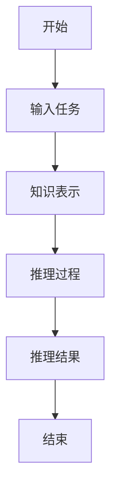
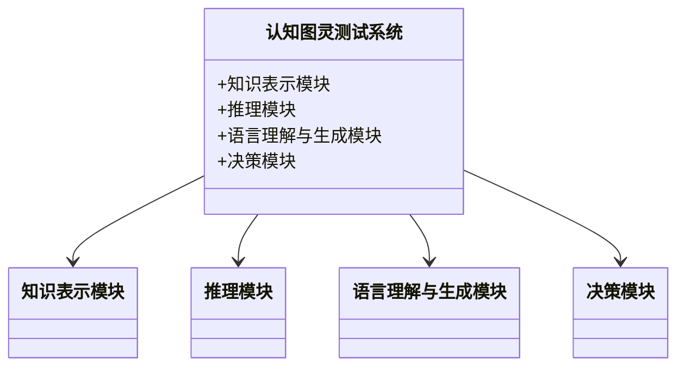

                 


# 构建AI Agent的认知图灵测试系统

> 关键词：认知图灵测试，AI Agent，人工智能，系统架构，算法原理，项目实战

> 摘要：本文将详细介绍构建AI Agent的认知图灵测试系统的各个方面。从认知图灵测试的背景和基本概念出发，逐步深入探讨其在AI Agent中的应用。通过分析认知图灵测试的理论基础、算法原理、系统架构设计以及项目实战，本文将为读者提供一个全面而深入的理解。同时，结合实际案例和最佳实践，本文将为构建高效的AI Agent认知图灵测试系统提供有价值的参考和指导。

---

## 第一部分: 认知图灵测试与AI Agent概述

### 第1章: 认知图灵测试与AI Agent的基本概念

#### 1.1 认知图灵测试的定义与背景

认知图灵测试是一种基于认知科学和人工智能的测试方法，旨在评估AI系统是否具备与人类相似的思考和推理能力。与传统的图灵测试相比，认知图灵测试更注重AI系统在复杂认知任务中的表现，例如知识表示、推理、语言理解和自适应学习等。

- **背景介绍**：认知图灵测试的提出源于对传统图灵测试的扩展，它不仅关注AI是否能够通过对话模仿人类，还关注AI是否能够理解和模拟人类的认知过程。
- **核心概念**：认知图灵测试通过模拟人类的认知过程，评估AI系统在复杂任务中的表现，例如问题解决、决策制定和知识推理等。
- **哲学意义**：认知图灵测试挑战了传统的图灵测试，提出了更深层次的AI认知能力评估标准，推动了人工智能研究的发展。

#### 1.2 AI Agent的基本概念

AI Agent是指具有自主决策和执行能力的智能体，能够在复杂环境中感知环境、理解任务、制定策略并执行操作。

- **定义与分类**：
  - **定义**：AI Agent是一种能够感知环境、理解任务、制定决策并执行操作的智能系统。
  - **分类**：根据智能体的智能水平，AI Agent可以分为简单反应型、基于模型的反应型、目标驱动型和完全自主型等。
- **核心能力**：
  - 知识表示与推理
  - 语言理解与生成
  - 学习与自适应能力
  - 行为决策与执行

#### 1.3 认知图灵测试与AI Agent的关系

认知图灵测试为AI Agent提供了一个评估其认知能力的框架，而AI Agent则是实现认知图灵测试的重要载体。

- **认知图灵测试在AI Agent中的应用**：
  - 通过认知图灵测试评估AI Agent在复杂任务中的表现，例如知识推理、问题解决和自适应学习。
  - AI Agent通过认知图灵测试不断提升其认知能力，从而更好地模拟和超越人类的思考过程。
- **AI Agent如何通过认知图灵测试**：
  - 基于知识图谱的推理能力
  - 自然语言处理与生成能力
  - 多步推理与决策能力
  - 自适应学习与优化能力

---

### 第2章: 认知图灵测试的理论基础

#### 2.1 认知科学与人工智能的交叉

认知科学是研究人类认知过程的学科，包括心理学、神经科学、语言学和哲学等领域。人工智能与认知科学的交叉为认知图灵测试提供了理论基础。

- **认知科学的基本概念**：
  - 认知过程：人类如何感知、思考和行动。
  - 知识表示：如何将知识结构化为计算机可处理的形式。
  - 认知模型：模拟人类认知过程的数学模型。
- **人工智能与认知科学的结合**：
  - 基于认知模型的AI设计
  - 知识表示与推理算法
  - 自然语言处理中的认知模型应用

#### 2.2 图灵测试的扩展与深化

传统的图灵测试关注AI是否能够通过对话模仿人类，而认知图灵测试进一步扩展了其评估范围，包括知识推理、问题解决和自适应学习等方面。

- **认知图灵测试的创新点**：
  - 强调AI的自主认知能力，而非仅仅模仿对话。
  - 评估AI在复杂任务中的表现，例如多步推理和知识整合。
  - 强调AI的自适应学习能力，能够根据反馈不断优化其认知模型。

#### 2.3 AI Agent的智能模型

AI Agent的智能模型是认知图灵测试的核心，它决定了AI Agent如何理解和处理任务。

- **知识表示与推理**：
  - 知识图谱的构建与应用：通过图谱表示知识的关联性。
  - 基于符号逻辑的推理算法：例如一阶逻辑推理。
- **语言理解与生成**：
  - 自然语言处理模型：例如BERT、GPT。
  - 语言生成算法：基于预训练语言模型的微调。
- **学习与自适应能力**：
  - 机器学习算法：监督学习、无监督学习和强化学习。
  - 迁移学习与自适应学习策略。

---

### 第3章: AI Agent的认知建模与实现

#### 3.1 认知模型的构建

认知模型是AI Agent实现认知能力的核心，它包括知识表示、推理机制和自适应学习模块。

- **知识图谱的构建与应用**：
  - 知识图谱的构建方法：基于规则的抽取和基于学习的抽取。
  - 知识图谱的存储与查询：使用图数据库和查询语言。
- **认知推理的算法实现**：
  - 符号逻辑推理：基于知识图谱的推理算法。
  - 概率推理：基于贝叶斯网络的推理方法。
- **状态空间的表示与更新**：
  - 状态表示：使用向量或符号表示状态。
  - 状态更新：基于感知信息和推理结果更新状态。

#### 3.2 AI Agent的行为决策机制

AI Agent的行为决策机制是其认知能力的重要组成部分，它决定了如何根据认知结果做出最优决策。

- **基于知识的决策树**：
  - 决策树的构建：基于知识图谱构建决策树。
  - 决策树的遍历：基于推理结果选择最优路径。
- **基于概率的决策模型**：
  - 概率分布的计算：基于贝叶斯定理计算概率。
  - 决策规则的制定：基于概率分布制定决策规则。
- **基于强化学习的决策优化**：
  - 强化学习算法：Q-learning、Deep Q-Network。
  - 决策优化：通过奖励机制优化决策策略。

---

## 第四部分: 算法原理讲解

### 第4章: 认知图灵测试的算法实现

#### 4.1 认知推理算法

认知推理算法是认知图灵测试的核心，它决定了AI Agent如何理解和推理任务。

- **符号逻辑推理**：
  - 基于一阶逻辑的推理算法。
  - 知识图谱中的符号逻辑推理。
- **概率推理**：
  - 基于贝叶斯网络的推理方法。
  - 基于马尔可夫逻辑网络的推理方法。

#### 4.2 语言理解与生成算法

语言理解与生成是认知图灵测试的重要组成部分，它决定了AI Agent如何与人类进行有效沟通。

- **自然语言处理算法**：
  - 分词、句法分析和语义理解。
  - 基于预训练模型的微调。
- **语言生成算法**：
  - 基于生成对抗网络的生成方法。
  - 基于预训练语言模型的生成方法。

#### 4.3 算法流程图

以下是一个认知推理算法的流程图：



---

## 第五部分: 系统架构设计

### 第5章: 认知图灵测试系统的架构设计

#### 5.1 系统功能设计

认知图灵测试系统需要具备以下功能模块：

- **知识表示模块**：负责知识的表示与存储。
- **推理模块**：负责基于知识的推理。
- **语言理解与生成模块**：负责与用户的交互。
- **决策模块**：负责基于推理结果做出决策。

#### 5.2 系统架构图

以下是一个认知图灵测试系统的架构图：



---

## 第六部分: 项目实战

### 第6章: 认知图灵测试系统的实现

#### 6.1 环境配置

以下是实现认知图灵测试系统的环境配置：

- **Python版本**：3.8以上
- **依赖库**：numpy、pandas、scikit-learn、networkx、spacy
- **安装命令**：
  ```bash
  pip install numpy pandas scikit-learn networkx spacy
  ```

#### 6.2 核心代码实现

以下是认知推理算法的核心代码：

```python
import networkx as nx
from networkx.algorithms import shortest_path

def cognitive_reasoning(knowledge_graph, query):
    path = shortest_path(knowledge_graph, query.start, query.end)
    return path
```

#### 6.3 案例分析

以下是认知图灵测试系统的实际案例分析：

- **案例背景**：一个AI Agent需要通过认知图灵测试，评估其在复杂任务中的表现。
- **任务描述**：AI Agent需要根据给定的知识图谱推理出两个节点之间的最短路径。
- **实现步骤**：
  1. 构建知识图谱。
  2. 实现认知推理算法。
  3. 进行任务推理。

#### 6.4 项目总结

通过以上步骤，我们可以实现一个认知图灵测试系统。该系统能够评估AI Agent在复杂任务中的表现，为AI Agent的优化提供依据。

---

## 第七部分: 扩展阅读与未来展望

### 第7章: 认知图灵测试的未来发展方向

#### 7.1 扩展阅读

以下是认知图灵测试领域的推荐阅读材料：

- 图灵测试的相关论文
- 认知科学的经典著作
- 人工智能领域的最新研究

#### 7.2 未来展望

认知图灵测试未来的发展方向包括：

- 更加复杂的认知任务评估
- 更高效的认知推理算法
- 更加智能的AI Agent设计

---

通过以上章节，我们详细探讨了构建AI Agent的认知图灵测试系统的各个方面。从理论基础到实际实现，从系统设计到项目实战，本文为读者提供了全面而深入的指导。希望本文能够为AI Agent的研究和应用提供有价值的参考和启发。

--- 

以上是一个详细的博客文章的思考和编写过程。如果您有任何问题或需要进一步的解释，请随时告诉我！

