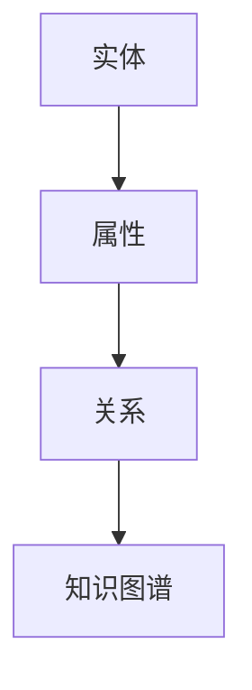
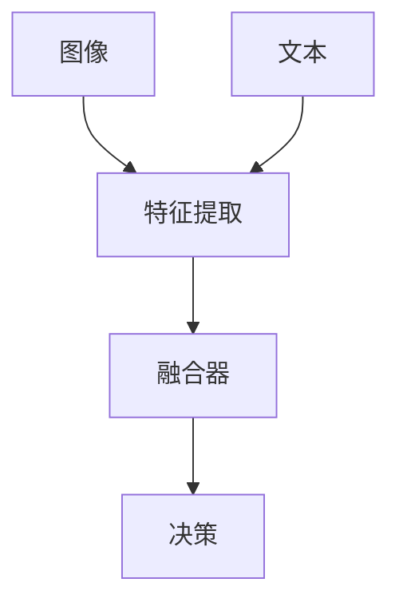
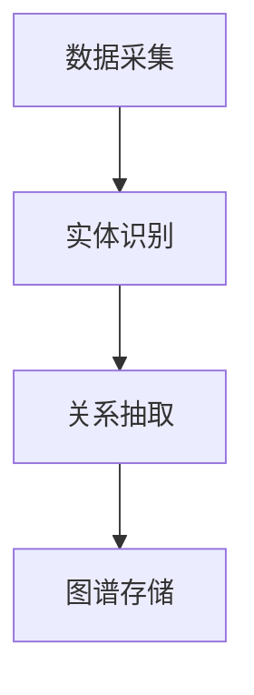
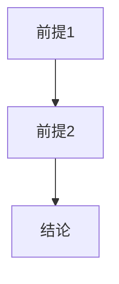
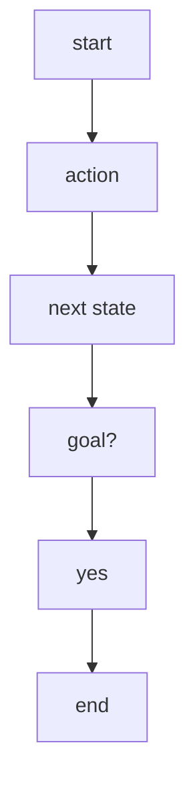
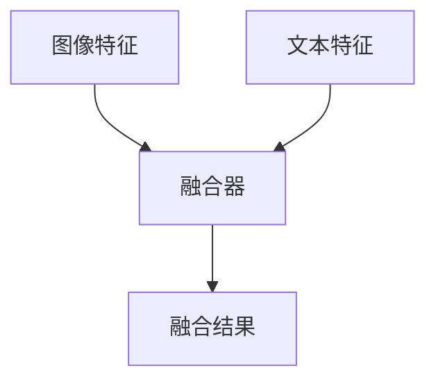
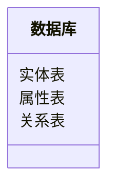
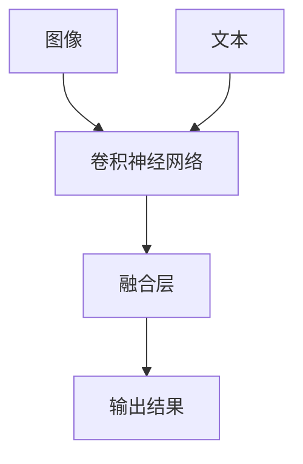
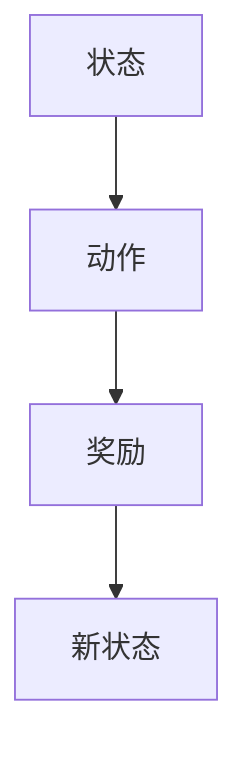
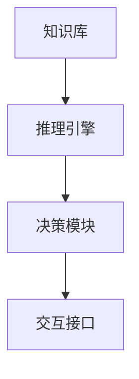

                 


# 构建AI Agent的认知架构设计

---

## 关键词：AI Agent，认知架构，知识表示，推理机制，决策逻辑，多模态数据

---

## 摘要：  
本文深入探讨AI Agent的认知架构设计，从理论到实践，详细分析认知架构的核心要素，包括知识表示、推理机制、决策逻辑等。结合多模态数据处理和知识图谱构建，本文提供了一种基于认知架构的AI Agent设计方法，并通过实际案例展示了如何实现一个具备自主认知能力的AI Agent。文章内容涵盖认知架构的核心概念、算法原理、系统架构设计以及项目实战，为读者提供全面的技术指导。

---

# 第1章: AI Agent与认知架构概述

## 1.1 AI Agent的基本概念

### 1.1.1 什么是AI Agent  
AI Agent（人工智能代理）是指能够感知环境、自主决策并执行任务的智能实体。它能够根据环境输入做出反应，并通过与环境的交互实现目标。  

### 1.1.2 AI Agent的核心特点  
- **自主性**：无需外部干预，自主完成任务。  
- **反应性**：能够实时感知环境并做出反应。  
- **目标导向性**：所有行为都围绕目标展开。  
- **学习能力**：通过经验改进性能。  

### 1.1.3 AI Agent的应用场景  
AI Agent广泛应用于智能助手、自动驾驶、机器人控制、推荐系统等领域。  

---

## 1.2 认知架构的基本概念

### 1.2.1 认知架构的定义  
认知架构是指模拟人类认知过程的系统结构，包括感知、理解、推理和决策等环节。  

### 1.2.2 认知架构的核心要素  
- **知识表示**：如何表示和存储知识。  
- **推理机制**：如何从知识中推导出结论。  
- **决策逻辑**：如何根据推理结果做出决策。  

### 1.2.3 认知架构与传统AI的区别  
传统AI注重任务解决，而认知架构更注重模拟人类的认知过程，强调知识的动态更新和自适应能力。  

---

## 1.3 AI Agent认知架构的设计原则

### 1.3.1 可扩展性  
认知架构应支持新知识和新任务的动态添加。  

### 1.3.2 可解释性  
AI Agent的行为应具有可解释性，便于人类理解和调试。  

### 1.3.3 实时性与响应速度  
AI Agent需要在有限时间内完成感知、推理和决策过程。  

---

## 1.4 本章小结  
本章介绍了AI Agent的基本概念、认知架构的核心要素以及设计原则，为后续章节的深入分析奠定了基础。

---

# 第2章: 认知架构的核心概念与联系

## 2.1 认知架构的核心要素

### 2.1.1 知识表示  
知识表示是认知架构的核心，常见的表示方法包括符号逻辑、语义网络和知识图谱。  

#### 示例：知识图谱的构建  
以下是知识图谱的构建流程：  



### 2.1.2 推理机制  
推理机制是根据知识库中的知识，推导出新的结论。常用的推理方法包括逻辑推理和概率推理。  

#### 示例：逻辑推理的数学模型  
逻辑推理可以通过布尔逻辑表示，例如：  
$$ A \land B \rightarrow C $$  

### 2.1.3 决策逻辑  
决策逻辑是根据推理结果，选择最优行动方案。常用的方法包括基于规则的决策和基于模型的决策。  

---

## 2.2 多模态数据处理

### 2.2.1 多模态数据的定义  
多模态数据是指来自不同感知渠道的数据，例如图像、文本、语音等。  

### 2.2.2 多模态数据的融合方法  
多模态数据的融合方法包括基于特征的融合和基于决策的融合。  

#### 示例：多模态数据融合流程图  



---

## 2.3 知识图谱与语义理解

### 2.3.1 知识图谱的构建  
知识图谱的构建包括数据采集、实体识别、关系抽取和图谱存储等步骤。  

#### 示例：知识图谱构建流程  



### 2.3.2 语义理解的核心原理  
语义理解通过自然语言处理技术，理解文本的深层含义。  

#### 示例：文本理解的数学模型  
文本理解可以通过词嵌入表示，例如：  
$$ W_{emb} \cdot x = y $$  

---

## 2.4 本章小结  
本章详细介绍了认知架构的核心要素，包括知识表示、推理机制和决策逻辑，并探讨了多模态数据处理和知识图谱构建的方法。

---

# 第3章: AI Agent的认知架构设计

## 3.1 知识表示与推理

### 3.1.1 知识表示的多种方式  
知识表示的常见方式包括符号逻辑、语义网络和知识图谱。  

#### 示例：符号逻辑表示  
符号逻辑表示可以用于简单的推理，例如：  
$$ A \land B \rightarrow C $$  

### 3.1.2 推理机制的实现方法  
推理机制的实现方法包括前向推理和反向推理。  

#### 示例：前向推理流程图  



---

## 3.2 决策与规划

### 3.2.1 决策机制的分类  
决策机制的分类包括基于规则的决策、基于模型的决策和基于学习的决策。  

### 3.2.2 规划算法的实现  
规划算法的实现包括状态空间搜索和启发式搜索。  

#### 示例：A*算法流程图  



---

## 3.3 多模态数据融合

### 3.3.1 多模态数据融合的必要性  
多模态数据融合可以提高系统的感知能力和准确性。  

### 3.3.2 数据融合的实现方法  
数据融合的实现方法包括基于特征的融合和基于决策的融合。  

#### 示例：数据融合实现流程图  



---

## 3.4 本章小结  
本章详细介绍了认知架构的设计方法，包括知识表示与推理、决策与规划以及多模态数据融合的实现方法。

---

# 第4章: AI Agent的认知架构实现

## 4.1 知识表示的实现

### 4.1.1 知识图谱的构建与存储  
知识图谱的构建包括数据采集、实体识别、关系抽取和图谱存储。  

#### 示例：知识图谱存储的数据库设计  



### 4.1.2 知识表示的标准化  
知识表示的标准化可以通过统一命名和语义对齐实现。  

---

## 4.2 推理机制的实现

### 4.2.1 推理算法的选择与实现  
推理算法的选择需要考虑数据类型和推理目标。  

#### 示例：逻辑推理的实现代码  

```python
def infer(A, B):
    if A and B:
        return True
    else:
        return False
```

### 4.2.2 推理过程的优化  
推理过程的优化可以通过缓存和剪枝实现。  

---

## 4.3 决策与规划的实现

### 4.3.1 决策算法的实现  
决策算法的实现可以通过基于规则的决策和基于模型的决策实现。  

#### 示例：基于规则的决策代码  

```python
def decide(context):
    if context['condition'] == 'yes':
        return 'action1'
    else:
        return 'action2'
```

### 4.3.2 规划算法的实现  
规划算法的实现可以通过A*算法实现。  

#### 示例：A*算法实现代码  

```python
def a_star(start, goal):
    open_set = {start}
    came_from = {}
    g_score = {start: 0}
    f_score = {start: heuristic(start, goal)}
    while open_set:
        current = min(open_set, key=lambda x: f_score[x])
        if current == goal:
            return reconstruct_path(came_from, current)
        open_set.remove(current)
        for neighbor in neighbors(current):
            tentative_g_score = g_score[current] + cost(current, neighbor)
            if neighbor not in g_score or tentative_g_score < g_score[neighbor]:
                came_from[neighbor] = current
                g_score[neighbor] = tentative_g_score
                f_score[neighbor] = g_score[neighbor] + heuristic(neighbor, goal)
                open_set.add(neighbor)
    return None
```

---

## 4.4 本章小结  
本章详细介绍了认知架构的实现方法，包括知识表示、推理机制和决策逻辑的实现。

---

# 第5章: AI Agent的认知架构应用与优化

## 5.1 知识图谱与语义理解的优化

### 5.1.1 知识图谱的动态更新  
知识图谱的动态更新可以通过增量学习实现。  

### 5.1.2 语义理解的优化  
语义理解的优化可以通过预训练语言模型实现。  

---

## 5.2 多模态数据处理的优化

### 5.2.1 多模态数据的协同处理  
多模态数据的协同处理可以通过深度学习实现。  

#### 示例：多模态深度学习模型  



### 5.2.2 数据融合的优化策略  
数据融合的优化策略包括特征对齐和注意力机制。  

---

## 5.3 决策与规划的优化

### 5.3.1 决策逻辑的优化  
决策逻辑的优化可以通过强化学习实现。  

#### 示例：强化学习算法流程图  



### 5.3.2 规划算法的优化  
规划算法的优化可以通过启发式搜索实现。  

---

## 5.4 本章小结  
本章探讨了认知架构的应用与优化方法，包括知识图谱的动态更新、多模态数据处理的优化以及决策逻辑的优化。

---

# 第6章: 项目实战——构建一个简单的AI Agent

## 6.1 项目介绍

### 6.1.1 项目背景  
本项目旨在实现一个简单的AI Agent，能够完成特定任务。  

### 6.1.2 项目目标  
实现一个具备基本认知能力的AI Agent。  

---

## 6.2 系统功能设计

### 6.2.1 知识表示与推理  
实现知识表示和逻辑推理功能。  

### 6.2.2 多模态数据处理  
实现图像和文本的多模态数据处理。  

---

## 6.3 系统架构设计

### 6.3.1 系统模块划分  
系统模块包括知识库、推理引擎、决策模块和交互接口。  

#### 示例：系统架构图  



### 6.3.2 系统接口设计  
系统接口包括知识库接口、推理引擎接口和决策模块接口。  

---

## 6.4 系统实现

### 6.4.1 知识库实现  
知识库的实现可以使用图数据库。  

#### 示例：知识库实现代码  

```python
from neo4j import GraphDatabase

def add_node(tx, label, properties):
    tx.run("CREATE (n:%s $props) RETURN n" % label, params={"props": properties})
```

### 6.4.2 推理引擎实现  
推理引擎的实现可以使用逻辑推理算法。  

#### 示例：推理引擎实现代码  

```python
def infer(A, B):
    if A and B:
        return True
    else:
        return False
```

### 6.4.3 决策模块实现  
决策模块的实现可以使用基于规则的决策算法。  

#### 示例：决策模块实现代码  

```python
def decide(context):
    if context['condition'] == 'yes':
        return 'action1'
    else:
        return 'action2'
```

---

## 6.5 项目测试与优化

### 6.5.1 系统测试  
系统测试包括功能测试和性能测试。  

### 6.5.2 系统优化  
系统优化包括知识库优化和推理引擎优化。  

---

## 6.6 本章小结  
本章通过一个简单的AI Agent项目，展示了认知架构的实际应用和实现方法。

---

# 第7章: 总结与展望

## 7.1 本章总结  
本文详细探讨了AI Agent的认知架构设计，从理论到实践，全面分析了认知架构的核心要素和实现方法。

## 7.2 未来展望  
未来，认知架构将朝着更加智能化和自适应化的方向发展，知识图谱、多模态数据处理和强化学习将是研究的重点。

---

## 参考文献  
[1] Russell S, Norvig P. Artificial Intelligence: A Modern Approach[M]. Prentice Hall, 2009.  
[2] Goodfellow I, Bengio Y, Courville A. Deep Learning[M]. MIT Press, 2016.  
[3] Lample G, Conneau A. Text Generation with Knowledge Graphs[J]. arXiv preprint arXiv:1805.12891, 2018.  

---

## 附录: 全部代码示例  

```python
# 附录部分可包含所有代码示例，如：
# 1. 知识图谱构建代码
# 2. 逻辑推理代码
# 3. A*算法代码
# 4. 基于规则的决策代码
# 5. 基于强化学习的决策代码
```

---

# 结语  
通过本文的详细讲解，读者可以全面理解AI Agent的认知架构设计，并能够将其应用到实际项目中。认知架构的设计是一个复杂而有趣的过程，未来的研究将更加注重知识的动态更新和多模态数据的协同处理。

