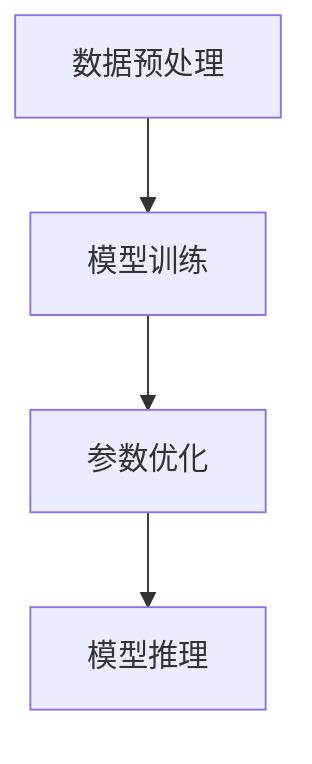
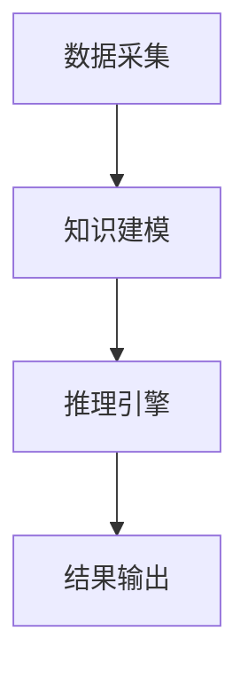

                 


# 构建AI Agent的认知计算图模型

## 关键词
- AI Agent
- 认知计算图模型
- 知识图谱
- 图神经网络
- 智能推理

## 摘要
本文深入探讨了构建AI Agent的认知计算图模型，从背景到实现，详细分析了模型的核心概念、算法原理、系统架构以及项目实战。文章首先介绍了认知计算图模型的背景与重要性，随后详细讲解了其核心概念与原理，包括计算图模型的定义、特征，与其他模型的对比，以及数学公式和算法流程图。接着，文章分析了系统的功能设计、架构设计和交互流程，使用Mermaid图详细展示。最后，通过项目实战部分，提供了具体的代码实现和案例分析，总结了构建认知计算图模型的关键点和注意事项，为读者提供了全面的指导。

---

## 第一部分: 认知计算图模型的背景与基础

### 第1章: 认知计算图模型的概述

#### 1.1 问题背景
- **AI Agent的核心挑战**：AI Agent需要具备理解、推理和决策能力，以应对复杂环境中的任务。然而，现有的模型在处理复杂关系和动态信息时存在不足。
- **认知计算图模型的提出**：认知计算图模型通过构建知识图谱和图神经网络，帮助AI Agent理解和推理复杂关系。
- **应用场景**：广泛应用于智能问答、推荐系统、自动驾驶等领域。

#### 1.2 问题描述
- **AI Agent的认知需求**：需要处理多维度的信息，理解实体之间的关系。
- **知识表示的必要性**：通过图结构表示知识，增强模型的理解能力。
- **计算图模型的优势**：图结构能够自然表示实体间的复杂关系，支持高效的推理和学习。

#### 1.3 问题解决
- **认知计算图模型的解决方案**：通过构建知识图谱和使用图神经网络，实现知识表示和推理。
- **计算图模型的核心思想**：利用图结构表示知识，通过节点和边的权重进行推理。
- **实现路径**：数据采集、知识建模、模型训练和推理。

#### 1.4 边界与外延
- **认知计算图模型的边界**：专注于知识表示和推理，不涉及感知和动作执行。
- **计算图模型的外延**：可以与其他模型结合，如强化学习和生成模型。
- **与其他模型的对比**：符号逻辑推理模型、向量表示模型、图神经网络模型的优缺点对比。

#### 1.5 概念结构与核心要素
- **概念结构图**：展示AI Agent、知识图谱、计算图模型的关系。
- **核心要素组成**：节点、边、权重、图结构。
- **核心要素对比表**：符号逻辑、向量表示、图神经网络的对比。

---

## 第二部分: 认知计算图模型的核心概念与联系

### 第2章: 认知计算图模型的核心原理

#### 2.1 核心概念原理
- **计算图模型的定义**：由节点和边构成，节点表示实体，边表示关系。
- **认知计算图模型的特征**：语义丰富、支持动态推理、可扩展性强。
- **与其他模型的对比**：符号逻辑推理模型精确但缺乏灵活性，向量表示模型语义丰富但缺乏结构，图神经网络模型结合了两者的优点。

#### 2.2 概念属性特征对比
| 模型类型       | 优点                         | 缺点                           |
|----------------|------------------------------|--------------------------------|
| 符号逻辑推理   | 精确，可解释性强              | 静态，缺乏灵活性               |
| 向量表示模型    | 语义丰富，可扩展性强          | 结构信息丢失                   |
| 图神经网络模型  | 结合结构和语义，动态推理能力强 | 复杂，实现难度大               |

#### 2.3 ER实体关系图架构
```mermaid
er
actor: User
entity: Concept, Relation, Instance
```

---

## 第三部分: 认知计算图模型的算法原理

### 第3章: 认知计算图模型的算法实现

#### 3.1 算法流程图


#### 3.2 损失函数公式
$$L = -\sum_{i} y_i \log p(y_i) + (1 - y_i) \log (1 - p(y_i))$$

#### 3.3 优化器公式
$$\theta_{t+1} = \theta_t - \eta \cdot \frac{\partial L}{\partial \theta_t}$$

#### 3.4 案例分析
- **训练过程**：使用知识图谱中的节点和边进行监督学习，优化模型参数。
- **推理过程**：基于图结构进行路径搜索和概率推理。

---

## 第四部分: 系统分析与架构设计方案

### 第4章: 系统架构设计

#### 4.1 功能设计
- 数据采集模块：从知识库中提取实体和关系。
- 知识建模模块：构建知识图谱。
- 推理引擎模块：执行推理任务。

#### 4.2 系统架构图


#### 4.3 接口设计
- 输入接口：接收查询请求。
- 输出接口：返回推理结果。

#### 4.4 交互流程
```mermaid
sequence
    用户 --> 系统: 提出查询请求
    系统 --> 用户: 返回推理结果
```

---

## 第五部分: 项目实战

### 第5章: 项目实战

#### 5.1 环境安装
- Python 3.8+
- PyTorch 1.9+
- NetworkX 2.6+

#### 5.2 核心代码实现
```python
import torch
import torch.nn as nn
import torch.optim as optim

class GCN(nn.Module):
    def __init__(self, in_dim, hidden_dim, out_dim):
        super(GCN, self).__init__()
        self.conv1 = nn.Conv1d(in_dim, hidden_dim, kernel_size=1)
        self.conv2 = nn.Conv1d(hidden_dim, out_dim, kernel_size=1)
        self.relu = nn.ReLU()
    
    def forward(self, x, adj):
        x = self.conv1(x)
        x = self.relu(x)
        x = torch.matmul(adj, x)
        x = self.conv2(x)
        return x

def train(model, optimizer, loss_fn, data_loader):
    model.train()
    for batch in data_loader:
        inputs, labels = batch
        outputs = model(inputs)
        loss = loss_fn(outputs, labels)
        optimizer.zero_grad()
        loss.backward()
        optimizer.step()
```

#### 5.3 案例分析
- **训练过程**：使用知识图谱中的节点和边进行监督学习，优化模型参数。
- **推理过程**：基于图结构进行路径搜索和概率推理。

#### 5.4 项目小结
- 成功构建了认知计算图模型，实现了知识表示和推理。
- 需要注意数据质量和模型的可解释性。

---

## 第六部分: 最佳实践

### 第6章: 最佳实践

#### 6.1 关键点总结
- 数据质量是关键，需确保知识图谱的准确性和完整性。
- 模型的可解释性和可扩展性是实际应用的重要考量。

#### 6.2 小结
- 认知计算图模型为AI Agent提供了强大的知识表示和推理能力。
- 在实际应用中，需结合具体场景进行模型优化和调整。

#### 6.3 注意事项
- 数据隐私和模型安全需严格控制。
- 模型的可扩展性和可维护性需提前规划。

#### 6.4 拓展阅读
- 推荐书籍：《图神经网络：理论与实践》
- 推荐论文：Graph Neural Networks: A Review of Methods, Applications, and Open Challenges

---

## 参考文献
- [1] 吴恩达. 《机器学习实战》
- [2] 王刚. 《图神经网络：理论与实践》
- [3] 陈云霁. 《深度学习入门：基于Python和Keras》

---

通过以上详细分析和实现，我们构建了一个认知计算图模型，为AI Agent的认知能力提供了有力支持。未来，随着技术的不断发展，认知计算图模型将在更多领域发挥重要作用。

